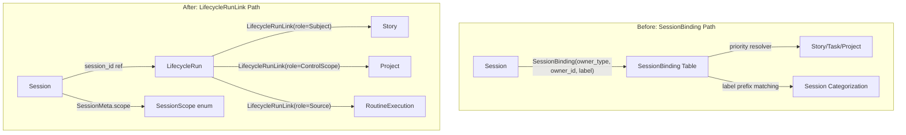

# SessionBinding 彻底移除重构

## 核心原则

- Session 不再持有 ownership 语义，仅为 runtime event stream 容器
- 业务归属（"这个 run 在为哪个 Story/Task 工作"）全部由 `LifecycleRunLink` 表达
- `SessionOwnerType` / `SessionOwnerCtx` / `SessionBinding` / `SessionBindingRepository` 全部删除
- CapabilityVisibility 用轻量过渡方案（后续独立权限系统重建）
- `HookOwnerSummary` 整体替换为 RunLink-derived 投影

## 架构变更图




## Phase 1: Domain 层清理

**目标**: 删除 `session_binding` domain module，在 Session 上引入轻量 scope metadata。

**变更文件**:

- [crates/agentdash-domain/src/session_binding/](crates/agentdash-domain/src/session_binding/) -- 整个目录删除
- [crates/agentdash-domain/src/lib.rs](crates/agentdash-domain/src/lib.rs) -- 移除 `pub mod session_binding` 导出

**新增**: `SessionScope` enum 到 agentdash-spi 或合适位置（替代 label 的分类功能）:

```rust
pub enum SessionScope {
    ProjectAgent { agent_key: String },
    StoryRoot,
    TaskExecution,
    LifecycleNode { node_key: String },
    LifecycleActivity { run_id: Uuid, activity_key: String, attempt: u32 },
    CompanionChild { parent_session_id: String, companion_label: String },
    Freeform,
}
```

**迁移**: 在 `SessionMeta`（或新增字段/表）上存储 scope 信息，替代 SessionBinding.label 的分类职责。

## Phase 2: Infrastructure 层清理

**目标**: 删除 SessionBinding 持久化，写 DB migration。

**变更文件**:

- [crates/agentdash-infrastructure/src/persistence/postgres/session_binding_repository.rs](crates/agentdash-infrastructure/src/persistence/postgres/session_binding_repository.rs) -- 删除
- [crates/agentdash-infrastructure/src/persistence/postgres/mod.rs](crates/agentdash-infrastructure/src/persistence/postgres/mod.rs) -- 移除导出
- [crates/agentdash-infrastructure/src/lib.rs](crates/agentdash-infrastructure/src/lib.rs) -- 移除导出
- 新增 migration `0070_drop_session_bindings.sql`:
  ```sql
  DROP TABLE IF EXISTS session_bindings;
  ```

## Phase 3: Application 层 - 核心服务迁移

**目标**: 所有依赖 `session_binding_repo` 的服务迁移到新路径。

关键迁移路径:


| 旧路径                                                        | 新路径                                                                  |
| ---------------------------------------------------------- | -------------------------------------------------------------------- |
| `find_task_execution_session_id` (via SessionBinding)      | 通过 LifecycleRunLink(subject=Task, role=Subject) -> Run -> session_id |
| `SessionOwnerResolver.resolve_primary`                     | 删除，不再需要                                                              |
| `hooks/owner_resolver.rs` SessionBinding->HookOwnerSummary | 从 LifecycleRun.session_id 反查 run -> links -> entities                |
| `companion_owner_candidates` from snapshot.owners          | 从 LifecycleRunLink 投影 session context                                |
| `is_business_root_session_label` prefix matching           | 改用 SessionScope enum 判断                                              |
| `SessionConstructionPlanner::project_agent_session_label`  | 改为 SessionScope::ProjectAgent                                        |


**主要受影响文件**:

- [crates/agentdash-application/src/repository_set.rs](crates/agentdash-application/src/repository_set.rs) -- 移除 `session_binding_repo`
- [crates/agentdash-application/src/session/ownership.rs](crates/agentdash-application/src/session/ownership.rs) -- 删除整个文件
- [crates/agentdash-application/src/hooks/owner_resolver.rs](crates/agentdash-application/src/hooks/owner_resolver.rs) -- 重写为 RunLink-based
- [crates/agentdash-application/src/task/mod.rs](crates/agentdash-application/src/task/mod.rs) -- `find_task_execution_session_id` 改用 RunLink
- [crates/agentdash-application/src/companion/tools.rs](crates/agentdash-application/src/companion/tools.rs) -- `companion_owner_candidates` 重写
- [crates/agentdash-application/src/session/construction_planner.rs](crates/agentdash-application/src/session/construction_planner.rs) -- 移除 label 依赖
- [crates/agentdash-application/src/reconcile/boot.rs](crates/agentdash-application/src/reconcile/boot.rs) -- 移除 binding 依赖
- [crates/agentdash-application/src/reconcile/terminal_cancel.rs](crates/agentdash-application/src/reconcile/terminal_cancel.rs) -- 改用 RunLink
- [crates/agentdash-application/src/task/service.rs](crates/agentdash-application/src/task/service.rs) -- 移除 binding 创建
- [crates/agentdash-application/src/task/gateway/session_bridge.rs](crates/agentdash-application/src/task/gateway/session_bridge.rs) -- 重写
- [crates/agentdash-application/src/routine/executor.rs](crates/agentdash-application/src/routine/executor.rs) -- 改用 RunLink
- [crates/agentdash-application/src/workflow/agent_executor.rs](crates/agentdash-application/src/workflow/agent_executor.rs) -- 移除 binding 创建
- [crates/agentdash-application/src/workflow/orchestrator.rs](crates/agentdash-application/src/workflow/orchestrator.rs) -- 移除 binding 依赖
- [crates/agentdash-application/src/vfs/tools/provider.rs](crates/agentdash-application/src/vfs/tools/provider.rs) -- 移除 binding 依赖
- [crates/agentdash-application/src/hooks/provider.rs](crates/agentdash-application/src/hooks/provider.rs) -- 用 RunLink 投影替代
- [crates/agentdash-application/src/hooks/workflow_snapshot.rs](crates/agentdash-application/src/hooks/workflow_snapshot.rs) -- 移除 binding 依赖
- [crates/agentdash-application/src/canvas/tools.rs](crates/agentdash-application/src/canvas/tools.rs) -- 移除 binding 依赖

## Phase 4: HookOwnerSummary 替换

**目标**: 用 RunLink-derived context 替代整个 `HookOwnerSummary` 和 `SessionHookSnapshot.owners`。

新的 hook session context 投影:

```rust
pub struct SessionRunContext {
    pub project_id: Uuid,
    pub story_id: Option<Uuid>,
    pub task_id: Option<Uuid>,
    pub story_title: Option<String>,
    pub task_title: Option<String>,
}
```

通过 `LifecycleRun.session_id -> run -> links` 投影得出，替代从 SessionBinding 反查的路径。

**变更**:

- [crates/agentdash-spi/src/hooks/mod.rs](crates/agentdash-spi/src/hooks/mod.rs) -- `SessionHookSnapshot.owners: Vec<HookOwnerSummary>` 替换为 `run_context: Option<SessionRunContext>`
- [crates/agentdash-application/src/hooks/snapshot_helpers.rs](crates/agentdash-application/src/hooks/snapshot_helpers.rs) -- 重写
- [crates/agentdash-application/src/companion/tools.rs](crates/agentdash-application/src/companion/tools.rs) -- `build_companion_owner_summary` 改读 `run_context`

## Phase 5: CapabilityResolver 过渡

**目标**: `SessionOwnerCtx` 从 CapabilityResolver 中移除，用简化的 scope 判断过渡。

当前 `CapabilityVisibilityRule.allowed_owner_types` 用 `SessionOwnerType` 做硬边界。过渡方案:

- 引入 `CapabilityScope` enum (Project/Story/Task) 专用于 capability visibility，不再复用 owner 概念
- `CapabilityResolverInput.owner_ctx` 替换为 `scope: CapabilityScope`
- `CapabilityScope` 从 `SessionScope` 或 `LifecycleRunLink` 推导

**主要受影响文件**:

- [crates/agentdash-spi/src/platform/tool_capability.rs](crates/agentdash-spi/src/platform/tool_capability.rs) -- `SessionOwnerType` 改为 `CapabilityScope`
- [crates/agentdash-application/src/capability/resolver.rs](crates/agentdash-application/src/capability/resolver.rs) -- `owner_ctx` 改为 `scope`
- [crates/agentdash-application/src/session/plan.rs](crates/agentdash-application/src/session/plan.rs) -- `SessionOwnerCtx` 引用替换
- [crates/agentdash-application/src/session/bootstrap.rs](crates/agentdash-application/src/session/bootstrap.rs) -- 同上
- 所有 `CapabilityResolverInput` 构造点（~10 处）

## Phase 6: API 层 + 前端清理

**目标**: API routes 移除 binding 依赖，前端类型清理。

**变更文件**:

- [crates/agentdash-api/src/routes/story_sessions.rs](crates/agentdash-api/src/routes/story_sessions.rs) -- 重写创建 session 逻辑（不再创建 binding）
- [crates/agentdash-api/src/routes/project_sessions.rs](crates/agentdash-api/src/routes/project_sessions.rs) -- session 列表改为从 SessionMeta + RunLink 查询
- [crates/agentdash-api/src/routes/project_agents.rs](crates/agentdash-api/src/routes/project_agents.rs) -- agent session 查找改用 scope metadata
- [crates/agentdash-api/src/routes/acp_sessions.rs](crates/agentdash-api/src/routes/acp_sessions.rs) -- freeform session 创建改为直接关联 RunLink
- [crates/agentdash-api/src/routes/task_execution.rs](crates/agentdash-api/src/routes/task_execution.rs) -- task session 查找改用 RunLink
- [crates/agentdash-api/src/routes/canvases.rs](crates/agentdash-api/src/routes/canvases.rs) -- 移除 binding 依赖
- [crates/agentdash-api/src/routes/extension_runtime.rs](crates/agentdash-api/src/routes/extension_runtime.rs) -- 移除 binding 依赖
- [crates/agentdash-api/src/bootstrap/repositories.rs](crates/agentdash-api/src/bootstrap/repositories.rs) -- 移除 binding repo 初始化
- [crates/agentdash-api/src/session_use_cases/construction.rs](crates/agentdash-api/src/session_use_cases/construction.rs) -- 重大重写
- [packages/app-web/src/types/session.ts](packages/app-web/src/types/session.ts) -- 移除 `SessionBindingOwner`, `owner_type`
- [packages/app-web/src/services/session.ts](packages/app-web/src/services/session.ts) -- 移除 binding 相关函数
- 前端 UI 组件适配新的 session list API 结构

## Phase 7: WorkflowBindingKind 精简 + StorySessionId 删除

**目标**: 清理 `WorkflowBindingKind` 中对 `SessionOwnerType` 的依赖，彻底删除 `StorySessionId`。

- [crates/agentdash-domain/src/workflow/value_objects/binding.rs](crates/agentdash-domain/src/workflow/value_objects/binding.rs) -- 移除 `From<SessionOwnerType>`，独立定义
- [crates/agentdash-domain/src/session_binding/session_id.rs](crates/agentdash-domain/src/session_binding/session_id.rs) -- 整个文件删除（随 Phase 1）
- [crates/agentdash-spi/src/session_persistence.rs](crates/agentdash-spi/src/session_persistence.rs) -- `StorySessionId` -> `String`
- [crates/agentdash-application/src/companion/tools.rs](crates/agentdash-application/src/companion/tools.rs) -- `StorySessionId` -> `String`

## Phase 8: 验证 + Spec 更新

- `cargo check --workspace`
- `cargo test --workspace`
- `pnpm typecheck`
- 更新 [.trellis/spec/backend/story-task-runtime.md](.trellis/spec/backend/story-task-runtime.md)

## 风险与决策点

- **Session 列表 API**: 当前 project sessions list 完全基于 SessionBinding 表。移除后需要替代查询方案 -- 可用 `lifecycle_run_links JOIN lifecycle_runs` 或给 SessionMeta 加 project_id + scope 字段做索引。
- **Companion session 创建**: 当前通过 `find_by_owner_and_label` 查找已有 companion session。移除后需通过 `LifecycleRunLink(role=SpawnedBy)` 或 SessionMeta scope 查找。
- **Boot reconciler**: 当前 `reconcile_lifecycle_projections` 遍历所有 bindings。改为遍历所有 active LifecycleRuns。

---

# 用户补充：

1. 请根据Phase阶段分批处理提交，使得阶段性成果可追溯
2. 请在完成任务后处理完整的清理Review，用以确认老模型痕迹是否在项目中残存

