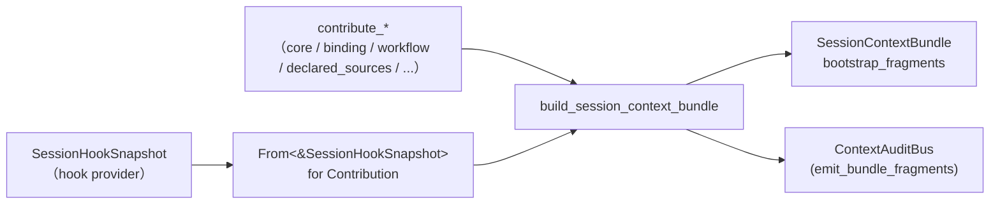
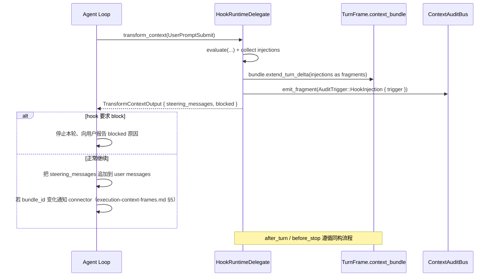

# Session Context Bundle 作为主数据面

> **主题**：`SessionContextBundle` 作为 session 业务上下文的唯一主数据面的
> 契约；配套 Hook 的三类语义（Bundle 改写 / per-turn steering / 控制流副作用）
> 如何分别接入 Bundle 或不接入。
>
> Bundle 如何在装配阶段被产出见 [`session-startup-pipeline.md`](./session-startup-pipeline.md)；
> Bundle 被放入 `TurnFrame.context_bundle` 后由 connector 消费的细节见
> [`execution-context-frames.md`](./execution-context-frames.md)。

## 摘要

- `SessionContextBundle` 是 session 业务上下文的**唯一**主数据面；所有
  connector 的 system prompt / agent context 最终都从 Bundle 派生，不存在第
  二条并行路径。
- Bundle 字段物理分层：`bootstrap_fragments`（组装期产出、跨 turn 稳定）与
  `turn_delta`（运行期 Hook 每轮追加的增量）。Inspector 可同时看到两路，方
  便审计"静态上下文 vs 动态补充"。
- 云端 Agent 消费 Bundle 时受 `RUNTIME_AGENT_CONTEXT_SLOTS` 白名单约束：
  新增 slot 必须同时更新白名单，否则渲染环节"看不见"它。
- Hook 的三类语义物理分离：① 改 Bundle（经 hook snapshot → Contribution → 进
  `bootstrap_fragments`；运行期经 fragment bridge 回灌 `turn_delta`）；② 本轮
  steering messages（`TransformContextOutput.steering_messages`，只承动态指
  令，不承静态上下文）；③ 控制流副作用（`blocked` / `Deny` / `Rewrite`
  等）。
- `HOOK_USER_MESSAGE_SKIP_SLOTS` 已废除；`session-capabilities://` 资源块注入
  user_blocks 的旧路径已拆除；companion_agents 只经 Bundle 一条路径。

## 1. `SessionContextBundle` 结构

定义位置：`crates/agentdash-spi/src/session_context_bundle.rs`。

```rust
pub struct SessionContextBundle {
    pub bundle_id: Uuid,
    pub session_id: Uuid,
    pub phase_tag: String,                        // "project_agent" / "task_start" / ...
    pub created_at_ms: u64,
    pub bootstrap_fragments: Vec<ContextFragment>,  // 组装期产出，跨 turn 稳定
    pub turn_delta: Vec<ContextFragment>,           // 运行期 Hook 追加的 per-turn 增量
}
```

依 **D3**（prd.md · Decisions）：Bundle 上加 `turn_delta` 与 `bootstrap_fragments`
物理分离，而非把运行期 hook fragment 合入 bootstrap；动机是让"静态 vs 动态"
在结构上可区分，Inspector 同时可见。

### 1.1 `bootstrap_fragments`

- **写入时机**：`build_session_context_bundle(contributions)` 在 compose 阶段
  调用，把所有 `contribute_*` 产出的 `Contribution.fragments` 合入 Bundle，
  经 `upsert_by_slot` 去重。
- **写入者**：`context::contributors::core / binding / instruction / mcp /
  workflow / declared_sources / hook_snapshot`（见 target-architecture.md §1.2）。
- **合并语义**：同 slot 按 `ContextFragment.strategy` 决定（`Append` /
  `Override`）；`Append` 用 `\n\n` 拼接 content + scope 并集 + source 合并；
  `Override` 整体替换 content、order 取 min、scope 并集。
- **跨 turn 稳定性**：装配完成后 `bootstrap_fragments` 视为只读；后续 turn 除
  非重新走 compose（例如 HTTP `RepositoryRehydrate(SystemContext)` 路径），
  否则保持不变。

### 1.2 `turn_delta`

- **写入时机**：每轮 prompt 开始或 Hook 触发时追加；每个新 turn 通常会得到一
  个新的 `context_bundle` clone，`turn_delta` 从空开始。
- **写入者**：主要是 `HookRuntimeDelegate.transform_context / after_turn /
  before_stop` 等运行期 hook 路径，通过 `bundle.push_turn_delta` /
  `bundle.extend_turn_delta`（后续 fragment bridge 在运行期接入，见 §4.2）。
- **合并语义**：`turn_delta` **不做** slot 去重，允许同 slot 多条，由
  `render_section` 按 `order` 升序合并（见 `session_context_bundle.rs:148-168`）。
  这是为了让 Hook 在同一轮内多次追加同 slot 时不互相覆盖（例如多条
  `workflow_context` 提示）。
- **Inspector 可见**：`ContextAuditBus` 订阅同样会看到 turn_delta 产出的
  fragment（当 fragment scope 含 `FragmentScope::Audit` 时），便于前端按 turn
  粒度审计。

### 1.3 渲染入口

```rust
impl SessionContextBundle {
    pub fn render_section(&self, scope: FragmentScope, slots: &[&str]) -> String;
    pub fn iter_fragments(&self) -> impl Iterator<Item = &ContextFragment>;
    pub fn filter_for(&self, scope: FragmentScope) -> impl Iterator<Item = &ContextFragment>;
}
```

- `render_section` 的三条规则：① 按 `scope` 过滤（bootstrap + turn_delta 同
  规则）；② 按 `slots` 白名单顺序保留；③ 同 slot 内部按 `order` 升序、用
  `\n\n` 拼接、空内容跳过。
- 调用方通常是 PiAgent（未来） / Application 层 `system_prompt_assembler`
  （当前） / title generator / summarizer / bridge replay。
- `scope` 决定哪些下游看见哪些 fragment；协议层加固"组装一次，多处消费"的
  scope 隔离。

## 2. `RUNTIME_AGENT_CONTEXT_SLOTS` 白名单

定义位置：`crates/agentdash-spi/src/context_injection.rs`。

```rust
pub const RUNTIME_AGENT_CONTEXT_SLOTS: &[&str] = &[
    "task", "story", "project", "workspace",
    "initial_context", "vfs", "tools", "persona",
    "required_context",
    "workflow", "workflow_context", "story_context",
    "runtime_policy", "mcp_config",
    "declared_source", "static_fragment",
    "requirements", "constraints", "constraint",
    "codebase", "references", "project_guidelines",
    "instruction", "instruction_append",
    "companion_agents",
];
```

### 2.1 契约

- 这是**云端 runtime agent 主通道**进入 system prompt 的 slot 白名单。
  Application 层的 `system_prompt_assembler` 和 connector 侧的自渲染路径
  都必须引用同一份常量。
- 新增 slot 的流程：① 在 contributor 产出 fragment 时先决定 slot 名；② 把
  slot 名加入白名单；③ 决定合适的 `slot_orders.rs` 默认 order；④ 如需要 hook
  层触达 slot，同步更新 `fragment_bridge::HOOK_SLOT_ORDERS`。缺少任一步会导
  致"Bundle 有内容但 PiAgent 看不到"的漂移。
- **禁令**：不要把"runtime 运行期动态 artifact"（例如 hook per-turn steering
  指令）加入白名单；这类内容属于 `steering_messages`，应该绕过 Bundle 直接
  进 agent context。

### 2.2 slot 归属

- `companion_agents`：由 PR 4 从独立 SP section 收入 Bundle（`bundle-main-datasource`
  路径），白名单纳入后自动进入 `## Project Context`；这是 `HOOK_USER_MESSAGE_SKIP_SLOTS`
  废除的语义前置条件。
- `constraint` / `constraints`：`constraint`（单数）由 hook provider /
  companion tools 产出 per-item hook injection 使用；`constraints`（复数）是
  compose 期 contributor 使用。两者并存，都在白名单中。
- 其他 slot 按 domain（task / story / project / workspace / workflow / ...）
  归属；具体由对应 contributor 管理。

## 3. Hook 三类语义分离

依 **D3** + **E6**（prd.md）：Hook 在本次重构后的目标语义**物理分离**成三
类；每一类由独立的数据通道承载，不再混用。

| 类别 | 语义 | 承载通道 | 消费者 |
|---|---|---|---|
| ① **Bundle 改写** | 静态 / 半静态上下文变化（companion_agents / workflow / constraint 等） | Hook snapshot → `Contribution` → Bundle `bootstrap_fragments`；运行期经 `fragment_bridge` 回灌 `turn_delta` | PiAgent / system_prompt_assembler / Inspector（经 ContextAuditBus） |
| ② **Per-turn steering** | 本轮 agent loop 的动态 user message 增量（rolling instruction、runtime steering） | `TransformContextOutput.steering_messages: Vec<AgentMessage>` | Agent loop（直接追加到 user messages 队列，不进 system prompt） |
| ③ **控制流副作用** | 阻断 / 拒绝 / 改写本轮请求或工具调用 | `TransformContextOutput.blocked: Option<String>` / `ToolCallDecision::Deny / Rewrite / Ask` / `StopDecision` | Agent loop（决定是否中止 / 改写 / 转询问） |

### 3.1 类别 ①：Bundle 改写

#### 3.1.1 装配期入口（`bootstrap_fragments`）

- `crates/agentdash-application/src/hooks/fragment_bridge.rs` 定义了
  `impl From<&SessionHookSnapshot> for Contribution`；在 compose 阶段读取
  hook provider 产出的 `SessionHookSnapshot.injections`，把每条
  `HookInjection` 转换成 `ContextFragment`（使用 `HOOK_SLOT_ORDERS` 的固定
  order，未覆盖 slot 退回 `slot_orders::HOOK_DEFAULT = 200`）。
- 该 `Contribution` 与其他 contributor 产出的 `Contribution` 被
  `build_session_context_bundle` 一视同仁地合并进 `bootstrap_fragments`；
  去重由 Bundle 的 `upsert_by_slot` 承担。

#### 3.1.2 运行期入口（`turn_delta`）

- 目标态：`HookRuntimeDelegate.transform_context / after_turn / before_stop`
  在 evaluate 后调 `hook_injection_to_fragment` 产出 `ContextFragment`，
  通过新设计的 channel / 直接 mutate 回灌到当前 turn 的
  `TurnFrame.context_bundle.turn_delta`（see PRD §"Bundle 主数据面" / §"Hook
  三类语义分离"）。
- 当前实现位点：`hook_delegate.rs::emit_hook_injection_fragments` 经
  `ContextAuditBus` 把同样的 fragment emit 给审计总线（以 `AuditTrigger::HookInjection`
  标签），在架构意图中与 `turn_delta` 对齐（同一份 fragment 既进 Bundle 又
  进 audit）；最终形态 `turn_delta` 作为 SPI 数据面主写入目标，audit 只作为
  旁路订阅。
- **约束**：SPI crate 不反向依赖 `agentdash-spi`（decisions.rs 注释明确）；
  因此 `TransformContextOutput` 结构上**不**直接承载 `bundle_delta`，Bundle
  写入由 application 层的 hook delegate 在 evaluate 完成后自己写到
  `TurnFrame.context_bundle.turn_delta`（参见 `decisions.rs:18-25` 设计注释）。

### 3.2 类别 ②：Per-turn steering

定义位置：`crates/agentdash-agent-types/src/decisions.rs`。

```rust
pub struct TransformContextOutput {
    pub steering_messages: Vec<AgentMessage>,
    pub blocked: Option<String>,
}
```

- `steering_messages` 是本轮 agent loop 要追加的 user message 列表（由 hook
  规则动态产出）。
- **禁令**（由字段文档注释加固）：`steering_messages` 不得承载"已经能进
  Bundle 的静态上下文"（companion_agents / workflow 等），否则会与 Bundle
  出现双源冲突、Inspector 看不全、去重白名单卷土重来。
- 常见内容：hook 临时向本轮 agent 追加的 rolling prompt / pending action
  说明 / runtime steering 文本，这些都是"每轮都不一样"的动态内容。
- 消费者：agent loop 在本轮内把 `steering_messages` 追加到 conversation
  messages，不写入 system prompt。

### 3.3 类别 ③：控制流副作用

- `TransformContextOutput.blocked: Option<String>`：当 hook 的 `block_reason`
  被设置时填充，agent loop 检测到该字段后应终止当前轮次并向用户报告原因。
- `ToolCallDecision::Deny { reason }` / `Rewrite { args, note }` /
  `Ask { reason, args, details }` / `Allow`：`HookRuntimeDelegate.before_tool_call`
  的产出，决定本次 tool call 行为。
- `StopDecision::{ Stop, Continue }`：`HookRuntimeDelegate.before_stop` 的产
  出，可在 Stop 时追加 steering / follow_up 继续下一轮（目标态由 hub 的
  `hook_dispatch` 模块做 auto-resume 限流）。
- **归属**：这些决策完全独立于 Bundle，属于 hook 对 agent loop 的**控制信号**。
  不会被记录进 Bundle（除非 hook 本身又声明一条 injection 落入类别 ①）。

### 3.4 废除的旧路径

为了使类别 ① / ② / ③ 的分离成立，以下旧路径必须已清除：

#### 3.4.1 `HOOK_USER_MESSAGE_SKIP_SLOTS` 白名单

- **语义**：旧实现在 `hook_delegate.rs` 中定义 `HOOK_USER_MESSAGE_SKIP_SLOTS =
  &["companion_agents"]`，用以在 `build_hook_injection_message` 中手工跳过某
  些 slot 的 user message 注入，避免和 Bundle 双重渲染。
- **废除理由**：本质是"Bundle 路径 + user_blocks 路径双写同一份数据"的补丁；
  一旦 Hook 的三类语义分离且 companion_agents 只走 Bundle，跳过白名单就失去
  必要性。
- **Acceptance 检查**：`grep -r "HOOK_USER_MESSAGE_SKIP_SLOTS" crates/` 零命
  中（见 target-architecture.md §I4）。

#### 3.4.2 `session-capabilities://` resource block 注入

- **语义**：旧实现在 `prompt_pipeline.rs:379-397` 向 `user_blocks` 首部注入
  `agentdash://session-capabilities/{session_id}` resource block，承载
  companion agents / skills / capabilities 摘要。
- **废除理由**：companion_agents 已由 Bundle 渲染进 SP `## Project Context`；
  skills 由 `<available_skills>` XML 块承载；capabilities 结构如需持久化应
  写 `SessionMeta`，而非进 `user_blocks`。
- **Acceptance 检查**：`grep -r "session-capabilities://" crates/` 零命中或
  仅测试；`prompt_pipeline.rs:397` 附近注释已明确该路径被删除。

#### 3.4.3 Companion Agents 单源化

- `companion_agents` slot 只经 Bundle 一条路径（`fragment_bridge` 产出的
  `Contribution` 进 Bundle `bootstrap_fragments`），`system_prompt_assembler`
  通过 `bundle.render_section(FragmentScope::RuntimeAgent, &["companion_agents", ...])`
  渲染出 SP 节。
- SP 里不再有独立的 `## Companion Agents` section 拼装逻辑；`## Project Context`
  内部由 Bundle 产出。

## 4. Audit Bus 与 Inspector 的关系

定义位置：`crates/agentdash-application/src/context/audit.rs` 等。

### 4.1 数据面

- `ContextAuditBus` 订阅所有 `context::emit_fragment(...)` 调用；默认实现
  `InMemoryContextAuditBus` 在 `AppState` 引导阶段构造，并通过
  `SessionRequestAssembler.audit_bus` / `HookRuntimeDelegate::new_with_mount_root_and_audit`
  等入口注入。
- 每条 fragment emit 携带 `AuditTrigger`（`BundleComposed` / `HookInjection {
  trigger }` / ...）与 `bundle_id` / `session_id`；前端 Inspector 订阅 bus
  得到 per-turn 级粒度的上下文变化流。

### 4.2 Bundle.turn_delta 与 audit 的双路径同时可见

- 装配期 fragment：emit 一次（`AuditTrigger::BundleComposed`），同时进
  Bundle.bootstrap_fragments。
- 运行期 hook fragment：
  - emit 到 audit bus（`AuditTrigger::HookInjection { trigger }`）；
  - 同时（目标态）回灌到 `turn_delta`。
- 两路同步可见是 D3 决策的关键收益：Inspector 既能看到"Bundle 最终形态"（经
  `iter_fragments` 或 `render_section`），又能看到"谁在什么时候加了这一条"。

### 4.3 FragmentScope 的作用

- `FragmentScope::Audit` 决定一个 fragment 是否对审计总线可见；默认
  `ContextFragment::default_scope() = RuntimeAgent | Audit`。
- 如果 hook 层想产出"只记录审计不进 agent"的 fragment，可以清除 `RuntimeAgent`
  bit、只保留 `Audit`；反之亦然。这为未来细粒度"只让 title generator 看到"等
  场景预留通道（参见 `context_injection.rs::FragmentScope`）。

## 5. 数据流全景

### 5.1 装配期（Bundle bootstrap）



### 5.2 运行期（Bundle turn_delta + 三类语义）



### 5.3 Connector 消费

- PiAgent：消费 `TurnFrame.context_bundle`，通过 `bundle_id` 比对触发 system
  prompt 热更（详见 `execution-context-frames.md` §5）；未来切换到
  `bundle.render_section(FragmentScope::RuntimeAgent, RUNTIME_AGENT_CONTEXT_SLOTS)`
  自行渲染。
- Relay / vibe_kanban：当前不消费 Bundle，走
  `assembled_system_prompt` 过渡字符串（`execution-context-frames.md` §3.2）。

## 6. 不变式（DoD 级别）

- **I · 单一主数据面**：`companion_agents` 只在 Bundle 出现；`grep -r "session-capabilities://" crates/`
  零命中或仅测试；`grep -r "HOOK_USER_MESSAGE_SKIP_SLOTS" crates/` 零命中。
- **II · Bundle 字段分层**：`SessionContextBundle.bootstrap_fragments` 与
  `turn_delta` 物理分离；bootstrap 通过 `upsert_by_slot` 去重；turn_delta 允
  许同 slot 多条；render_section 按 order 合并。
- **III · 白名单同步**：`RUNTIME_AGENT_CONTEXT_SLOTS` 与 `HOOK_SLOT_ORDERS`
  对已知 hook slot 保持一致；新增 slot 必须同时更新两者。
- **IV · Hook 三类语义结构独立**：`TransformContextOutput` 字段只承
  `steering_messages` + `blocked`；**不**承 Bundle delta（Bundle 写入由
  application 层 hook delegate 完成，这是 SPI crate 边界要求）。
- **V · fragment_bridge 在生产路径有调用**：`impl From<&SessionHookSnapshot> for Contribution`
  不是死代码；装配期 compose 的 `compose_*` 路径必有调用点（典型在 hook
  snapshot 读取后）。

## 7. 相关 spec / PRD / code 锚点

### 相关 spec

- [`session-startup-pipeline.md`](./session-startup-pipeline.md) — Bundle 如
  何在装配阶段产出；`PromptSessionRequest.context_bundle` 的唯一写入点。
- [`execution-context-frames.md`](./execution-context-frames.md) —
  `TurnFrame.context_bundle` 的生命周期与 PiAgent 按 `bundle_id` 热更的消费
  流程。
- `.trellis/spec/backend/hooks/execution-hook-runtime.md` — Hook runtime 总体
  契约；与本 spec §3 的三类语义拆分互补。
- `.trellis/spec/backend/hooks/hook-script-engine.md` — Rhai hook preset 编写
  指南；hook preset 产出的 injection 最终经 fragment bridge 进入 Bundle。

### PRD / 任务文档

- `.trellis/tasks/04-30-session-pipeline-architecture-refactor/prd.md`
  - Requirements · "Bundle 主数据面" / "Hook 三类语义分离"
  - Decisions · D3（新增 turn_delta） / E6（HookRuntimeDelegate 签名直改） /
    E8（CompanionSliceMode / static_fragment 清理）
  - Implementation Plan · PR 3 / PR 4
- `.trellis/tasks/04-30-session-pipeline-architecture-refactor/target-architecture.md`
  §C4 / §C11 / §5（三条轴 × 字段归属） / §I1 / §I4。
- `.trellis/tasks/archive/2026-04/04-29-session-context-builder-unification/prd.md`
  — Bundle 引入的基础任务（历史背景）。
- `.trellis/tasks/04-30-session-pipeline-architecture-refactor/research/pipeline-review/02-context-layer.md`
  — Bundle 与 contribute_* 的事实映射。
- `.trellis/tasks/04-30-session-pipeline-architecture-refactor/research/pipeline-review/03-connector-hook-layer.md`
  — Hook 双轨数据面现状 / PiAgent 与 Bundle 的消费关系。

### 代码锚点

- `crates/agentdash-spi/src/session_context_bundle.rs` — `SessionContextBundle` /
  `bootstrap_fragments` / `turn_delta` / `render_section`。
- `crates/agentdash-spi/src/context_injection.rs`
  - `RUNTIME_AGENT_CONTEXT_SLOTS`（白名单）
  - `ContextFragment` / `FragmentScope` / `FragmentScopeSet` / `MergeStrategy`
- `crates/agentdash-agent-types/src/decisions.rs`
  - `TransformContextOutput`（three-semantic 分离的设计注释位于 `decisions.rs:14-37`）
- `crates/agentdash-application/src/hooks/fragment_bridge.rs`
  - `hook_injection_to_fragment`
  - `impl From<&SessionHookSnapshot> for Contribution`
  - `HOOK_SLOT_ORDERS`
- `crates/agentdash-application/src/session/hook_delegate.rs`
  - `HookRuntimeDelegate::transform_context / after_turn / before_stop`
  - `emit_hook_injection_fragments`（audit bus 路径）
- `crates/agentdash-application/src/session/prompt_pipeline.rs:380-410`
  — user_blocks 不再注入 `session-capabilities://` 的确认点。
- `crates/agentdash-application/src/context/` — Bundle reducer /
  `contribute_*` / `slot_orders.rs` / audit。
- `crates/agentdash-executor/src/connectors/pi_agent/connector.rs:312-412`
  — Bundle 消费与 `bundle_id` 比对。
