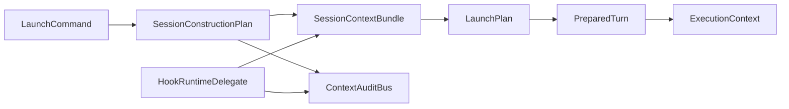

# Session Context Bundle 主数据面

`SessionContextBundle` 是 session 业务上下文的主数据面。Construction 负责产出
Bundle，`LaunchPlan` 与 `TurnPreparer` 把它投影到 connector `ExecutionContext`，
Hook runtime 只通过约定入口追加 per-turn 增量。

## Bundle Shape

定义位置：`crates/agentdash-spi/src/context/bundle.rs`。

```rust
pub struct SessionContextBundle {
    pub bundle_id: Uuid,
    pub session_id: Uuid,
    pub phase_tag: String,
    pub created_at_ms: u64,
    pub bootstrap_fragments: Vec<ContextFragment>,
    pub turn_delta: Vec<ContextFragment>,
}
```

| 字段 | 语义 | 写入时机 |
|---|---|---|
| `bootstrap_fragments` | construction 阶段产出的稳定上下文 | session compose / context rebuild |
| `turn_delta` | 运行期 hook 或 context transition 追加的 per-turn 增量 | 当前 turn 内 |

`bootstrap_fragments` 通过 slot merge 形成稳定视图；`turn_delta` 保留同 slot 多条记录，
便于审计同一轮内的多次动态补充。

## Rendering Contract

```rust
impl SessionContextBundle {
    pub fn render_section(&self, scope: FragmentScope, slots: &[&str]) -> String;
    pub fn iter_fragments(&self) -> impl Iterator<Item = &ContextFragment>;
    pub fn filter_for(&self, scope: FragmentScope) -> impl Iterator<Item = &ContextFragment>;
}
```

`render_section` 先按 `FragmentScope` 过滤，再按 slot 白名单与 order 输出。
Application 层、connector 侧自渲染、title/summarizer/bridge replay 都使用这一套
Bundle API。

## Runtime Agent Slot Whitelist

定义位置：`crates/agentdash-spi/src/context_injection.rs`：
`RUNTIME_AGENT_CONTEXT_SLOTS`。

新增 RuntimeAgent 可见 slot 时同步处理：

1. contributor 或 hook bridge 产出明确 slot。
2. slot 加入 `RUNTIME_AGENT_CONTEXT_SLOTS`。
3. 设置默认 order。
4. 若 hook injection 可产出该 slot，同步 `HOOK_SLOT_ORDERS`。

运行期即时 steering、pending action、tool decision 等控制内容不进入 bootstrap
白名单；它们通过 agent loop 的动态消息或控制流通道消费。

## Hook Semantics

Hook 输出分三类，每类有独立承载通道：

| 类别 | 承载通道 | 消费 |
|---|---|---|
| Bundle 改写 | hook snapshot -> `Contribution` -> `bootstrap_fragments`；runtime injection -> `turn_delta` | ContextFrame、Inspector、下一轮 context projection |
| Per-turn steering | `TransformContextOutput.steering_messages` | 当前 agent loop messages |
| 控制流副作用 | `blocked`、`ToolCallDecision`、`StopDecision` | agent loop 阻断、拒绝、改写、续跑 |

Bundle 改写由 application 层 hook delegate 写入 `SessionContextBundle.turn_delta`。
SPI hook decisions 不直接携带 Bundle delta，从而保持 agent-types 与 spi 的依赖方向。

## Audit And Inspector

`ContextAuditBus` 订阅 fragment emit：

- construction fragment：emit audit 后进入 `bootstrap_fragments`。
- runtime hook fragment：emit audit 后进入 `turn_delta`。

`FragmentScope::Audit` 决定 fragment 是否对审计可见；
`FragmentScope::RuntimeAgent` 决定它是否进入 runtime agent 渲染。

## Data Flow



## Invariants

- `companion_agents`、project/story/task/workspace context、workflow context 与 declared
  sources 通过 Bundle/ContextFrame 主数据面进入 agent context。
- `bootstrap_fragments` 与 `turn_delta` 物理分离。
- 新增 context slot 必须同时考虑 runtime 渲染白名单、order 与 hook bridge。
- `TransformContextOutput` 只承载 steering 与 block 结果。

## Related Specs

- [`session-startup-pipeline.md`](./session-startup-pipeline.md)
- [`execution-context-frames.md`](./execution-context-frames.md)
- `.trellis/spec/backend/hooks/execution-hook-runtime.md`
- `.trellis/spec/backend/hooks/hook-script-engine.md`
