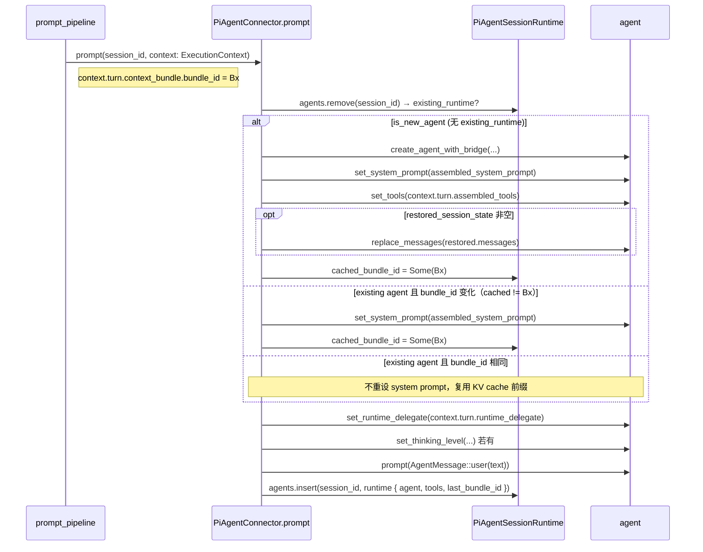

# Execution Context Frames

> **主题**：`agentdash-spi::ExecutionContext` 按"session 级不可变 vs turn 级
> 动态"拆成 `ExecutionSessionFrame` + `ExecutionTurnFrame` 两层之后，各字段的
> 所有权、生命周期与跨 turn 热更策略。
>
> 装配阶段如何产出这些字段见 [`session-startup-pipeline.md`](./session-startup-pipeline.md)；
> `TurnFrame.context_bundle` 的内部结构与运行期 hook 回灌见
> [`bundle-main-datasource.md`](./bundle-main-datasource.md)。

## 摘要

- 进入 connector 的上下文按"身份 + 执行环境"与"上下文 + 工具 + 运行时控制面"
  物理分两层：`ExecutionSessionFrame`（Who + Where）session 级不可变，
  `ExecutionTurnFrame`（What + How + Trigger 副作用）per-turn 可变。
- `SessionRuntime` 只持 session 级状态；per-turn 状态（`processor_tx` /
  `cancel_requested` / `session_frame` 快照等）下沉到
  `SessionRuntime.current_turn: Option<TurnExecution>`。
- Bundle 是主数据面：`TurnFrame.context_bundle: Option<SessionContextBundle>`；
  PiAgent 通过 `bundle_id` 比对在不重新创建 agent 的情况下热更 system prompt。
- `assembled_system_prompt` 字段存在仅作为 Relay / vibe_kanban 的过渡 fallback，
  标 `#[deprecated]`；当所有 connector 迁到直读 Bundle 后本字段下线（未来 PR）。

## 1. `ExecutionContext` 顶层结构

定义位置：`crates/agentdash-spi/src/connector.rs`。

```rust
pub struct ExecutionContext {
    pub session: ExecutionSessionFrame,
    pub turn: ExecutionTurnFrame,
}
```

- 构造权威：`crates/agentdash-application/src/session/prompt_pipeline.rs::start_prompt_with_follow_up`
  是**唯一**构造 `ExecutionContext` 的路径；其余代码只读 / clone。
- 热更路径（phase 切换 / MCP 热更）通过 `hub/tool_builder.rs` 基于
  `TurnExecution.session_frame` 重建一次性的 `ExecutionContext`，用来调
  `RuntimeToolProvider::build_tools`；这条路径**不**把重建的 context 传给
  connector prompt，仅用于工具构建（见 §4.3）。

## 2. `ExecutionSessionFrame` — Who + Where

```rust
pub struct ExecutionSessionFrame {
    pub turn_id: String,
    pub working_directory: PathBuf,
    pub environment_variables: HashMap<String, String>,
    pub executor_config: AgentConfig,
    pub mcp_servers: Vec<McpServer>,
    pub vfs: Option<Vfs>,
    pub identity: Option<AuthIdentity>,
}
```

| 字段 | 所有权（唯一权威） | 生命周期 | 消费者 |
|---|---|---|---|
| `turn_id` | `prompt_pipeline` 装配阶段生成 | 当前 turn 不变 | 每个 connector、trace meta、hook 审计 |
| `working_directory` | `prompt_pipeline` 调 `resolve_working_dir(default_mount_root, req.user_input.working_dir)` 产出 | 当前 turn 不变 | Relay / vibe_kanban（下发远端）、PiAgent 内部工具上下文 |
| `environment_variables` | move 自 `req.user_input.env` | 当前 turn 不变 | Relay 子进程启动、vibe_kanban 子进程启动 |
| `executor_config` | `req.user_input.executor_config` ∪ `session_meta.executor_config` 合并 | 当前 turn 不变 | 所有 connector（决定 executor / model / thinking_level 等） |
| `mcp_servers` | compose 层 `effective_mcp_servers` 汇总产出 | 当前 turn 不变 | **Relay** 透传远端；PiAgent 不读这里（读 `turn.assembled_tools`） |
| `vfs` | compose 产出或 `apply_workspace_defaults` 兜底 | 当前 turn 不变 | Relay / vibe_kanban / PiAgent 工具路径解析 |
| `identity` | entry 经 `SessionAssemblyBuilder::with_identity` 注入（E1 / E2） | 当前 turn 不变 | Relay 下发 / 审计链路 / permission 决策 |

**不可变语义**：在一次 `connector.prompt(...)` 调用范围内，`SessionFrame` 的
字段必须视为不可变。后续 turn 若有改动则由下一次 `prompt_pipeline` 重新组装
整个 `ExecutionContext`，当前 turn 内不 mutate。

**SessionFrame 与 `ActiveSessionExecutionState` 的收敛**：历史上 session 运行
态在 `ActiveSessionExecutionState` 内另存了 working_directory / mcp_servers /
executor_config / vfs / identity 等副本。目标态将这些字段**统一**以
`ExecutionSessionFrame` 为权威，运行态通过 `TurnExecution.session_frame`
（`Clone`）持一份快照供热更路径用（见 §4.3）。

## 3. `ExecutionTurnFrame` — What + How + Trigger 副作用

```rust
pub struct ExecutionTurnFrame {
    pub hook_session: Option<Arc<dyn HookSessionRuntimeAccess>>,
    pub flow_capabilities: FlowCapabilities,
    pub runtime_delegate: Option<DynAgentRuntimeDelegate>,
    pub restored_session_state: Option<RestoredSessionState>,
    pub context_bundle: Option<SessionContextBundle>,
    #[deprecated(note = "主数据面已迁至 context_bundle；Relay / vibe_kanban fallback 专用")]
    pub assembled_system_prompt: Option<String>,
    pub assembled_tools: Vec<DynAgentTool>,
}
```

| 字段 | 所有权 | 生命周期 | 备注 |
|---|---|---|---|
| `hook_session` | `SessionRuntime.hook_session`（Arc 共享）的 clone | 当前 turn 起止内共享 | 运行期 trace / injection / capability 追踪 |
| `flow_capabilities` | `req.flow_capabilities` clone | 当前 turn | 运行时工具裁剪依据 |
| `runtime_delegate` | `prompt_pipeline` 基于 `hook_session` 构造的 `HookRuntimeDelegate` | 当前 turn | 详见 `bundle-main-datasource.md` §3 |
| `restored_session_state` | 冷启动 continuation 路径从事件仓储恢复 | 仅首次重建 turn | `AgentConnector::supports_repository_restore` 返回 true 的 executor 才用 |
| `context_bundle` | `req.context_bundle` clone（装配期组装） | 当前 turn 初值；运行期 Hook 可追加 `turn_delta` | **主数据面**；详见 `bundle-main-datasource.md` |
| `assembled_system_prompt` | `prompt_pipeline` 调 `assemble_system_prompt(input)` 预渲染 | 当前 turn | 过渡字段：Relay / vibe_kanban 过渡消费；PiAgent 目前仍使用作为 fallback 直到 Bundle α 化完成 |
| `assembled_tools` | `prompt_pipeline` 调 `SessionHub::build_tools_for_execution_context` 预构建 | 当前 turn | runtime tools + direct MCP + relay MCP 混合列表；in-process connector 直接执行 |

### 3.1 Connector 字段消费矩阵

| Connector | SessionFrame 读 | TurnFrame 读 | 备注 |
|---|---|---|---|
| **PiAgent**（`crates/agentdash-executor/src/connectors/pi_agent/connector.rs`） | `turn_id` / `executor_config`（provider_id / model_id / thinking_level） | `assembled_tools` / `runtime_delegate` / `hook_session` / `restored_session_state` / `context_bundle`（bundle_id 比对） / `assembled_system_prompt`（fallback） | `mcp_servers` 不读；工具已在 `assembled_tools` 里 |
| **Relay** | `mcp_servers` / `vfs` / `working_directory` / `environment_variables` / `executor_config` / `identity` | `assembled_system_prompt`（过渡） | MCP 结构原样透传远端；`context_bundle` 暂不支持（需协议扩展） |
| **vibe_kanban** | `vfs` / `working_directory` / `environment_variables` / `executor_config` | `assembled_system_prompt` | 非结构化消费；prompt 前置到 user_text |

### 3.2 `assembled_system_prompt` 的过渡地位

- **当前**：`prompt_pipeline` 调 `assemble_system_prompt(SystemPromptInput { context_bundle: req.context_bundle.as_ref(), ... })` 预渲染出字符串，塞进 `TurnFrame.assembled_system_prompt`。
- **PiAgent** 仍在 is_new_agent 分支 / bundle_id 变化分支使用这段字符串调
  `agent.set_system_prompt(...)`（见 `pi_agent/connector.rs:335-387`）；
  理由：PiAgent 直接消费 Bundle 的 render 能力已就位，但让 connector 自行渲染
  会把 `render_runtime_section` 的责任下沉到 executor 层，目前选择渐进路径 β
  （见 PRD Out of Scope · Bundle α 化）。
- **Relay / vibe_kanban** 必须继续吃这段字符串，因为 Relay 协议尚未扩展
  `context_bundle`；vibe_kanban 做 prompt 前置。
- **计划下线路径**：Relay 协议扩展 Bundle → 所有 connector 直读
  `context_bundle` → 删除本字段（out of scope，独立任务）。

### 3.3 `hook_session` 的 Arc 共享

`SessionRuntime.hook_session: Option<SharedHookSessionRuntime>` 是 session 级
唯一权威；`ExecutionTurnFrame.hook_session` 通过 `Arc::clone` 持有同一实例。
`prompt_pipeline` **不**双向写入；运行期 hook 记录 trace / 追加 injection 时
都经 hook_session 上的内部锁管理，下一 turn 从同一 Arc 读取最新状态。

## 4. `SessionRuntime` vs `TurnExecution`

定义位置：`crates/agentdash-application/src/session/hub_support.rs`。

### 4.1 `SessionRuntime`（session 级）

```rust
pub(super) struct SessionRuntime {
    pub tx: broadcast::Sender<PersistedSessionEvent>,
    pub running: bool,
    pub hook_session: Option<SharedHookSessionRuntime>,
    pub current_turn: Option<TurnExecution>,
    pub hook_auto_resume_count: u32,
    pub last_activity_at: i64,
}
```

- 生命周期：`ensure_session` / 首次 prompt / subscribe / cancel 都会
  `or_insert_with(build_session_runtime)`；真正销毁只有
  `SessionHub.delete_session`。
- **纯 session 级字段**：`tx`（SSE fan-out）、`running`（互斥开关）、
  `hook_session`（跨 turn 共享）、`last_activity_at`（stall 检测）、
  `hook_auto_resume_count`（跨 auto-resume 链累积的限流计数，新 turn 不清零）。
- **禁令**：`SessionRuntime` struct 上不再出现 `processor_tx` / `turn_id` /
  `cancel_requested` / `session_frame`（参见 target-architecture.md §I5）。
- `current_turn` 是唯一 per-turn 字段；无活跃 turn 时为 `None`。

### 4.2 `TurnExecution`（per-turn）

```rust
pub(super) struct TurnExecution {
    pub turn_id: String,
    pub session_frame: ExecutionSessionFrame,
    pub relay_mcp_server_names: HashSet<String>,
    pub flow_capabilities: FlowCapabilities,
    pub cancel_requested: bool,
    pub processor_tx: Option<UnboundedSender<TurnEvent>>,
}
```

- 生命周期：`prompt_pipeline` 在组装完成后写入 `SessionRuntime.current_turn =
  Some(TurnExecution::new(...))`；`turn_processor` 收到 `TurnEvent::Terminal`
  后清理（下沉到 hub 的 `TurnEvent::Terminal` 路径，target 态由 hub 负责清除
  `current_turn`、`processor_tx`，参见 target-architecture.md §4.3 / I6）。
- `session_frame`：`ExecutionSessionFrame` 的 clone，供 MCP 热更 /
  `replace_runtime_mcp_servers` 重建 `ExecutionContext` 使用，避免回读 wire
  `PromptSessionRequest`。
- `relay_mcp_server_names`：伴随 `session_frame.mcp_servers` 的 classification
  集；`tool_builder` 据此分 direct / relay 构建工具集。
- `flow_capabilities`：per-turn 能力集，作为 MCP / 工具集重建时的入参。
- `cancel_requested`：`hub.cancel` 置 `true`；`turn_processor` / stream adapter
  读它决定发 `Interrupted` 终态。
- `processor_tx`：stream adapter 与 cancel 路径向 `SessionTurnProcessor` 发送
  `TurnEvent` 的 channel；per-turn 唯一实例。

### 4.3 MCP 热更 / 工具集热更路径

定义位置：`crates/agentdash-application/src/session/hub/tool_builder.rs`。

```text
hub.replace_runtime_mcp_servers(session_id, new_mcp_servers)
  └─ 读 SessionRuntime.current_turn.session_frame（clone）
  └─ 用 new_mcp_servers 覆盖 session_frame.mcp_servers
  └─ 构造一次性 ExecutionContext { session: session_frame, turn: default }
  └─ RuntimeToolProvider::build_tools(&ctx) → Vec<DynAgentTool>
  └─ connector.update_session_tools(session_id, tools)
  └─ 回写 SessionRuntime.current_turn.session_frame.mcp_servers（保持 per-turn 一致）
```

- 关键约束：热更路径**不**改写 `PromptSessionRequest`，也**不**构造 "ghost"
  `ExecutionContext` 传给 connector.prompt；仅仅是为了调用
  `RuntimeToolProvider::build_tools` 传入一个结构化上下文。
- 热更触发源：Workflow PhaseNode 切换 / MCP Preset 变更 / 能力变更 hook。
- **禁令**：Relay / 远程 connector 必须把 `update_session_tools` 转发给持有
  live session 的子 connector；不允许在 `CompositeConnector` 层走默认 no-op
  （见 `runtime-execution-state.md`）。

## 5. PiAgent 按 `bundle_id` 热更 system prompt

### 5.1 事件级流程



### 5.2 契约约束

- **缓存字段**：`PiAgentSessionRuntime.last_bundle_id: Option<uuid::Uuid>`，表示
  连接器已经把哪个 `bundle_id` 对应的 system prompt 写入了 agent。
- **变化判定**：`incoming = context.turn.context_bundle.map(|b| b.bundle_id)`；
  仅在 `cached != incoming` 时调 `agent.set_system_prompt(...)`。
- **渲染来源**：当前仍使用 `context.turn.assembled_system_prompt` 字符串（由
  application 层预渲染）。Bundle α 化（独立任务）后改为 connector 直接调
  `bundle.render_section(FragmentScope::RuntimeAgent, RUNTIME_AGENT_CONTEXT_SLOTS)`
  自行渲染。
- **out-of-band 热更钩**：`AgentConnector::update_session_context_bundle(
  session_id, bundle)` 默认 no-op，用于 MCP 热更 / hook snapshot 刷新等非
  prompt 边界的 Bundle 变化。PiAgent 应在此钩内做相同的 `set_system_prompt`
  触发（在活跃 session 才生效）；Relay / vibe_kanban 保持 no-op，等下一次
  prompt 的 Bundle 透传。

### 5.3 不变式

- PiAgent 的 agent 实例跨 turn 复用；仅在 `bundle_id` 变化或首次构造时重置
  system prompt；不每 turn 刷一次（避免 KV cache 失效）。
- 同一 `bundle_id` 跨 turn 不触发 `set_system_prompt`。
- `assembled_system_prompt == None` 时，`set_system_prompt` 不调用（Bundle
  为空等边界场景直接 fallback 到 agent 的默认 prompt）。

## 6. `assembled_system_prompt` 下线路线图

- **当前状态**（2026-04-30 / PR 3 完成态）：字段存在，标 `#[deprecated]`；
  PiAgent / Relay / vibe_kanban 三家都在消费。PiAgent 的消费通过 `bundle_id`
  变化门禁。
- **PR 8 拟下线条件**（未来独立任务）：
  1. Relay 协议扩展 `context_bundle` 下发，或 Relay 侧支持本地渲染；
  2. vibe_kanban 支持结构化 Bundle 消费（或放弃 system prompt 前置方案）；
  3. PiAgent 切换为在 connector 侧调用 `bundle.render_section(...)` 自行渲染。
- 下线动作：删除 `TurnFrame.assembled_system_prompt` 字段 → 删除
  `system_prompt_assembler::assemble_system_prompt` 的预渲染调用 →
  `prompt_pipeline` 仅传 Bundle 给 connector。

## 7. 相关 spec / PRD / code 锚点

### 相关 spec

- [`session-startup-pipeline.md`](./session-startup-pipeline.md) — 装配阶段
  如何产出 `SessionFrame` / `TurnFrame` 各字段的来源值。
- [`bundle-main-datasource.md`](./bundle-main-datasource.md) —
  `TurnFrame.context_bundle` 的结构 / Hook 三类语义 / turn_delta 回灌。
- [`./runtime-execution-state.md`](./runtime-execution-state.md) — 运行态
  `SessionRuntime` / `TurnExecution` 职责边界；与本 spec §4 互补。
- [`./pi-agent-streaming.md`](./pi-agent-streaming.md) — PiAgent streaming chunk
  合并协议，独立于 system prompt 热更。

### PRD / 任务文档

- `.trellis/tasks/04-30-session-pipeline-architecture-refactor/prd.md`
  - Requirements · "概念与边界" / "Bundle 主数据面"
  - Decisions · D2（立刻 split ExecutionContext） / D4（PiAgent 按 bundle_id
    热更） / E5（删除 `effective_capability_keys` dead_code）
  - Implementation Plan · PR 2 / PR 3 / PR 7
- `.trellis/tasks/04-30-session-pipeline-architecture-refactor/target-architecture.md`
  §C5 / §C6 / §C7 / §C8 / §C10 / §I2 / §I5 / §6.2 数据流图。
- `.trellis/tasks/04-30-session-pipeline-architecture-refactor/research/pipeline-review/01-runtime-layer.md`
  §2.1-2.4（`SessionRuntime` 结构与生命周期） / §5.1 字段冗余表。
- `.trellis/tasks/04-30-session-pipeline-architecture-refactor/research/pipeline-review/03-connector-hook-layer.md`
  §4.2 三 connector 字段消费矩阵。

### 代码锚点

- `crates/agentdash-spi/src/connector.rs`
  - `ExecutionSessionFrame`（~51 行）
  - `ExecutionTurnFrame`（~73 行，`#[deprecated] assembled_system_prompt`）
  - `ExecutionContext`（~107 行）
  - `AgentConnector::update_session_context_bundle`（~473 行，default no-op）
- `crates/agentdash-application/src/session/hub_support.rs`
  - `SessionRuntime`（~169 行，session 级）
  - `TurnExecution`（~187 行，per-turn）
- `crates/agentdash-application/src/session/prompt_pipeline.rs:270-350` —
  构造 `ExecutionContext` / 写入 `SessionRuntime.current_turn` / 预渲染
  `assembled_system_prompt`。
- `crates/agentdash-application/src/session/hub/tool_builder.rs` — MCP 热更
  从 `current_turn.session_frame` 出发构建工具集的路径。
- `crates/agentdash-application/src/session/hub/cancel.rs` — cancel 路径如何
  读写 `TurnExecution.cancel_requested` / `processor_tx`。
- `crates/agentdash-executor/src/connectors/pi_agent/connector.rs:312-412` —
  按 `bundle_id` 热更 system prompt 的消费路径。
