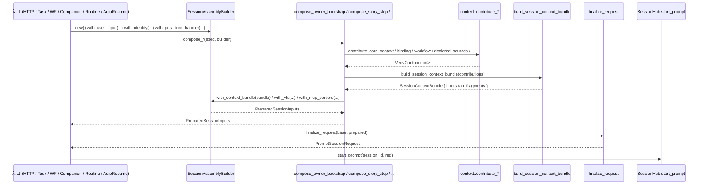

# Session Startup Pipeline

> **主题**：一个 prompt 从各种入口进入 `SessionHub` 之前，在 session 装配阶段
> 是如何被组装成 `PromptSessionRequest` 的。
>
> 本 spec 只描述装配阶段（entry → builder → finalize）的目标契约；
> 装配完成后进入 `prompt_pipeline` 构造 `ExecutionContext` 的部分由
> [`execution-context-frames.md`](./execution-context-frames.md) 承担；
> 业务上下文产物 `SessionContextBundle` 的形态由
> [`bundle-main-datasource.md`](./bundle-main-datasource.md) 承担。

## 摘要

- Session 装配统一走 `SessionAssemblyBuilder` —— 5 条正交轴（Who / Where /
  What / How / Trigger）每条都由 builder 的 first-class 方法承载，调用方不再
  靠调用顺序或额外赋值语句保证不漏字段。
- 6 条入口（HTTP / Task / Workflow / Companion / Routine / Auto-resume）全部
  聚拢到同一个 `compose → finalize_request` 节拍；`identity` /
  `post_turn_handler` / `env` 等跨轴字段由 entry 通过 `with_identity` /
  `with_post_turn_handler` / `with_user_input` 注入，不再在 `finalize_request`
  之后手工 `req.identity = ...`。
- `finalize_request` 的合并规则对称且显式：`mcp_servers` / `relay_mcp_server_names`
  均整体替换；`vfs` 优先取 prepared，`apply_workspace_defaults` 先于覆盖；
  `identity` / `post_turn_handler` 仅在 prepared 非空时覆盖 base。
- 装配阶段是**单一写入节拍**：除了 `from_user_input` 与 `finalize_request`，
  业务代码不得直接写 `PromptSessionRequest` 的字段。

## 1. 五条正交轴

Session 启动输入按以下五条轴分组；每一轴有唯一权威承载字段，装配器不允许同一
轴的数据在两个字段上同时存在。

| 轴 | 职责 | 权威承载 | 备注 |
|---|---|---|---|
| **Who** | 发起人身份 / owner 归属 | `PromptSessionRequest.identity` | `AuthIdentity::system_routine(id)` 承载定时任务等系统身份 |
| **Where** | 执行环境 | `PromptSessionRequest.user_input.working_dir` / `vfs` / `user_input.env` | workspace_defaults 用于兜底 VFS / working_dir |
| **What** | 业务上下文 | `PromptSessionRequest.context_bundle`（`SessionContextBundle`） | 详见 `bundle-main-datasource.md` |
| **How** | 能力 & 工具 | `flow_capabilities` / `effective_capability_keys` / `mcp_servers` / `relay_mcp_server_names` | compose 产出后 `finalize_request` 整体替换 |
| **Trigger** | 本轮触发输入 | `user_input.prompt_blocks` + `hook_snapshot_reload: HookSnapshotReloadTrigger` + `post_turn_handler` | `HookSnapshotReloadTrigger` 仅表达"是否需要本轮重载 hook snapshot" |

**禁令**：同一数据不得跨轴重复。典型反例：静态上下文（如 companion_agents）
只进 What 轴的 Bundle，不得同时塞进 Trigger 轴的 `prompt_blocks` 或
`user_blocks`；该约束由 `bundle-main-datasource.md` 的 hook 三语义规则加固。

## 2. 核心类型契约

### 2.1 `UserPromptInput`（wire DTO）

定义位置：`crates/agentdash-application/src/session/types.rs`。

```rust
pub struct UserPromptInput {
    pub prompt_blocks: Option<Vec<serde_json::Value>>,
    pub working_dir: Option<String>,
    pub env: HashMap<String, String>,
    pub executor_config: Option<AgentConfig>,
}
```

- 仅用于前端 HTTP 反序列化；不承载任何后端注入字段。
- 通过 `SessionAssemblyBuilder::with_user_input(input)` 一次性消化，进入
  builder 的 `prompt_blocks` / `executor_config` / `working_dir` / `env` 字段。
- 非 HTTP 入口（task / routine / auto-resume 等）也会先 `from_user_input(...)`
  构造一个 base `PromptSessionRequest`，再把真实 `UserPromptInput` 喂给 builder。

### 2.2 `PromptSessionRequest`（装配产物 wire 面）

定义位置：`crates/agentdash-application/src/session/types.rs`。

```rust
pub struct PromptSessionRequest {
    pub user_input: UserPromptInput,
    pub mcp_servers: Vec<McpServer>,
    pub relay_mcp_server_names: HashSet<String>,
    pub vfs: Option<Vfs>,
    pub flow_capabilities: Option<FlowCapabilities>,
    pub effective_capability_keys: Option<BTreeSet<String>>,
    pub context_bundle: Option<SessionContextBundle>,
    pub hook_snapshot_reload: HookSnapshotReloadTrigger,
    pub identity: Option<AuthIdentity>,
    pub post_turn_handler: Option<DynPostTurnHandler>,
}
```

- 按 **D1（prd.md · Decisions）**：`PromptSessionRequest` 继续作为 wire DTO
  存在，hub 内部路径直接消费它；plugin / relay 协议仍可序列化整体快照。
- **唯一允许的构造点**是 `PromptSessionRequest::from_user_input(input)`；
  业务代码不得裸构造 struct 字面量；这是为了保证 "每个字段都至少在 builder
  阶段被显式触碰一次" 的不变式（参见 target-architecture.md §I3）。
- 唯一允许的写入点是 `finalize_request(base, prepared)` 与 hub auto-resume
  augmenter；其他函数只应 clone / move。

### 2.3 `HookSnapshotReloadTrigger`（Trigger 轴子结构）

定义位置：`crates/agentdash-application/src/session/types.rs`。

```rust
pub enum HookSnapshotReloadTrigger {
    None,        // 普通续跑：不重载 hook snapshot、不触发 SessionStart
    Reload,      // Owner 首轮 / 冷启动续跑：重载 snapshot + 触发 SessionStart hook
}
```

- 由 **E7** 从旧 `SessionBootstrapAction::OwnerContext` 重命名收敛，语义明确为
  "本轮 prompt 是否需要重载 hook snapshot + 触发 `SessionStart` hook"。
- 与 `SessionMeta.bootstrap_state` 正交：后者是**持久化**的 session bootstrap
  阶段标记（Plain / Pending / Bootstrapped），两者不应混用。
- 取值由 compose 路径决定：
  - `compose_owner_bootstrap`（Story/Project/Routine 的 bootstrap）→ `Reload`
  - `compose_story_step` / `compose_lifecycle_node` / `compose_companion` → `None`
  - HTTP `RepositoryRehydrate(SystemContext)` 路径视重建需要可能写 `Reload`

### 2.4 `SessionAssemblyBuilder`

定义位置：`crates/agentdash-application/src/session/assembler.rs`。

Builder 按正交关注点分组，每一类字段由专属 `with_*` / `append_*` / `apply_*`
方法承载。所有 compose 函数内部必须通过 builder 构造，不允许直接裸构造
`PreparedSessionInputs` 字面量。

| 关注点 | First-class 方法 | 说明 |
|---|---|---|
| VFS（Where） | `with_vfs` / `with_companion_vfs` / `append_lifecycle_mount` / `append_canvas_mounts` | 允许追加 lifecycle mount / canvas mount |
| 能力（How） | `with_resolved_capabilities` / `with_companion_capabilities` | 传入 CapabilityResolver 结果或 companion 裁剪 |
| MCP（How） | `with_mcp_servers` / `append_mcp_servers` / `append_relay_mcp_names` | `with_*` 整体替换，`append_*` 追加 |
| 上下文（What） | `with_context_bundle` / `with_optional_context_bundle` | Bundle 是主数据面 |
| Prompt（Trigger） | `with_prompt_blocks` / `with_executor_config` / `with_hook_snapshot_reload` | Trigger 轴 |
| Workspace 默认值 | `with_workspace_defaults` / `with_optional_workspace_defaults` | 用于 `apply_workspace_defaults` 回填 |
| 用户输入聚合（Where + Trigger） | `with_user_input(UserPromptInput)` | 一次吞下 prompt_blocks / executor_config / working_dir / env |
| 独立环境变量 | `with_env(HashMap)` | 某些入口显式传入 env |
| 身份（Who） | `with_identity` / `with_optional_identity` | **E2 要求**：由 builder 而非调用方保证不漏 |
| 回调（Trigger 副作用） | `with_post_turn_handler` / `with_optional_post_turn_handler` | task / routine 注入 |
| 组合便利 | `apply_companion_slice` / `apply_lifecycle_activation` | 将多个关注点一次设置 |

产物是 `PreparedSessionInputs`（平坦结构），由 `finalize_request` 消化。

## 3. 6 条入口的统一节拍

所有后端入口必须满足：

```text
SessionAssemblyBuilder::new()
    .with_user_input(user_input)
    .with_identity(identity)
    .with_post_turn_handler(handler)          // 可选
    // ── compose 函数内部调用 .with_* / .apply_* ──
    .build()                                   // → PreparedSessionInputs
    |> finalize_request(base, prepared)       // → PromptSessionRequest
    |> SessionHub.start_prompt(...)
```

| # | 入口 | compose 函数 | builder 承载要点 |
|---|---|---|---|
| 1 | HTTP `POST /sessions/:id/prompt` | `augment_prompt_request_for_owner` → `compose_owner_bootstrap` / `compose_story_step` | `identity` 来自 HTTP session；对 `RepositoryRehydrate(SystemContext)` 路径通过 `apply_plain_lifecycle_request` 写 continuation bundle |
| 2 | Task service `start_task` / `continue_task` | `compose_story_step` | builder `.with_identity(task_identity)` + `.with_post_turn_handler(task_callback)` |
| 3 | Workflow orchestrator `start_agent_node_prompt` | `compose_lifecycle_node_with_audit` | 通过 `SessionAssemblyBuilder::apply_lifecycle_activation` 吸收 lifecycle activation 结果 |
| 4 | Companion tools `dispatch` | `compose_companion` / `compose_companion_with_workflow` | 通过 `apply_companion_slice` 一次性装配父 session 切片 |
| 5 | Routine executor `execute_with_session` | `compose_owner_bootstrap` | 依 **E1**：`AuthIdentity::system_routine(routine.id)` 注入；不再漏 identity（见 `crates/agentdash-application/src/routine/executor.rs:493-523`） |
| 6 | Hub auto-resume `schedule_hook_auto_resume` | `SharedPromptRequestAugmenter::augment` → 走回入口 1 节拍 | 通过 augmenter 重建完整 `PromptSessionRequest` |

**Base `PromptSessionRequest` 的来源约束**：非 HTTP 入口先
`PromptSessionRequest::from_user_input(UserPromptInput)` 得到 base；HTTP 入口
直接在 `augment_prompt_request_for_owner` 内部用 HTTP handler 传入的 DTO 作为
base。**禁止**在入口代码中裸 `PromptSessionRequest { user_input: ..., mcp_servers: vec![...], ... }`
字面量构造（见 target-architecture.md §I3）。

## 4. `finalize_request` 合并语义

定义位置：`crates/agentdash-application/src/session/assembler.rs::finalize_request`。

以下规则必须保持对称、显式、可预期：

| 字段 | 合并规则 |
|---|---|
| `user_input.prompt_blocks` | `prepared` 非空覆盖；否则保留 base |
| `user_input.executor_config` | `prepared` 非空覆盖；否则保留 base |
| `user_input.env` | `prepared.env` 非空整体替换；否则保留 base |
| `user_input.working_dir` | 先执行 `apply_workspace_defaults(&mut working_dir, &mut vfs, workspace_defaults)`；随后 `prepared.working_dir` 非空覆盖 |
| `vfs` | 先执行 `apply_workspace_defaults`；随后 `prepared.vfs` 非空覆盖 |
| `mcp_servers` | **整体替换**为 `prepared.mcp_servers`（compose 内部已汇总请求 / platform / custom / preset） |
| `relay_mcp_server_names` | **整体替换**为 `prepared.relay_mcp_server_names`（与 `mcp_servers` 对称） |
| `flow_capabilities` | 整体替换 |
| `effective_capability_keys` | 整体替换 |
| `context_bundle` | 整体替换（Bundle 是主数据面，compose 外部不应再补丁） |
| `hook_snapshot_reload` | 整体替换 |
| `identity` | `prepared.identity` 非空覆盖；否则保留 base |
| `post_turn_handler` | `prepared.post_turn_handler` 非空覆盖；否则保留 base |

**对称化背景（D1 / PR 1 Phase 1a 落地）**：旧实现中 `mcp_servers` 用 `=`、
`relay_mcp_server_names` 用 `.extend()`，语义不一致。收敛为两者都整体替换后，
compose 内部负责把 base 侧请求值合并进 `effective_mcp_servers` /
`relay_mcp_server_names` 再 builder 出去；finalize 阶段不再做增量合并。

**`identity` / `post_turn_handler` 下沉（PR 1 Phase 1c）**：过去 routine /
task 等路径都是 `finalize_request(base, prepared); req.identity = Some(id);`
两步走，routine 在 `04-30` 前就漏填过（prd.md · A.2）。现在 builder 持有这两
个字段，`finalize_request` 统一合入，节拍单一。

**`apply_workspace_defaults` 的顺序**：必须在 `prepared.working_dir` 与
`prepared.vfs` 覆盖**之前**执行，否则 workspace 回填会被紧随其后的 prepared
覆盖吞掉。当前实现位于 `finalize_request` 第一个分支之后、vfs 覆盖分支之前，
这是 PRD Requirements §"入口节拍" 的显式约束。

## 5. 装配时序图



组装只做一次：compose 函数产出 `SessionContextBundle.bootstrap_fragments` 后
不再被改写；运行期 hook 的增量改动走 `bundle.turn_delta`（详见
`bundle-main-datasource.md`）。

## 6. 入口实施要点

### 6.1 HTTP 主通道

- 入口：`crates/agentdash-api/src/routes/acp_sessions.rs::prompt_session` →
  `augment_prompt_request_for_owner`。
- HTTP handler 先从 session 解析 `identity`，然后根据 owner kind（Task /
  Story / Project）分派到 `build_task_owner_prompt_request` /
  `build_story_owner_prompt_request` / `build_project_owner_prompt_request`；
  内部调 `SessionRequestAssembler::compose_*`，统一走 builder + finalize。

### 6.2 Task / Workflow / Companion / Routine

- 各 service 直接持 `SessionRequestAssembler`，调各自的 `compose_*`。
- **必须**使用 `SessionAssemblyBuilder::with_identity` 注入身份；routine 通过
  `AuthIdentity::system_routine(routine.id)` 生成系统身份（E1 决策）；如缺
  identity，视为实施违规。
- **必须**使用 builder 的 `with_post_turn_handler`（若需要 per-turn 回调）。

### 6.3 Auto-resume

- 入口：`hub.schedule_hook_auto_resume`（由 `turn_processor` 侦测到 hook
  `BeforeStop == continue` 后触发）。
- 内部路径：构造一个最小 `PromptSessionRequest::from_user_input(
  UserPromptInput::from_text(AUTO_RESUME_PROMPT))` → 调
  `SharedPromptRequestAugmenter::augment`（AppState 注入的实现是
  `AppStatePromptAugmenter`，内部调 `augment_prompt_request_for_owner`） →
  与 HTTP 主通道共享同一条 compose + finalize 节拍。
- Auto-resume 限流（`hook_auto_resume_count < 2`）目标态由 `hub/hook_dispatch`
  承担（见 `execution-context-frames.md` §4）；入口契约保持不变。

### 6.4 基本不变式（必须可验证）

- `grep -r "PromptSessionRequest { " crates/` 在业务代码中零命中（仅 `from_user_input`
  与测试）；
- `routine/executor.rs` 产出的 `PromptSessionRequest.identity` 在任何执行路径
  上都是 `Some(AuthIdentity::system_routine(...))`；
- `finalize_request` 的 4 项对称性（mcp_servers / relay_mcp_server_names 替换
  策略对称、vfs prefer_base、workspace_defaults 顺序、identity /
  post_turn_handler 在 base 非空时保留）有对应单测（PR 1 已覆盖）。

## 7. 相关 spec / PRD / code 锚点

### 相关 spec

- [`execution-context-frames.md`](./execution-context-frames.md) — finalize 之后
  构造 `ExecutionContext.SessionFrame + TurnFrame` 的形态与生命周期。
- [`bundle-main-datasource.md`](./bundle-main-datasource.md) — 装配期产出的
  `SessionContextBundle` 结构及其 Hook 三类语义接入点。
- [`./runtime-execution-state.md`](./runtime-execution-state.md) — session 进
  入运行态后 `SessionRuntime` 与 `TurnExecution` 的职责边界。
- `.trellis/spec/backend/hooks/execution-hook-runtime.md` — Hook runtime 在
  装配期 / 运行期的整体契约，与本 spec 在 Trigger 轴配合。

### PRD / 任务文档

- `.trellis/tasks/04-30-session-pipeline-architecture-refactor/prd.md` — §
  Requirements / Acceptance Criteria / Decisions（D1 / D5 / E1 / E2 / E7）。
- `.trellis/tasks/04-30-session-pipeline-architecture-refactor/target-architecture.md`
  — §1.0 顶层架构图 / §3 五条正交轴 / §4.1 装配时序 / §6 不变式 I3 / I10。
- `.trellis/tasks/04-30-session-pipeline-architecture-refactor/research/pipeline-review/01-runtime-layer.md`
  — §1 入口拓扑 / §3 finalize_request 覆盖点事实。

### 代码锚点

- `crates/agentdash-application/src/session/assembler.rs`
  - `finalize_request`（~143 行）
  - `SessionAssemblyBuilder`（~205 行起）
  - `compose_owner_bootstrap` / `compose_story_step` / `compose_lifecycle_node_with_audit`
    / `compose_companion` / `compose_companion_with_workflow`
- `crates/agentdash-application/src/session/types.rs` — `PromptSessionRequest`
  / `UserPromptInput` / `HookSnapshotReloadTrigger`
- `crates/agentdash-application/src/session/context/mod.rs` —
  `apply_workspace_defaults`
- `crates/agentdash-application/src/session/augmenter.rs` +
  `crates/agentdash-api/src/bootstrap/prompt_augmenter.rs` — auto-resume 接入
- `crates/agentdash-spi/src/auth.rs::AuthIdentity::system_routine` — E1 实施
- `crates/agentdash-application/src/routine/executor.rs:493-523` — routine 入
  口装配示例
