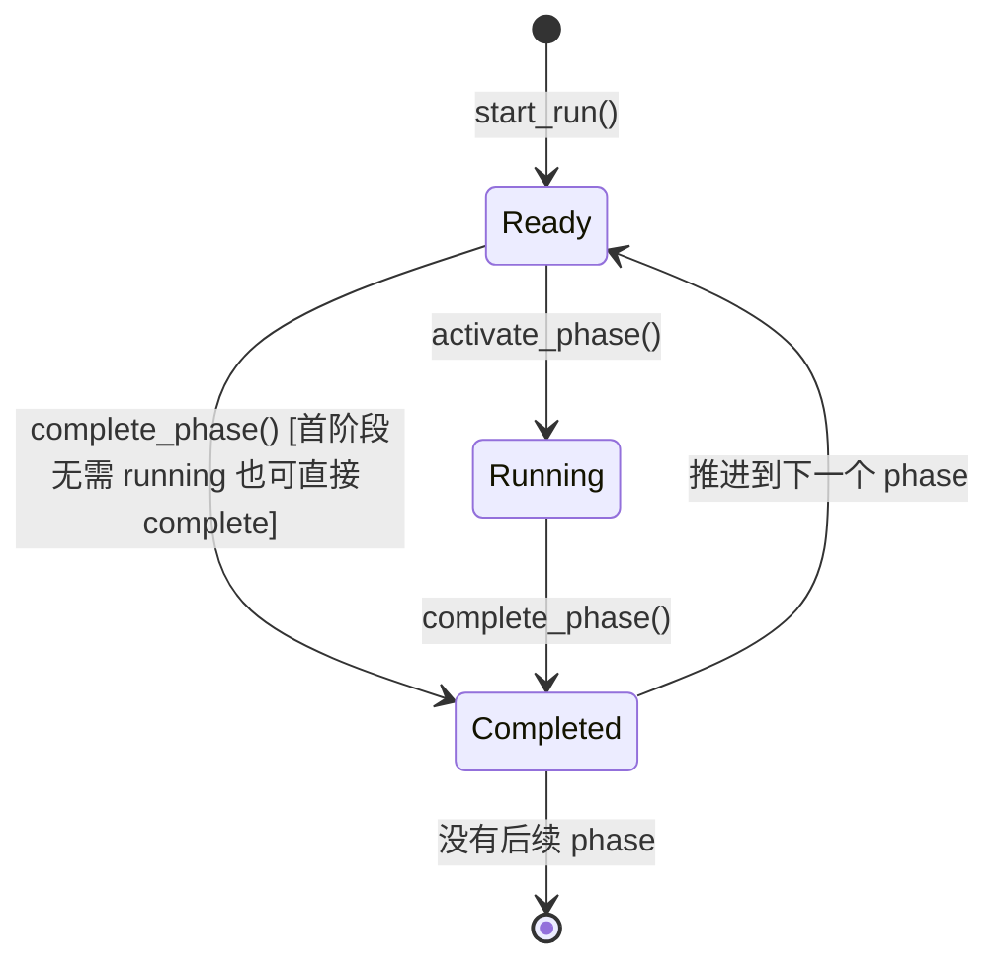
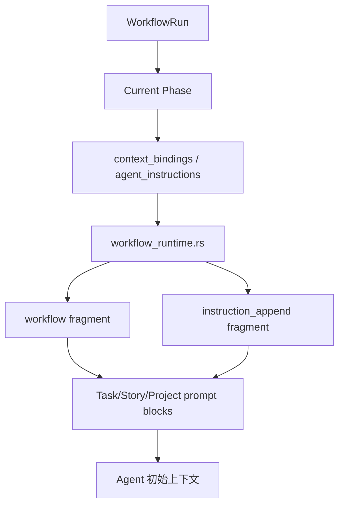
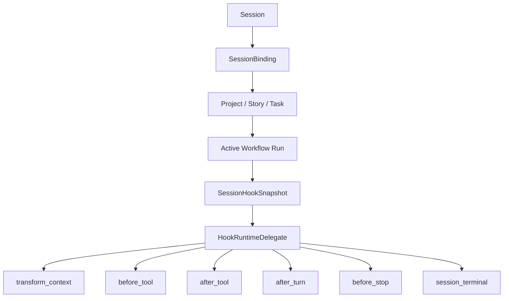
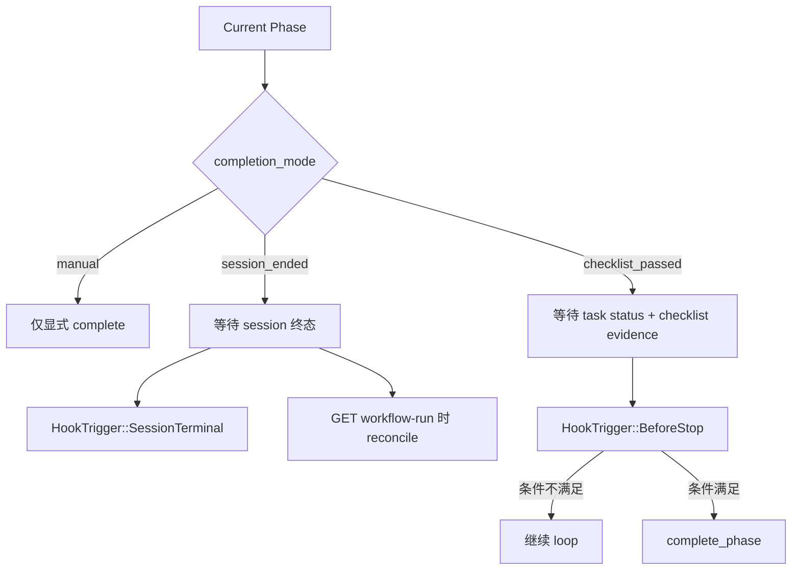
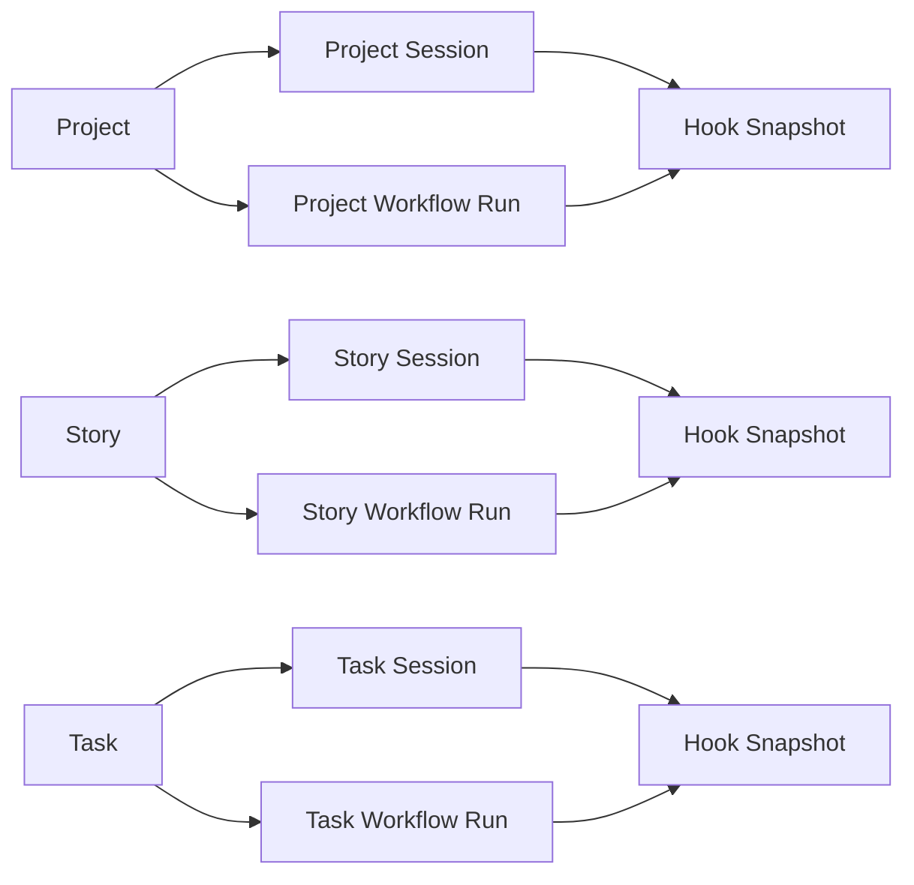

# Agent / Workflow 架构审查与过度设计分析

## 目标

本文件用于沉淀当前 `Agent` 与 `Workflow` 相关模块的真实运行逻辑、模块边界、重复语义、风险点，以及后续讨论执行计划时需要先统一的判断框架。

重点不是复述“设计上想做什么”，而是回答下面几个更实际的问题：

- 现在系统真正是怎么跑起来的。
- 哪些模块已经进入主链路，哪些还停留在“可用但未自动接线”的状态。
- 哪些复杂度是必要复杂度，哪些更像预研阶段叠出来的层次。
- 如果后续要瘦身，应该优先砍哪里、合哪里、保留哪里。

---

## 一句话结论

当前 `Agent` 运行时已经形成比较完整的主链路：

- `ExecutorHub -> Connector -> PiAgentConnector -> AgentLoop -> HookRuntimeDelegate`

但 `Workflow` 还处于“模型与治理层已经很完整、业务入口接线仍未完全闭环”的阶段：

- `WorkflowDefinition / Assignment / Run / Phase / Artifact / Completion Mode` 都已经成型。
- `Workflow` 语义已经能通过静态 prompt 注入和动态 hook 注入进入 session。
- 但 `assignment -> 自动开 run -> 自动 activate phase -> 自动绑定 session` 这条生命周期主链还没有彻底收口为默认行为。

因此，当前最显著的架构特征不是“缺模块”，而是：

- 同一类语义在多条链路中被重复表达。
- 同一类状态推进在多个位置可以发生。
- 运行时层已经比业务入口层更先进。

---

## 核心模块地图

### Domain

- `crates/agentdash-domain/src/workflow/`
  - `WorkflowDefinition`
  - `WorkflowAssignment`
  - `WorkflowRun`
  - `WorkflowPhaseState`
  - `WorkflowRecordArtifact`

### Application

- `crates/agentdash-application/src/workflow/`
  - `definition.rs`
  - `catalog.rs`
  - `run.rs`
  - `completion.rs`

### API / Runtime Glue

- `crates/agentdash-api/src/routes/workflows.rs`
- `crates/agentdash-api/src/workflow_runtime.rs`
- `crates/agentdash-api/src/execution_hooks.rs`
- `crates/agentdash-api/src/bootstrap/task_execution_gateway.rs`
- `crates/agentdash-api/src/routes/project_agents.rs`
- `crates/agentdash-api/src/routes/project_sessions.rs`
- `crates/agentdash-api/src/routes/story_sessions.rs`
- `crates/agentdash-api/src/routes/task_execution.rs`

### Execution Runtime

- `crates/agentdash-executor/src/hub.rs`
- `crates/agentdash-executor/src/connectors/pi_agent.rs`
- `crates/agentdash-executor/src/runtime_delegate.rs`
- `crates/agentdash-agent/src/agent.rs`
- `crates/agentdash-agent/src/agent_loop.rs`

---

## 当前系统的主链路

## 1. 启动期

应用启动时，`AppState` 会初始化：

- 持久化仓储
  - project / story / task / session_binding
  - workflow_definition / workflow_assignment / workflow_run
- 运行时服务
  - `ExecutorHub`
  - `CompositeConnector`
  - `PiAgentConnector`
  - `AddressSpaceService`
  - `AppExecutionHookProvider`
- task 运行时辅助状态
  - per-task lock
  - restart tracker

也就是说，`Workflow` 并不是挂在边上的辅助模块，而是已经正式进入全局应用状态。

---

## 2. Session 执行主链

用户真正发起一次任务执行时，主链大致如下：

```mermaid
sequenceDiagram
    participant User as 用户
    participant API as Task API
    participant GW as TaskExecutionGateway
    participant CTX as Context Builder
    participant HUB as ExecutorHub
    participant HOOK as HookProvider
    participant PI as PiAgentConnector
    participant LOOP as AgentLoop
    participant MON as Turn Monitor

    User->>API: POST /tasks/{id}/start
    API->>GW: execute_start_task
    GW->>CTX: 组装 task/story/project/workspace 上下文
    CTX-->>GW: prompt_blocks + sources + mcp + working_dir
    GW->>HUB: start_prompt(session_id, prompt_req)
    HUB->>HOOK: load_session_snapshot
    HOOK-->>HUB: SessionHookSnapshot
    HUB->>PI: connector.prompt(...)
    PI->>LOOP: agent.prompt(...)
    LOOP->>HOOK: transform_context / before_tool / after_tool / before_stop
    LOOP-->>PI: Agent events
    PI-->>HUB: ACP SessionNotification stream
    HUB-->>MON: 写入 session history + 广播
    MON->>API: 更新 task 状态 / 产物 / task change
```

这一条链是当前最稳定的主链。

如果只看“真正跑起来的系统”，`Workflow` 并不直接驱动 `AgentLoop`，而是通过两种中间机制影响它：

- 静态上下文注入
- 动态 hook 治理

---

## 3. Workflow 运行时本体

`WorkflowRun` 的状态机本身很简单：



更准确地说：

- run 创建时
  - 第一个 phase 直接是 `Ready`
  - 其他 phase 是 `Pending`
  - `current_phase_key` 指向第一个 phase
- `activate_phase`
  - 只允许激活 `current_phase_key`
  - 如果 phase `requires_session=true`，必须先拿到 `session_binding_id`
- `complete_phase`
  - 当前 phase 变为 `Completed`
  - 下一个 `Pending` phase 变为 `Ready`
  - 没有后续 phase 时，整个 run 变为 `Completed`

从领域模型角度看，这部分是相对克制的，没有明显过度设计。

---

## Workflow 语义进入 Agent 的两条链

## 1. 静态注入链

入口：

- `crates/agentdash-api/src/workflow_runtime.rs`

逻辑：

1. 根据 `target_kind + target_id` 找 active workflow run。
2. 找到当前 `current_phase_key` 对应的 `WorkflowPhaseDefinition`。
3. 解析 phase 的 `context_bindings`：
   - `document_path`
   - `runtime_context`
   - `checklist`
   - `journal_target`
   - `action_ref`
4. 生成两类 `ContextFragment`：
   - `workflow`
   - `instruction_append`
5. 在 task/story/project session 的上下文构建阶段，把这些 fragment 塞进 prompt blocks。

图示如下：



这条链的特点：

- 优点
  - 结构直观
  - phase 信息直接出现在 prompt 里
  - 比较容易调试
- 缺点
  - 只在“构建 prompt”的时刻起作用
  - 更像静态快照，不是强运行时约束

---

## 2. 动态 Hook 注入链

入口：

- `crates/agentdash-api/src/execution_hooks.rs`
- `crates/agentdash-executor/src/runtime_delegate.rs`

逻辑：

1. `ExecutorHub.start_prompt()` 为 session 加载 `HookSessionRuntime`。
2. `AppExecutionHookProvider.load_session_snapshot()` 根据 session binding 反查 owner。
3. 继续解析 active workflow run / phase。
4. 把 workflow phase 信息写入：
   - `snapshot.context_fragments`
   - `snapshot.constraints`
   - `snapshot.policies`
   - `snapshot.metadata.active_workflow`
5. `HookRuntimeDelegate` 在多个时点读取并执行这些规则：
   - `transform_context`
   - `before_tool_call`
   - `after_tool_call`
   - `after_turn`
   - `before_stop`
   - `session_terminal`

图示如下：



这条链的特点：

- 优点
  - 具备真正的运行时治理能力
  - 可以阻止 stop、要求审批、要求补 evidence、自动推进 phase
  - 能跟 session 实时状态联动
- 缺点
  - 语义已经不只是在“注入上下文”，而是在“实时编排”
  - 与静态注入链发生部分重叠
  - metadata 高度依赖字符串字段，比较脆

---

## Workflow 完成语义的真实运行方式

当前支持三种 phase completion mode：

- `manual`
- `session_ended`
- `checklist_passed`

### manual

- 不自动推进
- 需要显式调用 complete phase

### session_ended

- 当前 phase 结束条件是“关联 session 进入终态”
- 实际上有两条推进路径：
  - Hook 在 `SessionTerminal` 时推进
  - `GET workflow run` 时，路由层 `reconcile_workflow_run_runtime()` 也可能顺手推进

### checklist_passed

结束条件是同时满足：

- task status 已经进入 `awaiting_verification` 或 `completed`
- 当前 phase 已存在 checklist evidence

Hook 在 `before_stop` 时会先做 stop gate：

- 条件没满足，就继续 loop，不让自然结束
- 条件满足，就触发 `complete_phase`

图示如下：



这块是当前最明显的复杂度放大点之一，因为“phase completion 的 authority”并不唯一。

---

## Project / Story / Task 三条 owner 线

系统现在支持三种 workflow target：

- `Project`
- `Story`
- `Task`

而这三种 owner 又各自可以拥有：

- session binding
- workflow run
- address space
- mcp 注入
- hook snapshot
- context snapshot

图示如下：



这套设计本身不一定错，但会带来一个现实问题：

- 同样的“session context 详情接口”逻辑，在 project/story/task 三处都得再做一遍。

现在已经能看到这种重复：

- project session context builder
- story session context builder
- task session context builder

三条线都要做：

- 找 owner
- 找 workspace
- 算 executor summary
- 算 tool visibility
- 算 runtime policy
- 算 workflow runtime

这通常说明模型已经开始需要再抽象一层了。

---

## 当前最值得怀疑的过度设计点

## 1. ~~同一份 Workflow 语义被表达了两遍~~ ✅ 已解决

重复点：

- `workflow_runtime.rs` 把 phase 转成 prompt fragments
- `execution_hooks.rs` 把 phase 转成 snapshot/policy/constraint/metadata

结果：

- phase summary、phase constraints、completion mode、binding 语义，都在两处出现
- 后续改 phase 语义时，很容易一处更新、一处漏掉

这类复杂度不是“多一层抽象”，而是“多一套语义投影”。

判断：

- 这是目前最像过度设计的点之一

---

## 2. ~~completion 推进 authority 不唯一~~ ✅ 已解决

现在可能推进 phase 的地方有：

- hook `BeforeStop`
- hook `SessionTerminal`
- ~~路由层 `reconcile_workflow_run_runtime()`~~ **✅ 已从 GET 路由移除** (commit `164b27d`)
- 显式 API `complete_workflow_phase`

> **已完成**：GET 路由不再有副作用。曾新增 POST `/workflow-runs/{id}/reconcile` 作为过渡，Phase 5 将删除。
>
> **进行中**：Phase 4 将把 hook 改为 signal-only，由 `HookSessionRuntime::evaluate` post-evaluate 统一调用 `provider.advance_workflow_phase()`。


判断：

- 这不是能力不足，而是推进路径过多
- 属于明显应收口的复杂度

---

## 3. WorkflowAssignment 已建模完整，但业务入口未完全接线

当前已经有：

- workflow template
- definition bootstrap
- project assignment
- role default

但当前 task 执行主链并没有形成：

- `assignment -> 自动 start_run -> 自动 activate current phase -> 自动绑定 session -> session 结束后自动推下阶段`

更多是：

- 如果已经存在 active run，就消费它
- 如果显式调 workflow route，就推进它

所以 assignment 现在更像：

- 一个“已经很完整的配置面能力”
- 但还不是“默认驱动业务执行的主线”

判断：

- 这是典型的“模型先进于接线”的预研期现象
- 不算错，但确实很像过度平台化前置

---

## 4. Snapshot / Context / Runtime 层数偏多

现在系统里与一轮会话相关的中间形态至少有：

- session meta
- session jsonl history
- task agent context
- workflow runtime snapshot
- session hook snapshot
- hook runtime snapshot
- address space
- mcp server list

这些对象单独看都有意义，但叠在一起后会带来一个常见后果：

- 很难一眼说清“某个约束是在哪里注入给模型的”

一旦需要排障，问题通常会变成：

- 是 prompt fragment 没进来？
- 还是 hook snapshot 刷新后丢了？
- 还是 runtime delegate 没在该 trigger 上执行？
- 还是 MCP/address space 切换了工具集合？

判断：

- 这是“调试复杂度”层面的过度设计信号

---

## 5. metadata 强依赖字符串键值

例如：

- `active_workflow.completion_mode`
- `active_workflow.phase_key`
- `active_workflow.default_artifact_type`
- `active_workflow.checklist_evidence_present`
- `active_task.status`
- `permission_policy`
- `workspace_root`

这让 hook rule 很灵活，但也意味着：

- snapshot rebuild 时，少传一个字段就会悄悄失效
- 编译器对这些语义几乎没有保护

这次 review 已经看到一个典型问题：

- `refresh_session_snapshot()` 会把 `permission_policy / working_directory / workspace_root` 清空
- 后续规则中又有 supervised 审批和绝对路径 cwd rewrite 依赖它们

这说明当前字符串 metadata 模式已经开始暴露维护成本。

判断：

- 这不是“绝对不能这样做”，但已经接近系统规模上限

---

## 6. Hook Runtime 已经承担了部分编排器角色

理论上 hook 更像“运行时治理层”。

但现在它实际上在做：

- 动态上下文注入
- 工具审批
- stop gate
- checklist completion gate
- subagent blocking review gate
- session terminal 后 phase 自动推进

也就是说，hook 不只是 hook，已经开始承担“轻量编排器”的职责。

这会带来两个风险：

- 业务编排逻辑分散进 hook 规则后，主业务入口反而变轻但变空
- 后续很难界定“这条规则应该放 workflow service、task execution gateway，还是 hook runtime”

判断：

- 这是设计边界开始模糊的信号

---

## 哪些复杂度我认为是必要的

不是所有复杂度都该砍，下面这些我认为大体合理。

## 1. `ExecutorHub -> Connector -> AgentLoop` 分层

这条分层职责清楚：

- `ExecutorHub`
  - session 生命周期
  - history / broadcast / turn 状态
- `Connector`
  - 对接不同执行器
- `AgentLoop`
  - 模型调用、工具执行、消息循环

这是健康复杂度。

## 2. HookRuntimeDelegate 的插点设计

`transform_context / before_tool / after_tool / after_turn / before_stop`

这些插点是典型的 runtime governance 点位，本身是合理的，问题不在有这个机制，而在于它现在承载的业务语义有点太多。

## 3. WorkflowRun / PhaseState / Artifact 领域模型

领域模型本身是清晰的：

- `WorkflowDefinition`
- `WorkflowAssignment`
- `WorkflowRun`
- `WorkflowPhaseState`
- `WorkflowRecordArtifact`

这些不是过度设计。真正的问题在于：

- 主业务入口还没把它们当成唯一主线。

---

## 当前 review 发现的具体风险

## 1. ~~Hook snapshot refresh 会丢关键运行时元数据~~ ✅ 已修复

> commit `164b27d` — `HookSessionRuntime::refresh` 现在会从旧 snapshot 回填 session 级常量字段（`permission_policy` / `workspace_root` / `working_directory` / `connector_id` / `executor`）。新增 `preserve_session_level_metadata` 函数及 3 项单元测试。

## 2. ~~同一 target 允许并存多个 active workflow run~~ ✅ 已修复

> commit `164b27d` — `WorkflowRunService::start_run` 现在拦截同一 target 上任意进行中的 run（不再仅限同一 `workflow_id`）。新增 `start_run_rejects_different_workflow_on_same_target_with_active_run` 测试。

## 3. Workflow 生命周期没有唯一自动入口

现象：

- assignment 已存在
- run / activate / complete API 已存在
- 但 task/session 执行主链没有自动按 assignment 驱动 workflow

影响：

- workflow 更像“附加控制面”
- 不是“默认业务主线”

严重性：

- 中高

---

## 我建议后续讨论时优先统一的架构判断

在做执行计划前，建议先统一下面几件事。

## 1. Workflow 语义的唯一来源是什么

可选方向：

- 方案 A：以 hook snapshot 为唯一运行时来源，静态 prompt 注入只做展示补充
- 方案 B：以 workflow runtime fragment 为唯一来源，hook 只读 fragment 结果，不再重复解析 workflow
- 方案 C：保留双链，但抽一层 shared runtime projection，两个消费端共用同一结构

我当前更倾向：

- 方案 C 作为过渡
- 最终走向 A 或 B 之一

## 2. Workflow completion 的唯一 authority 是谁

可选方向：

- 只允许 hook 推进
- 只允许 workflow service / route 推进
- hook 只给 signal，不直接写回

我当前更倾向：

- 让 hook 负责 signal 与 gate
- 让单一 application service 负责真正写回
- 不要让“查询 run”再带推进副作用

## 3. Assignment 是否应该进入默认业务主线

如果答案是“是”，那就应补齐：

- project/story/task 创建或启动时自动选 assignment
- 自动创建 workflow run
- 自动推进到正确 phase
- 需要 session 的 phase 自动绑定当前 session

如果答案是“否”，那就应承认：

- assignment 现在只是配置面，不要再把它包装成默认编排主线

## 4. Hook Runtime 到底是治理层还是编排层

如果定位是治理层：

- 它应该约束、提示、阻止
- 不应该承担太多业务状态推进

如果定位是轻量编排层：

- 就应该明确承认它是 orchestration runtime
- 并让主业务入口更薄、规则更集中

现在它处于两者之间。

---

## 可选的瘦身方向

这里只先给方向，不展开成正式计划。

## 方向 A：Workflow 收口为单一 runtime projection

做法：

- 抽一个统一的 `ActiveWorkflowProjection`
- `workflow_runtime.rs` 与 `execution_hooks.rs` 都只消费它

收益：

- phase summary / constraints / completion mode 不再重复投影

风险：

- 需要梳理现有 hook snapshot metadata 与 fragment 结构

## 方向 B：把 completion 推进收口到单一路径

做法：

- hook 只生成 completion signal / gate
- `WorkflowRunService` 成为唯一 phase 推进入口
- 路由层不再做隐式 reconcile 副作用

收益：

- phase 为什么推进会变得清晰

风险：

- 需要调整现有 hook terminal 行为

## 方向 C：先承认 assignment 不是主线

做法：

- 短期不强行接自动 run
- 明确它只是配置面能力
- 先把 run 行为收口、注入收口

收益：

- 改动更小
- 更符合当前真实状态

风险：

- 用户侧认知会继续有“为什么配置了默认 workflow 却没自动跑”的落差

## 方向 D：真正把 assignment 接进 task/story/project 主链

做法：

- 在 owner session / task start 等入口自动解析 assignment
- 自动创建或恢复 run
- 自动 activate phase
- 自动绑定 session

收益：

- Workflow 真正变成主业务编排层

风险：

- 需要先解决 authority 与重复语义问题，否则会把现有复杂度再放大

---

## 我当前的判断排序

如果后续要进入执行计划，我建议优先级按下面顺序考虑：

1. 修掉会导致规则失效的真实 bug
   - hook refresh 丢 metadata
   - 多 active run 并存
2. 收口 phase completion authority
3. 收口 workflow 语义投影来源
4. 再决定 assignment 要不要成为默认业务主线

原因很简单：

- 先修 bug，避免继续在不稳定地基上讨论平台化。
- 再收口 authority，避免一个状态被多个地方推进。
- 然后收口语义来源，避免继续双轨维护。
- 最后才谈更高层的“是否自动编排”。

---

## 供后续讨论的直接问题

后面详细讨论执行计划时，建议直接围绕这些问题决策：

1. 我们要不要允许一个 target 同时存在多个 active workflow run？
2. `WorkflowAssignment` 在当前阶段是“配置能力”还是“默认主线”？
3. `Workflow completion` 是否必须只有一个 authoritative writer？
4. `HookRuntimeDelegate` 是否应该继续承担 phase 自动推进？
5. `workflow_runtime.rs` 和 `execution_hooks.rs` 是否应共享同一份 runtime projection？
6. `SessionHookSnapshot.metadata` 是否已经到了需要强类型化的时候？

---

## 本文件的用途

本文件同时作为架构审查基线和执行计划载体。上半部分是现状分析，下半部分是已确认的决策和执行计划。

---

## 架构决策记录

以下决策已经过讨论确认，后续执行均基于这些结论。

### 决策 1: Workflow 语义唯一来源

**选择**: Hook Snapshot 为唯一运行时来源。`workflow_runtime.rs` 退化为仅提供 binding 解析，不再重复生成 phase summary / instructions。

### 决策 2: Hook Runtime 角色定位

**选择**: Hook 只产出 completion signal（`satisfied=true`），不直接写回。由单一 `WorkflowRunService` 统一负责 phase 推进。调用点收口到 `apply_completion_decision` 统一走 service。

### 决策 3: Binding 解析位置

**选择**: binding 解析提取到 `agentdash-application` 共享层，两边都可以调用，但 fragment 生成收口到 hook 侧。

### 决策 4: 前端 WorkflowRuntimeSnapshot

**选择**: 前端从 hook runtime snapshot 中派生 workflow 信息（hook snapshot 已包含 owner.workflow_run_id 等），删掉单独的 `WorkflowRuntimeSnapshot` 字段。

### 决策 5: Signal 桥接机制

**选择**: 在 `HookSessionRuntime::evaluate` 内部加一步 post-evaluate：如果 resolution 带 advance signal，自动调用 `provider.advance_phase()`。对 caller（hub.rs / runtime_delegate.rs）透明。

### 决策 6: Reconcile endpoint

**选择**: 删除 POST `/workflow-runs/{id}/reconcile`，不保留多条路径。Phase 推进只有一条权威写入路径。

### 决策 7: Assignment 定位

**选择**: 当前阶段承认 assignment 是"配置面能力"，不急于接入自动主线。先完成收口工作再评估。

---

## 执行计划

### 已完成

| 修复项 | 状态 | commit |
|--------|------|--------|
| Fix 1: refresh_session_snapshot 丢失 session 级 metadata | ✅ 已完成 | `164b27d` |
| Fix 2: start_run 未拦截不同 workflow 的 active run 并存 | ✅ 已完成 | `164b27d` |
| Fix 3: GET 路由中移除 reconcile 副作用，新增显式 POST endpoint | ✅ 已完成 | `164b27d` |
| Fix 4: select_active_run / workflow_run_priority 去重到共享模块 | ✅ 已完成 | `164b27d` |

### Phase 1: 提取 binding 解析到 agentdash-application ✅

**状态**: 已完成

**目标**: 消除 binding 解析逻辑对 api crate 的锁定，为 hook 侧消费 binding 做准备。

**完成内容**:

1. 在 `agentdash-application::workflow` 下新建 `binding` 模块
2. 从 `workflow_runtime.rs` 迁入 `resolve_binding`、`resolve_document_binding`、`resolve_runtime_context_binding` 等函数和类型
3. `workflow_runtime.rs` 和 hook provider 均改为调用共享模块

### Phase 2: 去重 fragment 生成，hook 成为唯一注入源 ✅

**状态**: 已完成

**目标**: 消除双链 fragment 重复。

**完成内容**:

1. `workflow_runtime.rs` 不再生成 `ContextFragment`，`resolve_workflow_runtime_injection` 返回空 fragments
2. `AppExecutionHookProvider` 新增 `resolve_workflow_bindings` 方法，在 `load_session_snapshot` 中注入 binding fragments
3. Hook 成为运行时 context fragment 的唯一注入源

### Phase 3: 前端从 hook snapshot 派生 workflow 信息 ✅

**状态**: 已完成

**目标**: 删掉 `WorkflowRuntimeSnapshot` API 字段，前端统一从 hook snapshot 取 workflow 数据。

**完成内容**:

1. 删除 `WorkflowRuntimeSurfaceCard` 组件（功能已由 `HookRuntimeSurfaceCard` 覆盖）
2. 从 `project_sessions.rs`、`story_sessions.rs`、`task_execution.rs` API 移除 `workflow_runtime` 字段
3. 前端类型定义删除 `WorkflowRuntimeSnapshot`、`WorkflowRuntimePhaseSnapshot` 接口
4. 删除 `workflow_runtime.rs` 整个模块（已无消费者）

### Phase 4: Hook signal-only + post-evaluate 桥接 ✅

**状态**: 已完成

**目标**: Hook 不再直接推进 phase，改为纯 signal 输出。

**完成内容**:

1. 新增 `HookPhaseAdvanceRequest` 数据结构和 `ExecutionHookProvider::advance_workflow_phase` trait 方法
2. `apply_completion_decision` 重构为 signal-only：只填充 `resolution.pending_advance`，不直接调用 `complete_phase`
3. `HookSessionRuntime::evaluate` 新增 post-evaluate 桥接步骤：消费 `pending_advance` 信号并委托 provider 执行

### Phase 5: 删除 reconcile endpoint + 清理 ✅

**状态**: 已完成

**目标**: 消除多余的 phase 推进路径。

**完成内容**:

1. 删除 `POST /workflow-runs/{id}/reconcile` 路由注册及 handler
2. 删除前端 `reconcileWorkflowRun` 函数
3. `reconcile_workflow_run_runtime` 已无内部用途，一并删除

### 执行总结

全部 5 个 Phase 已完成。改动总量 ≈ **+252 / -1050 行**，净减少约 800 行代码。

关键成果：
- **唯一注入源**: Hook 成为运行时 context fragment 的唯一权威来源
- **唯一推进路径**: Phase advancement 仅通过 hook post-evaluate 桥接执行
- **零冗余 API**: `WorkflowRuntimeSnapshot` 完全移除，前后端统一走 hook snapshot
- **共享 binding**: binding 解析逻辑提取到 `agentdash-application` 共享层
