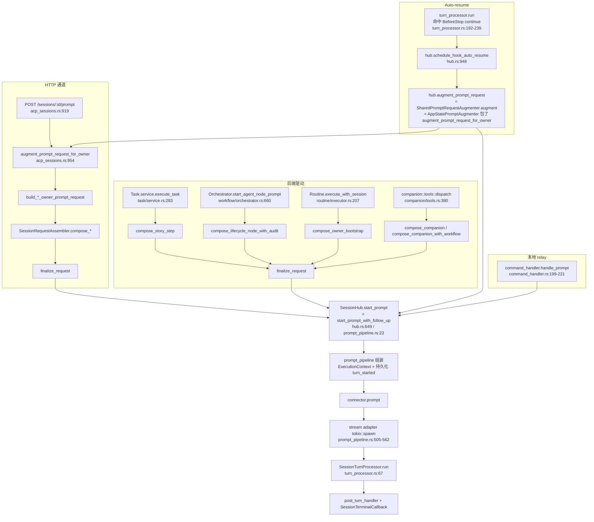
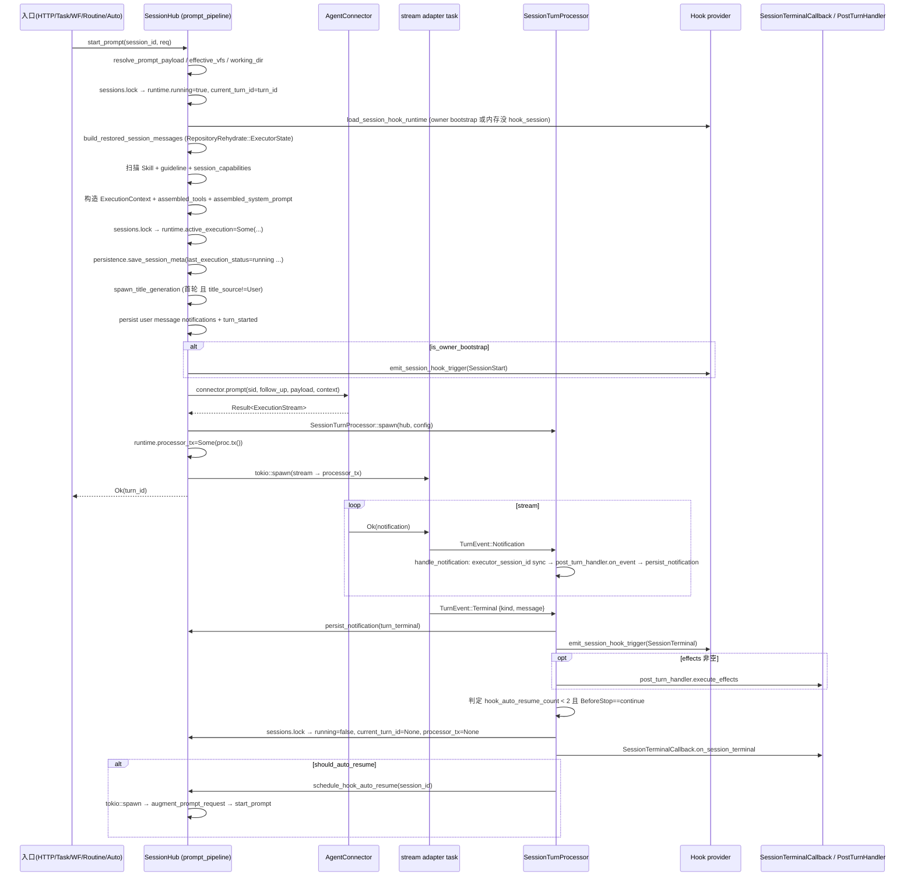

# Research: Session → Agent 管线运行时层（Runtime Layer）

- **Query**: 摸清 `PromptSessionRequest` 进入 `SessionHub` 到交给 connector 之间的所有环节
- **Scope**: internal（`crates/agentdash-application/src/session/*` + 上游入口）
- **Date**: 2026-04-30
- **关键文件定位**：
  - `crates/agentdash-application/src/session/hub.rs`（`SessionHub` 主入口 + cancel/notify 外围方法）
  - `crates/agentdash-application/src/session/prompt_pipeline.rs`（`start_prompt_with_follow_up` 核心）
  - `crates/agentdash-application/src/session/hub_support.rs`（`SessionRuntime` / `ActiveSessionExecutionState` / `TurnTerminalKind`）
  - `crates/agentdash-application/src/session/turn_processor.rs`（per-turn 事件处理循环）
  - `crates/agentdash-application/src/session/continuation.rs`（从事件重建历史消息 / owner context markdown）
  - `crates/agentdash-application/src/session/post_turn_handler.rs`（`PostTurnHandler` / `SessionTerminalCallback` trait）
  - `crates/agentdash-application/src/session/event_bridge.rs`（hook evaluate → trace → persist）
  - `crates/agentdash-application/src/session/companion_wait.rs`（companion_request(wait=true) 挂起通道）
  - `crates/agentdash-application/src/session/types.rs`（`PromptSessionRequest` / `SessionMeta` / `SessionPromptLifecycle` 定义）
  - `crates/agentdash-application/src/session/assembler.rs`（5 条入口共享的 compose → `PreparedSessionInputs` → `finalize_request`）
  - `crates/agentdash-application/src/session/augmenter.rs` + `crates/agentdash-api/src/bootstrap/prompt_augmenter.rs`（HTTP 主通道增强契约）
  - `crates/agentdash-spi/src/connector.rs`（`ExecutionContext`）
  - `crates/agentdash-spi/src/session_context_bundle.rs`（`SessionContextBundle`）

---

## 目录

1. 入口拓扑（谁调 `start_prompt`）
2. `SessionRuntime` 的角色（结构 / 生命周期 / 与 `SessionMeta` 的关系）
3. `PromptSessionRequest` 在 hub 内的所有读/写/覆盖点
4. 每轮 turn 的生命周期与注入点
5. 冗余与耦合信号
6. Hub 内模块边界：叙述 vs 代码

---

## 1. 入口拓扑

### 1.1 谁调用 `SessionHub::start_prompt` / `start_prompt_with_follow_up`

通过 grep `start_prompt|start_prompt_with_follow_up` 一共 **6 个入口**（第 6 个是 hub 自身的 `schedule_hook_auto_resume`）：

| # | 入口 | 调用点 | compose 路径 | 是否经 augmenter |
|---|---|---|---|---|
| 1 | HTTP `POST /sessions/:id/prompt`（用户手动 prompt） | `crates/agentdash-api/src/routes/acp_sessions.rs:942` | `augment_prompt_request_for_owner` → `compose_owner_bootstrap` / `compose_story_step` | 直接调 augment（而非 hub 里的 wrapper） |
| 2 | Task service（`start_task` / `continue_task`） | `crates/agentdash-application/src/task/service.rs:283` | `compose_story_step` + `finalize_request` | **否**（已持有装好的 req） |
| 3 | Workflow orchestrator（AgentNode 自动启动） | `crates/agentdash-application/src/workflow/orchestrator.rs:706` | `compose_lifecycle_node_with_audit` + `finalize_request` | **否** |
| 4 | Companion 工具（子 session 派发） | `crates/agentdash-application/src/companion/tools.rs:422`、`companion/tools.rs:1576` | `compose_companion` / `compose_companion_with_workflow` + `finalize_request` | **否** |
| 5 | Routine executor（定时触发） | `crates/agentdash-application/src/routine/executor.rs:209` | `compose_owner_bootstrap`（OwnerScope::Project） + `finalize_request` | **否** |
| 6 | Hub 内 `schedule_hook_auto_resume`（hook BeforeStop continue） | `crates/agentdash-application/src/session/hub.rs:948-979` | `augment_prompt_request` → `start_prompt` | **是**（强制经 augmenter） |
| (+) | Local relay `command.prompt`（嵌入式） | `crates/agentdash-local/src/command_handler.rs:232` | 直接构造裸 `PromptSessionRequest` | 否（嵌入式裸请求） |

**结论：没有 "先 start 后 compose" 的路径**。所有入口都是"先 compose 再 start"。但"compose 发生在哪儿"分成两家：

1. **HTTP 主通道**：compose 发生在 `augment_prompt_request_for_owner`（`routes/acp_sessions.rs:954`）里——读取 `session_binding` → 决定 Task / Story / Project owner → 调对应 `build_*_owner_prompt_request` → 内部再调 `SessionRequestAssembler::compose_*` → `finalize_request` → 回到 `prompt_session` 里 `.start_prompt()`。
2. **后端驱动通道**：task / workflow / companion / routine 在各自的 service 里直接构造 `SessionRequestAssembler` 并调 `compose_*`，拿到 `PreparedSessionInputs` 后自己 `finalize_request` 合入一个 `PromptSessionRequest::from_user_input(...)` 的 base，再 `.start_prompt()`。
3. **Hub 自驱动 auto-resume**：裸请求 `PromptSessionRequest::from_user_input(UserPromptInput::from_text(AUTO_RESUME_PROMPT))` → 调 `self.augment_prompt_request()`（即 `SharedPromptRequestAugmenter::augment`，在 AppState bootstrap 绑为 `AppStatePromptAugmenter`，见 `crates/agentdash-api/src/app_state.rs:416-420` + `bootstrap/prompt_augmenter.rs:47`）→ 复用 HTTP 主通道同一条 `augment_prompt_request_for_owner` 逻辑。

### 1.2 Mermaid



### 1.3 小结

- 目前 **没有单一入口**保证 compose 一定先于 start；三家自行拼 request 意味着 `PromptSessionRequest` 的六个后端注入字段（`mcp_servers`/`relay_mcp_server_names`/`vfs`/`flow_capabilities`/`effective_capability_keys`/`context_bundle`/`bootstrap_action`）都由调用方负责填。如果某个新入口忘了填，就会像 auto-resume 一样出现 "裸请求" 漂移——这正是 `PromptRequestAugmenter` trait 产生的动机（见 `session/augmenter.rs:1-10` 注释）。
- **augmenter 实际只兜底一条路径：hub 内的 auto-resume**。task/workflow/companion/routine 不走 augmenter，因为它们调用 compose 时已经拿到足够上下文（task_id / run_id / agent_id），没必要再 round-trip。
- **AppState 注入时序**（见 `crates/agentdash-api/src/app_state.rs:312`、`:370`、`:416-420`）：`SessionHub::set_terminal_callback` / `set_context_audit_bus` / `set_prompt_augmenter` 都是延迟注入，hub 构造完再绑——用 `Arc<RwLock<Option<...>>>` 结构就是为了解这个循环依赖（hub → augmenter → AppState → hub）。

---

## 2. `SessionRuntime` 的角色

### 2.1 结构定义

`crates/agentdash-application/src/session/hub_support.rs:167-196`：

```rust
pub(super) struct SessionRuntime {
    pub tx: broadcast::Sender<PersistedSessionEvent>,         // session event fan-out（订阅端 = 前端 SSE / companion_wait 等）
    pub running: bool,                                        // 互斥：同一时间只能有一个活跃 turn
    pub current_turn_id: Option<String>,                      // 当前活跃 turn
    pub cancel_requested: bool,                               // cancel 与 processor 之间的软信号
    pub hook_session: Option<SharedHookSessionRuntime>,       // 每 session 的 hook 运行时（trace/snapshot/capability）
    pub active_execution: Option<ActiveSessionExecutionState>,// 本轮执行态快照（见下）
    pub hook_auto_resume_count: u32,                          // 限流：最多 2 次 auto-resume（turn_processor.rs:191）
    pub last_activity_at: i64,                                // stall 检测用
    pub processor_tx: Option<UnboundedSender<TurnEvent>>,     // relay / cancel 发送 Terminal 用
}
```

`ActiveSessionExecutionState`（`hub_support.rs:184-196`）：

```rust
pub(super) struct ActiveSessionExecutionState {
    pub mcp_servers, relay_mcp_server_names,
    pub vfs, working_directory, executor_config,
    pub flow_capabilities,
    pub effective_capability_keys,   // #[allow(dead_code)] 已标注
    pub identity,
}
```

### 2.2 生命周期

**创建**（首次落位）——至少 3 处可能创建同一个 `SessionRuntime`：

- `hub.ensure_session`（`hub.rs:366-376`）：前端 SSE subscribe 时，`sessions.entry(id).or_insert_with(build_session_runtime)` → `running=false`、`active_execution=None`。
- `prompt_pipeline::start_prompt_with_follow_up`（`prompt_pipeline.rs:37-51`）：首次 prompt 时同样 `or_insert_with`，随后立即 `runtime.running = true; current_turn_id = Some(...)`。
- `hub.persist_notification`（`hub.rs:836-844`）：任何广播路径都会 `or_insert_with` 兜底（比如 `inject_notification` 在 session 尚未 subscribe 前抢先写事件）。
- `hub.cancel`（`hub.rs:727-740`）：cancel 在 session 从未被 subscribe 时也兜底创建。
- `hub.ensure_hook_session_runtime`（`hub.rs:637-645`）：冷启动拉 hook snapshot 时也兜底。

**更新**——`prompt_pipeline.rs:316-330` 写入 `active_execution`，`prompt_pipeline.rs:496-502` 注册 `processor_tx`；turn_processor 终止时 `turn_processor.rs:210-221` 清空 `running` / `current_turn_id` / `cancel_requested` / `processor_tx`。

**销毁**——只有 `hub.delete_session`（`hub.rs:358-364`）主动 `sessions.remove`。其余情况下 `SessionRuntime` 常驻直到进程退出。所以单一 `SessionRuntime` 的寿命通常 ≫ 一轮 turn，是 session 级而非 turn 级。

**持有关系**：

- 被 `SessionHub.sessions: Arc<Mutex<HashMap<String, SessionRuntime>>>` 独占（`hub.rs:34`）。
- 反过来 `SessionRuntime.tx` 被 subscribe 的 SSE 客户端 / `SessionTurnProcessor` 内部拷贝持有；`hook_session` 被 `HookRuntimeDelegate`（通过 `ExecutionContext.runtime_delegate`）和 `SessionTurnProcessor` 共同持有。

### 2.3 `SessionRuntime` ↔ `SessionMeta`

- **运行时状态**（`running` / `current_turn_id`）不写回 `SessionMeta`，只存在内存。
- **终态状态**（`last_execution_status` / `last_turn_id` / `last_terminal_message` / `executor_config` / `executor_session_id` / `bootstrap_state`）写进 `SessionMeta` 持久化（`prompt_pipeline.rs:332-343`、`turn_processor.rs:262-265`）。
- 冷启动恢复（`recover_interrupted_sessions` `hub.rs:172-198`）只读 `SessionMeta.last_execution_status == "running"` → 写回 `interrupted` 或发 `turn_interrupted` 事件，并不重建 `SessionRuntime`。
- `meta_to_execution_state`（`hub_support.rs:238-280`）单向从 `SessionMeta` 派生 `SessionExecutionState`，内存 `SessionRuntime.running` 优先。
- `inspect_execution_states_bulk`（`hub.rs:280-310`）：先看内存 `running_set`，再 fallback 到 `SessionMeta` — 典型 "运行时 vs 持久态" 双数据源模式。

### 2.4 关键观察

- `SessionRuntime` 本身不是 per-turn 对象，它持续存在；真正的 per-turn 对象是 `ActiveSessionExecutionState`（由 prompt_pipeline 写入，turn_processor 不写但 phase 相关的 `replace_runtime_mcp_servers` 会热更新）。
- `ActiveSessionExecutionState.effective_capability_keys` 被标了 `#[allow(dead_code)]`（`hub_support.rs:193`）——承载了数据但当前没人读它。这是 "留作 runtime/inspector 投影使用" 的半熟字段。
- `SessionRuntime` 与 `SessionTurnProcessor` 之间通过 `processor_tx` 通信但生命周期不对齐：processor 的 join handle 被 processor 自己 `_join_handle` 持有（`turn_processor.rs:47`），hub 不管 processor 何时退出，只知道 processor 退出时会自己清理 `running = false`。

---

## 3. `PromptSessionRequest` 在 hub 内的所有读/写/覆盖点

`PromptSessionRequest` 字段（`types.rs:27-48`）：`user_input`（嵌套 `UserPromptInput`）/ `mcp_servers` / `relay_mcp_server_names` / `vfs` / `flow_capabilities` / `effective_capability_keys` / `context_bundle` / `bootstrap_action` / `identity` / `post_turn_handler`。

### 3.1 `prompt_pipeline::start_prompt_with_follow_up` 内对 req 的读写清单

| 字段 | 位置 | 操作 |
|---|---|---|
| `req.user_input.resolve_prompt_payload()` | `prompt_pipeline.rs:29-32` | 读，产出 `text_prompt` / `prompt_payload` / `user_blocks` |
| `req.vfs` | `prompt_pipeline.rs:53-61` | 读，回退到 `self.default_vfs`；后文称 `effective_vfs` |
| `req.user_input.working_dir` | `prompt_pipeline.rs:69-71` | 读，用于 `resolve_working_dir(default_mount_root, working_dir)` |
| `req.user_input.executor_config` | `prompt_pipeline.rs:93-103` | 读，fallback 到 `session_meta.executor_config` |
| `req.bootstrap_action == OwnerContext` | `prompt_pipeline.rs:105` | 读，决定 `is_owner_bootstrap` |
| `req.mcp_servers` / `req.relay_mcp_server_names` / `req.flow_capabilities` / `req.effective_capability_keys` / `req.identity` | `prompt_pipeline.rs:263-267` | `clone`，后续写入 `ExecutionContext` 与 `ActiveSessionExecutionState` |
| `req.user_input.env` | `prompt_pipeline.rs:272` | move（`environment_variables`） |
| `req.context_bundle` | `prompt_pipeline.rs:303` | 读 `.as_ref()`，传给 `SystemPromptInput` |
| `req.post_turn_handler` | `prompt_pipeline.rs:490` | move → `SessionTurnProcessorConfig.post_turn_handler` |
| `req.identity` | `prompt_pipeline.rs:267、279` | clone，写入 `ExecutionContext.identity` 和 `ActiveSessionExecutionState.identity` |

**prompt_pipeline 内 req 没有被就地改写（`req.xxx = ...`）**，只有读 / clone / move。所有"覆盖"都发生在 **入口侧 `augment` / `finalize_request`** 里。

### 3.2 `augment_prompt_request_for_owner` 内对 req 的覆盖点

（`crates/agentdash-api/src/routes/acp_sessions.rs:954-1093`）

- `:973-977` 读 `req.user_input.executor_config`，fallback 到 `meta.executor_config`
- `:1070-1089` 若是 `RepositoryRehydrate(SystemContext)`：先调 `hub.build_continuation_system_context` → 生成 `continuation_bundle` → 调 `apply_plain_lifecycle_request` 改写 `req.context_bundle`、`req.bootstrap_action`
- `build_task_owner_prompt_request`（`:1356-1600+`）：`mut req`，陆续：
  - `:1441-1445` 从 `req.user_input.prompt_blocks.take()` 拿走 prompt
  - 调 `prepared.prompt_blocks.take()` 覆盖（`:1460`）
  - `:1455` clone `prepared.context_bundle` 赋给 `context_bundle`
  - `:1456` 新建 `bootstrap_action = None`
  - 根据 lifecycle 分支再决定 `context_bundle` / `bootstrap_action`
  - 结尾通过 `finalize_augmented_request` 统一写回（`:1095-1117`）
- `build_story_owner_prompt_request` / `build_project_owner_prompt_request`：`req.user_input.prompt_blocks.take()` + `compose_owner_bootstrap` + `finalize_request(req, prepared)` 一把覆盖

### 3.3 `finalize_request` 的覆盖逻辑

`crates/agentdash-application/src/session/assembler.rs:105-140`：

```rust
pub fn finalize_request(base: PromptSessionRequest, prepared: PreparedSessionInputs) -> PromptSessionRequest {
    let mut req = base;
    if let Some(blocks) = prepared.prompt_blocks { req.user_input.prompt_blocks = Some(blocks); }  // 覆盖 prompt
    if let Some(cfg) = prepared.executor_config { req.user_input.executor_config = Some(cfg); }   // 覆盖 executor
    req.context_bundle = prepared.context_bundle;                                                  // 覆盖 bundle
    req.bootstrap_action = prepared.bootstrap_action;
    apply_workspace_defaults(&mut req.user_input.working_dir, &mut req.vfs, prepared.workspace_defaults.as_ref());
    if let Some(wd) = prepared.working_dir { req.user_input.working_dir = Some(wd); }
    if req.vfs.is_none() { req.vfs = prepared.vfs; } else if prepared.vfs.is_some() { req.vfs = prepared.vfs; }
    req.mcp_servers = prepared.mcp_servers;                                                        // 整体替换
    req.relay_mcp_server_names.extend(prepared.relay_mcp_server_names);                            // merge（不替换）
    req.flow_capabilities = prepared.flow_capabilities;
    req.effective_capability_keys = prepared.effective_capability_keys;
    req
}
```

- **`req.mcp_servers` 整体替换**（`:134`），与 `req.relay_mcp_server_names.extend()`（`:135`）行为不一致。合并语义在两字段间不对称，容易漏掉外部传入但 prepared 没重算的 mcp server。
- **`req.vfs` 覆盖规则有三重分支**（`:127-133`）：base 无 vfs → 用 prepared；base 有 vfs 且 prepared 也有 → **仍以 prepared 为准**（注释写了"保证 compose 的 workspace/canvas/lifecycle mount 组合不被覆盖"）。这意味着 HTTP 透传 `vfs` 实际上只在 compose 不产出 vfs 时才生效。
- `identity` / `post_turn_handler` 两字段 `finalize_request` 不管，需要调用方在 `finalize_request` 之后显式赋值（典型 `task/service.rs:272-281`）。

### 3.4 Hub 层对 req 的 "其他写"

- `hub.start_prompt_with_follow_up`（pipeline 内）：构造 `ExecutionContext` 时是 clone 而非就地改；但在 `hub.replace_runtime_mcp_servers`（`hub.rs:441-500`）热更新路径下，**不经过 `PromptSessionRequest`**，直接改 `ActiveSessionExecutionState.mcp_servers`，绕过了 `finalize_request` 契约。
- `hub.schedule_hook_auto_resume`（`hub.rs:948-979`）：构造一个裸的 `PromptSessionRequest::from_user_input(UserPromptInput::from_text(AUTO_RESUME_PROMPT))`，再交给 augmenter 增强。

### 3.5 观察

- `PromptSessionRequest` 在 prompt_pipeline 里是纯读，修改集中在 "入口 augment" 和 "assembler finalize_request"。但 **后端驱动通道（task/workflow/companion/routine）跳过了 augment 节拍**，它们的 `req.identity` / `req.post_turn_handler` 必须在 `finalize_request` 之后手动填，否则丢失；routine executor 甚至完全不设 `identity` / `post_turn_handler`（`routine/executor.rs:500-515`）——如果未来加入身份审计这里会首先漏。
- `req.relay_mcp_server_names` 用 `extend` 而非 `=`，是因为有些入口允许 HTTP 传入 relay 名字叠加 compose 产出；但同字段 `mcp_servers` 用 `=`，**语义不一致**。

---

## 4. 每轮 turn 生命周期

### 4.1 主流程（prompt_pipeline + turn_processor + adapter）



### 4.2 注入点清单

| 注入点 | 位置 | 触发时机 | 备注 |
|---|---|---|---|
| `title_generator.spawn_title_generation` | `prompt_pipeline.rs:346-355` + `title_generator.rs:22-` | 首轮 prompt 且 `title_source != User` 且 `title_generator` 已注入 | 完全 fire-and-forget，不回写 turn |
| `build_tools_for_execution_context`（runtime tool + direct MCP + relay MCP） | `prompt_pipeline.rs:286-293` + `hub.rs:502-544` | prompt 前预构建 | 结果写入 `ExecutionContext.assembled_tools` |
| `assemble_system_prompt` | `prompt_pipeline.rs:296-314` | 当 `base_system_prompt` 非空 | 产出的字符串写入 `ExecutionContext.assembled_system_prompt` |
| `SessionStart` hook | `prompt_pipeline.rs:420-445` | 仅当 `is_owner_bootstrap` | 不再按"进程内第几轮"绑定 |
| `capability_changed` hook | `hub.rs:389-426`（外部触发） | PhaseNode 等动态能力更新 | 与 turn 无绑定 |
| `SessionTerminal` hook | `turn_processor.rs:146-166` | turn 终止时 | 返回 `effects` 给 `post_turn_handler.execute_effects` |
| `post_turn_handler.on_event` | `turn_processor.rs:269-270` | 每条 notification | 调用方（typ. Task service）写 artifact / binding |
| `post_turn_handler.execute_effects` | `turn_processor.rs:171-187` | 仅当 `terminal_effects` 非空 | 支持 effect kind 校验 warn |
| `SessionTerminalCallback.on_session_terminal` | `turn_processor.rs:225-229` | running 清理之后 | LifecycleOrchestrator 借此启动后继 node session |
| `schedule_hook_auto_resume` | `turn_processor.rs:232-238` → `hub.rs:948-979` | `BeforeStop == "continue"` 且 count < 2 | 内部 sleep 200ms 后跑 augment + start_prompt |
| Companion wait register / resolve | `companion_wait.rs` + `hub.rs:1005-1042` | companion_request(wait=true) 工具执行 → 人类回复 | 与 turn 生命周期正交，resolved 后会注入 companion_human_response notification |

### 4.3 终态判定逻辑

- Adapter（`prompt_pipeline.rs:505-562`）根据 stream 正常结束 / 错误 / `cancel_requested && live_turn_matches` 三分支，向 processor 显式发送 `TurnEvent::Terminal {kind, message}`。
- processor 主循环（`turn_processor.rs:88-109`）一旦收到 Terminal 就 break；如果没收到（`received_terminal == false`），退出循环时再读 `cancel_requested` 做一次补判（`:111-127`）。
- processor 产出的 `turn_terminal_notification` 通过 `hub.persist_notification` 入库广播（`:130-139`）。

### 4.4 `cancel` 路径

`hub.cancel`（`hub.rs:724-822`）：

- running = true → 调 `connector.cancel` + 给 `processor_tx.send(Terminal{Interrupted, "执行已取消"})`。
- running = false → 扫描 `persistence.list_all_events` 找 "最近未收尾 turn"，伪造 `turn_interrupted` 事件补记。这是 cleanup 兜底，与当前 turn 状态无关。

---

## 5. 冗余与耦合信号

### 5.1 字段在多处被重复计算 / 拷贝

1. **`working_directory`**：
   - 原始输入：`req.user_input.working_dir: Option<String>`（相对路径）
   - prompt_pipeline 里计算：`resolve_working_dir(default_mount_root, working_dir)` → `working_directory: PathBuf`（`:69-71`）
   - 写入 `ExecutionContext.working_directory`（`:271`）
   - 写入 `ActiveSessionExecutionState.working_directory`（`:323`）
   - hook snapshot metadata 里还存一份 `SessionSnapshotMetadata.working_directory: Option<String>`（`prompt_pipeline.rs:620`）
   - **同一个值在一次 prompt 内被存了 3 份，修改任何一份都可能漂移**。

2. **`executor_config`**：
   - 源头 1：`req.user_input.executor_config`（用户 / compose 覆盖产出）
   - 源头 2：`session_meta.executor_config`（过往 turn 写下的持久化版本）
   - `prompt_pipeline.rs:93-103` 做 or_else 合并；同时 HTTP project_agent 路径还会 "用 preset 补全字段"（`acp_sessions.rs:1226-1237`）。
   - 写入 `ExecutionContext.executor_config`、`ActiveSessionExecutionState.executor_config`、`session_meta.executor_config`（回写） 三处。

3. **`mcp_servers` / `relay_mcp_server_names`**：
   - `req.mcp_servers` → `ExecutionContext.mcp_servers` → `ActiveSessionExecutionState.mcp_servers`
   - `build_tools_for_execution_context` 又 partition 一次 direct / relay（`prompt_pipeline.rs:632-647`）
   - `replace_runtime_mcp_servers`（`hub.rs:441-500`）读 `active_execution` 里的、构造一个新的 `ExecutionContext`、`build_tools`、调 `update_session_tools`、再写回 `active_execution`。
   - 同一组 server 最多出现在 4 个地方（req / context / active / discovery tmp）。

4. **`flow_capabilities` / `effective_capability_keys`**：
   - 两字段语义重叠（keys 是 caps 的字符串投影），分别存在 req / ExecutionContext / ActiveSessionExecutionState / hook_session 里。
   - `prompt_pipeline.rs:421-425` SessionStart 时又调 `hook_session.update_capabilities(initial_caps)` 把 keys 送一份进 hook 运行时。
   - `effective_capability_keys` 在 `ActiveSessionExecutionState` 里被标 `#[allow(dead_code)]`（`hub_support.rs:193`）——存了没人读。

5. **`source`（AgentDashSourceV1）**：
   - pipeline 内本地构造一次（`prompt_pipeline.rs:370-375`）
   - turn_processor 构造器又接收一份同源 source（`turn_processor.rs:36`，但 pipeline 传入的其实就是上面那份）
   - event_bridge 里再 clone（`event_bridge.rs:85-87`）

### 5.2 跨抽象层直接访问

| 行为 | 位置 | 说明 |
|---|---|---|
| prompt_pipeline 直接构造 `ExecutionContext` 字段 | `prompt_pipeline.rs:269-283` | SPI 数据结构在 application 层裸拼；"谁负责填哪个字段"没有 builder 兜住，每增一字段要改三个地方（struct + pipeline 构造 + `replace_runtime_mcp_servers` `hub.rs:465-479`）。 |
| `SessionHub::build_tools_for_execution_context` 依赖 `agentdash_executor::mcp::discover_*` | `hub.rs:508-544` | application crate 直接依赖 `agentdash-executor`（实现 crate），打穿层级。 |
| turn_processor 直接 `sessions.lock()` 修改 `SessionRuntime` | `turn_processor.rs:111-122、:204-221` | processor 名义上是 per-turn 模块，却要访问 session 级状态（`hook_auto_resume_count` / `processor_tx` 清理）。 |
| `post_turn_handler` 由调用方（task/service）注入，但 `SessionTerminalCallback` 由 hub 持有 | `prompt_pipeline.rs:490`（req 透传）vs `hub.rs:77`（hub 字段） | 两个回调职责相近（session 终态回调），但注入路径、生命周期、作用域完全不同。 |
| `CompanionWaitRegistry` 存在于 hub 字段（`hub.rs:38`），但只被 companion 工具使用 | `hub.rs:1005-1042` | hub 成为 companion 特性的 "放东西的地方"。 |
| `event_bridge` 的 `_tx` 参数是占位 | `event_bridge.rs:29` 参数未使用 | 事件广播实际由 `persist_notification` 内部的 `tx.send` 完成（`hub.rs:845`），event_bridge 里不用。 |
| `continuation` 纯函数被 hub 直接依赖 | `continuation.rs:30、204、377` | hub 中暴露 `build_continuation_system_context` / `build_restored_session_messages` 两个 public 方法，但实现依赖 persistence events 而非 live runtime。跨 "live 运行时 / 事件仓储" 边界直接写死。 |

### 5.3 "拿 SessionMeta 就够了，却带 PromptSessionRequest" / 反向情况

- `augment_prompt_request_for_owner`（`acp_sessions.rs:954-993`）接受 `PromptSessionRequest` 但主要信息源来自 `session_hub.get_session_meta`（`:960-964`）、`session_binding_repo.list_by_session`（`:966-971`）、`hub.has_live_runtime`、`connector.supports_repository_restore`。真正需要 `req` 的只有 `req.user_input.executor_config` / `req.user_input.prompt_blocks` / `req.mcp_servers` / `req.vfs`。这个函数完全可以拆成 "`augment_context(session_id, bindings, meta) -> EnrichmentSpec`" + "`finalize_request(base, spec)`"。
- 反过来，`prompt_pipeline::start_prompt_with_follow_up` 需要同时读 `req`（for env / vfs / working_dir / identity / post_turn_handler） 和 `session_meta`（for executor_session_id / bootstrap_state / last_event_seq / title_source）——这部分 `SessionMeta` 其实应该在 pipeline 入口一次性合并成 "runtime input"，而不是散开读。
- `schedule_hook_auto_resume` 的 req 只有 `AUTO_RESUME_PROMPT` 一个字段真正是用户输入，其他全由 augmenter 从 `SessionMeta + session_binding` 重建。这里 `PromptSessionRequest` 作为 "容器" 的价值很弱，几乎等价于 "一条文本 + session_id"。
- `PromptSessionRequest.identity` 与 `ExecutionContext.identity` 一一对应；但 `identity` 在 application 层没有任何分支逻辑，纯粹透传给 connector。pipeline 复制它两次（req → ExecutionContext → ActiveSessionExecutionState.identity）只有"未来可能用"的价值。

### 5.4 其他具体冗余

- `PreparedSessionInputs.workspace_defaults: Option<Workspace>`（`assembler.rs:93`）与 `prepared.vfs` / `prepared.working_dir` 的关系靠 `apply_workspace_defaults` 手写耦合（`finalize_request` `:119-123`）。`apply_workspace_defaults` 只在 `req.vfs == None` 时生效，但 `finalize_request` 紧接着又会用 `prepared.vfs` 覆盖，逻辑顺序脆弱。
- `PromptSessionRequest.post_turn_handler` 与 `SessionTerminalCallback`（hub 字段）是两个语义相近但不同作用域的回调入口，代码中需要两套 trait（`PostTurnHandler` + `SessionTerminalCallback`）。叙述上区分 per-session vs 全局（`post_turn_handler.rs:36-48`），但对调用方来说要理解"我要注入哪个"不直观。

---

## 6. Hub 内模块边界：叙述 vs 代码

### 6.1 叙述（各文件模块注释）

- **`turn_processor`**：per-turn 事件处理器。统一 cloud-native 和 relay 两条路径的 notification 处理逻辑（`turn_processor.rs:1-5`）。
- **`continuation`**：从 session 事件仓储重建历史消息 / owner context markdown，用于冷启动恢复（`continuation.rs:19-21、144-145`）。
- **`post_turn_handler`**：session 事件回调，替代 TurnMonitor（`post_turn_handler.rs:1-19`）。
- **`event_bridge`**：hook evaluate + trace 广播（`event_bridge.rs` 无顶部注释，但 `emit_session_hook_trigger` 的实现就是这三件事）。
- **`companion_wait`**：companion wait registry 纯执行层，不涉及 hook（`companion_wait.rs:19-22`）。

### 6.2 代码实际边界

| 模块 | 声称职责 | 代码实际做的 | 偏离 |
|---|---|---|---|
| `turn_processor` | per-turn 事件处理（notification → persist → broadcast → terminal） | 同时做：executor_session_id sync、持久化 `SessionMeta`（`handle_notification` `:258-265`）、`hook_auto_resume_count` 限流（`:191-207`）、修改 `SessionRuntime.running / current_turn_id / processor_tx`（`:210-221`）、调 `hub.schedule_hook_auto_resume`（`:237`） | 既改 turn 状态也改 session 状态；名义 per-turn 实际有 session 级副作用 |
| `continuation` | 从事件重建历史 | 除此之外还包含 `build_companion_human_response_notification`（`:377-425`） —— 与 continuation 无关，只是挂这里 | 单文件职责混杂 |
| `post_turn_handler` | per-session turn 终态回调 + hook effect 执行 | trait 定义两个函数 `on_event` + `execute_effects`，`on_event` 粒度是"每条 notification"（不是"每轮 turn"），实际落在 turn_processor 的 `handle_notification`（`:269-270`） | 名字是 "post turn" 但实际是 "per notification + per terminal" 的组合 |
| `event_bridge` | hook trigger → evaluate → trace → persist | 除此之外还有一份与 hub 的强绑定（`impl SessionHub`），`tx` 参数在函数体里没用到（`:29、85`） | 不是独立模块，是 hub 的一个方法外置文件 |
| `hub` | 对外入口、配置注入、session 管理 | 同时持有 `base_system_prompt` / `user_preferences` / `runtime_tool_provider` / `mcp_relay_provider` 等 factory 级字段（`hub.rs:50-57`），又直接实现 `build_tools_for_execution_context` 等业务逻辑（`:502-544`） | 既是 "门面" 又是 "实现"，与叙述中 "hub 作为协调器" 不一致 |
| `prompt_pipeline` | 组装 ExecutionContext / 启动 connector / spawn processor | 所有事都做：hook runtime 管理、skill 扫描、guideline 扫描、系统 prompt 组装、meta 写回、title 派发、SessionStart hook、stream adapter spawn | 500+ 行的 "上帝函数 `start_prompt_with_follow_up`"，模块边界就是"hub.rs 太大，挪到这"，而不是逻辑分割 |

### 6.3 具体偏离举例

- `turn_processor::handle_notification`（`:242-275`） 负责 "executor_session_id 同步" —— 这是 session meta 级副作用，但发生在每条 notification 的 hot path，既昂贵又和 "per-turn 事件处理" 的语义错位。
- `hub.persist_notification`（`hub.rs:824-847`） 里 `runtime.last_activity_at = now`，每条 notification 都改 `SessionRuntime`——这意味着 stall 检测的时间戳更新和 notification 广播是同一个 lock 周期，但语义上应该拆开。
- `prompt_pipeline.rs:194-261` 里 skill + guideline 扫描都属于 "prompt 预处理"，但 session_capabilities 的构建与 "持续注入 hook" 之间耦合很紧（`build_session_baseline_capabilities(hook_session.as_deref(), &discovered_skills)` `:230`）——导致 skill 扫描失败时 capabilities 也会不完整，但外部感知不到。
- `ExecutionContext.mcp_servers` 与 `assembled_tools` 同时存在（`connector.rs:57、74`）：cloud-native connector 只读 `assembled_tools`，relay 模式才读 `mcp_servers` —— 但 SPI 层没有把 "谁该读什么" 成文，导致 `hub.replace_runtime_mcp_servers` 必须同时 rebuild 两份（`hub.rs:465-490`）。

### 6.4 总结

- 按照当前代码，**"运行时层"没有清晰的分层，而是按"代码太大移一下"的方式拆出的物理模块**。名义 per-turn 的 turn_processor 其实混入了 session 级操作；名义 "hub 作为门面" 的 `hub.rs` 2800 行里夹了 factory 字段、hook 触发、工具构建、cancel 事件重放、compaction boundary 推导等多重角色。
- 6 条入口之于 `PromptSessionRequest` 的覆盖节拍都略有不同；`augment` / `finalize_request` / `prompt_pipeline` 形成三重 "改 req" 的层，但边界靠"谁在谁之前调"隐式保证。
- 冗余字段集中在 `working_directory` / `executor_config` / `mcp_servers` / `flow_capabilities`，这些都来自"hub 把 req 拆散之后同样的内容在 req / ExecutionContext / ActiveSessionExecutionState / SessionMeta / hook metadata 里各存一份"。真正的 **权威来源没有单一归属**。

---

## Caveats / Not Found

- 本笔记只覆盖"PromptSessionRequest → connector.prompt" 之间；连接器内部（PiAgent bridge / relay adapter）的行为未深入，它们对 `ExecutionContext` 的消费差异（`assembled_tools` vs `mcp_servers`）仅点到。
- "companion wait registry 如何注入 notification 回到事件流" 细节（companion_human_response 的 trace）未覆盖——需要另一篇笔记跟进。
- Title generator 的具体实现（`title_generator.rs`）只扫了签名；与 runtime 层的耦合仅限于 `spawn_title_generation` 一处调用。
- PhaseNode 热更新路径（`emit_capability_changed_hook` + `replace_runtime_mcp_servers`）从 pipeline 视角看是 "外部 API"，实际触发者（workflow orchestrator? MCP preset change?）未在本次分析中定位。
- 搜索没有发现 "先 start 后 compose" 的路径，如有隐藏路径（plugin / mcp tool 内部调 hub），应补充搜索 `start_prompt`。
