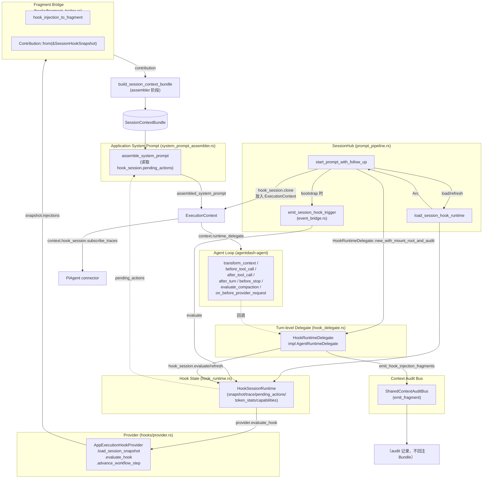

# Pipeline Review 03 — Connector / Hook / Delegate 层

- **Query**：ExecutionContext → Connector → LLM 请求组装链路，以及 Hook Runtime 与之的交叉关系
- **Scope**：internal（仓内代码）
- **Date**：2026-04-30
- **关注点**：ExecutionContext 字段冗余、PiAgent system prompt 与 Bundle 的优先级、hook_delegate / hook_runtime / fragment_bridge 的控制流与数据流分类

---

## 0. TL;DR

1. `ExecutionContext` 目前是一个"大块字段合集"，它把 **(a) 执行环境** (`working_directory` / `environment_variables` / `executor_config` / `identity`) + **(b) 上下文数据** (`vfs` / `mcp_servers` / `assembled_tools` / `assembled_system_prompt` / `restored_session_state`) + **(c) 运行时控制面** (`hook_session` / `runtime_delegate` / `flow_capabilities`) 平摊在同一个 struct 里，消费者（两个 in-process connector 和 relay connector）各取所需，缺乏分层。见 `crates/agentdash-spi/src/connector.rs:46-75`。
2. **Bundle 的角色是"组装原料"而不是"运行时主数据"**：当前代码里，Bundle (`SessionContextBundle`) 只在 Application 层 `system_prompt_assembler` 中被 **render 成字符串** (`crates/agentdash-application/src/session/system_prompt_assembler.rs:82-90`)，然后挤进 `assembled_system_prompt`；Connector 层（包括 PiAgent）从未直接访问 Bundle。于是 `assembled_system_prompt` 是 Bundle 的下游产物而非同级冗余，但 `ExecutionContext` 完全没有 Bundle 本身——Bundle 生命在 `PromptSessionRequest` 消化之后就结束。
3. **PiAgent connector 已经没有"自建 runtime system prompt"的路径**。`system_prompt.rs` 只剩一个 `DEFAULT_SYSTEM_PROMPT` 常量，用于 factory 初始化时放进 `PiAgentConnector.system_prompt`（Layer 0 base）。实际运行时：只要 `context.assembled_system_prompt` 非空，就直接 `agent.set_system_prompt(...)`；为空时 fallback 到 `AgentConfig.system_prompt`（即 Layer 0 常量）。没有任何位置走 `build_runtime_system_prompt`——这个名字仅以 doc comment 形式出现在 `session_context_bundle.rs:108`，实现已被 `system_prompt_assembler` 接管。
4. **Hook 链路有两条轨道**：
   - **Session 级（低频、手动 emit）**：`SessionHub::emit_session_hook_trigger`（`event_bridge.rs`）发 `SessionStart / SessionTerminal / CapabilityChanged`，不进入 agent loop。
   - **Turn 级（Agent loop 回调）**：`HookRuntimeDelegate`（`hook_delegate.rs`）实现 `AgentRuntimeDelegate`，被 Agent 在 `transform_context / before_tool_call / after_tool_call / after_turn / before_stop / evaluate_compaction / after_compaction / on_before_provider_request` 时回调。两轨道共用 `HookSessionRuntime`（`hook_runtime.rs`）作为状态容器。
5. Hook 注入路径的"三类语义"没有完全解耦：
   - 改 **prompt_blocks**：当前路径是 Application 侧把 snapshot 的 injections **通过 `fragment_bridge` 写回 Bundle**，再由 system_prompt_assembler 渲染——但这只发生在 Bundle 组装阶段；turn-级 hook delegate 不走这条路。
   - 改 **bundle**：只在 session 组装阶段由 `Contribution::from(&SessionHookSnapshot)`（`fragment_bridge.rs:49`）生效；turn 内 hook 新增的 injection 只通过 `audit_bus` 回写为 fragment（`hook_delegate.rs:101-125`），不回注 Bundle。
   - 改 **本轮 side effect**：走 `transform_context` / `after_turn` / `before_stop` 的 `messages` 字段；这条路径产出的 `AgentMessage::user(...)` 直接塞进消息列表，与 system prompt 并行。
6. `system_prompt_assembler`（Application）与 `pi_agent/system_prompt.rs`（Executor）并非在做同一件事——前者是完整的"四层 Identity + Project Context + Workspace + Available Tools + Hooks + Skills" 组装器，后者只剩一个常量身份基底。两者名字相似，但定位互补。

---

## 1. ExecutionContext 字段的生产者 / 消费者矩阵

ExecutionContext 定义位置：`crates/agentdash-spi/src/connector.rs:46-75`。

| 字段 | 生产者（唯一或主要） | 消费者 | 冗余 / 相关性 |
|---|---|---|---|
| `turn_id: String` | `prompt_pipeline.rs:33` 用 `chrono::Utc::now().timestamp_millis()` 生成 | PiAgent connector `connector.rs:392` 写入 `AgentDashSource.turn_id`；Relay connector 不消费 | 与 `SessionHookSnapshot.metadata.turn_id` 有语义重叠，但此处是 ACP 事件侧的标识 |
| `working_directory: PathBuf` | `prompt_pipeline.rs:69-70` 由 `resolve_working_dir(default_mount_root, user_input.working_dir)` 解析 | PiAgent 不直接用；Relay `relay_connector.rs:141` 投成 `working_dir` 字符串下发；vibe_kanban `workspace_path_from_context(...)` | 与 `vfs.default_mount().root_ref` 高度相关——后者是根，前者是相对根的子目录 |
| `environment_variables: HashMap<String,String>` | `prompt_pipeline.rs:272` 直接拷 `req.user_input.env` | vibe_kanban `vibe_kanban.rs:213` 合入 `ExecutionEnv`；Relay `relay_connector.rs:145` 透传；PiAgent 不读 | 与 ExecutionContext 的"执行环境"子集无重叠 |
| `executor_config: AgentConfig` | `prompt_pipeline.rs:93-103` 从 `req.user_input.executor_config` 或 `session_meta.executor_config` 回落 | 所有 connector：PiAgent `connector.rs:346-373` 用它解析 bridge / model / thinking_level；Relay `relay_connector.rs:117-133` 转成 `RelayExecutorConfig`；vibe_kanban `vibe_kanban.rs:186` 转成 vk profile | 核心字段，没有冗余 |
| `mcp_servers: Vec<McpServer>` | `prompt_pipeline.rs:263` 从 `req.mcp_servers` 拷贝 | PiAgent **不消费**（已预构建到 `assembled_tools`）；Relay `relay_connector.rs:147-151` 下发给远端；system_prompt_assembler 也读它（用于渲染"MCP Tools"段） | 与 `assembled_tools` 部分重叠——`assembled_tools` 已把 direct MCP 里的工具实例化，但仍需在 prompt 文案中列出 MCP server 名；relay 路径则纯靠 mcp_servers（因为 relay 不做工具实例化） |
| `vfs: Option<Vfs>` | `prompt_pipeline.rs:53-68` 从 `req.vfs` 或 `self.default_vfs` 回落 | PiAgent 不直接用；system_prompt_assembler `system_prompt_assembler.rs:115-128` 用来渲染 Workspace 段；vibe_kanban `workspace_path_from_context` 读它；Relay 从 `default_mount().root_ref` 取 mount_root_ref | 与 `working_directory` 存在"根 + 相对"的关系 |
| `hook_session: Option<Arc<dyn HookSessionRuntimeAccess>>` | `prompt_pipeline.rs:117-152` 根据 owner bootstrap / existing session 决策；真正创建在 `load_session_hook_runtime` `prompt_pipeline.rs:567-602` | PiAgent `connector.rs:367-371`（读 `subscribe_traces`）；system_prompt_assembler `system_prompt_assembler.rs:190-195`（读 `pending_actions`）；`HookRuntimeDelegate` 内部持有 | 与 `runtime_delegate` 有高度相关性（runtime_delegate 是 hook_session 的包装后 wrapper） |
| `flow_capabilities: FlowCapabilities` | `prompt_pipeline.rs:265` 从 `req.flow_capabilities` 拷贝 | 理论上 runtime tool provider 构建工具时应读它裁剪 cluster（见 `connector.rs:153-162` ToolCluster 定义），实际消费点在 `build_tools_for_execution_context` 上游 | 与 `effective_capability_keys` 有语义重叠——前者是 Cluster 集合，后者是 capability key 集合 |
| `runtime_delegate: Option<DynAgentRuntimeDelegate>` | `prompt_pipeline.rs:162-168` 由 `HookRuntimeDelegate::new_with_mount_root_and_audit(hook_session, ...)` 构造 | 仅 PiAgent `connector.rs:371` 调 `agent.set_runtime_delegate(context.runtime_delegate.clone())`；Relay / vibe_kanban 不消费（relay 是远端 agent 的职责，vibe_kanban 是子进程 agent） | 与 `hook_session` **概念重叠但不冗余**：delegate 是 hook_session 的"接线器"，agent loop 只认 delegate interface |
| `identity: Option<AuthIdentity>` | `prompt_pipeline.rs:267` 从 `req.identity` 拷贝 | 目前只被 `ActiveSessionExecutionState` 记录（hub.rs），少量日志用途；connector 不读 | 与 `SessionHookSnapshot.owners` 部分重叠（owner 是业务 owner，identity 是调用者） |
| `restored_session_state: Option<RestoredSessionState>` | `prompt_pipeline.rs:177-192` 在 `RepositoryRehydrate(ExecutorState)` 分支由 `build_restored_session_messages` 构造 | 仅 PiAgent `connector.rs:320-323, 363-365` 在新建 agent 时调 `agent.replace_messages()` | 与 `context_bundle`（在 `PromptSessionRequest` 上）存在"历史消息 vs 业务上下文"的互补关系 |
| `assembled_system_prompt: Option<String>` | `prompt_pipeline.rs:296-314` 在 `!base_system_prompt.is_empty()` 时由 `system_prompt_assembler::assemble_system_prompt(...)` 生成 | PiAgent `connector.rs:359-361`（`agent.set_system_prompt(...)`）；vibe_kanban `vibe_kanban.rs:173-177`（前置到 user_text）；Relay **不消费**（故 relay executor 目前拿不到 Bundle/skills/guidelines 任何内容） | 与 `PromptSessionRequest.context_bundle` 不是冗余——它是 Bundle + guidelines + caps + tools + mcp + hook_session 的终极渲染结果 |
| `assembled_tools: Vec<DynAgentTool>` | `prompt_pipeline.rs:286-293` 调 `self.build_tools_for_execution_context(...)` 产出（runtime + direct MCP + relay MCP） | PiAgent `connector.rs:357, 362`；system_prompt_assembler `system_prompt_assembler.rs:133-186` 用它渲染 "Platform Tools" 段；Relay / vibe_kanban 不用（remote executor 自建工具） | 与 `mcp_servers` 部分重叠（见前文） |

关键观察：

- **PiAgent 一路不再碰 mcp_servers / vfs / flow_capabilities**：这些字段对它来说只是 Application 预处理后的"元数据副本"。见 `connector.rs:308-396` 全文。
- **Relay 只消费 mcp_servers / executor_config / working_directory / identity 等"扁平元数据"**，不认 assembled_* / hook_session / runtime_delegate / context_bundle 等；所以远端 agent 得不到 Application 层的身份 prompt。这是目前 cloud 与 relay 体验差异的根源之一。
- `hook_session` 与 `runtime_delegate` 的**双字段**设计值得注意：`hook_session` 给"直接需要读 snapshot/trace"的消费者（PiAgent 的 trace 订阅、system_prompt_assembler 的 pending_actions 读取），`runtime_delegate` 给"需要接入 agent loop"的消费者。两者都封装同一个 `HookSessionRuntime` 实例。

---

## 2. PiAgent build_runtime_system_prompt 现状

### 2.1 旧路径已不存在

- 代码内没有 `build_runtime_system_prompt` 的实现，只在 `crates/agentdash-spi/src/session_context_bundle.rs:108` 的 doc comment 里提到它曾是调用方。
- `crates/agentdash-executor/src/connectors/pi_agent/system_prompt.rs` 全文仅剩 `DEFAULT_SYSTEM_PROMPT: &str` 常量（29 行）。

### 2.2 真实优先级

`crates/agentdash-executor/src/connectors/pi_agent/connector.rs:353-366`：

```rust
// 只有新创建的 agent 才需要 build tools 和 system prompt。
// 已存在的 agent（后续 turn）复用上次的 tools 和 system prompt...
if is_new_agent {
    current_tools = context.assembled_tools.clone();

    if let Some(system_prompt) = &context.assembled_system_prompt {
        agent.set_system_prompt(system_prompt.clone());
    }
    agent.set_tools(current_tools.clone());
    if let Some(messages) = restored_messages.filter(|messages| !messages.is_empty()) {
        agent.replace_messages(messages).await;
    }
}
```

优先级顺序（从高到低）：

1. `context.assembled_system_prompt` 非空 → 直接用，**这是主路径**。
2. 无 `assembled_system_prompt` 时 → 不调 `set_system_prompt`，保留 `Agent::new` 时注入的 `AgentConfig.system_prompt`（即 `PiAgentConnector.system_prompt`，由 factory 从 settings `agent.pi.base_system_prompt` / env `PI_AGENT_SYSTEM_PROMPT` / `DEFAULT_SYSTEM_PROMPT` 解析，见 `factory.rs:34-37`）。
3. **后续 turn（同一 session 再次 prompt）**：`is_new_agent == false` 分支里**不会重新 set**——既不读 `assembled_system_prompt`，也不读 Bundle。换言之 system prompt 只在第一次构建 agent 时写入，整个 session 生命周期保持不变。即使之后 `assembled_system_prompt` 被更新（因 hook 刷新、能力变更等），PiAgent 也不会热替换。

### 2.3 Bundle 渲染用的 slot 白名单

Bundle 不直接进 connector；它在 `crates/agentdash-application/src/session/system_prompt_assembler.rs:82-90` 中被渲染：

```rust
if let Some(bundle) = input.context_bundle {
    let project_context = bundle.render_section(
        agentdash_spi::FragmentScope::RuntimeAgent,
        RUNTIME_AGENT_CONTEXT_SLOTS,
    );
    if !project_context.trim().is_empty() {
        sections.push(format!("## Project Context\n\n{project_context}"));
    }
}
```

slot 白名单定义在 `crates/agentdash-spi/src/context_injection.rs:11-35`（`RUNTIME_AGENT_CONTEXT_SLOTS`），包含：

```
task, story, project, workspace, initial_context, vfs, tools, persona,
required_context, workflow, workflow_context, story_context, runtime_policy,
mcp_config, declared_source, static_fragment, requirements, constraints,
codebase, references, project_guidelines, instruction, instruction_append
```

此常量还有另一个消费点：`crates/agentdash-api/src/routes/acp_sessions.rs:1451` 和 `crates/agentdash-application/src/session/assembler.rs:1880`（后者用于测试 fixture），确保 Application 预渲染与 HTTP 层的前端 preview 使用同一份 slot 列表。

### 2.4 Fallback 路径排查

- 没有任何代码在 `context.assembled_system_prompt == None` 时走 "由 connector 读 Bundle 并自建 system prompt" 的路径。
- 搜索 "context.context_bundle" / "ExecutionContext.*bundle" 字样（`Grep context_bundle`）全部命中 Application 层 / API 层，executor crate 为零。
- 唯一相关的"老 API 残留"是 `PiAgentConnector` 自身仍持有 `system_prompt: String` 字段（`connector.rs:40`），但只在 `Agent::new` 时注入，并不会参与 assembled_system_prompt。

结论：Bundle → system_prompt 是**单向预渲染**链路，executor 侧没有二次消费机会；若 `assembled_system_prompt == None`（例如 `base_system_prompt == ""` 的降级场景或某个本地测试 hub），PiAgent 就只拿到 Layer 0 常量，**彻底看不到 Bundle**。

---

## 3. ExecutionContext 构造点全景

### 3.1 全量构造点

仓内只有 **5** 个 `ExecutionContext { ... }` 字面量构造：

| # | 位置 | 场景 |
|---|---|---|
| 1 | `crates/agentdash-application/src/session/prompt_pipeline.rs:269-283` | **主路径**：把 `PromptSessionRequest` 变成 ExecutionContext，随后传给 `connector.prompt(...)` |
| 2 | `crates/agentdash-application/src/session/hub.rs:465-479` | `replace_runtime_mcp_servers`：热更新 MCP 时临时构造一个 ExecutionContext 传给 `build_tools_for_execution_context`（用来重新构建工具列表），**并未真正发给 connector.prompt** |
| 3 | `crates/agentdash-application/src/relay_connector.rs:372-386` | Relay connector 的单元测试 |
| 4 | `crates/agentdash-executor/src/connectors/pi_agent/connector_tests.rs:1197` | PiAgent 单元测试 |
| 5 | `crates/agentdash-executor/src/connectors/pi_agent/connector_tests.rs:1234` | PiAgent 单元测试 |

生产代码中的"唯一真正把 PromptSessionRequest 转成 ExecutionContext 的点"就是 prompt_pipeline 的第 1 处；第 2 处是"构造伪造的 ExecutionContext 用于复用 tool builder"的兼容技巧。

### 3.2 主构造点字段分类

`prompt_pipeline.rs:269-314` 的字段填法：

| 分类 | 字段 | 来源 |
|---|---|---|
| **直接拷贝** | `turn_id` | 本函数内 `format!("t{}", timestamp)` 生成 |
| | `environment_variables` | `req.user_input.env` |
| | `executor_config` | 合并自 `req.user_input.executor_config` 与 `session_meta.executor_config` |
| | `mcp_servers` | `req.mcp_servers.clone()` |
| | `flow_capabilities` | `req.flow_capabilities.clone().unwrap_or_default()` |
| | `identity` | `req.identity.clone()` |
| **路径重计算** | `working_directory` | `resolve_working_dir(default_mount_root, req.user_input.working_dir.as_deref())` |
| | `vfs` | `req.vfs.clone().or_else(|| self.default_vfs.clone())` |
| **生命周期派生** | `hook_session` | `load_session_hook_runtime` 或复用 existing runtime → `refresh(...)` |
| | `runtime_delegate` | `HookRuntimeDelegate::new_with_mount_root_and_audit(hook_session.clone(), mount_root, audit_bus)` |
| | `restored_session_state` | 仅 `SessionPromptLifecycle::RepositoryRehydrate(ExecutorState)` 时构建；其他分支为 `None` |
| **预计算（先空置后填）** | `assembled_tools` | `prompt_pipeline.rs:286-293` 先置 `Vec::new()`，之后 `context.assembled_tools = build_tools_for_execution_context(...).await` 填入 |
| | `assembled_system_prompt` | `prompt_pipeline.rs:281` 先置 `None`，若 `base_system_prompt` 非空则 `Some(assemble_system_prompt(...))` |

值得注意：`req.context_bundle` **并不直接作为 ExecutionContext 字段**；它只以 `Option<&SessionContextBundle>` 形式传给 `SystemPromptInput.context_bundle`（`prompt_pipeline.rs:303`）。因此 Bundle 只是一次性 render 的 input，被丢在 PromptSessionRequest 上、在 connector 交付前就"被消化"掉。

### 3.3 关于 hub.rs:465 的 "ghost ExecutionContext"

```rust
// hub.rs:465-479
let context = ExecutionContext {
    turn_id,
    working_directory: active.working_directory.clone(),
    ...
    assembled_system_prompt: None,
    assembled_tools: Vec::new(),
};
let all_tools = self
    .build_tools_for_execution_context(session_id, &context, &mcp_servers, ...)
    .await;

self.connector.update_session_tools(session_id, all_tools).await?;
```

这里构造的 ExecutionContext **仅用于喂给 `build_tools_for_execution_context`**（让 runtime_tool_provider 有个标准入参签名），之后把结果 `all_tools` 通过 `update_session_tools` 传给 connector。ExecutionContext 本身并没有进入 connector 的 `prompt` 方法。这是一次"为了工具构建 API 统一而构造的临时值"。

---

## 4. Connector Factory / Registry

### 4.1 Connector 注册拓扑

`crates/agentdash-api/src/app_state.rs:232-273` 的装配：

```
CompositeConnector
├── PiAgentConnector     （build_pi_agent_connector, app_state.rs:246）
├── RelayAgentConnector  （app_state.rs:264-266）
└── plugin_registration.connectors （插件注入，app_state.rs:269）
```

- `CompositeConnector`（`crates/agentdash-executor/src/connectors/composite.rs`）维护 `executor_id → connector idx` 的 `HashMap`（`composite.rs:152-160`），每个 sub connector 的 `list_executors()` 决定路由。
- PiAgent 声明唯一 executor `"PI_AGENT"`（`connector.rs:226-233`）。
- Relay 从 `transport.list_online_executors()` 动态拉取（`relay_connector.rs:60-72`），`refresh_routing` 在 `resolve_connector` miss 时重做，以适配 relay 后端后上线的情况（`composite.rs:167-184`）。
- 路由的唯一输入是 `context.executor_config.executor`（`composite.rs:259-267`），没有其他 heuristic（不看 `vfs`、不看 `hook_session`）。

### 4.2 Sub-connector 对 ExecutionContext 的消费差异

| 字段 | PiAgent | Relay | vibe_kanban |
|---|---|---|---|
| `assembled_system_prompt` | **消费**（set_system_prompt） | 忽略 | **消费**（前置到 user_text） |
| `assembled_tools` | **消费**（set_tools） | 忽略 | 忽略 |
| `mcp_servers` | 忽略 | **消费**（下发给远端） | 忽略（用 profile 自带配置） |
| `vfs` | 忽略 | **消费**（取 mount root_ref） | **消费**（workspace_path_from_context） |
| `hook_session` | **消费**（subscribe_traces） | 忽略 | 忽略 |
| `runtime_delegate` | **消费**（set_runtime_delegate） | 忽略 | 忽略 |
| `restored_session_state` | **消费**（replace_messages） | 忽略 | 忽略 |
| `working_directory` | 忽略（PiAgent 自己不 cwd） | **消费**（to_relative_working_dir） | **消费**（RepoContext） |
| `environment_variables` | 忽略 | **消费** | **消费**（ExecutionEnv::merge） |
| `flow_capabilities` | 间接通过 assembled_tools | 忽略 | 忽略 |
| `identity` | 忽略（目前仅记录） | 忽略 | 忽略 |

三个 connector 对 ExecutionContext 的"消费集合"几乎不重叠，说明这个 struct 是"服务多种 connector 的 union type"。这是字段显得臃肿的结构性原因。

### 4.3 update_session_tools 与 push_session_notification

PiAgent 独家实现两个可选 trait 方法：

- `update_session_tools`（`connector.rs:537-573`）：替换 session 当前工具列表，用于 Phase Node 切换、MCP 热更等，由 `SessionHub::replace_runtime_mcp_servers` (`hub.rs:489-491`) 触发。
- `push_session_notification`（`connector.rs:575-588`）：调 `agent.steer(AgentMessage::user(...))`，把 out-of-band 消息挤进 steering 队列。目前被 `hub.rs` 层的能力变更提醒等路径调用。

Relay connector 对这两个方法都返回 trait 默认 no-op（`relay_connector.rs` 里没有覆写）——说明"运行时工具热更"在 relay 路径下无法工作。

---

## 5. Hook 链路拓扑

### 5.1 参与模块地图



### 5.2 关键调用时刻

1. **Session 组装阶段（assembler.rs）**：`AppExecutionHookProvider.load_session_snapshot` 产出初始 `SessionHookSnapshot`（含 `companion_agents` / `workflow` 等 injection），通过 `fragment_bridge.rs` `Contribution::from(&SessionHookSnapshot)` 进入 `build_session_context_bundle` → Bundle。
2. **Prompt 入口（prompt_pipeline.rs）**：
   - 若 owner bootstrap：`load_session_hook_runtime`（新建 `HookSessionRuntime`） + `emit_session_hook_trigger(HookTrigger::SessionStart, ...)`（`prompt_pipeline.rs:420-446`）。
   - 后续 turn：复用 `existing_hook_session` + `refresh()`（`prompt_pipeline.rs:142-152`）。
   - 构造 `HookRuntimeDelegate`（`prompt_pipeline.rs:162-168`），挂到 `ExecutionContext.runtime_delegate`。
3. **Turn 内（agent loop）**：Agent 在每个边界调用 `DynAgentRuntimeDelegate` 对应方法，例如 before LLM 请求：`transform_context(UserPromptSubmit)` → 产出 steering/follow-up messages + blocked reason（`hook_delegate.rs:315-409`）。
4. **Turn 结束后（turn_processor.rs:146-155）**：`emit_session_hook_trigger(HookTrigger::SessionTerminal, ...)` 发终态 hook。
5. **Trace 回流**：`HookRuntimeDelegate.record_trace` → `HookSessionRuntime.append_trace` → broadcast 到 PiAgent connector 的 `hook_trace_rx`（`connector.rs:367-370`），最终经 `build_hook_trace_notification` 转为 ACP `SessionNotification`。

### 5.3 SessionHookSnapshot 的产出时机与读者

- **产出**：`AppExecutionHookProvider.load_session_snapshot`（`hooks/provider.rs:196-391`），组合 `owner_resolver` + `workflow_builder` + `build_companion_agents_injection`。
- **首次加载**：`prompt_pipeline.rs:579-587`（owner bootstrap 或 cold start）。
- **运行时刷新**：
  - 显式：`HookSessionRuntime.refresh`（provider.refresh_session_snapshot）
  - 被动：evaluate 返回 `resolution.refresh_snapshot = true` 触发自动 refresh（`hook_delegate.rs:83-92` / `event_bridge.rs:54-62`）
- **读者**：system_prompt_assembler（读 pending_actions）、HookRuntimeDelegate（每次 evaluate 均 snapshot）、baseline_capabilities（读 companion_agents injection）、context/builder 的 hooks 分支（读 snapshot.injections）。

---

## 6. Hook 注入路径的语义分类

| 类别 | 对应代码 | 数据面 |
|---|---|---|
| ① 改 prompt_blocks | `transform_context` 返回的 `messages` 头部："hook injection message" + pending companion action message（`hook_delegate.rs:395-404`） | 走 `AgentMessage::user(...)`；只影响本次 LLM 请求的 history prefix |
| ② 改 bundle | A. Application 组装阶段：`fragment_bridge::hook_injection_to_fragment` → `Contribution::fragments_only` → `build_session_context_bundle`。 B. 运行时：`emit_hook_injection_fragments`（`hook_delegate.rs:101-125`）**只写 audit bus**，不回注 Bundle | `ContextFragment` |
| ③ 改本轮 side effect | `before_tool_call` 返回 `ToolCallDecision::{Allow/Deny/Ask/Rewrite}`（`hook_delegate.rs:411-481`）、`before_stop` 返回 `StopDecision::{Stop/Continue}`（`hook_delegate.rs:588-694`）、`after_turn` 返回 `TurnControlDecision.steering/follow_up`（`hook_delegate.rs:528-586`） | 控制流决策 + 消息队列修改 |

### 6.1 是否真的分开？

**部分分开，部分混杂**：

- **① 与 ③ 混杂在同一个 trait 方法里**：`transform_context` 同时承担 "追加动态注入的 AgentMessage" 与 "blocked reason → 阻塞本轮"，前者属于 ①，后者属于 ③。代码通过 `TransformContextOutput { messages, blocked }` 两字段区分，但产出路径完全耦合。见 `hook_delegate.rs:315-409`。
- **② 与 ①/③ 物理隔离**：Bundle 的生产在 session 组装阶段就结束，turn 内 delegate 不再写 Bundle；delegate 只通过 `audit_bus` 记录 fragment 给 Context Inspector 看，运行路径不相关（`hook_delegate.rs:101-125`）。
- **`snapshot.injections` 的双用途是主要混淆来源**：同一个 `HookInjection { slot, content, source }` 结构既会被 fragment_bridge 打包成 Bundle fragment（组装期），又会被 hook_delegate 在 `transform_context` 里拼成 user message 字符串（runtime 期）。类型相同、语义不同，容易误以为是同一条路径。
- **`HOOK_USER_MESSAGE_SKIP_SLOTS`**（`hook_delegate.rs:806-821`）是 ① 与 ② 之间的"手动去重":companion_agents slot 在 Bundle 渲染出 `## Companion Agents` 段后，要手动从 runtime user message 中剔除，否则会重复。这是双路径共存的直接代价。

---

## 7. 冗余与耦合信号

### 7.1 system_prompt_assembler vs pi_agent/system_prompt.rs

- **`system_prompt_assembler.rs`（Application 层）**：完整"组装器"。约 400 行，覆盖 Identity / Project Guidelines / Project Context (from Bundle) / Companion Agents / Workspace / Available Tools / Hooks / Skills 八个 section，并负责 Path convention、fs_apply_patch 提示等工具使用说明。
- **`pi_agent/system_prompt.rs`（Executor 层）**：29 行，只是 Layer 0 常量。

**结论：不是同一件事**。历史上 PiAgent 可能自己组装 runtime prompt，但现在已经退化为常量。两者共存不构成代码重复，但名字相似**容易误导新读者**以为 executor 还有独立逻辑。

### 7.2 Hook side effect vs Bundle fragment 的共享结构

- `HookInjection`（`agentdash-spi/src/hooks/...`）= { slot, content, source }。
- `ContextFragment`（`agentdash-spi/src/context_injection.rs`）= { slot, label, order, strategy, scope, source, content }。
- `fragment_bridge::hook_injection_to_fragment`（`fragment_bridge.rs:36-47`）是**唯一的转换函数**，在 hook_injection 额外补 order（从 `HOOK_SLOT_ORDERS` 查表 `fragment_bridge.rs:15-19`）、strategy=Append、scope=default(`RuntimeAgent|Audit`)。

这个 bridge 是"控制流 vs 数据流"耦合的最高浓度点：`HookInjection` 原本是 hook evaluation 的输出（控制面语义），转成 `ContextFragment` 后就成为 Bundle 的一部分（数据面）。**这种单向转换本身是对的，但两个 struct 共享 `slot / content / source` 字段使得"什么时候该转、什么时候不该转"只能靠约定**：

- Assembler 阶段 snapshot.injections → 全部转 Bundle
- Runtime 阶段 delegate.evaluate(...).injections → **不转 Bundle**，只写 user message + audit bus

### 7.3 baseline_capabilities 与 capability resolver 的关系

- **baseline_capabilities**（`session/baseline_capabilities.rs`）：输入 `hook_session.snapshot().injections`（只取 `companion_agents` slot）+ 已发现 skills，输出 `SessionBaselineCapabilities { companion_agents, skills }`。**本质是读取 hook 静态注入 + VFS skill 扫描**，用于 system prompt 渲染 `## Companion Agents` / `## Skills`。
- **capability resolver**（未在本次任务范围，但 assembler.rs:873-877 引用了 `cap_output.effective_capabilities`）：产出 `FlowCapabilities` 与 `effective_capability_keys`，决定 ToolCluster 启用集。

两者**是不同概念**：
- `SessionBaselineCapabilities` 描述"有哪些伙伴 agent / 有哪些 skill 文件可读"（身份级）
- `FlowCapabilities` 描述"哪些工具 cluster 可以被 runtime_tool_provider 注入"（工具级）

命名接近但语义不同，命名空间有碰撞风险。在 ExecutionContext 里两者都以间接形态存在（前者烤进 `assembled_system_prompt` 文案，后者存在 `flow_capabilities` 字段），进一步降低了结构可读性。

### 7.4 其他耦合点

- **PiAgent session runtime 状态**：`PiAgentSessionRuntime { agent, tools }`（`connector.rs:46-50`）只持有 agent + tools，缺少 session 级 cached system prompt——下一轮 prompt 根本拿不回上一轮的 `assembled_system_prompt`，因此"首轮 set 后不再更新"是被结构逼出来的，不是设计选择。
- **hook_session 既在 ExecutionContext 里又在 SessionRuntime 里**：`prompt_pipeline.rs:154-159` 把 hook_session 写回 `SessionHub.sessions[...]`，同时通过 ExecutionContext 传给 connector。这意味着"当前 hook_session"有两个持有者，刷新时两处都要同步（当前通过 Arc 共享自动同步，但结构上是冗余引用）。

---

## 8. 附录：进一步研读时的 anchor

- ExecutionContext 定义：`crates/agentdash-spi/src/connector.rs:46-75`
- 唯一生产点：`crates/agentdash-application/src/session/prompt_pipeline.rs:269-314`
- PiAgent prompt 主逻辑：`crates/agentdash-executor/src/connectors/pi_agent/connector.rs:308-494`
- PiAgent factory：`crates/agentdash-executor/src/connectors/pi_agent/factory.rs:30-72`
- PiAgent system prompt 常量：`crates/agentdash-executor/src/connectors/pi_agent/system_prompt.rs:7-29`
- Application 组装器：`crates/agentdash-application/src/session/system_prompt_assembler.rs:39-205`
- Bundle 白名单：`crates/agentdash-spi/src/context_injection.rs:11-35`
- Bundle 渲染：`crates/agentdash-spi/src/session_context_bundle.rs:100-131`
- HookRuntimeDelegate 实现：`crates/agentdash-application/src/session/hook_delegate.rs:185-724`
- HookSessionRuntime 状态容器：`crates/agentdash-application/src/session/hook_runtime.rs:18-379`
- Fragment Bridge：`crates/agentdash-application/src/hooks/fragment_bridge.rs:36-60`
- Session-level hook emit：`crates/agentdash-application/src/session/event_bridge.rs:22-99`
- Composite 路由：`crates/agentdash-executor/src/connectors/composite.rs:143-268`
- Relay connector（参考对比）：`crates/agentdash-application/src/relay_connector.rs:89-181`
- vibe_kanban connector（参考对比）：`crates/agentdash-executor/src/connectors/vibe_kanban.rs:165-213`
- Hook provider 主逻辑：`crates/agentdash-application/src/hooks/provider.rs:194-530`
- Baseline capabilities：`crates/agentdash-application/src/session/baseline_capabilities.rs:10-78`
