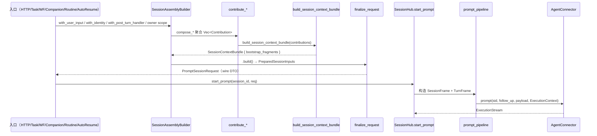
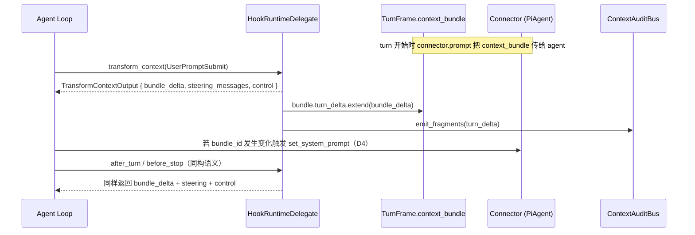
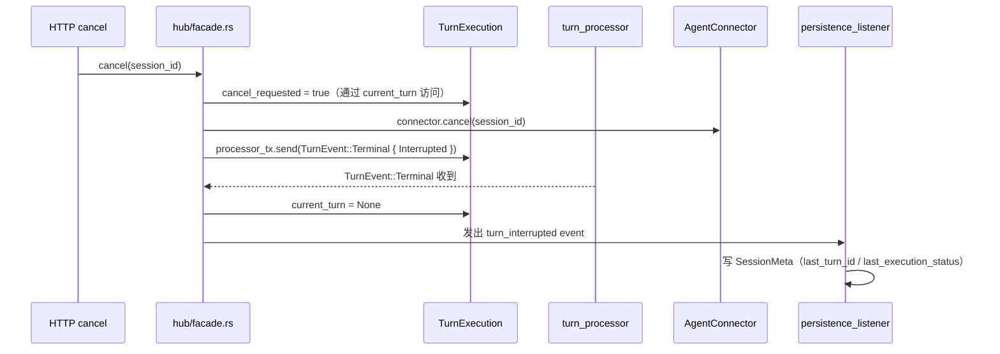

# 终态架构图景：Session Pipeline 重构后的干净形态

> **本文档地位**：与 `prd.md` 同级的一等交付物。任何 PR 完成后若实际代码偏离本文档
> 描述的形态，视为**重构未完成**。实施过程中若需修改此图景，必须通过 PR 明确修订本文档。

- **Date**: 2026-04-30（kickoff 对齐）
- **关联**: `prd.md` Requirements / Acceptance Criteria / Decisions；`research/pipeline-review/00-refactor-plan.md`

---

## 0. 一页概览（TL;DR）

**目标形态可用 8 条话概括**：

1. **5 条正交轴**（Who / Where / What / How / Trigger）在类型系统里显式分组。
2. **入口单一节拍**：5 条后端入口全部走 `SessionAssemblyBuilder.compose().finalize()`；`identity` / `post_turn_handler` 是 builder first-class 字段。
3. **SessionContextBundle 是业务上下文的唯一主数据面**：含 `bootstrap_fragments` + `turn_delta`；connector 层直接消费结构化 Bundle（PiAgent）或消费其渲染产物（Relay/vibe_kanban 过渡）。
4. **ExecutionContext 分 `SessionFrame` + `TurnFrame` 两层**：前者不可变（身份 + 执行环境），后者 per-turn（Bundle + tools + hook runtime）。
5. **Hook 三类语义物理分离**：① 改 Bundle（`turn_delta` 回灌）、② 改本轮 steering messages、③ 改控制流副作用（block/deny/rewrite）。`HOOK_USER_MESSAGE_SKIP_SLOTS` 不存在。
6. **SessionRuntime 回归 session 级门面**：`current_turn: Option<TurnExecution>` 承载所有 per-turn 状态；`turn_processor` 不写 SessionMeta、不改 SessionRuntime 字段。
7. **`hub.rs` ≤ 500 行**：职责拆为 `facade / factory / tool_builder / hook_dispatch / cancel` 5 个子模块。
8. **contribute_\* 单源单责**：`workflow_context` / `workspace` / SessionPlan / declared_sources 每条概念只有一个渲染 helper；所有 slot 的默认 order 集中到 `context/slot_orders.rs`。

---

## 1. 模块拓扑（target state）

### 1.0 顶层架构图（一图看懂）

```mermaid
flowchart TB
    %% ─────────── 入口层 ───────────
    subgraph Entries["① 入口层 · 所有路径汇聚到 SessionAssemblyBuilder"]
        direction LR
        HTTP[HTTP Route<br/>/sessions/:id/prompt]
        Task[Task Service<br/>start_task/continue_task]
        WF[Workflow<br/>Orchestrator]
        Comp[Companion Tools<br/>dispatch]
        Routine[Routine Executor<br/>cron/webhook/plugin]
        AR[Hub Auto-resume]
    end

    %% ─────────── Application Crate ───────────
    subgraph App["② Application Crate — 装配 & 运行时编排"]
        direction TB

        subgraph Startup["session/startup/ · 装配"]
            direction TB
            Builder["<b>SessionAssemblyBuilder</b><br/>.with_user_input()<br/>.with_identity()<br/>.with_post_turn_handler()<br/>.compose_*()<br/>.build()"]
            PrepInputs[PreparedSessionInputs]
            Finalize[finalize_request<br/>→ PromptSessionRequest]
            Builder --> PrepInputs --> Finalize
        end

        subgraph CtxBuild["context/ · Bundle 组装 reducer"]
            direction TB
            Contribs[contributors/<br/>core · binding · instruction<br/>mcp · workflow · declared<br/>hook_snapshot]
            Reducer["<b>build_session_context_bundle</b><br/>零 domain 依赖的 pure reducer"]
            Render[rendering/<br/>workflow_injection · workspace_view<br/>declared_sources · kickoff_prompt]
            Slots[slot_orders.rs<br/>所有 order 单源]
            Contribs --> Reducer
            Contribs -.用.-> Render
            Contribs -.用.-> Slots
            Render -.用.-> Slots
        end

        subgraph Runtime["session/runtime/ · session 级"]
            direction TB
            HubFacade["<b>hub/facade.rs</b><br/>≤ 500 行门面"]
            HubSub[hub/factory<br/>hub/tool_builder<br/>hub/hook_dispatch<br/>hub/cancel]
            SR["SessionRuntime<br/>tx · hook_session<br/>current_turn: Option&lt;TurnExecution&gt;"]
            TE["TurnExecution<br/>processor_tx · cancel_requested<br/>hook_auto_resume_count<br/>session_frame"]
            HubFacade --- HubSub
            HubFacade --> SR
            SR --> TE
        end

        subgraph TurnMod["session/turn/ · per-turn"]
            direction TB
            Proc[turn_processor<br/>stream→persist→terminal]
            PL[persistence_listener<br/>executor_session_id 同步]
            PTH[PostTurnHandler]
            Proc --> PTH
            Proc --> PL
        end

        subgraph HooksMod["session/hooks/ · 运行时 Hook"]
            direction TB
            Delegate["HookRuntimeDelegate<br/>impl AgentRuntimeDelegate"]
            HookRT[HookSessionRuntime]
            Bridge["fragment_bridge<br/>HookInjection → ContextFragment"]
            Messages[messages.rs<br/>build_hook_steering_messages]
            Delegate --> HookRT
            Delegate --> Bridge
            Delegate --> Messages
        end

        subgraph SysProm["session/system_prompt/ · Bundle → String"]
            direction LR
            SAssembler[assembler.rs<br/>assemble_system_prompt<br/>Relay/vibe_kanban fallback]
            SRenderer[renderer.rs<br/>render_runtime_section]
            SAssembler --> SRenderer
        end

        subgraph Model["session/model/"]
            UI[UserPromptInput<br/>wire DTO]
            PSR[PromptSessionRequest<br/>wire DTO · immutable after finalize]
            Meta[SessionMeta<br/>persisted]
        end
    end

    %% ─────────── SPI 契约层 ───────────
    subgraph SPI["③ agentdash-spi · 零 domain 依赖的契约"]
        direction LR
        Bundle["<b>SessionContextBundle</b><br/>bootstrap_fragments + turn_delta<br/>phase_tag · bundle_id"]
        EC["<b>ExecutionContext</b><br/>{ session: SessionFrame,<br/>&nbsp;&nbsp;turn: TurnFrame }"]
        Auth[AuthIdentity<br/>+ system_routine(id)]
        ConnT[AgentConnector trait<br/>+ update_session_context_bundle]
    end

    %% ─────────── Connector 层 ───────────
    subgraph Connectors["④ Connector 层 · 只读 ExecutionContext"]
        direction LR
        PiAgent["<b>PiAgent</b><br/>读 TurnFrame.context_bundle<br/>+ assembled_tools<br/>+ hook_session"]
        Relay["Relay<br/>读 SessionFrame<br/>+ assembled_system_prompt（过渡）"]
        VK["vibe_kanban<br/>读 SessionFrame + prompt 前置"]
    end

    %% ─────────── 主要数据流 ───────────
    Entries ==装配==> Builder
    PrepInputs --> CtxBuild
    Reducer --> Bundle
    Finalize --> PSR
    PSR ==派发==> HubFacade
    HubFacade --构造--> EC
    Bundle --主数据面--> EC
    EC ==prompt==> ConnT
    ConnT --> PiAgent
    ConnT --> Relay
    ConnT --> VK
    PiAgent -.set_runtime_delegate.-> Delegate
    Delegate --write turn_delta--> Bundle
    HubFacade --spawn--> Proc
    Proc --TurnEvent::Terminal--> HubFacade
    SysProm --render--> EC

    %% 样式：标注主数据面与过渡字段
    classDef mainData fill:#d4edda,stroke:#28a745,stroke-width:2px
    classDef deprecated fill:#fff3cd,stroke:#ffc107,stroke-width:1px,stroke-dasharray: 5 5
    class Bundle mainData
    class Relay deprecated
```

**图例解读**：

- **实线粗箭头** = 主数据流（入口 → 装配 → 派发 → connector）
- **虚线箭头** = 运行时反向流（hook delegate 回写 Bundle / turn processor 发终态）
- **绿色高亮 (`Bundle`)** = 主数据面
- **黄色虚框 (`Relay`)** = 过渡期消费 `assembled_system_prompt`（未来 PR 8 α 化后删）

### 1.1 `agentdash-application/src/session/` 终态目录树

```
session/
├── mod.rs                          # 重导出 + 模块声明
├── model/                          # 纯数据类型，无业务行为
│   ├── mod.rs
│   ├── request.rs                  # UserPromptInput / PromptSessionRequest（wire DTO）
│   ├── meta.rs                     # SessionMeta / TitleSource / SessionBootstrapState
│   ├── lifecycle.rs                # SessionPromptLifecycle / resolve_session_prompt_lifecycle
│   ├── execution_state.rs          # SessionExecutionState
│   └── companion.rs                # CompanionSessionContext（wire DTO 部分）
│
├── startup/                        # 入口 → 装配 → finalize 全链路
│   ├── mod.rs
│   ├── builder.rs                  # SessionAssemblyBuilder（扩展后承载 identity/post_turn_handler/user_input）
│   ├── prepared_inputs.rs          # PreparedSessionInputs
│   ├── finalize.rs                 # finalize_request + apply_workspace_defaults
│   ├── augmenter.rs                # PromptRequestAugmenter trait（auto-resume 兜底）
│   └── specs.rs                    # OwnerBootstrapSpec / StoryStepSpec / LifecycleNodeSpec / CompanionSpec
│
├── runtime/                        # session 级运行时状态
│   ├── mod.rs
│   ├── hub/                        # （PR 6 后）hub.rs 拆分的子模块
│   │   ├── mod.rs                  # SessionHub 门面
│   │   ├── facade.rs               # 对外 API：start_prompt / cancel / subscribe / delete / ensure
│   │   ├── factory.rs              # SessionHubFactory：base_system_prompt / user_prefs / providers
│   │   ├── tool_builder.rs         # build_tools_for_session_frame（替代旧 ghost context 构造）
│   │   ├── hook_dispatch.rs        # emit_session_hook_trigger / ensure_hook_session_runtime / schedule_hook_auto_resume + auto-resume 限流
│   │   └── cancel.rs               # cancel + interrupted 事件补发
│   ├── session_runtime.rs          # SessionRuntime：tx / running / hook_session / current_turn
│   └── turn_execution.rs           # TurnExecution：processor_tx / cancel_requested / hook_auto_resume_count / frame 快照
│
├── turn/                           # per-turn 事件处理
│   ├── mod.rs
│   ├── processor.rs                # SessionTurnProcessor（只管 stream → persist → terminal）
│   ├── event_bridge.rs             # hook trace → ACP notification
│   ├── post_turn_handler.rs        # PostTurnHandler / SessionTerminalCallback trait
│   └── persistence_listener.rs     # executor_session_id 同步等 meta 写入
│
├── context_build/                  # Application 层 Bundle 组装 reducer
│   │  (context/ 目录保持现名；本文档按"逻辑归属"画分)
│   ...（见 §1.2 context 目录）
│
├── hooks/                          # Hook 数据面 + 运行时
│   ├── mod.rs
│   ├── delegate.rs                 # HookRuntimeDelegate（impl AgentRuntimeDelegate）
│   ├── runtime.rs                  # HookSessionRuntime（状态容器）
│   ├── fragment_bridge.rs          # hook_injection_to_fragment + From<&SessionHookSnapshot>
│   └── messages.rs                 # build_hook_steering_messages（only steering，不承静态上下文）
│
├── system_prompt/                  # Bundle → String 渲染层
│   ├── mod.rs
│   ├── assembler.rs                # assemble_system_prompt（保留作 fallback / Relay 消费）
│   └── renderer.rs                 # render_runtime_section 共享 helper
│
├── companion_wait.rs               # companion_request(wait=true) 挂起通道
├── continuation.rs                 # 事件仓储 → 消息历史重建（专司 continuation，不再寄生函数）
└── title_generator.rs              # SessionTitleGenerator
```

**说明**：

- 现有 `session/assembler.rs` 拆到 `session/startup/` 下。`session/hub.rs` 拆到 `session/runtime/hub/` 下（PR 6）。
- `context/` 目录保持在 `agentdash-application/src/context/`，逻辑上仍属 context_build 层。
- `hooks/` 提升为 session 子模块（当前 `hooks/fragment_bridge.rs` 在 `application/src/hooks/`，PR 4 后并入 `session/hooks/`）。
- `system_prompt_assembler.rs` 更名为 `system_prompt/assembler.rs`，新增 `system_prompt/renderer.rs` 存共享 helper。

### 1.2 `agentdash-application/src/context/` 终态目录树

```
context/
├── mod.rs
├── builder.rs                      # build_session_context_bundle reducer（零 domain 依赖）
├── contributors/                   # 领域自治 contribute_* 函数
│   ├── mod.rs
│   ├── core.rs                     # contribute_core_context（task）
│   ├── binding.rs                  # contribute_binding_initial_context / contribute_task_binding（新增 task-only）
│   ├── instruction.rs              # contribute_instruction
│   ├── mcp.rs                      # contribute_mcp
│   ├── workflow.rs                 # contribute_workflow_binding / contribute_lifecycle_context
│   ├── declared_sources.rs         # contribute_declared_sources + contribute_workspace_static_sources
│   └── hook_snapshot.rs            # From<&SessionHookSnapshot> for Contribution 的运行时调用
├── rendering/                      # 共享渲染 helper（PR 5 抽出）
│   ├── mod.rs
│   ├── workflow_injection.rs       # render_workflow_injection(workflow, bindings_opt, mode) -> Vec<ContextFragment>
│   ├── workspace_view.rs           # workspace_context_fragment 单源
│   ├── declared_sources.rs         # fragment_slot / fragment_label / render_source_section（合并两套）
│   └── kickoff_prompt.rs           # lifecycle kickoff 结构化渲染
├── declared_source_registry.rs     # 取代 source_resolver.rs + workspace_sources.rs
├── mount_file_discovery.rs         # AGENTS.md / MEMORY.md / SKILL.md 扫描（不变）
├── vfs_discovery.rs                # 前端 selector 的 VFS 描述符（不变）
├── audit.rs                        # ContextAuditBus + AuditTrigger
└── slot_orders.rs                  # 所有 slot 默认 order 中央常量（新增）
```

### 1.3 `agentdash-spi/src/` 终态涉及

```
spi/src/
├── connector.rs                    # ExecutionContext { session: SessionFrame, turn: TurnFrame }
│                                     AgentConnector trait（签名不变，内部字段访问更新）
├── context_injection.rs            # ContextFragment / FragmentScope / RUNTIME_AGENT_CONTEXT_SLOTS
├── session_context_bundle.rs       # SessionContextBundle { bootstrap_fragments, turn_delta, bundle_id, ... }
└── auth.rs                         # AuthIdentity + AuthIdentity::system_routine(id) 辅助构造
```

---

## 2. 核心概念辞典（target state）

### C1. `UserPromptInput`

- **定义位置**: `session/model/request.rs`
- **本质**: HTTP wire DTO，前端 JSON 反序列化目标
- **字段**: `prompt_blocks` / `working_dir` / `env` / `executor_config`
- **生命周期**: 单次 HTTP 请求
- **写者**: HTTP handler / 测试 fixture
- **读者**: `SessionAssemblyBuilder.with_user_input(input)` 入口

### C2. `PromptSessionRequest`

- **定义位置**: `session/model/request.rs`
- **本质**: **wire DTO**——序列化层保留不动（D1 决策），作为"完整请求快照"透传给 plugin / relay。
- **字段**: `user_input` + 全部后端注入字段（mcp_servers / vfs / flow_capabilities / effective_capability_keys / context_bundle / bootstrap_action / identity / post_turn_handler）
- **生命周期**: 从 compose 结束到 connector.prompt 调用的短链
- **写者**: **只有** `finalize_request`
- **读者**: `prompt_pipeline`（构造 ExecutionContext）、SessionHub auto-resume 路径
- **禁令**: 任何 compose 逻辑不得在 `finalize_request` 之外直接构造或写入 `PromptSessionRequest` 字段（除了`from_user_input`）

### C3. `SessionAssemblyBuilder`（扩展版，E2）

- **定义位置**: `session/startup/builder.rs`
- **本质**: 5 条入口的**唯一装配路径**
- **First-class 方法**（本次新增）:
  - `with_user_input(UserPromptInput)` — 承载原始用户输入
  - `with_identity(AuthIdentity)` — 承载身份（含 `AuthIdentity::system_routine(id)`）
  - `with_post_turn_handler(DynPostTurnHandler)` — 承载 per-turn 回调
- **既有方法**: `with_vfs / with_mcp_servers / append_mcp_servers / with_context_bundle / with_prompt_blocks / with_executor_config / with_bootstrap_action / with_workspace_defaults / apply_companion_slice / apply_lifecycle_activation` 等
- **产出**: `PreparedSessionInputs`（.build() 后的平坦结构）
- **调用者**: 5 个 compose 函数（compose_owner_bootstrap / compose_story_step / compose_lifecycle_node / compose_companion / compose_companion_with_workflow）+ auto-resume augmenter
- **消费者**: `finalize_request` 把 `PreparedSessionInputs` 合入 `PromptSessionRequest`

### C4. `SessionContextBundle`（D3 双字段）

- **定义位置**: `agentdash-spi/src/session_context_bundle.rs`
- **本质**: 业务上下文的**唯一主数据面**
- **字段**（PR 4 改造后）:
  ```
  SessionContextBundle {
      bundle_id: Uuid,
      session_id: Uuid,
      phase_tag: String,
      created_at_ms: u64,
      bootstrap_fragments: Vec<ContextFragment>,    // 组装期产出（compose_*）
      turn_delta: Vec<ContextFragment>,             // 运行期 Hook 追加（per-turn 增量）
  }
  ```
- **生命周期**: bootstrap_fragments 跟随 session 生命期；turn_delta 每 turn 重建
- **写者**:
  - `build_session_context_bundle`（组装 bootstrap）
  - `HookRuntimeDelegate.transform_context / after_turn / before_stop`（写 turn_delta）
- **读者**:
  - Application 层 `system_prompt/renderer.rs::render_runtime_section`
  - Connector 层 PiAgent（直接消费 Bundle）
  - Context Inspector

### C5. `ExecutionContext.SessionFrame`

- **定义位置**: `agentdash-spi/src/connector.rs`
- **本质**: per-session 不可变视图（执行环境 + 身份）
- **字段**:
  ```
  SessionFrame {
      session_id: Uuid,
      turn_id: String,
      working_directory: PathBuf,
      vfs: Option<Vfs>,
      environment_variables: HashMap<String, String>,
      executor_config: AgentConfig,
      identity: Option<AuthIdentity>,
  }
  ```
- **权威来源**: prompt_pipeline 构造一次
- **生命周期**: 当前 turn 内不可变（下 turn 若有改动则重构）

### C6. `ExecutionContext.TurnFrame`

- **定义位置**: `agentdash-spi/src/connector.rs`
- **本质**: per-turn 可变视图（上下文 + 工具 + 运行控制面）
- **字段**:
  ```
  TurnFrame {
      context_bundle: Option<SessionContextBundle>,            // 主数据面
      assembled_tools: Vec<DynAgentTool>,
      hook_session: Option<Arc<dyn HookSessionRuntimeAccess>>,
      runtime_delegate: Option<DynAgentRuntimeDelegate>,
      restored_session_state: Option<RestoredSessionState>,
      flow_capabilities: FlowCapabilities,
      #[deprecated(note = "connector 应读 context_bundle 自行渲染；Relay/vibe_kanban 过渡期消费")]
      assembled_system_prompt: Option<String>,
  }
  ```

### C7. `SessionRuntime`

- **定义位置**: `session/runtime/session_runtime.rs`
- **本质**: session 级内存门面
- **字段**（PR 7 瘦身后）:
  ```
  SessionRuntime {
      tx: broadcast::Sender<PersistedSessionEvent>,
      running: bool,
      hook_session: Option<SharedHookSessionRuntime>,
      last_activity_at: i64,
      current_turn: Option<TurnExecution>,          // ← 所有 per-turn 字段下沉
  }
  ```
- **被删字段**: `processor_tx` / `cancel_requested` / `current_turn_id` / `hook_auto_resume_count` / `active_execution` — 全部移入 `current_turn`

### C8. `TurnExecution`（原 `ActiveSessionExecutionState`）

- **定义位置**: `session/runtime/turn_execution.rs`
- **本质**: per-turn 运行时快照
- **字段**（PR 7 后）:
  ```
  TurnExecution {
      turn_id: String,
      processor_tx: UnboundedSender<TurnEvent>,
      cancel_requested: bool,
      hook_auto_resume_count: u32,
      session_frame: ExecutionSessionFrame,         // ← 执行环境快照
  }
  ```
- **被删字段**: `mcp_servers` / `relay_mcp_server_names` / `vfs` / `working_directory` / `executor_config` / `flow_capabilities` / `effective_capability_keys`(已删) / `identity` — 通过 `session_frame` 间接访问

### C9. `SessionMeta`

- **定义位置**: `session/model/meta.rs`
- **本质**: 持久化元信息（wire）
- **字段**: 不变（`id` / `title` / `executor_config` / `executor_session_id` / `bootstrap_state` / 等）
- **注意**: PR 7 后 `turn_processor` 不再直接写 `SessionMeta.executor_session_id`，改由 `persistence_listener` 订阅事件后写入。

### C10. `AgentConnector` trait

- **定义位置**: `agentdash-spi/src/connector.rs`
- **签名**: 不变
- **内部访问模式变化**: `context.x` → `context.session.x` / `context.turn.x`
- **新增可选 trait 方法**（default no-op）:
  - `update_session_context_bundle(session_id, bundle)` — PiAgent 专用，Bundle 变化时触发 system prompt 热更

### C11. `HookRuntimeDelegate`（签名变更，E6）

- **定义位置**: `session/hooks/delegate.rs`
- **核心返回结构**（PR 4 变更）:
  ```
  TransformContextOutput {
      bundle_delta: Vec<ContextFragment>,     // 回灌 TurnFrame.context_bundle.turn_delta
      steering_messages: Vec<AgentMessage>,   // 只承 per-turn steering，不承静态上下文
      control: HookControlDecision,            // Allow / Block { reason } / Rewrite { ... }
  }
  ```
- **禁令**: steering_messages 不得包含会在 Bundle 里出现的 slot 内容（责任分离）

### C12. `HookSnapshotReloadTrigger`（原 `SessionBootstrapAction`，E7）

- **定义位置**: `session/model/lifecycle.rs`
- **本质**: 是否在本轮 prompt 时 reload hook snapshot + 触发 `SessionStart` hook
- **变体**: `None` / `Reload`（原 `OwnerContext` 重命名）
- **被删责任**: 不再触发"往 user_blocks 注入 session-capabilities resource block"——该路径 PR 4 整体废除

---

## 3. 五条正交轴 × 终态字段归属

| 轴 | 职责 | 权威字段 | 位置 |
|---|---|---|---|
| **Who** | 用户身份 / owner 归属 | `identity` | `SessionFrame.identity` |
| **Where** | 执行环境 | `working_directory` / `vfs` / `environment_variables` | `SessionFrame` 三字段 |
| **What** | 业务上下文 | `context_bundle`（bootstrap + turn_delta） | `TurnFrame.context_bundle` |
| **How** | 工具 & 能力 | `flow_capabilities` / `assembled_tools` | `TurnFrame` 两字段 |
| **When/Trigger** | 本轮触发输入 | prompt_payload + `HookRuntimeDelegate.steering_messages` | `connector.prompt(..., payload)` + `TurnFrame.runtime_delegate` |

**禁令**：同一数据不得在两条轴上出现。典型反例：`companion_agents` 在"What"轴（Bundle）表达即可，不得再进"When"轴（user_blocks）。PR 4 后这是强不变式。

---

## 4. 数据流（终态）

### 4.1 session 启动到 connector 交付



### 4.2 per-turn 生命周期（Hook 回灌 turn_delta）



### 4.3 cancel 路径



---

## 5. Contract 层次

### 5.1 SPI 层（`agentdash-spi`）

- 仅承载跨 crate 契约：`ExecutionContext` / `SessionContextBundle` / `ContextFragment` / `AgentConnector` / `AuthIdentity`。
- **禁令**: 不依赖 `agentdash-domain` / `agentdash-application`；结构只携带 id / 字符串标签 / 纯数据（如 `phase_tag: String` 而非 enum）。

### 5.2 Application 层（`agentdash-application`）

- 负责"从 domain entity 装配到 SPI 契约"的全部逻辑：compose / finalize / Bundle reducer / contribute_* / system_prompt rendering / hook delegate。
- **禁令**: 不直接调用 connector 的内部实现；通过 `AgentConnector` trait。

### 5.3 Connector 层（`agentdash-executor` / `agentdash-first-party-plugins`）

- **只消费 `ExecutionContext` 契约**，不读 application 层类型。
- PiAgent 消费 `TurnFrame.context_bundle`（结构化）+ `assembled_tools`；Relay 消费 `SessionFrame`（working_directory / env / identity）+ `assembled_system_prompt`（过渡字符串）。
- **禁令**: connector 不构造 / 不写 Bundle；只读 + 触发 `update_session_context_bundle` 风格钩子。

---

## 6. 关键不变式（Invariants，DoD 级别）

> 每条都必须在重构完成后可验证。若实际代码违反，本次重构视为不完整。

- **I1 · 单一主数据面**：`grep -r "assembled_system_prompt" crates/agentdash-executor/` 命中位置仅限 Relay / vibe_kanban fallback 路径；PiAgent 主路径零命中（PR 3 完成后）。
- **I2 · ExecutionContext 分层**：`ExecutionContext` 的结构在 IDE Go-to-Definition 看到的是 `{ session: SessionFrame, turn: TurnFrame }`；没有扁平字段（PR 2 完成后）。
- **I3 · 入口单一节拍**：`grep -r "PromptSessionRequest { " crates/` 不含结构字面量构造（只有 `from_user_input` + `finalize_request`）；所有业务字段装配经 `SessionAssemblyBuilder`（PR 1 完成后）。
- **I4 · Hook 语义分离**：
  - `grep -r "HOOK_USER_MESSAGE_SKIP_SLOTS" crates/` 零命中（PR 4 完成后）
  - `grep -r "session-capabilities://" crates/` 零命中或仅测试
  - `TransformContextOutput` 三字段语义独立，无相互依赖
- **I5 · SessionRuntime 纯 session 级**：`SessionRuntime` struct 定义里无 `processor_tx` / `cancel_requested` / `current_turn_id` / `hook_auto_resume_count` 字段（PR 7 完成后）。
- **I6 · turn_processor 职责单一**：`grep -r "session_meta\." crates/agentdash-application/src/session/turn/processor.rs` 零命中；`grep -r "sessions.lock" crates/agentdash-application/src/session/turn/processor.rs` 零命中。
- **I7 · hub.rs ≤ 500 行**：PR 6 完成后 `hub/facade.rs` 可能略低于此，但综合 hub/ 子模块与原 hub.rs 职责 1:1 对齐。
- **I8 · contribute_\* 单源**：
  - `grep -r "workflow_context" crates/agentdash-application/src/context/` 中的 content 渲染调用点只有 `rendering/workflow_injection.rs`
  - `workspace_context_fragment` 函数只存在一处
  - `ContextFragment { slot: "declared_source"` 构造只在 `rendering/declared_sources.rs` 中
- **I9 · slot order 集中**：所有 slot 默认 order 来自 `context/slot_orders.rs`；`grep -rn "order: [0-9]\+" crates/agentdash-application/src/` 只命中测试 fixture 或本文件。
- **I10 · Routine identity 非 None**：`grep -rn "routine.*AuthIdentity" crates/` 可见 `AuthIdentity::system_routine(id)` 调用点；`routine/executor.rs` 产出的 `PromptSessionRequest.identity != None`。

---

## 7. 删除清单（What Disappears）

### 7.1 结构/类型

- ❌ `ActiveSessionExecutionState` → 重命名为 `TurnExecution` + 字段大幅瘦身
- ❌ `ActiveSessionExecutionState.effective_capability_keys` 字段（E5）
- ❌ `ActiveSessionExecutionState.mcp_servers / relay_mcp_server_names / vfs / working_directory / executor_config / flow_capabilities / identity` 字段（PR 7 下沉到 session_frame）
- ❌ `SessionBootstrapAction::OwnerContext` 变体语义 → 重命名为 `HookSnapshotReloadTrigger::Reload`（E7）
- ❌ `SessionMeta.bootstrap_state`（待实施时定，若 `HookSnapshotReloadTrigger` 语义已足可删）

### 7.2 常量 / 约定

- ❌ `HOOK_USER_MESSAGE_SKIP_SLOTS`（`session/hook_delegate.rs:806`）
- ❌ `build_continuation_bundle_from_markdown` 的 `static_fragment` slot 包装（E8）
- ❌ 散落的 slot order 硬编码（统一到 `context/slot_orders.rs`）

### 7.3 代码路径

- ❌ `prompt_pipeline.rs:379-397` 往 user_blocks 首部注入 `session-capabilities://` resource block 的代码（PR 4）
- ❌ `hub.rs` 的 `build_tools_for_execution_context` ghost ExecutionContext 构造（PR 2 + PR 6）
- ❌ `turn_processor` 内 `executor_session_id` 同步（PR 7 → persistence_listener）
- ❌ `turn_processor` 内对 `SessionRuntime.running / current_turn_id / processor_tx` 的直接写（PR 7）
- ❌ `finalize_request` 的不对称合并（PR 1 Phase 1a，**已完成**）
- ❌ `compose_companion_with_workflow` 手工 upsert 字符串拼接 workflow fragment（PR 5 改用 `render_workflow_injection` 共享 helper）
- ❌ `source_resolver.rs` + `workspace_sources.rs` 的重复 fragment helper（PR 5 合并）
- ❌ `contribute_story_context` / `contribute_project_context` 内嵌 SessionPlan（PR 5 外挂）
- ❌ `continuation.rs::build_companion_human_response_notification`（PR 7 移到 companion/）

### 7.4 未来可能删除（PR 8 范围）

- ⏳ `ExecutionTurnFrame.assembled_system_prompt`（Relay/vibe_kanban 迁完后）
- ⏳ `system_prompt/assembler.rs::assemble_system_prompt`（若所有 connector 都自渲染）

---

## 8. Before / After 对比表

| 概念 / 字段 | Before (现状) | After (终态) |
|---|---|---|
| `identity` | req / ExecutionContext / ActiveSessionExecutionState 三份 | `SessionFrame.identity` 一份 |
| `working_directory` | req / ExecutionContext / ActiveSessionExecutionState / SessionSnapshotMetadata 四份 | `SessionFrame.working_directory` 一份 |
| `executor_config` | req / ExecutionContext / ActiveSessionExecutionState / SessionMeta 四份 | `SessionFrame.executor_config`（SessionMeta 继续承载持久化副本） |
| `mcp_servers` | req / ExecutionContext / ActiveSessionExecutionState / tool_builder 内 partition 四份 | `SessionFrame.mcp_servers`（Relay 下发用）+ `TurnFrame.assembled_tools`（PiAgent 用） |
| `flow_capabilities` | req / ExecutionContext / ActiveSessionExecutionState / hook_session 四处 | `TurnFrame.flow_capabilities` 一处（hook_session 不再持副本） |
| `effective_capability_keys` | ActiveSessionExecutionState（dead_code） | **删除**（E5） |
| `context_bundle` | 只在 `PromptSessionRequest` 上，executor 层零读 | `TurnFrame.context_bundle`，PiAgent 直接消费 |
| `assembled_system_prompt` | ExecutionContext 主路径 | `TurnFrame.assembled_system_prompt` 标 deprecated，Relay fallback 专用 |
| Hook `HookInjection` | 组装期→Bundle fragment；运行期→user message 字符串（双轨） | 组装期→`bootstrap_fragments`；运行期→`turn_delta` 回灌；user message 仅 steering |
| `HOOK_USER_MESSAGE_SKIP_SLOTS` | `hook_delegate.rs:806` 白名单去重 | **不存在** |
| `companion_agents` 渲染 | SP section + session-capabilities resource + HookInjection 三条路径 | Bundle fragment 一条路径（SP 由 Bundle render 产出） |
| `workflow_context` 渲染 | `contribute_workflow_binding` / `contribute_lifecycle_context` / `compose_companion_with_workflow` 三处字符串拼接 | `context/rendering/workflow_injection.rs::render_workflow_injection` 一处 |
| `workspace` slot 渲染 | `contribute_core_context` / `workspace_context_fragment` / `build_workspace_snapshot_from_entries` 三份 | `context/rendering/workspace_view.rs::workspace_context_fragment` 一份（带可选参数） |
| SessionPlan fragment | owner 路径内嵌 / task 路径外挂 / lifecycle 不走 | 全部外挂：compose 显式 push `Contribution::fragments_only(session_plan.fragments)` |
| source 解析 | `source_resolver.rs` + `workspace_sources.rs` 双路径重复 helper | `declared_source_registry.rs` 单入口 + `context/rendering/declared_sources.rs` 单 helper |
| `SessionRuntime.processor_tx / cancel_requested / current_turn_id / hook_auto_resume_count` | SessionRuntime 字段（session 级混杂 per-turn） | `SessionRuntime.current_turn: Option<TurnExecution>` 的内部字段 |
| `SessionBootstrapAction::OwnerContext` | 语义糅合 hook reload + user_blocks 注入 | `HookSnapshotReloadTrigger::Reload`，仅保留 hook reload 语义 |
| `finalize_request` mcp_servers vs relay_mcp_server_names | 替换 vs extend（不对称） | 两者均替换（对称，**已完成 PR 1 Phase 1a**） |
| `hub.rs` | 2800 行（门面 + factory + tool builder + hook dispatch + cancel + companion wait + ...） | `hub/facade.rs` ≤ 500 行门面 + 5 子模块 |
| `turn_processor` | 写 SessionMeta / 改 SessionRuntime / 递增 auto_resume | 只 stream → persist → terminal；其他通过事件推给 hub |

---

## 9. Open Evolutions（未来演进，不在本任务）

- **PR 8 Bundle α 化**：删除 `assembled_system_prompt`，所有 connector 自渲染。前提：Relay 协议扩展 or relay 侧本地 render。
- **Relay 协议扩展 context_bundle**：让 relay 后端能消费结构化 Bundle；独立任务。
- **vibe_kanban 深改**：目前靠 `assembled_system_prompt` 前置到 user_text，未来可支持结构化 Bundle。
- **`AuthIdentity::system_routine` 与 auth 政策对齐**：若发现 hook/permission 对 `user_id.starts_with("system:")` 有特殊处理需求。
- **D2a 激进方案**：Hook 副作用 / pending action / BeforeStop / compaction 全部 fragment 化（存档在 `04-29-session-context-builder-d2a-exploration`）。

---

## 10. 验收清单（与 prd.md 的 Acceptance Criteria 双向对齐）

> 本清单是 I1-I10 的实施映射；PRD Acceptance Criteria 是业务视角的验收条目。两者互补。

- [ ] I1 · PiAgent `grep context_bundle` 命中 > 0；Relay/vibe_kanban 保留 fallback
- [ ] I2 · `ExecutionContext` 定义为 `{ session, turn }`
- [ ] I3 · `PromptSessionRequest` 字面量构造仅在 `from_user_input` + 测试
- [ ] I4 · `HOOK_USER_MESSAGE_SKIP_SLOTS` 从代码库移除；`session-capabilities://` 不在 user_blocks 中
- [ ] I5 · `SessionRuntime` struct 不含 per-turn 字段
- [ ] I6 · `turn_processor` 不写 `SessionMeta` 也不改 `SessionRuntime.running`
- [ ] I7 · `hub/facade.rs` ≤ 500 行
- [ ] I8 · `workflow_context` / `workspace` / declared_source 渲染 helper 单源
- [ ] I9 · `context/slot_orders.rs` 存在且被所有 contributor 引用
- [ ] I10 · `routine/executor.rs` 产 non-None identity；`AuthIdentity::system_routine(id)` 存在

---

（完 — 本文档将在每个 PR 完成后追加"[PR N 完成] 本 PR 验证的 I 编号 = ..."小节，作为进度锁）
