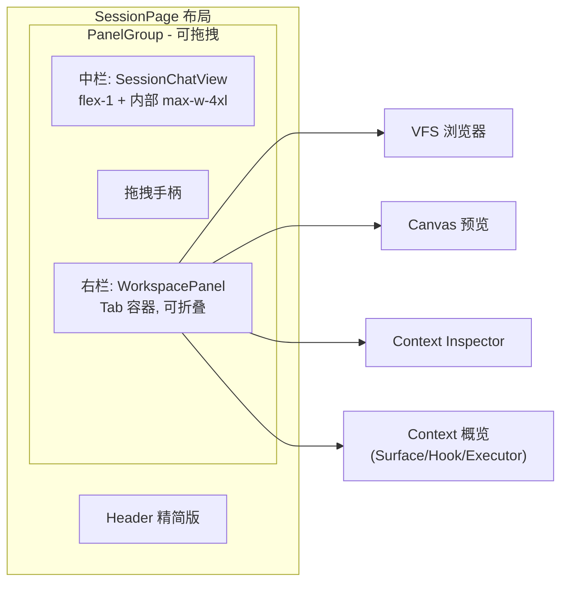

# Session 页三栏布局重构

## 现状分析

当前 `SessionPage` 的右侧面板是"临时弹出"模式：Context Inspector (w-[480px]) 和 Canvas (w-[55vw]) 作为独立 div 硬编码宽度，互相不感知；VFS 浏览器和 Hook Runtime 诊断信息则塞在 header 区域的折叠 Context Panel 里。没有统一的工作空间容器，也没有拖拽调整能力。

### 涉及的现有组件

- [SessionPage.tsx](frontend/src/pages/SessionPage.tsx) — 页面主体，管理所有面板状态
- [SessionChatView.tsx](frontend/src/features/session/ui/SessionChatView.tsx) — 聊天视图（中栏主体）
- [CanvasSessionPanel.tsx](frontend/src/features/canvas-panel/CanvasSessionPanel.tsx) — Canvas 预览面板
- [context-inspector-panel.tsx](frontend/src/features/session-context/context-inspector-panel.tsx) — Context 审计面板
- [context-panels.tsx](frontend/src/features/session-context/context-panels.tsx) — Project/Story 上下文面板（含 VFS、Surface、Hook Runtime）
- [agent-tab-view.tsx](frontend/src/features/agent/agent-tab-view.tsx) — Agent 主页简化 session 面板

## 目标架构




## 实施步骤

### 阶段 1：基础设施 — 安装依赖 + 创建 WorkspacePanel 骨架

- 安装 `react-resizable-panels`
- 在 `frontend/src/features/workspace-panel/` 下新建：
  - `WorkspacePanel.tsx` — 右栏 Tab 容器组件，管理 Tab 状态和内容区
  - `workspace-panel-types.ts` — Tab 枚举和 Props 类型
  - `index.ts` — 模块导出

**WorkspacePanel 核心设计**：

- Props 接收 `sessionId`、各面板所需数据（canvas、context snapshot 等）
- 内部维护 `activeTab` 状态，Tab 列表为: `context` | `vfs` | `canvas` | `inspector`
- 对外暴露 `openTab(tab)` 命令式方法（通过 `useImperativeHandle`），供 SessionPage 在 Canvas 事件等场景下调用
- 各 Tab 内容区按需渲染（已有组件直接迁入，不重写）

### 阶段 2：SessionPage 布局重构

改造 [SessionPage.tsx](frontend/src/pages/SessionPage.tsx) 的 `<div className="flex flex-1 overflow-hidden">` 区域：

**之前**：

```
<div flex>
  <SessionChatView flex-1 />
  <ContextInspector w-480 />    // 条件渲染
  <CanvasPanel w-55vw />        // 条件渲染
</div>
```

**之后**：

```
<PanelGroup direction="horizontal">
  <Panel>
    <SessionChatView />
  </Panel>
  <PanelResizeHandle />          // 仅右栏展开时渲染
  <Panel defaultSize={0} collapsible>
    <WorkspacePanel />
  </Panel>
</PanelGroup>
```

关键变更：

- 移除 `isContextInspectorOpen`、`isCanvasPanelOpen` 两个独立布尔状态，统一为 `workspacePanelOpen` + `workspaceActiveTab`
- 移除 header 区域的 ProjectSessionContextPanel / StorySessionContextPanel 折叠面板，其内容拆入右栏 `context` Tab
- 保留 header 但精简按钮：原来的"Context Inspector"和"打开 Canvas"按钮改为统一的右栏展开/收起按钮
- `canvas_presented` 系统事件触发时，自动 `openTab("canvas")` + 展开右栏

### 阶段 3：Context 概览 Tab 拆分

将 [context-panels.tsx](frontend/src/features/session-context/context-panels.tsx) 中的 `ProjectSessionContextPanel` 和 `StorySessionContextPanel` 从"header 折叠条"形态改造为"右栏 Tab 内容"形态：

- 新建 `frontend/src/features/workspace-panel/ContextOverviewTab.tsx`
- 复用已有子组件（SurfaceCard、HookRuntimeCards、VfsBrowser 等），只重新组织布局
- 移除原来的折叠/展开交互（onToggle/isOpen），改为始终展示的滚动列表
- Props 保持兼容：接收 contextSnapshot、vfs、hookRuntime、sessionCapabilities 等

### 阶段 4：AgentTabView 联动

在 [agent-tab-view.tsx](frontend/src/features/agent/agent-tab-view.tsx) 的面包屑栏中：

- 在现有"全屏"按钮旁增加一个"工作空间"按钮
- 点击时携带 `open_workspace_panel: true` 的 navigation state 跳转到 `/session/:id`
- SessionPage 读取该 state 后自动展开右栏

### 阶段 5：默认折叠行为 + 展开触发

右栏可见性逻辑（集中在 SessionPage）：

- 默认折叠（`react-resizable-panels` 的 `collapsed` 状态）
- Header 右上角的统一展开按钮
- `canvas_presented` 事件 → 自动展开 + 切到 canvas Tab
- 路由 state 携带 `open_workspace_panel` → 自动展开
- 用户手动拖拽到最小宽度以下 → 自动折叠（`react-resizable-panels` 内置 `onCollapse` 回调）

## 不变的部分

- `SessionChatView` 内部结构和 Props 不变，它仍然是中栏的主体
- 左栏导航 `WorkspaceLayout` 不变
- Canvas/VFS/Inspector 各组件的内部逻辑不变，只改变它们的挂载位置
- 现有路由结构不变

## 文件变更清单


| 操作  | 文件                                                                  |
| --- | ------------------------------------------------------------------- |
| 新建  | `frontend/src/features/workspace-panel/WorkspacePanel.tsx`          |
| 新建  | `frontend/src/features/workspace-panel/ContextOverviewTab.tsx`      |
| 新建  | `frontend/src/features/workspace-panel/workspace-panel-types.ts`    |
| 新建  | `frontend/src/features/workspace-panel/index.ts`                    |
| 重构  | `frontend/src/pages/SessionPage.tsx`                                |
| 小改  | `frontend/src/features/agent/agent-tab-view.tsx`                    |
| 小改  | `frontend/src/features/session-context/index.ts`（调整导出）              |
| 不变  | `frontend/src/features/canvas-panel/CanvasSessionPanel.tsx`         |
| 不变  | `frontend/src/features/session-context/context-inspector-panel.tsx` |
