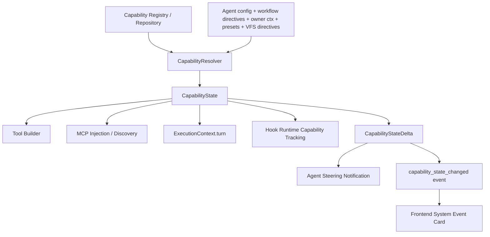

# 收敛 CapabilityState

## 背景

`05-08-workflow-tool-surface-filtering` 已把工具级裁剪收敛到
`CapabilityState.tool_policy`，解决了 Workflow Admin Plan 阶段错误暴露
`upsert_*` MCP 工具的问题。

但这仍然只是局部修正：之前的运行态同时存在 FlowCapabilities / CapabilitySurface /
ResolverOutput 多个容器，分别描述 capability key、ToolCluster、工具过滤、MCP、VFS。
这些结构表达的是同一件事，却在不同链路里各自成为“事实来源”，最终导致 Plan 阶段
错误暴露 upsert 工具、能力更新提示无法真实反映工具集变化。

这意味着能力管理仍存在下一层隐患：

- 运行态事实源不是一个一眼能识别的类型。
- FlowCapabilities、CapabilitySurface、CapabilityResolverOutput、McpInjectionConfig
  容易继续产生职责重叠。
- 后续新增权限、模型策略、上下文能力、工具策略时，开发者可能继续把状态散落到不同结构。
- diff 逻辑此前围绕展示 surface 做，但 resolver 和 connector 又各自消费 flow
  capabilities / MCP list，概念没有彻底统一。

## 目标

- 建立一个与 capability registry / repository 定义一一映射、可由 Resolver 唯一产出的
  `CapabilityState`。
- 后续 Agent 的所有能力管理、工具暴露、MCP 注入、VFS/context state、事件 diff、
  prompt / connector 装配都基于这个唯一 state。
- 删除 FlowCapabilities / CapabilitySurface 这类局部或投影名词作为运行态状态容器，
  避免“能力状态”“工具裁剪实现细节”“展示表面”三套概念并行。
- 让 capability diff 基于完整 `CapabilityState`，而不是散落的 key set / MCP list /
  tool filter / VFS delta 各自比较。

## 非目标

- 不做兼容旧字段或双字段过渡；项目处于预研期，应直接硬切到正确模型。
- 不改变 `ToolCapabilityDirective` 的 JSON 语法。
- 不重做前端完整 capability editor UI。
- 不把所有 capability metadata 移入数据库；本次先定义 runtime state 与 registry
  的边界，具体持久化可后续独立推进。

## 命名建议

最终建议：

```rust
CapabilityState
```

理由：

- `Capability`：覆盖工具、MCP、VFS/context、hook/runtime 权限等未来能力维度。
- `State`：表达它是完整状态，可整体 diff / persist / apply。
- 在 `ExecutionTurnFrame`、`SessionProfile`、phase transition 等上下文里，`Runtime`
  这个限定词已经由外层语境提供；写进类型名反而显得拖沓。

不推荐：

- `RuntimeCapabilityState`：语义准确但偏长，且 `Runtime` 与字段所在上下文重复。
- `ResolvedCapabilityState`：更强调 resolver 输出，但不如 runtime 覆盖热更新后的状态。
- `SessionCapabilityState`：容易和 session-level 静态配置混淆。
- `CapabilitySurface`：surface 更像展示/投影，不像权威状态容器；
  如果保留，也只能是 UI/事件层从 `CapabilityState` 派生出的只读 view。

当前 `CapabilitySurface` 的职责应并入 `CapabilityState`。原则上不再需要独立
surface 状态类型；事件 payload 需要的展示字段必须从 `CapabilityState` 派生，
字段名也统一为 state / tool_state。

## 目标模型

### Capability Registry / Repository

能力仓储或注册表负责描述“系统知道哪些能力，以及能力能展开出什么”：

```rust
CapabilityDefinition {
    key: ToolCapability,
    visibility_rule: CapabilityVisibilityRule,
    tool_descriptors: Vec<ToolDescriptor>,
    platform_mcp_scope: Option<PlatformMcpScope>,
    tool_clusters: BTreeSet<ToolCluster>,
}
```

现有来源：

- `WELL_KNOWN_KEYS`
- `default_visibility_rules()`
- `platform_tool_descriptors()`
- `capability_to_tool_clusters()`
- `capability_to_platform_mcp_scope()`

这些应收拢成一个可查询 registry，而不是散落函数。

### CapabilityState

运行态唯一状态容器：

```rust
CapabilityState {
    capabilities: BTreeSet<ToolCapability>,
    tool_policy: BTreeMap<String, ToolCapabilityFilter>,
    tool_clusters: BTreeSet<ToolCluster>,
    mcp_servers: Vec<SessionMcpServer>,
    vfs: Option<Vfs>,
}
```

含义：

- `capabilities`：最终生效 capability keys。
- `tool_policy`：工具级 include/exclude 策略，即当前 `CapabilityState.tool_policy`。
- `tool_clusters`：由 registry 从 `capabilities` 派生的本地工具簇。
- `mcp_servers`：由 registry + resolver 输入展开出的 platform/custom MCP server。
- `vfs`：当前运行态文件/上下文访问状态。

后续可扩展但必须保持同一容器：

- model/provider permissions
- approval policy
- context injection scopes
- hook action permissions
- runtime notification abilities

### Derived Views

允许存在只读派生视图，但不能作为状态存储：

- `enabled_tool_paths()`
- `blocked_tool_paths()`
- `agent_facing_tool_names()`
- `CapabilityStateDelta`
- frontend display lines

这些必须从 `CapabilityState` 派生。

## 数据流



## 实施计划

### Phase 1：定义 registry 与 state 类型

- 新增 `CapabilityState`。
- 将当前 `CapabilityState` 的字段迁入该类型，然后删除 `CapabilityState`
  作为状态容器的角色。
- 新增 `CapabilityRegistry` 查询接口，先包装现有静态函数，不引入数据库。
- `CapabilityState` 降级为内部兼容删除候选，或直接删除并把字段迁入 state。

### Phase 2：Resolver 输出唯一 state

- `CapabilityResolverOutput` 改为：

```rust
pub struct CapabilityResolverOutput {
    pub state: CapabilityState,
}
```

- 删除并行输出：
  - `capability_state`
  - 平台 MCP 配置列表
  - 自定义 MCP server 列表
  - `capabilities`
- 所有调用方只消费 `state`。

### Phase 3：工具构建与 connector 装配只读 state

- `ExecutionTurnFrame.capability_state` 替换为 `capability_state`。
- `PromptSessionRequest.capability_state` 替换为 `capability_state`。
- `SessionProfile.capability_state` 替换为 `capability_state` 或直接持有完整 state。
- runtime tools、direct MCP、relay MCP 均从 `CapabilityState` 判定工具是否可见。

### Phase 4：统一 diff

- 用 `CapabilityStateDelta` 替代当前 `CapabilityStateDelta`。
- diff 覆盖：
  - capability keys
  - tool policy / derived tool paths
  - tool clusters
  - MCP servers
  - VFS
- Agent steering notification 与前端 `capability_state_changed` 事件都使用同一个 delta。

### Phase 5：删除旧概念与规格固化

- 删除 `CapabilityState` 类型或将其重命名迁移完成。
- 更新 `.trellis/spec/backend/capability/tool-capability-pipeline.md`。
- 更新 `.trellis/spec/backend/session/execution-context-frames.md`。
- 增加 grep 守卫，禁止新增 `capability_state` 字段名。

## 验收标准

- 非测试代码中不再出现 `CapabilityState` 作为运行态状态容器。
- 非测试代码中不再出现 `CapabilityState` 作为运行态状态容器。
- Resolver 只输出一个 `CapabilityState`。
- 所有工具构建入口只接收 `CapabilityState` 或其只读引用。
- phase transition / pending transition / event payload / frontend display 都基于同一个
  `CapabilityStateDelta`。
- Workflow Admin Plan 阶段仍不暴露 upsert，Apply 阶段暴露 upsert。
- 相关 Rust 测试、前端类型检查和 lint 通过。

## 风险点

- `CapabilityState` 目前在 SPI、application、executor、API route 和 session pipeline
  中引用较广，建议一次硬切但分 commit 小步完成。
- `CapabilityState` 和 pending transition 持久化在 session meta 中，字段改名需要同步
  session meta 序列化契约；预研期不做兼容，但需要确认本地开发数据迁移/清理策略。
- Relay / remote connector 当前部分消费 session frame 的 `mcp_servers`，需要明确
  runtime state 如何投影成远端协议字段。

## 相关文件

- `crates/agentdash-spi/src/platform/tool_capability.rs`
- `crates/agentdash-spi/src/connector/mod.rs`
- `crates/agentdash-application/src/capability/resolver.rs`
- `crates/agentdash-application/src/session/types.rs`
- `crates/agentdash-application/src/session/capability_state.rs`
- `crates/agentdash-application/src/session/hub/tool_builder.rs`
- `crates/agentdash-application/src/session/hub/runtime_context_transition.rs`
- `crates/agentdash-executor/src/mcp/direct.rs`
- `crates/agentdash-executor/src/mcp/relay.rs`
- `frontend/src/features/session/ui/SessionSystemEventCard.tsx`
