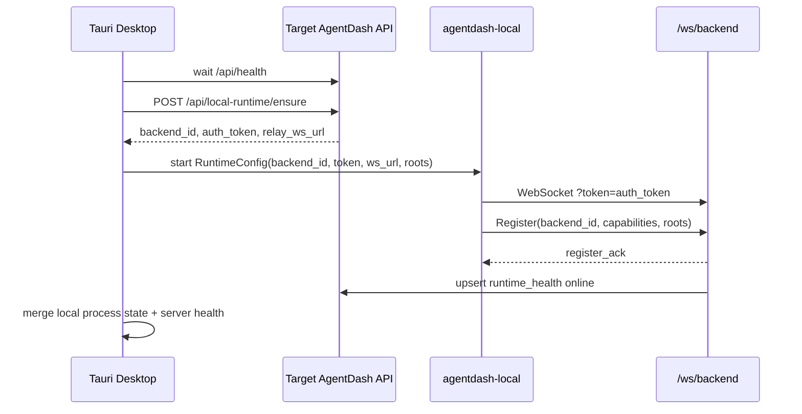

# 本机端与服务器连接闭环设计

## 现状判断

当前 AgentDash 的 local 端与 server 端已经具备协议能力，但缺少“配置与注册的控制面”：

- `agentdash-local` 能连接 `cloud_url?token=...`，首包发送 `Register { backend_id, name, version, capabilities, accessible_roots }`。
- `agentdash-api` 的 `/ws/backend` 会用 token 查 `backends.auth_token`，并强校验注册包里的 `backend_id` 等于 token 绑定的 backend row。
- Tauri 的 `runtime_start` 在缺少 `backend_id` 时会随机生成 UUID。这与 server 的强校验矛盾：随机 UUID 没有对应的 server row/token，原则上无法可靠注册。
- Tauri 目前只保存 `desktop-runtime-profile.json`，没有调用 server API 创建/领取 backend token，也没有在 embedded API 启动后自动把内置 local runtime 串上去。
- Desktop UI 目前是 `Runtime | Dashboard` 两个顶层视图，Dashboard 只是嵌入 web app，Local Runtime 是另一个独立界面。这正是截图里样式割裂和产品概念割裂的来源。

所以本任务的核心不是重写 runtime，而是补齐控制面：server 负责授权和身份，Tauri 负责本机进程/配置生命周期，web/desktop 前端共用同一套组件与样式。

## 总体决策

采用“server 权威资源 + desktop profile 管理 + local IPC 即时反馈”的结构：

1. Server 权威
   - `backends` 是 local backend 的授权资源，保存 `backend_id`、`auth_token`、`owner_user_id`、`enabled`、`backend_type`。
   - `runtime_health` 是在线/能力/根目录/设备信息的权威状态。
   - `/ws/backend` 继续只接受 server 颁发 token，不接受客户端自造身份。

2. Desktop 管理
   - Tauri 维护每个目标 server 的 desktop profile，包括 `server_origin`、稳定 `device_id`、用户选择的 roots、启动偏好。
   - Tauri 不保存长期“自造 backend token”。启动前调用 server ensure API，拿到当前有效 token 和 ws URL。
   - Tauri 负责启动/停止内置 `agentdash-local`，并通过 IPC 把本地进程状态传给 renderer。

3. UI 融合
   - Desktop renderer 直接加载共享 Web App。
   - Web App 的 Settings 在 desktop 环境注入一个 `Local Runtime` 面板。
   - 主导航不再出现独立 `Dashboard`，也不把 local runtime 当作和 Dashboard 平级的应用页面。

4. 样式工程化
   - 继续执行前序 task 的工程化方向：`@agentdash/ui` 提供组件和 tokens，`@agentdash/ui/styles.css` 是样式入口。
   - Tauri 包禁止维护独立视觉体系。desktop-only 页面也使用共享 `Button/Input/Switch/Badge/Dialog/Tabs/Tooltip` 等组件。

## Server 设计

### 新 API

新增用户态 API：

```http
POST /api/local-runtime/ensure
Authorization: Bearer <user token>
Content-Type: application/json
```

请求：

```json
{
  "device_id": "desktop:windows:<stable-uuid>",
  "profile_id": "desktop:<server-host>:<user-id>",
  "name": "Yihao Windows Desktop",
  "accessible_roots": ["D:/ABCTools_Dev"],
  "executor_enabled": true,
  "client_version": "0.1.0",
  "device": {
    "os": "windows",
    "arch": "x64",
    "app": "agentdash-desktop"
  }
}
```

响应：

```json
{
  "backend_id": "local_<stable-id>",
  "name": "Yihao Windows Desktop",
  "relay_ws_url": "ws://127.0.0.1:3001/ws/backend",
  "auth_token": "generated-server-token",
  "backend_enabled": true,
  "profile_id": "desktop:<server-host>:<user-id>"
}
```

命名可以在实现时按现有 routes 风格调整，但语义必须保持“一次 ensure 返回启动 runtime 所需的一切”。

### 身份与唯一性（修订）

第一版实现用 `owner_user_id + profile_id + device_id` 作为 ensure 唯一键，能解决“当前用户的桌面端自动上线”，但这不是最终模型。参考 multica 后期从 hostname 迁移到机器级 UUID 的策略后，AgentDash 应把“机器身份”“个人绑定”“共享 Scope”拆开。

核心原则：

- `machine_id` 表示本地安装/物理机器身份，由 Desktop 本地生成并长期保存。它不应包含用户 ID，也不应按 server profile 重新生成。
- `machine_label` / hostname 只用于展示、默认命名和用户可读诊断，不自动参与身份匹配。只有由旧 profile/device 明确提交到 `legacy_machine_ids` 的值才可用于 legacy merge。
- `owner_user_id` 表示 personal backend 的拥有者或 shared backend 的创建/管理者，不是机器身份的一部分。
- `profile_id` 表示 Desktop 连接的目标 server/profile，不是物理机器身份。
- 一个 machine 可以有多个 backend slot：个人 slot、项目共享 slot、系统共享 slot。

最终唯一键建议：

- `machine_id + share_scope_kind + COALESCE(share_scope_id, '') + capability_slot`

其中：

- personal backend：`share_scope_kind = user`，`share_scope_id = owner_user_id`，默认 `visibility = private`。
- project shared backend：`share_scope_kind = project`，`share_scope_id = project_id`，默认 `visibility = shared`。
- system shared backend：`share_scope_kind = system`，`share_scope_id = null`，默认 `visibility = system`。

当前已落地的唯一键：

- `owner_user_id + profile_id + device_id`

这个键可以作为 Phase 1/2 的临时闭环，但后续应演进为 `machine_id + scope`。迁移时需要保留旧 `device_id` 作为 `legacy_machine_ids` 候选，避免已有 backend 变成孤儿。

当前 `backends` 已有 `owner_user_id`，`runtime_health` 已有 `profile_id`。若不补迁移，`profile_id/device_id` 只能塞进 endpoint 或 name，这会让后续查询和重置很脏。因此建议继续补齐并进一步扩展：

- 迁移 `backends` 增加：
  - `profile_id TEXT`
  - `device_id TEXT`（短期兼容字段，后续语义迁移为 legacy）
  - `machine_id TEXT`
  - `machine_label TEXT`
  - `legacy_machine_ids JSONB NOT NULL DEFAULT '[]'`
  - `visibility TEXT NOT NULL DEFAULT 'private'`
  - `share_scope_kind TEXT NOT NULL DEFAULT 'user'`
  - `share_scope_id TEXT`
  - `capability_slot TEXT NOT NULL DEFAULT 'default'`
  - `device JSONB NOT NULL DEFAULT '{}'`
  - `last_claimed_at TIMESTAMPTZ`
  - 临时唯一索引 `(owner_user_id, profile_id, device_id)`，仅 local backend 生效。
  - 目标唯一索引 `(machine_id, share_scope_kind, COALESCE(share_scope_id, ''), capability_slot)`，仅 local backend 生效。
- 保留 `auth_token` 明文现状不扩大本 task 范围；若要安全升级，单独 task 做 token hash 化。预研期也可以一并做，但会扩大影响面到 relay 鉴权和测试。

### ensure 行为

- 校验用户已登录。
- 归一化 `machine_id/machine_label/profile_id/scope/name/roots`。
- 短期兼容 `device_id`；长期由 `machine_id + scope` 定位 local backend。
- 查找同 machine/scope/slot 的 local backend。personal scope 下 `scope_id` 等于当前用户；shared scope 下必须校验当前用户拥有对应 project/system 管理权限。
- 不存在则创建 backend，生成 `backend_id` 和 `auth_token`。
- 存在则更新 name/device/endpoint/enabled/last_claimed_at；auth_token 默认复用，除非请求显式 rotate。
- 返回 relay websocket URL。对于 embedded desktop API，URL 来自当前 server origin 派生；对于远端 server，也是同一 server 的 `/ws/backend`。
- 不直接写 `runtime_health` 为 online。online 仍由 WS register 成功后写入，避免 UI 误报。
- 接收 `legacy_machine_ids` 后，server 可把显式旧身份候选对应的 backend row 合并到当前 machine row。合并必须重定向 workspace bindings、views backend_ids 等引用后再删除旧 row，避免历史关系丢失。

### relay 注册约束

`/ws/backend` 现有约束应保留：

- token 必须命中 exactly one backend。
- backend 必须 enabled。
- register payload 的 `backend_id` 必须与 token 绑定 backend 一致。
- 重复在线同 backend_id 继续拒绝；Tauri 侧收到后展示“此设备/配置已有实例在线”，提供重启本机 runtime 或 reset profile。

## Tauri / Local Runtime 设计

### 配置模型

用 server profile 取代现在的单一 `desktop-runtime-profile.json`。建议结构：

```json
{
  "profiles": {
    "http://127.0.0.1:3001": {
      "server_origin": "http://127.0.0.1:3001",
      "device_id": "desktop:windows:...",
      "name": "Yihao Windows Desktop",
      "accessible_roots": ["D:/ABCTools_Dev/AgentDashboard"],
      "executor_enabled": true,
      "auto_start": true
    }
  },
  "active_server_origin": "http://127.0.0.1:3001"
}
```

本地文件保存可恢复偏好和稳定 device identity，不保存 server 权威状态。token 可短期缓存以支持诊断展示，但启动前仍以 ensure 返回为准。

### 启动流程



### 状态融合

Renderer 需要看到两类状态：

- Local IPC 状态：`installing/starting/running/stopping/stopped/error`，进程是否活着，最近错误，日志。
- Server 状态：`backend exists/enabled`、`runtime_health.status`、`last_seen_at`、`capabilities`、`accessible_roots`。

融合原则：

- server online 是是否可被 cloud/dashboard 调度的权威。
- local IPC 状态用于桌面端立即反馈，例如刚点 Stop 后无需等 server sweeper。
- 当二者冲突时，设置页展示两行状态而不是互相覆盖：例如“本机进程 running，但 server 未注册：token 无效或网络断开”。

### 错误恢复

必须覆盖：

- server 未启动：embedded API 管理器继续负责启动，Local 面板显示等待 API。
- ensure 401：用户未登录或 token 失效，提示重新登录，不启动 runtime。
- ensure 失败：不启动 runtime，保留错误。
- WS token invalid/backend mismatch：强制重新 ensure 并 restart 一次；仍失败则提示 reset profile。
- duplicate online：提示已有实例在线，提供 stop/restart local runtime；必要时提供 server 侧 rotate/reset。
- server target 切换：停止旧 runtime，切换 active profile，ensure 新 server，按 auto_start 启动。

## Frontend 信息架构

### Desktop App 外壳

`packages/app-tauri/src/App.tsx` 应从双视图外壳演进为 Desktop Provider：

- 初始化 desktop API client。
- 注入 `window.__AGENTDASH_DESKTOP__` 或 React provider，提供 desktop capabilities。
- 渲染 `<WebDashboardApp />` 作为唯一主应用。
- 不再维护 `DesktopView = 'runtime' | 'dashboard'`。

### Settings / Local Runtime 面板

在 web app 的 Settings 中新增 desktop-only route/tab：

- 连接目标：server origin、embedded/external 模式、当前用户。
- 本机 runtime：状态、backend_id、device_id、profile_id、版本。
- 根目录：accessible roots 列表、添加/删除。
- 执行能力：executor enabled、MCP/tool capability 摘要。
- 操作：Start、Stop、Restart、Reset profile、Rotate token、Open logs。
- 诊断：最近日志、server health、last_seen、capabilities JSON 展开。

该面板应从 `packages/app-web` 的 Settings 体系进入；desktop-only 的数据访问通过 adapter 注入，Web 环境下不显示该 tab。

### Dashboard 复用

Dashboard 不做 desktop 专属复制。当前 `DashboardHost` 中等待 embedded API ready 的逻辑应移动到 desktop provider 或 app bootstrap 层，成为“API 未就绪时的启动遮罩/状态条”，而不是单独 Dashboard 页面。

## 与 multica 的映射

可借鉴：

- 桌面进程拥有独立 profile，profile 按目标 server host 派生，避免污染用户手工 CLI 配置。
- 机器身份使用本地持久 UUID，而不是 hostname。hostname/device name 只做展示标签；如果确有旧身份要合并，必须由本机端作为显式 legacy id 提交。
- 个人 runtime 是机器上的 private binding，不等同于机器本身。shared runtime 用同一套 runtime row + visibility/scope 机制表达。
- 桌面主进程负责 daemon/local runtime 生命周期，renderer 只通过 IPC 操作。
- 启动时先同步 server URL/token，再启动 daemon。
- 设置页展示 auto-start、auto-stop、diagnostics、logs。
- UI 通过本地 IPC 状态加速反馈，但 server runtime row 仍是权威。
- runtime deleted/gone 时，本机端能移除 stale ID 并重新注册。
- server 注册时带显式 legacy IDs；server 负责合并旧身份对应的 runtime row，但不能从当前 hostname / `.local` / 大小写变体自动推导身份，避免两台同名机器被误合并。

不照搬：

- multica 的 runtime 是 workspace/provider 维度的 `agent_runtime`，AgentDash 当前是 backend 维度的 `backends + runtime_health`。
- multica daemon 会轮询 workspace/task；AgentDash local runtime 主要通过 relay ws 执行后端任务与工具调用。
- multica 使用 Electron CLI sidecar；AgentDash 已经把 local runtime crate 嵌入 Tauri，可以直接调用 Rust manager。

转化为 AgentDash 决策：

- `device_id` 重命名/升级为 `machine_id`，且本地按安装保存，不按用户或 server target 生成。
- `profile_id` 只用于连接目标 server/profile 的配置隔离，不参与物理机器身份。
- `owner_user_id` 不再参与最终 `backend_id` 的机器部分；它只是 personal scope 的 `share_scope_id`。
- `visibility/share_scope` 进入 server row，让“个人本机”和“共用本机”共用一套模型。
- Settings 中以机器标签聚合展示 runtime scopes，而不是直接以 backend row 平铺。

## 测试策略

Server:

- ensure API 新建 backend、复用 backend、按 owner/profile/device 隔离、rotate token。
- `/ws/backend` token/backend_id mismatch 仍拒绝。
- runtime_health 只在 register 成功后 online。
- migration 唯一约束与已有数据兼容。

Tauri/local:

- profile 按 server origin 隔离。
- missing backend_id 不再随机启动，而是先 ensure。
- server 切换会 stop old runtime 并 ensure new profile。
- ensure 401、duplicate online、token invalid 有明确状态。

Frontend:

- Desktop App 渲染 web app 主体验，不再显示 Runtime/Dashboard 顶层切换。
- Settings 仅 desktop 环境显示 Local Runtime tab。
- Local 面板能展示 local IPC 与 server health 的冲突状态。
- 样式导入只走共享 `@agentdash/ui/styles.css`。

端到端:

- `pnpm dev` 后打开 desktop app，embedded API ready 后自动 ensure 并启动 local runtime。
- server `/api/backends` 能看到 local backend，`/api/runtime-health` 能看到 online。
- 停止 runtime 后 UI 立即显示本机 stopped，server 随断开更新 offline。
