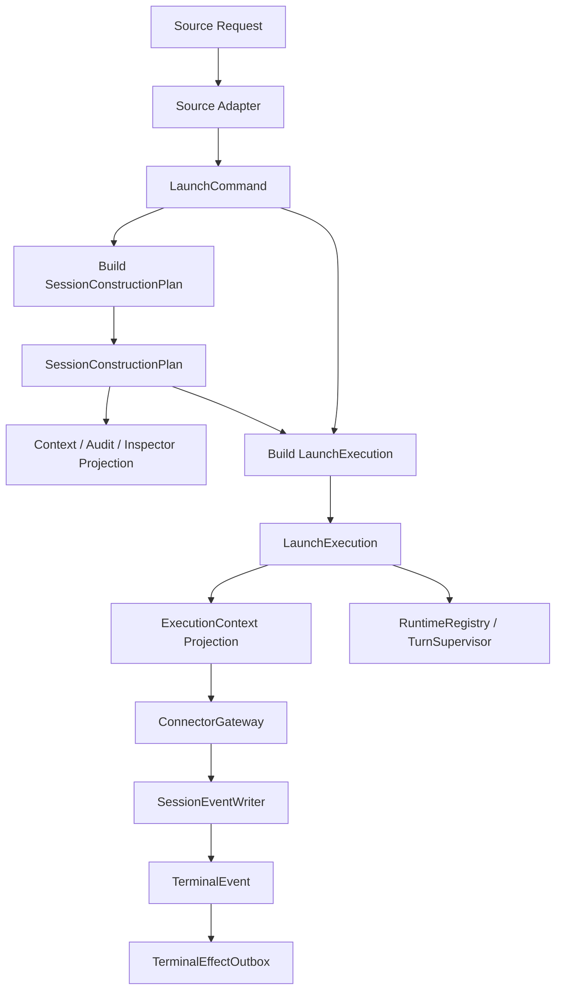

# Target Architecture：Session 构建与 Launch 数据流

## 一页结论

目标架构的中心是 session 构建与 launch 执行之间的唯一数据流：

```text
LaunchCommand -> SessionConstructionPlan -> LaunchExecution
```

`SessionConstructionPlan` 是 session 构建的唯一事实源，供 launch、context endpoint、audit/inspector 共同投影。`LaunchExecution` 是一次 launch 的短生命周期执行计划，包含本次 prompt/lifecycle/restore/hook/runtime command/effect 策略，以及 connector 所需输入。`ExecutionContext` 只是 connector SPI 投影，不再作为主链路中间层。

读取 facts、解析 owner、构建 construction、解析 launch、生成 connector projection 是实现手段，不是必须暴露的数据传递层。

`SessionHub` 最终不保留为有职责 facade。`PromptSessionRequest` 最终删除。

## 目标能力区域

```text
core          : durable session facts、meta、event seq、execution projection
ownership     : owner/binding/bootstrap owner phase
construction  : SessionConstructionPlan，统一 owner/workspace/surface/context/execution profile
launch        : LaunchCommand + SessionConstructionPlan -> LaunchExecution，一次性 launch 策略解析
runtime       : turn reservation、active、cancel、supervision、stall
eventing      : event writer、projection、broadcast、terminal event
hooks         : hook runtime、delegate、hook launch policy
effects       : terminal event -> durable outbox -> handlers
pending       : runtime command events + derived projection
adapters      : HTTP/task/workflow/routine/companion/hook/local relay
```

## 唯一数据流



## SessionConstructionPlan 边界

`SessionConstructionPlan` 包含：

- session identity / meta summary；
- `ResolvedSessionOwner`；
- source contract；
- project/story/task/workflow/routine/companion 相关 session facts；
- workspace / VFS / mount / typed working dir；
- executor config resolution 与来源；
- MCP / tools / capability state；
- context fragments / context frame plan / bundle plan；
- identity / assignment / pending action frames；
- context endpoint、audit、inspector projection；
- fallback trace。

`SessionConstructionPlan` 不包含：

- turn id；
- runtime reservation；
- connector accepted 状态；
- hook reload/refresh 执行结果；
- repository restore / executor follow-up 的运行状态；
- terminal effect/outbox 状态；
- runtime command applied/failed 状态。

## LaunchExecution 边界

`LaunchExecution` 包含：

- launch id；
- prompt payload；
- source；
- `SessionConstructionPlan`；
- lifecycle：plain / owner bootstrap / repository rehydrate；
- restore：live executor / follow-up / repository transcript / none；
- hook plan：reload / refresh / none；
- pending runtime command launch plan；
- terminal effect plan；
- connector input；
- launch trace。

它不作为 context query 或 audit 的长期事实源；这些查询都应从 construction projection 出发。

connector input 是 `LaunchExecution` 的字段或内部子结构，不要求独立成为跨模块 handoff 层。它包含 connector 执行所需的最终输入：

- executor config；
- working directory；
- env；
- MCP servers；
- VFS；
- capability state；
- context frames；
- restored state；
- runtime tools。

`ExecutionContext` 是 connector SPI 投影，不应被 route、task、workflow、routine、companion 直接构造。

## Runtime / Turn 边界

Turn 只负责运行态：

- claim / active / release；
- cancel token；
- hook runtime handle；
- stream adapter / processor supervision；
- stall detection；
- terminal release。

Turn 不负责 owner/VFS/MCP/capability/context/follow-up fallback。

## Terminal Effects

终态顺序：

```text
stream terminal
  -> terminal event persisted
  -> runtime release
  -> outbox enqueue
  -> effect dispatcher claim
  -> handler execute with idempotency key
  -> success / retry / dead-letter
```

effect 类型采用受控 kind + JSON payload。失败不会破坏 terminal event 的事实性。

## Pending Runtime Command

pending runtime command 不再藏在 `SessionMeta`。

目标模型：

```text
RuntimeCommandRequested event
RuntimeCommandApplied event
RuntimeCommandFailed event
derived runtime_command_projection
```

projection 只作为 planner 查询索引，可由事件重建，不是新的事实源。

## 扩展原则

- 新启动来源只新增 adapter/source contract，不改 construction 主流程。
- 新 context source 只新增 construction provider，不改 route。
- 新 connector 只消费 connector SPI 投影，不依赖 application 内部 construction/launch 类型。
- 新 terminal effect 只新增 outbox handler，不改 processor。
- 新 runtime command 只新增 domain event 和 projection applier，不改 meta 字段。

## 收口不变量

- 生产主链路不再传递 `PromptSessionRequest`。
- context endpoint 不再拥有独立 owner/VFS/capability/context 组装路径。
- launch 不再临时推导 session construction 信息。
- 主链路不强制保留 `LaunchResolution`、`ExecutionPlan`、`ExecutionProjector` 这类传递型中间层。
- `SessionHub` 不再作为业务能力入口存在。
- 所有 fallback 都有 construction trace 或 launch trace。
- 所有 terminal effect 进入 durable outbox。
