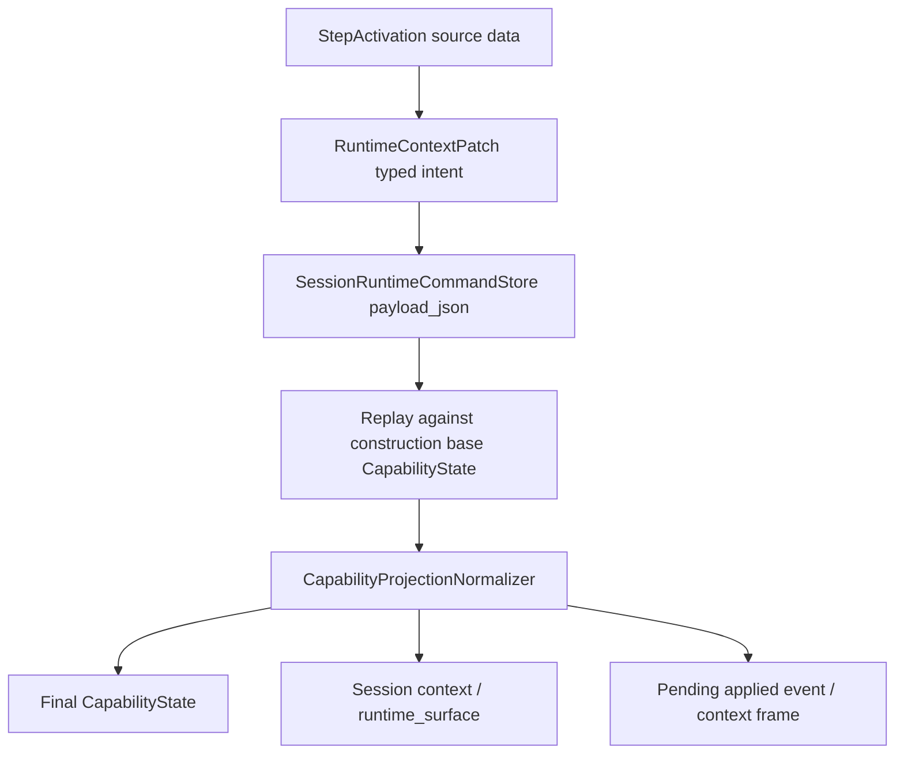
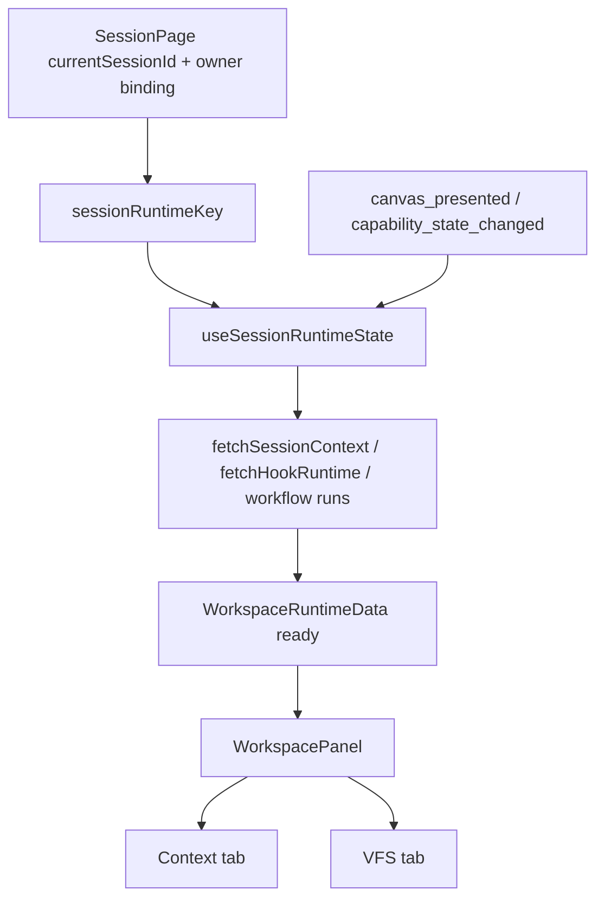

# Runtime Context Patch Typed Intent 标准化设计

## Scope

本任务只处理 runtime command payload 的语义标准化。上一轮已经建立 final projection pipeline，本轮要把 pending command 的“输入事实”也收成 typed intent，避免 payload 继续携带闭包 projection。

同一原则也覆盖 Session 右侧栏：右侧栏展示的是当前 session runtime projection 的 UI 投影，不应从多份临时 snapshot 拼出“看起来像当前状态”的上下文。因此本任务同时收束前端 WorkspacePanel 的 session runtime data source。

目标链路：

```text
workflow / runtime source intent
  -> RuntimeContextPatch typed intent
  -> runtime command store payload_json
  -> replay against construction base projection
  -> capability projection normalizer
  -> final CapabilityState / context frame / runtime_surface
```

前端目标链路：

```text
current session id + owner/source key
  -> SessionRuntimeState loader
  -> /sessions/{id}/context final projection
  -> WorkspacePanelData
  -> Context / VFS / Inspector tabs
```

## Current Shape

当前结构：

```rust
RuntimeContextPatch {
    tool: Option<ToolDimension>,
    companion: Option<CompanionDimension>,
    vfs_overlay: Option<Vfs>,
    mount_directives: Vec<MountDirective>,
}
```

问题在于：

- `tool` / `companion` 是 projection 维度，不是 intent。
- `RuntimeContextPatch::from_target_state` 从 `after_state` 反推 patch，会鼓励调用方继续先构造闭包状态。
- `prompt_pipeline`、`session_construction_bootstrap` 需要从 `patch.tool` 读 MCP，说明 replay 语义泄漏到了调用点。

## Target Shape

建议拆出 intent 维度：

```rust
pub struct RuntimeContextPatch {
    pub tool_directives: Vec<ToolCapabilityDirective>,
    pub tool_intent: RuntimeToolIntent,
    pub mcp_intent: RuntimeMcpIntent,
    pub companion_intent: RuntimeCompanionIntent,
    pub vfs_intent: RuntimeVfsIntent,
}

pub enum RuntimeToolIntent {
    NoChange,
    SetEffectiveTool {
        capabilities,
        enabled_clusters,
        tool_policy,
    },
}

pub enum RuntimeMcpIntent {
    NoChange,
    SetEffectiveServers(Vec<SessionMcpServer>),
}

pub enum RuntimeCompanionIntent {
    NoChange,
    SetAgents(Vec<CompanionAgentEntry>),
}

pub struct RuntimeVfsIntent {
    pub overlay: Option<Vfs>,
    pub mount_directives: Vec<MountDirective>,
}
```

`SetEffectiveServers` / `SetAgents` 是刻意的 typed intent：它表达 runtime action 对本轮 effective runtime projection 的明确设置，而不是把整个 `ToolDimension` / `CompanionDimension` 作为事实源塞进 payload。后续若 capability resolver 能直接 replay all source contributions，可再把 set intent 细化为 add/remove delta。

## Replay Contract

新增或重命名 replay 入口：

```rust
pub fn replay_runtime_context_patch(
    base_state: &CapabilityState,
    patch: &RuntimeContextPatch,
) -> RuntimeContextReplay
```

输出包含：

```rust
pub struct RuntimeContextReplay {
    pub capability_state: CapabilityState,
    pub vfs_overlay: Option<Vfs>,
    pub effective_mcp_servers: Option<Vec<SessionMcpServer>>,
}
```

replay 顺序：

1. 从 construction base `CapabilityState` clone。
2. 应用 tool directives 到 tool dimension 的 capability / policy 表达；如果当前代码没有轻量 reducer，可先复用 resolver 输出的 set intent，但 schema 名称必须表达这是 runtime intent。
3. 应用 `RuntimeMcpIntent::SetEffectiveServers` 到 `state.tool.mcp_servers`。
4. 应用 `RuntimeCompanionIntent::SetAgents` 到 `state.companion.agents`。
5. 合并 `RuntimeVfsIntent.overlay` 与 `mount_directives`。
6. 返回 replay 结果，调用方继续用 capability projection normalizer 写回 final VFS / MCP / Skill。

`session_construction_bootstrap` 和 `prompt_pipeline` 不再直接读 `patch.tool`，而是通过 replay output / helper 读取 pending MCP 与 VFS 结果。

## Pending Transition Contract

`PendingRuntimeContextTransitionInput` 需要携带 typed patch：

```rust
pub(crate) struct PendingRuntimeContextTransitionInput {
    ...
    pub before_state: Option<CapabilityState>,
    pub after_state: CapabilityState,
    pub patch: RuntimeContextPatch,
    ...
}
```

`after_state` 仍可服务 event diff 与 live parity，但 persisted payload 使用 `patch`。这样 pending command 保存 source intent，event 仍能展示 before/after delta。

workflow pending path 从 `StepActivation` 构造 patch：

```text
StepActivation
  - capability directives / resolved keys
  - mcp_servers
  - lifecycle_vfs
  - mount_directives
  -> RuntimeContextPatch
```

如果某条非 workflow path 只能提供 final state，应该先抽出该 source action 的 intent builder，再进入 pending transition，而不是恢复 `from_target_state`。

## JSON Shape

`payload_json` 继续保存 `PendingCapabilityStateTransition`。预期 JSON 形状：

```json
{
  "id": "...",
  "runId": "...",
  "lifecycleKey": "...",
  "phaseNode": "...",
  "capabilityKeys": ["..."],
  "patch": {
    "toolDirectives": [],
    "toolIntent": { "kind": "setEffectiveTool", "capabilities": [], "enabledClusters": [], "toolPolicy": {} },
    "mcpIntent": { "kind": "setEffectiveServers", "servers": [] },
    "companionIntent": { "kind": "noChange" },
    "vfsIntent": { "overlay": {}, "mountDirectives": [] }
  },
  "createdAt": 0
}
```

实际 serde tag 命名以项目现有风格为准；测试只断言语义字段存在、`state` / `tool` / `companion` replacement 不存在。

## Data Flow



## Frontend Session Runtime State

当前 `SessionPage` 维护了多份局部 runtime 数据：

- `loadedSessionContext`
- `loadedHookRuntime`
- `loadedOwnerStory`
- `workflowRuns`
- `activeCanvasId`

其中 `loadedSessionContext` 通过 `session_id + source_key` 防止串用旧数据，但它缺少统一的 lifecycle state。右侧栏收到的是拆散后的 props，无法表达“正在刷新当前 session projection”“刷新失败但保留上次成功投影”“session/source 已切换，旧投影不再可用”等状态。

建议引入页面级 hook 或 zustand slice：

```ts
type SessionRuntimeState = {
  session_id: string;
  source_key: string;
  status: "idle" | "loading" | "ready" | "refreshing" | "error";
  context: SessionContextPayload | null;
  hook_runtime: HookSessionRuntimeInfo | null;
  workflow_runs: WorkflowRun[];
  owner_story: Story | null;
  active_canvas_id: string | null;
  error: string | null;
};
```

实现原则：

- key 由 `session_id + owner/source key` 决定。
- key 变化时先进入 `loading`，右侧栏不继续展示旧 key 的 runtime surface。
- runtime event 触发 `refreshing`，刷新成功后原子替换当前 projection。
- 刷新失败时状态保留 error；是否保留上一份同 key projection由 UI 状态明确表达，而不是隐式继续展示。
- `WorkspacePanel` 接收 `WorkspaceRuntimeData` 或等价单对象，内部 tabs 通过 `WorkspaceDataProvider` 读取同一对象。

这样右侧栏的“当前上下文”与后端 current projection 关联，不需要为每次事件创建新的长期快照。

## Frontend Data Flow



## Migration

项目处于预研阶段，`payload_json` shape 可以直接更新。数据库表结构不变；现有测试 fixtures 统一改成新 shape。

## Risks

- tool directives 可能无法无损还原当前 `ToolDimension` 的所有运行态字段。解决方式是将不适合 directive 表达的部分显式建模为 `SetEffectiveToolPolicy` / `SetEffectiveMcpServers`，保持 intent 字段粒度清楚。
- pending event 还需要 before/after diff；因此 `after_state` 可以留在内存 input 中，但不能成为 persisted payload 的来源。
- 现有测试大量使用 `RuntimeContextPatch::from_target_state`，需要改成 typed builder，避免测试继续固化旧模型。

## Validation

关键验证：

- serialization test：payload JSON 不含 `state`、`tool`、`companion` replacement。
- replay unit test：typed intent replay 后等价于当前 workflow activation final state。
- repository test：requested / applied / failed 状态保存读取新 payload。
- runtime test：pending transition apply-on-next-turn 的 event/context frame 使用 replay + normalizer 后 projection。
- construction/API test：pending VFS overlay 后 context `runtime_surface` 仍与 final VFS 一致。
- frontend test：session key 切换时右侧栏不展示旧 context。
- frontend test：runtime refresh 后 WorkspacePanel / VFS tab 使用最新 `runtime_surface`。
