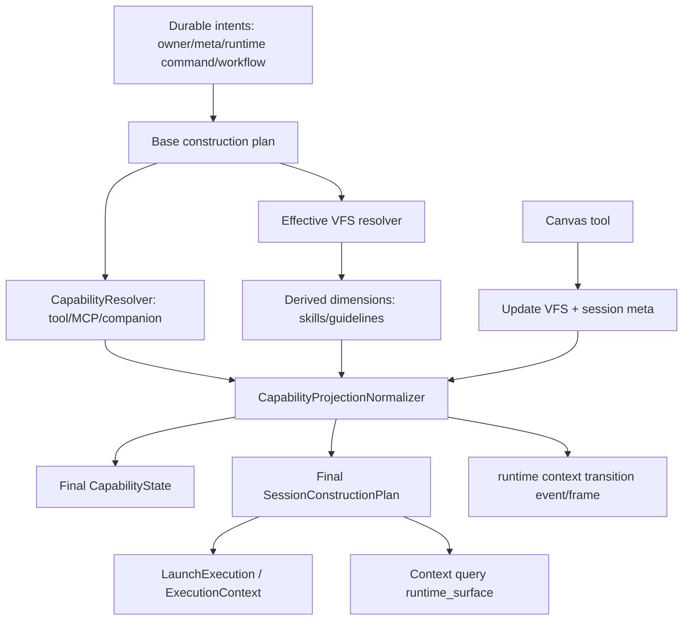

# Session Capability Projection Pipeline 收束设计

## Reference

完整链路短参考见 [pipeline-reference.md](./pipeline-reference.md)。本设计只展开本任务需要落地的技术边界。

## Scope

本任务从单点修复扩展为 Session capability projection pipeline 的分阶段收束，已按阶段先建立统一 normalizer，再把 pending runtime command 改为 typed patch：

- 修正 `/sessions/{session_id}/context` 的 `runtime_surface` 生成时机。
- 抽出 application 层 capability projection normalizer，统一补齐 VFS 依赖维度。
- 让 Skill baseline discovery 成为 normalizer 的派生阶段。
- 覆盖 Canvas 工具级联动测试。

本任务不改变 VFS provider 或数据库 schema；runtime command 仍使用既有 `payload_json` 容器，但 payload 内容表达 typed patch / intent。

完整重构覆盖 Phase 1-4，见参考文档的覆盖矩阵。本文只展开 Phase 1 的可执行设计，并为 Phase 2-4 保留明确接口方向。

## Architectural Review

### 当前结构

现有主线已经比较清晰：

```text
LaunchCommand
  -> SessionConstructionPlan
  -> LaunchExecution
  -> ExecutionContext connector projection
```

并且已有一致性 gate：

- `SessionConstructionPlan::validate_for_launch` 要求 `capability_state.vfs.active == surface.vfs`。
- `SessionConstructionPlan::validate_for_launch` 要求 `capability_state.tool.mcp_servers == projections.mcp_servers`。
- `SessionRuntime` / `TurnExecution` 保存的是运行期 projection 与 connector hot-update 所需快照，不承担 owner/context/VFS 解析。

问题出在能力维度之间的依赖还没有一条标准化派生链：

- `CapabilityResolver` 只处理 tool / MCP / companion。
- `effective_vfs` 在 `finalize_session_construction_projection` 里合并 pending overlay。
- Skill baseline 在 bootstrap 与 live transition 中重复扫描。
- `runtime_surface` 在 context query 中提前生成，早于 finalize 的 pending overlay 合并。
- pending runtime command 持有完整 after-state 快照，但快照闭包依赖由调用点自行补齐。

### 建议模型

VFS 不应被当作到处手动维护的业务事实。更正常的模式是：

```text
durable intents
  - owner/project/story/task facts
  - session meta: visible_canvas_mount_ids
  - workflow mount_directives
  - runtime command requested transition
  - request/source MCP declarations
  ↓
CapabilityProjectionNormalizer
  ↓
effective capability projection
  - effective_vfs
  - effective_mcp_servers
  - capability_state(tool + companion + vfs + skill)
  - session_capabilities
  - discovered_guidelines
  - runtime_surface(context query only)
```

这样快照仍然可以存在，但它是 projection cache / connector update payload，不是散落事实源。

## Capability Projection Pipeline

### Stage 1. Base Tool Capability

输入来自现有 `CapabilityResolver`：

- owner ctx
- agent / workflow / resource contributions
- MCP candidates
- companion candidates

输出：

- `CapabilityState.tool`
- `CapabilityState.companion`
- base `projections.mcp_servers`

这阶段保持纯函数，不读 VFS。

### Stage 2. Effective VFS

输入：

- construction base `plan.surface.vfs`
- local relay workspace fallback
- session meta visible canvas mounts 已在 owner context planner / assembler 中进入 base VFS
- requested runtime command 中的 pending VFS overlay
- workflow / step mount directives

输出：

- `effective_vfs`
- `vfs_source`
- `pending_overlay_applied`
- `working_directory`

规则：

- construction finalize 只能输出最终 VFS，不输出 partial VFS。
- context query 的 runtime surface 必须在此阶段之后生成。
- live transition 的 incoming `after_state.vfs.active` 进入 normalizer 后再应用。

### Stage 3. Derived Capability Dimensions

基于 `effective_vfs` 派生：

- Skill baseline：VFS skill + local/extra skill dirs。
- Guidelines：`BUILTIN_GUIDELINE_RULES`。
- 后续可扩展：VFS-scoped tool affordances、asset-provided capabilities。

Skill 合并语义：

- VFS URI skill 由当前 effective VFS 重新发现。
- local/extra skill 以 VFS skill name map 作为冲突基线。
- live transition 保留既有非 VFS skill，除非新 baseline 中出现同名 skill。

### Stage 4. Capability State Assembly

把 Stage 1 和 Stage 2 / 3 归一成唯一运行态容器：

```rust
CapabilityState {
    tool,
    companion,
    vfs: VfsDimension { active: Some(effective_vfs) },
    skill: SkillDimension { skills },
}
```

并同步：

- `plan.surface.vfs`
- `plan.context_projection.vfs`
- `plan.projections.context.vfs`
- `plan.projections.mcp_servers`
- `plan.projections.capability_state`
- `plan.projections.session_capabilities`

### Stage 5. Query-only Runtime Surface

`ResolvedVfsSurface` 是给前端 / VFS browser 的 DTO projection，不应早于 final VFS 生成。

```text
final SessionConstructionPlan
  -> build_surface_summary(SessionRuntime { session_id }, final_vfs)
  -> plan.context_projection.runtime_surface
  -> plan.projections.context.runtime_surface
  -> plan.surface.runtime_surface
```

## Proposed API Shape

优先放在 application crate，例如 `session/capability_projection.rs` 或 `capability/session_projection.rs`。

```rust
pub struct CapabilityProjectionInput<'a> {
    pub base_state: CapabilityState,
    pub base_vfs: Option<Vfs>,
    pub pending_vfs_overlay: Option<&'a Vfs>,
    pub mcp_servers: Vec<SessionMcpServer>,
    pub vfs_service: Option<&'a RelayVfsService>,
    pub extra_skill_dirs: &'a [PathBuf],
    pub preserve_existing_non_vfs_skills: Option<&'a [SkillEntry]>,
}

pub struct CapabilityProjectionOutput {
    pub effective_vfs: Option<Vfs>,
    pub capability_state: CapabilityState,
    pub session_capabilities: SessionBaselineCapabilities,
}
```

更贴近 construction 的实现可以拆成两个函数：

- `derive_session_skill_baseline(...)`
- `normalize_capability_state_for_vfs(...)`

第一阶段允许先采用较小 API，但调用点必须体现同一条依赖顺序。

## Runtime Command State Model

runtime command 持久化 typed intent / patch：

```text
RuntimeContextPatch {
  tool_directives,
  mount_directives,
  vfs_overlay,
  mcp_delta,
  phase metadata
}
```

每次 query / launch / live apply 都从 base facts + patches 重新生成 effective projection。

当前阶段保留既有 repository 表结构，是因为 `payload_json` 已经是 runtime command 的事件容器；变更集中在 payload 类型与 replay 管线，SQLite / PostgreSQL 的状态流仍保持 `requested -> applied / failed`。

## Data Flow



## Concrete Changes

### 1. Runtime Surface 后移

`session_context_query::build_session_context_plan` 删除 owner branch 内的 `attach_runtime_surface`，改为：

```text
owner-specific plan
  -> finalize_session_construction_projection
  -> attach_runtime_surface
```

### 2. Skill Baseline 统一入口

抽出 `derive_session_skill_baseline`：

- 从 active VFS 扫描 skill。
- 合并 `extra_skill_dirs`。
- 统一 diagnostics logging。
- 返回 `SessionBaselineCapabilities`。

替换：

- `session_construction_bootstrap::finalize_session_construction_projection`
- `SessionCapabilityService::derive_skill_entries_for_active_vfs`
- `SessionConstructionPlanner::build_session_capabilities`

### 3. Capability State Normalizer

新增 `normalize_capability_state_for_active_vfs`：

- 接收 base state / effective VFS / mcp servers / skill baseline。
- 写回 `state.vfs.active`、`state.tool.mcp_servers`、`state.skill.skills`。
- live transition 支持保留非 VFS skill。

### 4. Canvas 工具测试

新增工具级测试直接执行 `present_canvas` 或 `canvas_start`，断言：

- `SessionMeta.visible_canvas_mount_ids` 包含 canvas mount id。
- active capability VFS 包含 `cvs-<mount_id>`。
- active capability Skill 包含 `canvas-system`。
- `capability_state_changed` 早于或至少不晚于 `canvas_presented` 的最终可见效果。

## Compatibility / Migration

无需 migration。项目处于预研阶段，不保留旧派生路径。旧的重复 discovery 代码应删除或替换。

## Risks

- `runtime_surface` 后移后，若某些 query branch 依赖 finalize 前的 surface，需要测试暴露并按 final VFS 重算。
- normalizer 可能改变 Skill 诊断日志或顺序；实现时保持 loader 的现有顺序。
- 如果一次性把 runtime command 改为 typed patch，会扩大 repository 与恢复语义风险；建议拆成后续任务。

## Rollback

将变更分为三组：

- context query surface 后移；
- Skill / capability normalizer 抽取；
- Canvas 工具测试。

若 normalizer 抽取引发大面积回归，可保留 context query 修复并回退抽取部分。
