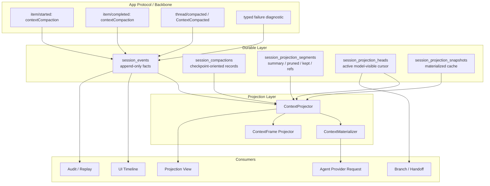

# 上下文压缩系统实践设计

## Design Position

AgentDash 的上下文压缩应从 agent loop 内部的 `Vec<AgentMessage>` 替换，升级为一套面向云端协作的 context checkpoint / projection 基础设施。

本设计的核心判断是：

> 协议层对齐 Codex app protocol；事实层使用 AgentDash 的 PostgreSQL durable event log；模型输入只由 ContextProjector / ContextMaterializer 从 durable facts 和 projection metadata 构建。

这意味着 compact 不是“把 UI 消息数组裁掉一段”，而是：

- 一次可观察的 app protocol lifecycle。
- 一次有 source range、first kept pointer、token stats、strategy、status 的 durable checkpoint。
- 一个新的 model context projection 版本。
- 一个可被前端、审计、resume、branch 和 agent input 分别消费的结构化事实。

## Evidence Baseline

本设计的评估前提不是“把所有实现细节读完”，而是先掌握足够支撑架构判断的关键事实。压缩系统横跨协议、运行时、仓储、投影、前端和参考项目，因此每个结论都必须能回答两个问题：

- 这个判断依赖哪些已经确认的事实？
- 这个判断还缺哪些上下文，因此只能作为方向，不能直接下沉成最终实现细节？

本轮已经足以支撑总体设计的上下文包括：

- 三个参考项目的 compact 基准策略、持久化形态和恢复路径。
- AgentDash 当前 Backbone protocol、Codex Bridge、Pi/native stream mapper 的 compact 事件映射方式。
- AgentDash 当前 `session_events` / `last_event_seq` 的 durable log 基础。
- AgentDash 当前 agent loop 中 `evaluate_compaction -> execute_compaction -> transform_context -> BridgeRequest` 的相对顺序。
- AgentDash 当前 `ProjectedTranscript`、`ProjectionKind`、`MessageRef`、continuation projection 的能力边界。
- AgentDash 当前 `ContextFrame(kind="compaction_summary")` 在前后端的展示链路。

这些信息已经足以判断：压缩应收敛为 Codex-aligned lifecycle + durable checkpoint + projection store，而不是继续强化内存消息数组裁剪。

但以下信息还不足以直接决定最终实现细节：

- 当前 vendored Codex protocol method 名称与 upstream 最新文档之间的差异。
- 前端 generic item renderer 对 `contextCompaction` 的真实支持程度。
- 新 projection store 与现有 `SessionEventStore::append_event()` 的事务合并方式。
- branch / lineage 任务最终 schema 与本任务预留字段的命名对齐。
- provider-visible token estimator 的既有实现与准确性边界。

因此，本文先锁定基础设施形状和模块责任；具体表字段、trait 方法、前端组件和 migration 编号应在 implement 阶段基于这些待补上下文收束。

### Codex

Codex 给出的基准是协议和恢复语义。

- App Server 文档将 manual compact 建模为 `thread/compact/start`，进度通过标准 `turn/*` 与 `item/*` 通知发出。
- `contextCompaction` 是 `ThreadItem` 的一等 item：`{ type: "contextCompaction", id }`。
- 旧的 `thread/compacted` / `ContextCompactedNotification { threadId, turnId }` 已被标注为 deprecated completed marker。
- Core 侧 `CompactedItem { message, replacement_history }` 是 rollout 中的持久化压缩项。
- `replace_compacted_history()` 同时替换运行时 history、启动下一轮 auto compact window，并把 `RolloutItem::Compacted` 持久化。
- resume / fork 的 rollout reconstruction 会反向扫描最新 surviving `replacement_history`，以它作为 base，再 replay 后续 suffix。
- auto compact threshold 默认取 resolved context window 的 90%，并受配置上限约束。

AgentDash 需要吸收的是：**contextCompaction lifecycle + replacement_history/checkpoint + suffix replay**，但不能照搬 Codex 的本地 rollout 文件作为事实源。

### Claude Code

Claude Code 给出的基准是策略分层和 boundary 元数据。

- 结构性 compact 的 `CompactionResult` 固定拼装为 `boundaryMarker + summaryMessages + messagesToKeep + attachments + hookResults`。
- `compact_boundary` 是 transcript 内的系统边界，`getMessagesAfterCompactBoundary()` 以最后一个 boundary 构造 API view。
- partial / session-memory compact 会在 boundary 上写 `preservedSegment(headUuid, anchorUuid, tailUuid)`，resume loader 用它修复 parent chain。
- cached microcompact 不改写本地 message content，只在 API/cache-edit 层生效；time-based microcompact 会把旧 tool result 内容替换为短占位，但它仍不是 full compact checkpoint。
- auto compact threshold 使用 effective context window 减去 autocompact buffer，并有 consecutive failure 熔断。

AgentDash 需要吸收的是：**低损耗 tool result pruning、结构性 summary compact、reactive overflow recovery 应作为同一套 strategy pipeline 的不同策略**；boundary/preserved tail 应进入 projection provenance。

### pi-mono

pi-mono 给出的基准是 session tree projection。

- `CompactionEntry { summary, firstKeptEntryId, tokensBefore, details }` 是 append-only session tree entry。
- `buildSessionContext()` 从当前 leaf 走到 root，找到最新 compaction 后输出 `summary + firstKeptEntryId 之后的 kept entries + compaction 后 suffix`。
- `prepareCompaction()` 从上一次 `firstKeptEntryId` 开始重新纳入摘要范围，使用 token budget 找 cut point，并避免 tool result 作为切点。
- compact 成功后 append compaction entry，再重新 `buildSessionContext()` 安装 agent state。

AgentDash 需要吸收的是：**append-only 结构事件、first kept pointer、branch path projection**，但需要把它数据库化、团队化，并与 Codex protocol 对齐。

### AgentDash Current Baseline

当前项目已经有可继续演进的种子：

- `BackboneEvent` 已经以 Codex app protocol payload 为基准，包含 `ItemStarted`、`ItemCompleted`、`ContextCompacted`。
- 前端生成类型已包含 `ThreadItem` 的 `contextCompaction` union。
- `CodexBridgeConnector` 已经解析 Codex app-server notification，但目前只监听了 `"context/compacted"`，需要与当前 Codex 的 `item/* contextCompaction` 和 legacy `"thread/compacted"` 对齐。
- Pi/native runtime 目前把 `AgentEvent::ContextCompacted` 映射为 `PlatformEvent::SessionMetaUpdate { key: "context_compacted" }`。
- `session_events` 与 `sessions.last_event_seq` 已形成 append-only durable log 基础。
- `ProjectedTranscript`、`ProjectionKind`、`MessageRef` 已存在，但 projection kind 只有 `Transcript` / `CompactionSummary`。
- `ContextFrame(kind="compaction_summary")` 已进入前后端展示链路。
- continuation 目前通过 `context_compacted` platform event payload 推导临时 checkpoint，并把 `[CompactionSummary] + suffix` 拼成 `ProjectedTranscript`。

当前主要差距：

- 压缩发生在 `transform_context` 之前，不能准确覆盖最终 provider-visible payload。
- cut 策略以 `keep_last_n` 消息数为主，`reserve_tokens` 没有真正驱动保留尾部。
- 压缩结果直接替换内存 `context.messages`，没有 durable checkpoint / projection store。
- 空摘要会生成成功占位摘要，导致失败语义污染后续 projection。
- Pi/native 的 compaction 事件仍是 platform meta，不是 Codex-aligned item lifecycle。
- Codex Bridge 当前没有把 `contextCompaction` item lifecycle 作为主要 compact 信号。
- continuation 从平台 payload 反推 checkpoint，不能支撑 branch、rollback、多端同步和团队审计。

## Architecture Overview

目标架构分为五层：

```text
Codex-aligned App Protocol Lifecycle
  -> Compaction Orchestrator
  -> Durable Event Log + Projection Store
  -> ContextProjector
  -> ContextMaterializer / Product Views
```



## Core Design Decisions

### D1. Codex App Protocol 是控制面基准

AgentDash 的 compact lifecycle 应以 Codex app protocol 的 item lifecycle 为主：

- `item/started` with `ThreadItem::contextCompaction`
- `item/completed` with same `contextCompaction.id`
- typed failure diagnostic
- legacy `ContextCompactedNotification` 仅作为 completed marker 或外部运行时兼容信号的输入来源

Backbone 已具备 `ItemStarted` / `ItemCompleted` / `ContextCompacted` 形态，因此设计目标不是发明另一套 compact protocol，而是让所有 connector 将 compact 归一到这套 Backbone event。

Pi/native runtime 的成功 compact 不应只输出 `PlatformEvent::SessionMetaUpdate(key="context_compacted")`。它应该输出 Codex-aligned item lifecycle，并在应用层由 checkpoint / projection metadata 派生 `ContextFrame(kind="compaction_summary")`。

### D2. Durable Log 是事实源

`session_events` 记录真实发生过的事件，包括用户输入、assistant 输出、工具生命周期、ContextFrame、compact lifecycle、failure diagnostic、branch/rollback transition。

压缩不改写真实历史。压缩只提交新的 model context projection。

因此，UI timeline 默认展示事实历史；Context panel 展示模型当前可见 projection；agent input 使用 ContextMaterializer 输出的 provider-specific request。三者共享事实源，但不是同一个数组。

### D3. Checkpoint 与 Projection 分层

Codex 的 `replacement_history` 在 AgentDash 中应拆成两层：

- `session_compactions`：一次 compact 的 checkpoint-oriented record，记录范围、策略、状态、token、summary、first kept pointer、active projection version。
- `session_projection_segments`：ContextProjector 产出的可恢复 segment，记录 summary chunk、pruned message、tool result digest、artifact reference、kept tail 等。

推荐 MVP 使用 `session_compactions` 作为统一表名，不再同时引入 `session_checkpoints`。原因是产品事件叫 compaction，表结构承担 checkpoint 职责；职责可通过字段和 repository trait 表达，避免同一事实被两张表拆散。

### D4. ContextProjector 独立于 UI Timeline

模型输入必须由后端 ContextProjector 从 durable facts 构建，而不是在 UI message array 上就地裁剪。

ContextProjector 产出 AgentDash 内部语义的 projection：

```text
AgentContextEnvelope {
  session_id
  branch_id
  projection_kind
  projection_version
  head_event_seq
  checkpoint_id?
  messages: AgentInputMessage[]
  artifacts: ArtifactRef[]
  token_estimate
}
```

每条 message 必须标明来源：

```text
AgentInputMessage {
  role
  content
  origin: "event" | "projection"
  synthetic: bool
  source_event_seq?
  source_range?
  projection_segment_id?
  provenance?
}
```

这样 `[summary of 1-80] + [81..100]` 与 `[1..80 pruned] + [81..100]` 都能成为合法 projection，并且不会被误认为真实历史。

### D5. ContextMaterializer 负责 provider-specific request

Projection 不是 provider request。ContextMaterializer 负责把 `AgentContextEnvelope` 转成具体 provider 的输入：

- Codex app protocol / Responses shape
- Anthropic messages
- Gemini messages
- Pi/native bridge 当前 `AgentMessage` shape

Pressure evaluation 应以 materialized draft request 为依据，至少覆盖 system prompt、tools、hook steering、ContextFrame 注入和 provider message shape 的 token 估算。

### D6. Runtime Ownership 分为协议归一和上下文归属

所有 runtime 都进入同一套 Backbone protocol lifecycle，但 replacement projection 的 owner 不一定相同。

- Pi/native runtime：AgentDash 拥有 canonical context，成功 compact 必须创建 AgentDash checkpoint / projection。
- Codex Bridge：Codex app-server 拥有其内部 transcript 和 replacement history；AgentDash 持久化 app protocol lifecycle，用于 UI/audit/feed。除非 Codex Bridge 暴露足够 replacement/provenance，否则 AgentDash 不从 `thread/compacted` 的 `{threadId, turnId}` 伪造 checkpoint。
- 未来 relay / external runtime：按 connector 能力声明是否提供 projection payload；提供则归一进 `session_projection_segments`，不提供则只作为 external lifecycle event。

## Storage Design

### Existing Fact Store

现有 `session_events` 已经是正确方向：

```text
session_events {
  session_id
  event_seq
  occurred_at_ms
  committed_at_ms
  session_update_type
  turn_id
  entry_index
  tool_call_id
  notification_json
}
```

后续应保持 event log append-only，并围绕它增加 projection store。`event_seq` 是 compact source range、first kept pointer、projection head 和 suffix replay 的最低稳定坐标。

### `session_compactions`

一次结构性 compact 的 checkpoint record。

```text
session_compactions {
  id
  workspace_id?
  session_id
  branch_id?
  projection_kind
  projection_version

  lifecycle_item_id
  start_event_seq
  completed_event_seq?
  failed_event_seq?
  status

  trigger
  reason
  phase
  strategy
  budget_scope

  base_head_event_seq
  source_start_event_seq
  source_end_event_seq
  first_kept_event_seq

  summary
  replacement_projection_json
  token_stats_json
  diagnostics_json

  created_by
  created_at
  completed_at?
}
```

状态建议：

- `started`
- `projection_committed`
- `failed`
- `superseded`
- `rolled_back`

MVP 可以只查询 `projection_committed` 作为有效 checkpoint。

### `session_projection_segments`

ContextProjector 的可恢复片段。

```text
session_projection_segments {
  id
  workspace_id?
  session_id
  branch_id?
  projection_kind
  projection_version
  sort_order

  segment_type
  origin
  synthetic
  source_start_event_seq?
  source_end_event_seq?
  source_refs_json
  generated_by_compaction_id?

  content_json
  token_estimate
  created_at
}
```

`segment_type` 至少包含：

- `original_event`
- `summary_chunk`
- `kept_tail`
- `pruned_message`
- `tool_result_digest`
- `artifact_reference`
- `system_context`
- `branch_summary`
- `handoff_summary`

MVP 可以先只写 `summary_chunk`、`kept_tail`、`original_event`。第二阶段再接入 `tool_result_digest` / `artifact_reference`。

### `session_projection_heads`

当前模型可见状态的 cursor。

```text
session_projection_heads {
  session_id
  branch_id?
  projection_kind
  projection_version
  head_event_seq
  active_compaction_id?
  updated_by_event_seq
  updated_at
}
```

用途：

- resume 查找当前 model context projection。
- rollback 只移动 active head，不删除历史事件。
- fork 固定 child 的 initial projection。
- audit 可以回答“这次 turn 模型实际看到了哪个 projection”。

### `session_projection_snapshots`

Materialized cache，不是事实源。

```text
session_projection_snapshots {
  id
  session_id
  branch_id?
  projection_kind
  projection_version
  head_event_seq
  materialized_context_json
  token_estimate
  invalidation_key
  created_at
}
```

Snapshot 可重建、可失效；事实源仍是 `session_events + session_compactions + session_projection_segments + session_projection_heads`。

### `session_lineage`

完整 lineage 由 `04-08-session-tree-branching` 承接，但本任务的 schema 需要为 branch-aware checkpoint 留出坐标：

```text
session_lineage {
  child_session_id
  parent_session_id
  relation_kind
  fork_point_event_seq
  fork_point_ref_json
  fork_point_compaction_id?
  status
  created_at
  metadata_json
}
```

推荐 fork 时 materialize child initial projection，使 child session 不依赖 parent 后续 compact / rollback。

## Runtime Flow

### Native / Pi Pre-provider Flow

目标路径：

```text
session_events + projection_head
  -> ContextProjector builds AgentContextEnvelope
  -> runtime refresh tools
  -> transform_context consumes turn-start ContextFrames / hook steering
  -> ContextMaterializer builds draft BridgeRequest
  -> ContextPressurePlanner estimates provider-visible payload
  -> contextCompaction item started
  -> CompactionStrategyPipeline
  -> commit checkpoint + segments + projection head + completed event
  -> ContextFrame projector derives compaction_summary
  -> ContextProjector rebuilds envelope
  -> ContextMaterializer builds final provider request
  -> provider
```

关键事务边界：

- `started` lifecycle 可以先落事件，用于 UI 展示 compact 正在发生。
- `completed` lifecycle、`session_compactions`、`session_projection_segments`、`session_projection_heads` 应作为一次提交单元。
- completed event 不能早于 checkpoint / projection commit。
- summary 为空、provider error、cancel、projection persist failed 时，只提交 failed diagnostic，不安装新的 active projection。

### Manual Compact Flow

Manual compact 应按 Codex 的 `thread/compact/start` 语义建模为独立 turn/task：

```text
user command
  -> turn started
  -> item started: contextCompaction
  -> strategy pipeline
  -> checkpoint commit
  -> item completed: contextCompaction
  -> turn completed
```

如果当前上下文无需压缩，应记录 no-op diagnostic，并保持 projection head 不变。

### Codex Bridge Flow

Codex Bridge 应消费三类 compact 信号：

- `item/started` 中的 `contextCompaction`
- `item/completed` 中的 `contextCompaction`
- legacy `thread/compacted` / `ContextCompactedNotification`

处理原则：

- 所有信号进入 `session_events`，供 feed、audit、ContextFrame 解释。
- `contextCompaction` item lifecycle 是主信号。
- legacy completed marker 只作为完成态补充。
- 如果 payload 不包含 replacement history 或 source range，不创建 AgentDash-owned checkpoint。
- 如果未来 Codex Bridge 可以读到 replacement history，可作为 external projection import 写入 `session_projection_segments`，并标记 owner/provenance。

### Resume Flow

目标 resume 路径：

```text
session_id + branch_id
  -> read session_projection_heads(model_context)
  -> load active session_compactions / projection_segments
  -> replay suffix events after head/source boundary
  -> ContextProjector builds AgentContextEnvelope
  -> ContextMaterializer builds provider request
```

这替代当前从 `PlatformEvent::SessionMetaUpdate(key="context_compacted")` 里抽 summary 和 message count 的临时模式。

### Branch / Fork / Rollback Flow

Branch-aware compact 的基本规则：

- compact 绑定 `session_id + branch_id + base_head_event_seq`。
- 不同 branch 可以有不同 active projection head。
- parent 后续 compact 不改变 child 已 materialized 的 initial projection。
- rollback 通过事件和 `session_projection_heads` 更新当前模型可见状态，不删除 `session_events`。
- 每次 agent turn 应记录使用的 projection kind/version/snapshot，便于审计“模型当时看到了什么”。

## Projection Shapes

ContextProjector 不应只支持“整段摘要成一个 chunk”。它应支持多种 projection plan。

### Tool Result Pruning Shape

当 1-80 轮主要是 tool output 太大时，优先使用逐消息裁剪：

```text
[1 pruned_message: 保留用户意图、assistant 决策、tool name、关键结果 digest、artifact ref]
[2 pruned_message]
...
[80 pruned_message]
[81 original_event]
...
[100 original_event]
```

这类 projection 需要标记：

```text
ProjectionRange {
  source_start_event_seq
  source_end_event_seq
  mode: "pruned_messages"
  transformations: ["tool_result_digest", "artifact_reference"]
  compressed: true
}
```

真实 timeline 仍展示完整工具输出；模型 projection 只看到 digest/reference。

### Rolling Summary Shape

当 token 压力更高时，使用整段摘要：

```text
[summary_chunk: source 1-80]
[81 original_event]
...
[100 original_event]
```

summary chunk 必须包含：

- 用户目标变化。
- 关键决策与约束。
- 已读/已改文件。
- 重要工具结果。
- 当前状态与下一步。
- source range / artifact reference / first kept pointer。

### Mixed Shape

Projection 可以混合：

```text
[summary_chunk: 1-40]
[pruned_message: 41-80]
[original_event: 81-100]
```

这让低损耗压缩和高压摘要可以共享同一套 segment store，而不是重写 agent loop。

## Strategy Pipeline

MVP 策略：

```text
ProviderVisiblePressure
  -> SummaryPrefixCompaction
  -> ProjectionCommit
```

后续策略：

```text
ToolResultPruning
  -> RollingSummary
  -> ReactiveEmergencyCompact
  -> BranchHandoffSummary
  -> ProviderNativeCompaction
```

### SummaryPrefixCompaction

替代当前 `keep_last_n` 主导切分。

职责：

- 使用 token budget 决定 source range 和 retained tail。
- 以 event_seq / MessageRef 记录 source boundary。
- 避免切断 tool call / tool result 因果链。
- 写入 `first_kept_event_seq`。
- 生成 summary segment 和 replacement projection。

`keep_last_n` 可以保留为最低尾部保护参数，但不能作为主预算模型。

### ToolResultPruning

第二阶段优先策略。

职责：

- 大型 tool output 入 artifact store。
- projection 中保留 digest、artifact reference、文件路径、错误码、关键结果。
- 保留原始事件的因果骨架。

### ReactiveEmergencyCompact

provider 真实 context overflow 后触发。

职责：

- 记录 overflow diagnostic。
- 基于失败的 provider-visible request 建立 emergency projection。
- 成功后重试原 turn。
- turn 记录使用过的 projection version。

### BranchHandoffSummary

面向团队协作。

- model context summary 面向模型续跑。
- branch summary 面向树导航。
- handoff summary 面向人类接手。

三者共享 source events，但写入不同 projection kind。

## Module Boundaries

建议边界：

- `agentdash-agent`
  - 保留 agent loop、streaming、tool call、bridge request 编排。
  - 不直接持有 durable checkpoint repository。
  - 从 delegate 接收 already materialized context 或 compaction decision。

- `agentdash-agent-types`
  - 定义 `AgentContextEnvelope`、projection DTO、compaction decision、failure reason。
  - 扩展 `ProjectionKind` 与 `ProjectedEntry` provenance。

- `agentdash-application`
  - 实现 `CompactionOrchestrator`、`ContextPressurePlanner`、`ContextProjector`、ContextFrame 派生。
  - 协调 session event append、checkpoint commit、projection head 更新。

- `agentdash-spi`
  - 定义 `SessionCompactionStore` / `SessionProjectionStore` trait。
  - 保持 `SessionEventStore` 作为事实事件边界。

- `agentdash-infrastructure`
  - PostgreSQL / SQLite migrations。
  - repository transaction 实现。

- `agentdash-agent-protocol`
  - 保持 Codex app protocol aligned Backbone event。
  - 补齐 compact lifecycle 的 TS generation。

- `agentdash-executor`
  - Codex Bridge 映射 `item/* contextCompaction` 与 legacy completed marker。
  - Pi/native stream mapper 输出 Codex-aligned lifecycle。

- `packages/app-web`
  - timeline 消费真实 event stream。
  - context panel 消费 projection view。
  - ContextFrame 展示 compact summary metadata。

## Migration / Landing Plan

项目仍处预研期，可以直接把模型收敛到正确形态；数据库变更仍需要 migration。

### Phase 1. Protocol Alignment

- Codex Bridge 映射 `item/started` / `item/completed` 中的 `contextCompaction`。
- Codex Bridge 同步接入 current legacy `thread/compacted` completed marker。
- Pi/native runtime 输出 Codex-aligned compact item lifecycle。
- 前端把 `contextCompaction` item 作为可见 compact 进度，而不是只静默 `context_compacted`。

### Phase 2. Durable Checkpoint Store

- 新增 `session_compactions`、`session_projection_segments`、`session_projection_heads`。
- 成功 compact 通过应用层 repository 一次性提交 completed event、checkpoint、segments、head。
- 失败 compact 提交 typed diagnostic，保持 active head 不变。

### Phase 3. ContextProjector

- 将 continuation 中的 `build_projected_transcript_from_events` 提升为正式 ContextProjector。
- 从 platform payload 推导 checkpoint 的逻辑切换为读取 `session_compactions`。
- 输出 `AgentContextEnvelope`，并保留 `.into_messages()` 作为 materializer 的一类目标输出。

### Phase 4. Provider-visible Pressure

- 将最终压力评估移动到 `transform_context` 和 draft materialization 之后。
- system prompt、tools、hook steering、ContextFrame、provider message shape 都进入估算。
- `reserve_tokens` 进入 cut / projection 策略。

### Phase 5. Branch-aware Projection

- 引入 branch/head 字段与 projection head。
- fork 时 materialize child initial projection。
- rollback 移动 active projection head。

### Phase 6. Strategy Expansion

- ToolResultPruning。
- ReactiveEmergencyCompact。
- BranchHandoffSummary。
- ProviderNativeCompaction import adapter。

## Failure Semantics

失败类型建议：

- `summary_empty`
- `summary_api_error`
- `cancelled`
- `provider_stream_closed`
- `checkpoint_persist_failed`
- `projection_materialize_failed`
- `compaction_request_too_large`
- `consecutive_failures_exceeded`

规则：

- 成功 checkpoint 只在 summary/projection/persistence 全部成功后创建。
- completed lifecycle 只在 checkpoint commit 后发出。
- 失败可以写 diagnostic event 和 telemetry。
- active projection head 保持原值。
- 自动压缩失败计入熔断窗口。
- ContextFrame 展示真实失败状态或不生成成功 summary。

## Frontend / Product Surface

前端应形成两条清晰视图：

```text
Timeline = real events + compact lifecycle marker
Projection View = current model-visible context segments
```

Timeline：

- 展示完整历史、工具调用、assistant 输出、compact started/completed marker。
- 压缩不折叠真实历史。

Context panel：

- 展示当前 `model_context` projection version。
- 展示 segment 列表、source range、token estimate、strategy、artifact reference。
- 对 `origin="projection"` 的消息明确显示它来自摘要、裁剪或 digest。

ContextFrame：

- 继续作为用户可见解释层。
- `compaction_summary` section 增加 checkpoint id、projection version、strategy、trigger、phase、source range、first kept、tokens before/after。
- ContextFrame 从 checkpoint / segment metadata 派生，不作为恢复事实源。

## Observability

每次 compact 至少记录：

```text
compaction telemetry {
  workspace_id?
  session_id
  branch_id?
  projection_kind
  projection_version
  trigger
  reason
  phase
  strategy
  provider
  model
  status
  source_event_count
  tokens_before
  tokens_after
  summary_tokens
  kept_tail_tokens
  duration_ms
  retry_count
  error_code?
}
```

每次 agent turn 应记录使用的 projection：

```text
turn_context_usage {
  session_id
  turn_id
  branch_id?
  projection_kind
  projection_version
  projection_snapshot_id?
  model
  provider
}
```

这让审计能够回答：模型当时看到了什么、压缩是否改变了后续行为、某个团队成员接手时使用的是哪个上下文版本。

## Design Invariants

- 真实历史只追加，不因 compact 被改写。
- 模型输入只来自 ContextProjector / ContextMaterializer。
- protocol lifecycle 表达发生了什么；checkpoint / projection 表达如何恢复。
- completed lifecycle 晚于 checkpoint commit。
- ContextFrame 是解释层，checkpoint / projection store 是恢复层。
- Snapshot 是缓存，event log + compaction + segment + head 是事实组合。
- Branch / rollback 改变 active projection head，不删除历史。
- Agent input 中的派生内容必须标记 `origin="projection"` 与 `synthetic=true`。

## Validation Plan

设计落地后应覆盖：

- Pi/native 成功 compact 发出 `contextCompaction` item started/completed。
- Codex Bridge 能消费 `item/* contextCompaction` 与 legacy completed marker。
- 空摘要 / cancel / persist failure 不会安装新的 active projection。
- `session_compactions + session_projection_segments + session_projection_heads` 能恢复 `[summary] + suffix`。
- continuation 从 checkpoint store 恢复，不从 platform payload 反推。
- provider-visible pressure 覆盖 transform 后的 draft request。
- tool call / tool result 因果边界不被 cut 破坏。
- 前端 timeline 仍展示真实历史，projection view 显示模型可见 segment。
- rollback 后 active projection head 改变，完整 event log 保留。
- PostgreSQL / SQLite migration 与 repository test 同步通过。

## Context Needed Before Finalizing Detailed Design

以下点需要后续补上下文后再定实现细节：

1. 当前项目实际 vendored `codex_app_server_protocol` 版本与 method mapping。
   - 参考仓库显示 legacy completed marker 是 `thread/compacted`，而当前 `CodexBridgeConnector` 监听的是 `"context/compacted"`。实现前需要确认生成 crate 的真实 ServerNotification method，并决定是否同时支持两个输入名。

2. 前端对 `item_started` / `item_completed` 的通用渲染路径。
   - 已确认生成类型包含 `contextCompaction`，但还需要检查现有 SessionEntry 渲染是否能自然展示该 item，还是需要专门 compact item renderer。

3. `SessionEventStore` 与新 projection store 的事务边界。
   - 当前 `append_event()` 自己开启事务。checkpoint commit 需要 event append + compaction row + segments + head update 一次提交，可能需要新的 application-level repository primitive 或 infrastructure-level transaction API。

4. Branch task 的最终 schema。
   - 本设计已保留 `branch_id`、`session_lineage`、`projection_heads`，但 `04-08-session-tree-branching` 的具体 session/tree/branch 命名与 API 仍需对齐。

5. Provider-visible token estimator。
   - 需要确认现有是否有 provider tokenizer / estimate helper；如果没有，MVP 需要先定义 conservative estimator，但 cut 策略仍以 token budget 而不是 message count 为主。

6. Codex Bridge 是否能拿到 replacement history。
   - 当前 app-server protocol 的 completed notification 只有 `{threadId, turnId}`；如果无法读取 replacement history，Codex Bridge 只作为 external lifecycle/audit event，不创建 AgentDash-owned checkpoint。

7. Projection segment payload 的长期 JSON shape。
   - MVP 可以用 `content_json` 承载内部 DTO；正式实现前需要确定 Rust DTO、TS projection view 和 migration 类型的边界。

8. `session_compactions` 命名是否与未来 branch/checkpoint 体系冲突。
   - 本设计推荐 checkpoint-oriented `session_compactions` 单表；若后续 lineage 设计已经有统一 checkpoint 概念，再决定是否抽象为更通用的 `session_checkpoints`。
