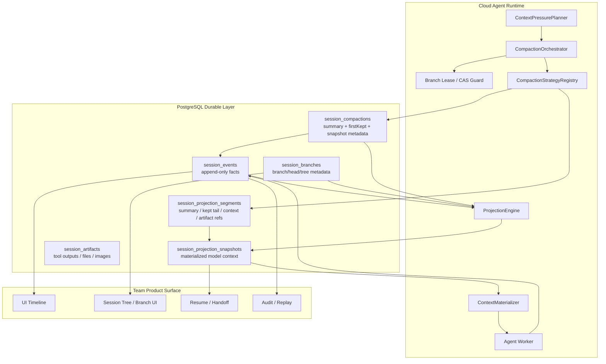
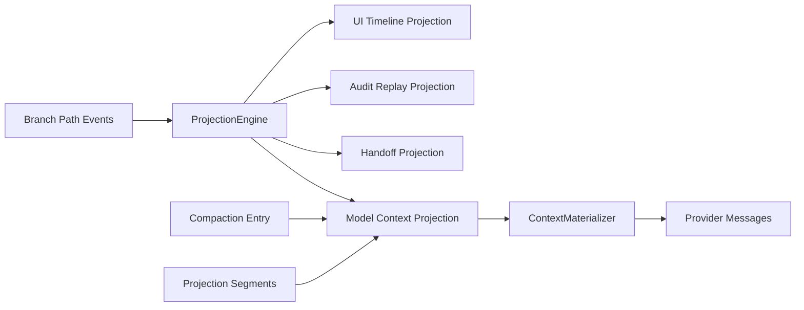
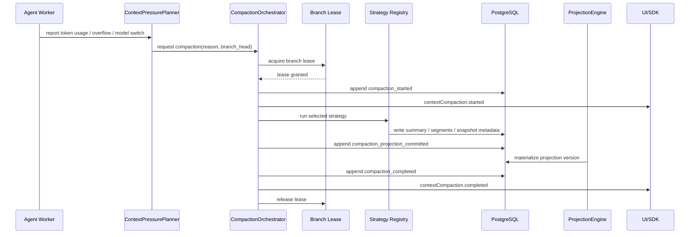
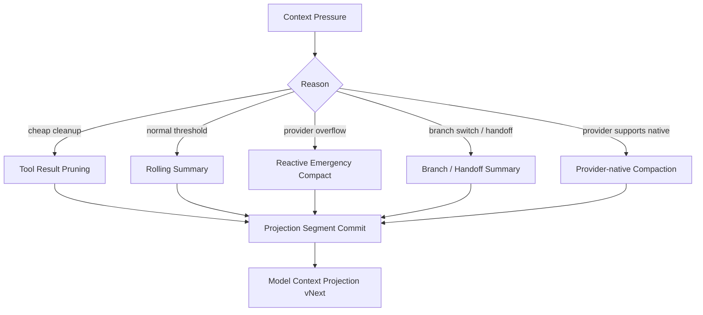

# 上下文压缩基础设施预研

**状态：** 预研讨论记录  
**日期：** 2026-05-25  
**范围：** Codex、Claude Code、pi-mono 的 compact 策略对照，以及 AgentDash 在云端协作场景下的吸收方案

---

## 1. 结论先行

AgentDash 的上下文压缩应当被定义为一套后端基础设施，而不是一个本地客户端命令。

在本地 agent 中，compact 往往表现为“把当前消息数组摘要后替换”。AgentDash 的场景更复杂：

- Agent 运行在云端或云端/本机混合运行时中。
- 会话、分支、执行状态和团队协作状态依赖 PostgreSQL 持久化。
- Session tree、branching、projection、resume、handoff 都是产品能力的一部分。
- 团队协作需要审计、权限、可追溯和可解释的上下文视图。

因此，AgentDash 更适合把 compact 建模为：

> 基于 PostgreSQL append-only session graph 的、多 projection、多 branch、可审计 context compaction 基础设施。

压缩不改变原始历史。压缩改变的是“模型将要看到的上下文投影”。

---

## 2. 三个参考项目的核心逻辑

### 2.1 Codex：运行时与协议内建的 compaction turn

Codex 的 compact 是运行时协议的一等概念。它有 TUI `/compact`、app-server `thread/compact/start`、core `CompactTask` 等入口，并通过 `contextCompaction` item 向 UI 暴露 started/completed 生命周期。

核心特征：

- compact 是独立 turn/task，而不是后台静默状态变更。
- 自动触发基于模型的 `auto_compact_token_limit`。
- pre-turn、mid-turn、manual compact 使用不同上下文注入策略。
- compact 结果持久化为 `CompactedItem { message, replacement_history }`。
- rollout reconstruction 以最新 `replacement_history` 作为恢复基线，只重放后续 suffix。
- local、legacy remote、remote v2 三条实现路径共享同一个运行时语义。

最值得吸收的是两点：

1. **标准生命周期事件。** UI、SDK、远程会话都可以感知 compact 正在发生。
2. **replacement history 一等持久化。** 恢复时可以直接拿到压缩后的 canonical context，而不是重新猜测摘要与尾部消息如何拼接。

### 2.2 Claude Code：多层压缩流水线和恢复细节

Claude Code 的 compact 更像应用层的上下文管理系统。它不仅有 `/compact`，还包含 microcompact、session memory compact、legacy summary compact、reactive compact、post cleanup、SDK status、transcript resume 等一整套配套机制。

核心特征：

- `CompactionResult` 固定为 `boundaryMarker + summaryMessages + messagesToKeep + attachments + hookResults`。
- microcompact 在请求前清理旧 tool result 或通过 cache editing 缩减上下文。
- session memory compact 优先复用已抽取的长期记忆。
- reactive compact 在真实 prompt-too-long/media overflow 后触发恢复。
- partial compact 使用 `preservedSegment(head/anchor/tail)` 修复 resume 时的 parent chain。
- post cleanup 统一复位 microcompact、context collapse、system prompt cache、classifier state、session cache 等状态。

Claude Code 的持久化层更接近“本地 transcript + in-band boundary marker + 加载时重建 API view”：

- 真实 transcript 仍是主要事实源，消息带 uuid、parent 关系和 metadata。
- full compact 写入 `compact_boundary` 系统消息和 compact summary message。
- partial/session-memory compact 如果保留尾部消息，会在 boundary 上写 `preservedSegment`，resume 时修复 parent chain。
- 大 transcript 加载时会找最后的 compact boundary，并跳过边界前内容以降低加载成本。
- 它没有显式的 projection table；projection 由 transcript loader、`getMessagesAfterCompactBoundary()`、microcompact、context analysis 等运行时逻辑共同解释出来。

因此 Claude Code 的简单压缩需要单独看待：

- cached microcompact 不修改本地 message content，不落盘，只在 API 层添加 cache edit/cache reference，属于请求期优化。
- time-based microcompact 会把旧 tool result 内容替换成短占位文本，但它仍不是结构性 compact：没有新的 `compact_boundary`、没有 `replacement_history`、没有 `firstKeptEntryId`，也没有 session tree 结构变化。
- full/partial/session-memory compact 才是会话结构意义上的 compact，它们会产生 boundary、summary、preserved segment 或 post-compact message set。

最值得吸收的是两点：

1. **多层策略管线。** 先做低损耗压缩，再做摘要，最后处理真实超限恢复。
2. **boundary + preserved tail 协议。** 压缩结果必须携带足够元数据，让 resume、partial compact、日志写入和远程状态都能正确恢复。

### 2.3 pi-mono：append-only session tree 上的结构变更

pi-mono 的 compact 与 session tree 结合紧密。它把 compaction 作为 append-only session tree entry，而不是覆盖历史；模型上下文由当前 branch path 投影出来。

核心特征：

- `CompactionEntry` 记录 `summary`、`firstKeptEntryId`、`tokensBefore`、`details`。
- `prepareCompaction()` 找到最新 compaction，把上次 summary 作为 `previousSummary`。
- 多次压缩从上次 `firstKeptEntryId` 开始重新纳入摘要范围。
- `findCutPoint()` 根据 `keepRecentTokens` 从尾部累加 token，并选择合法切点。
- tool result 不作为切点；切到 turn 中间时生成 split-turn prefix summary。
- session context 重建时使用 `summary + firstKeptEntryId 之后的 retained entries + 新消息`。

最值得吸收的是两点：

1. **session tree 友好。** compact 是树上的结构事件，原始历史仍可用于 tree 回看和 branch 导航。
2. **firstKeptEntryId。** 它清楚描述了压缩后尾部上下文从哪里开始，对重复压缩和 branch projection 很有价值。

### 2.4 参考源码上下文索引

以下索引用于保留本轮结论形成时的源码入口。它们不是 AgentDash 的实现依赖，而是帮助后续复核 compact 语义、持久化边界和上下文重建策略。

#### Codex

| 关注点 | 参考入口 | 说明 |
|---|---|---|
| compact 结果结构 | `references/codex/codex-rs/protocol/src/protocol.rs` 的 `CompactedItem` | `message` 是压缩摘要，`replacement_history` 是恢复模型上下文的关键 checkpoint。 |
| 自动压缩阈值 | `references/codex/codex-rs/protocol/src/openai_models.rs` 的 `auto_compact_token_limit()` | 默认以 resolved context window 的 90% 作为 compact 触发上限，并受配置上限约束。 |
| manual / auto compact 入口 | `references/codex/codex-rs/core/src/compact.rs` 的 `run_compact_task()`、`run_inline_auto_compact_task()` | manual compact 是独立 turn；auto compact 可在 pre-turn、mid-turn、model downshift 等阶段触发。 |
| replacement history 生成 | `references/codex/codex-rs/core/src/compact.rs` 的 `build_compacted_history()` | 本地 compact 把最近用户消息和 summary 组合成新的 replacement history。 |
| compact 后替换与持久化 | `references/codex/codex-rs/core/src/session/mod.rs` 的 `replace_compacted_history()` | 内存 history 被替换，同时把 `RolloutItem::Compacted` 写入 rollout。 |
| resume 重建 | `references/codex/codex-rs/core/src/session/rollout_reconstruction.rs` | 反向扫描最新 `replacement_history` 作为基线，再重放后续 rollout suffix。 |
| remote compact 归一化 | `references/codex/codex-rs/core/src/compact_remote.rs`、`compact_remote_v2.rs` | provider / remote endpoint 的 compact 输出最终也会安装成 replacement history。 |

#### Claude Code

| 关注点 | 参考入口 | 说明 |
|---|---|---|
| compact 结果结构 | `references/claude-code/src/services/compact/compact.ts` 的 `CompactionResult` | 结果固定由 `boundaryMarker`、`summaryMessages`、`messagesToKeep`、attachments、hooks 组成。 |
| compact 后消息拼装 | `references/claude-code/src/services/compact/compact.ts` 的 `buildPostCompactMessages()` | 结构性 compact 后的会话数组按 boundary、summary、保留消息、附件、hook 结果排序。 |
| preserved segment | `references/claude-code/src/services/compact/compact.ts` 的 `annotateBoundaryWithPreservedSegment()` | partial / session-memory compact 用 head、anchor、tail 元数据支持 resume 时修链。 |
| boundary 创建与投影切片 | `references/claude-code/src/utils/messages.ts` 的 `createCompactBoundaryMessage()`、`getMessagesAfterCompactBoundary()` | compact boundary 是 transcript 内系统消息；API view 从最后一个 boundary 之后构建。 |
| transcript resume 修链 | `references/claude-code/src/utils/sessionStorage.ts` 的 `applyPreservedSegmentRelinks()` | loader 会根据 preserved segment 修复 parentUuid，并裁去 boundary 前的物理前缀。 |
| microcompact 分层 | `references/claude-code/src/services/compact/microCompact.ts` 的 `microcompactMessages()` | cached microcompact 走 API cache edits；time-based microcompact 会替换旧 tool result 内容。 |
| 自动压缩阈值 | `references/claude-code/src/services/compact/autoCompact.ts` 的 `getAutoCompactThreshold()` | effective context window 预留 summary 输出空间，再扣除 autocompact buffer。 |
| session memory compact | `references/claude-code/src/services/compact/sessionMemoryCompact.ts` | 复用 session memory，计算 `messagesToKeep`，并通过 boundary preserved segment 保留尾部。 |

#### pi-mono

| 关注点 | 参考入口 | 说明 |
|---|---|---|
| session tree entry | `references/pi-mono/packages/coding-agent/src/core/session-manager.ts` 的 `CompactionEntry` | compaction 是 append-only entry，记录 `summary`、`firstKeptEntryId`、`tokensBefore` 和 `details`。 |
| 模型上下文投影 | `references/pi-mono/packages/coding-agent/src/core/session-manager.ts` 的 `buildSessionContext()` | 从当前 branch path 生成模型消息：summary、kept range、compaction 后消息。 |
| compact 触发配置 | `references/pi-mono/packages/coding-agent/src/core/compaction/compaction.ts` 的 `DEFAULT_COMPACTION_SETTINGS`、`shouldCompact()` | 默认保留 recent tokens，同时为 prompt 和输出预留 reserve tokens。 |
| cut point 选择 | `references/pi-mono/packages/coding-agent/src/core/compaction/compaction.ts` 的 `findValidCutPoints()`、`findCutPoint()` | 从尾部累加 token，选择合法切点，避免把 tool result 作为切点。 |
| compaction preparation | `references/pi-mono/packages/coding-agent/src/core/compaction/compaction.ts` 的 `prepareCompaction()` | 读取最新 compaction、确定 `boundaryStart`、`firstKeptEntryId`、summary 范围和 split-turn prefix。 |
| summary 生成 | `references/pi-mono/packages/coding-agent/src/core/compaction/compaction.ts` 的 `compact()` | 生成结构化 summary，split turn 时额外生成 turn prefix summary，并记录文件读写概览。 |
| session 应用 | `references/pi-mono/packages/coding-agent/src/core/agent-session.ts` 的 `compact()`、`_runAutoCompaction()` | 压缩完成后 append compaction entry，再通过 `buildSessionContext()` 重建 agent state。 |

---

## 3. 三者可吸收点对比

| 维度 | Codex | Claude Code | pi-mono | AgentDash 吸收方式 |
|---|---|---|---|---|
| 运行时模型 | compact 是独立 turn/task | compact 是应用层流水线 | compact 是 session tree mutation | 后端 `CompactionTurn` + session graph event |
| UI/协议 | `contextCompaction` item 生命周期 | SDK `compacting` status + boundary message | UI 重建 chat + summary block | 统一 lifecycle event，前端订阅状态 |
| 触发方式 | manual / pre-turn / mid-turn / model downshift | proactive threshold / reactive PTL / manual | overflow / threshold / manual | pressure planner 同时支持 proactive 与 reactive |
| 持久化 | `replacement_history` | transcript boundary + preserved segment + request-time microcompact | `firstKeptEntryId` + append-only entry | 同时保存 replacement snapshot、first kept pointer 与 projection provenance |
| 恢复 | rollout reconstruction 以 replacement history 为基线 | transcript boundary skip + relink | branch path projection | projection engine 按版本重建模型上下文 |
| 策略层 | local / remote / remote v2 | microcompact / memory / summary / reactive | summary + split-turn prefix | strategy registry 分层执行 |
| 协作适配 | 偏单会话运行时 | 偏本地 REPL/transcript | 更接近 tree/branch | 以 PostgreSQL session graph 承载团队协作 |

---

## 4. AgentDash 的背景差异

这三个项目主要面向本地 agent 或本地优先的 session runtime。AgentDash 的基础约束更接近云端协作 IDE：

- **存储介质是 PostgreSQL。** 上下文、分支、事件、执行记录、artifact、权限都需要可查询、可索引、可迁移。
- **会话是团队对象。** 同一个 workspace 下多人查看、接手、复盘、分支和合并。
- **branching 是核心产品语义。** branch 不是临时 UI 状态，而是可持久化、可审计、可恢复的工作路径。
- **projection 是中心能力。** 模型上下文、UI timeline、审计回放、团队 handoff 可以来自同一事件源，但投影形态不同。
- **agent 运行时可迁移。** 云端 worker、本机 backend、未来远程 sandbox 都应从同一个 session projection 恢复。

因此，AgentDash 的 compact 应当服务于 projection，而不是直接修改 message history。

---

## 5. 推荐总体架构



### 5.1 Event Store：事实源

`session_events` 存储不可变事实，而不是当前聊天数组。

典型事件：

- `user_message_created`
- `assistant_message_created`
- `tool_call_started`
- `tool_call_completed`
- `artifact_created`
- `branch_forked`
- `branch_head_moved`
- `compaction_started`
- `compaction_summary_created`
- `compaction_projection_committed`
- `compaction_completed`
- `compaction_failed`

核心字段建议：

```text
session_events {
  id
  workspace_id
  session_id
  branch_id
  turn_id
  parent_event_id
  sequence
  event_type
  actor_type
  actor_id
  visibility
  payload
  created_at
}
```

这里的 `payload` 可以使用 JSONB，但 `workspace_id`、`session_id`、`branch_id`、`turn_id`、`sequence`、`event_type` 应当列化，方便查询和约束。

### 5.2 Branch Graph：团队协作路径

`session_branches` 负责表达 branch 的产品语义。

```text
session_branches {
  id
  workspace_id
  session_id
  parent_branch_id
  base_event_id
  head_event_id
  created_by
  purpose
  status
  created_at
  updated_at
}
```

compact 以 branch path 为边界执行。不同 branch 可以有不同 projection，不同 projection 可以服务不同 agent worker 或团队成员。

### 5.3 Projection Engine：从事实到上下文视图

同一份 session graph 至少需要四类 projection：

| Projection | 用途 | 是否受 compact 影响 |
|---|---|---|
| `model_context_projection` | 模型调用输入 | 是，compact 主要更新它 |
| `ui_timeline_projection` | 前端聊天/事件展示 | 只展示 compact 事件，不折叠原始历史 |
| `audit_replay_projection` | 审计、复盘、问题定位 | 保留完整事实 |
| `handoff_projection` | 团队接手、摘要、状态交接 | 可使用更偏人类可读的摘要 |

compact 的本质是提交一个新的 `model_context_projection` 版本。



### 5.4 Context Materializer：provider-specific 输入构造

Projection 仍然是 AgentDash 内部语义。真正调用模型前，需要由 `ContextMaterializer` 转成 provider-specific input。

Materializer 负责：

- system/developer/context 注入。
- branch summary 注入。
- compaction summary 注入。
- artifact reference 展开或摘要。
- tool result 截断和 digest。
- provider message 格式转换。
- token budget 估算和最终裁剪。

这样 compaction strategy 不需要直接绑定 OpenAI、Anthropic、Gemini 等 provider 的 message shape。

### 5.5 从仓储到消费端的三层数据结构

AgentDash 应当明确区分三类对象：

1. **事实层。** PostgreSQL 中的真实历史，表达实际发生了什么。
2. **投影层。** ContextProjector 产出的派生上下文，表达模型或人类视图应该看到什么。
3. **消费层。** 面向 Agent、前端 timeline、前端 context panel 的不同 DTO。

#### 事实层：真实历史

```text
SessionEvent {
  id
  workspaceId
  sessionId
  branchId
  turnId?
  parentEventId?
  sequence
  type:
    | "user_message"
    | "assistant_message"
    | "tool_call_started"
    | "tool_call_completed"
    | "artifact_created"
    | "branch_forked"
    | "compaction_started"
    | "compaction_completed"
  actorType: "user" | "agent" | "system"
  actorId
  payload
  createdAt
}
```

```text
SessionBranch {
  id
  sessionId
  parentBranchId?
  baseEventId?
  headEventId
  status: "active" | "archived" | "merged"
  createdBy
  purpose?
}
```

```text
Artifact {
  id
  workspaceId
  sessionId
  sourceEventId
  kind: "tool_output" | "file" | "image" | "log" | "diff"
  storageUri
  digest?
  metadata
}
```

前端聊天 timeline 默认读取事实层，所以它能展示完整历史、工具调用、分支、压缩 marker 和 artifact 链接。

#### 投影层：模型上下文视图

```text
ContextProjection {
  id
  workspaceId
  sessionId
  branchId
  kind: "model_context" | "handoff" | "ui_context" | "audit"
  version
  baseHeadEventId
  strategy: "verbatim" | "tool_pruned" | "summary" | "emergency"
  tokenEstimate
  createdAt
}
```

```text
ProjectionSegment {
  id
  projectionId
  order
  kind:
    | "original_event"
    | "summary_chunk"
    | "pruned_message"
    | "tool_result_digest"
    | "artifact_reference"
    | "system_context"
    | "branch_summary"
  sourceStartEventId?
  sourceEndEventId?
  sourceEventIds?
  generatedByCompactionId?
  content
  tokenEstimate
}
```

投影层是派生物。它可以被重新生成、替代、失效或缓存，但不能替代事实层。

#### 面向 Agent 的 DTO

Agent 不直接读取 timeline，而是获取完整的上下文 envelope：

```text
AgentContextEnvelope {
  sessionId
  branchId
  projectionId
  projectionVersion
  headEventId
  messages: AgentInputMessage[]
  artifacts: ArtifactRef[]
  tokenEstimate
}
```

```text
AgentInputMessage {
  role: "system" | "developer" | "user" | "assistant" | "tool"
  content
  origin: "event" | "projection"
  synthetic: boolean
  sourceEventId?
  projectionSegmentId?
  sourceRange?: { startEventId, endEventId }
}
```

`origin` 和 `synthetic` 是关键边界：

- `origin: "event"` 表示真实历史转换来的模型消息。
- `origin: "projection"` 表示摘要、裁剪、digest、artifact reference 等派生内容。
- `synthetic: true` 表示这是模型输入中的派生消息，不是用户或 agent 真正说过的话。

#### 面向前端的 DTO

前端至少需要两个视图。

Timeline 视图读取事实历史：

```text
TimelineItem {
  eventId
  type
  branchId
  turnId?
  actor
  payload
  createdAt
}
```

Context 面板读取投影：

```text
ProjectionView {
  projectionId
  version
  branchId
  segments: ProjectionSegmentView[]
}
```

```text
ProjectionSegmentView {
  id
  kind
  label
  sourceRange?
  tokenEstimate
  preview
  expandable
}
```

这样用户在聊天流里看到真实 1-100 轮；在上下文面板里看到“模型当前看到的是：1-80 工具结果已裁剪 + 81-100 原文”。

---

## 6. Compaction Lifecycle



关键语义：

- compact 必须绑定 `branch_id` 和 `base_head_event_id`。
- 提交 projection 时使用 compare-and-swap，确认 branch head 没有被其它 worker 改写。
- 如果 compact 期间 branch 追加了新事件，可以重试，也可以把新事件作为 suffix 追加进新 projection。
- compact 失败也写入事件，便于 UI、审计和自动恢复判断。

---

## 7. Compaction Strategy Pipeline

AgentDash 可以吸收 Claude Code 的多层思路，但需要适配 PostgreSQL 和云端运行时。



### 7.1 Tool Result Pruning

低损耗策略，优先处理大型 tool result：

- 原始 tool result 进入 `session_artifacts`。
- model projection 中保留短 digest、artifact reference、必要 metadata。
- UI timeline 仍可展示完整工具输出或可点击 artifact。

这种策略通常不应该把整个历史范围合成一个 summary chunk。它更适合保留消息骨架，只替换重内容：

```text
[1 用户消息]
[1 助手消息：保留结论与工具调用意图，工具结果替换为 digest/reference]
[2 用户消息]
[2 助手消息：工具结果替换为 digest/reference]
...
[80 裁剪后的消息骨架]
[81 原始或轻裁剪]
...
[100 原始消息]
```

同时，系统仍然可以给 `1-80` 标记一个 projection range：

```text
ProjectionRange {
  sourceStartTurn: 1
  sourceEndTurn: 80
  strategy: "tool_result_pruning"
  compressed: true
}
```

这里的 “compressed” 表示模型视图已经经过压缩策略处理，不表示真实历史被改写。

### 7.2 Rolling Summary

常规阈值触发时使用：

- 输入范围来自 branch path。
- 上次 compaction 的 `first_kept_event_id` 作为本次摘要边界参考。
- 生成新的 summary segment。
- 保留最近 token budget 内的 tail events。

### 7.3 Reactive Emergency Compact

provider 返回真实 context overflow 后使用：

- 记录 overflow 事件和 provider error。
- 对失败 projection 做紧急压缩。
- 生成新 projection 后重试原 turn。
- turn 记录自己使用过的 projection version，便于复盘。

### 7.4 Branch / Handoff Summary

团队协作下，branch summary 和 model compaction summary 应分开：

- branch summary 面向树导航和团队接手。
- model compaction summary 面向模型续跑。
- handoff summary 面向人类协作，强调当前目标、阻塞点、关键文件、下一步。

### 7.5 Provider-native Compaction

吸收 Codex remote v2 的方向：

- provider 支持原生 compaction output 时，使用 provider-native path。
- 输出仍归一化为 AgentDash 的 `ProjectionSegment` 和 `CompactionEntry`。
- 上层 UI、恢复、审计不依赖具体 provider 的 compact 格式。

### 7.6 逐消息裁剪与整段摘要的选择

对同一段历史，ContextProjector 可以产生两种不同形态的模型上下文。

如果只是裁掉早期工具调用内容，应优先产生逐消息裁剪投影：

```text
[1(剔除工具重内容)]
[2(剔除工具重内容)]
...
[80(剔除工具重内容)]
[81]
...
[100]
```

这种形态保留时间顺序、因果链、用户意图、assistant 决策、工具调用名称、文件路径、错误码和结果摘要。它适合中等 token 压力。

如果 token 压力更高，或 `1-80` 的细节已经不值得逐消息保留，再升级为整段摘要投影：

```text
[Summary of turns 1-80]
[81]
...
[100]
```

这时 summary chunk 应包含：

- 用户目标变化。
- 关键决策。
- 已读/已改文件。
- 工具调用的重要结果。
- 当前状态。
- 下一步。
- 完整历史或 artifact 的 provenance reference。

因此，投影计划可以显式记录每段历史的形态：

```text
ProjectionPlan {
  ranges: [
    {
      source: turns 1-80,
      mode: "pruned_messages",
      transformations: ["tool_result_digest", "artifact_reference"]
    },
    {
      source: turns 81-100,
      mode: "verbatim"
    }
  ]
}
```

当 token 压力继续增大时，只需要把第一段从 `pruned_messages` 升级为 `summary_chunk`，而不需要改写真实历史。

---

## 8. PostgreSQL 存储建议

### 8.1 `session_compactions`

```text
session_compactions {
  id
  workspace_id
  session_id
  branch_id
  base_head_event_id
  trigger
  reason
  phase
  strategy
  status
  source_start_event_id
  source_end_event_id
  first_kept_event_id
  summary_event_id
  projection_version
  tokens_before
  tokens_after
  created_by
  created_at
  completed_at
}
```

### 8.2 `session_projection_segments`

```text
session_projection_segments {
  id
  workspace_id
  session_id
  branch_id
  projection_kind
  projection_version
  segment_type
  source_start_event_id
  source_end_event_id
  source_event_ids
  generated_by_compaction_id
  content
  token_estimate
  sort_order
  created_at
}
```

`segment_type` 可以包括：

- `system_context`
- `developer_context`
- `original_event`
- `summary`
- `summary_chunk`
- `kept_tail`
- `pruned_message`
- `tool_result_digest`
- `artifact_reference`
- `branch_summary`
- `handoff_summary`

### 8.3 `session_projection_snapshots`

```text
session_projection_snapshots {
  id
  workspace_id
  session_id
  branch_id
  projection_kind
  projection_version
  head_event_id
  materialized_context
  token_estimate
  invalidation_key
  created_at
}
```

Snapshot 是缓存，不是事实源。事实源仍然是 `session_events`、`session_compactions`、`session_projection_segments`。

---

## 9. Branching 与 Projection 的处理方式

### 9.1 Branch-local compaction

每次 compact 绑定一个 branch path：

```text
base_branch_path + compaction range + kept tail => model_context_projection
```

这样不同 branch 可以独立压缩。一个 branch 的 compact 不会改变其它 branch 的模型上下文。

### 9.2 Fork 后的继承

新 branch 从某个 event fork 时，可以继承父 branch 当前 projection：

- 如果 fork point 在父 projection 的 kept tail 内，可以复用父 summary segment。
- 如果 fork point 早于父 compaction range，需要生成 branch-specific projection。
- 如果权限、artifact 可见性、workspace policy 变化，materializer 重新过滤。

### 9.3 Merge / Handoff

merge 或 handoff 更适合生成单独 summary：

- `branch_summary` 描述离开某条 branch 时完成了什么。
- `handoff_summary` 描述团队成员接手需要知道什么。
- `model_context_summary` 描述模型续跑需要知道什么。

这三类 summary 共享输入事件，但服务不同投影。

---

## 10. Projection Version 与审计

每一次模型调用都应记录：

```text
agent_turns {
  id
  session_id
  branch_id
  projection_kind
  projection_version
  projection_snapshot_id
  model
  provider
  started_at
}
```

这样可以回答三个重要问题：

- 当时模型看到了什么上下文？
- compact 是否改变了 agent 的后续行为？
- 某个团队成员接手时看到的是哪个 projection？

summary 可以被新 summary 替代，但旧 summary 仍作为历史事件保留。新的 projection 通过更高版本表达当前推荐视图。

---

## 11. UI 与产品体验

前端不直接消费“压缩后的消息数组”，而是消费不同 projection：

- Chat timeline：完整事件流 + compact marker。
- Context panel：当前 model context projection 的 segment 组成。
- Branch tree：branch graph + branch summary。
- Handoff view：handoff projection。
- Audit view：full replay projection。

用户可见的 compact 状态：

- `compaction started`
- `summarizing old context`
- `materializing projection`
- `completed`
- `failed`

对于团队协作，compact marker 应展示：

- 触发原因。
- 压缩范围。
- tokens before/after。
- summary 摘要。
- 可跳转到完整历史。
- 当前 branch / projection version。

---

## 12. 可观测性

参考 Codex 的 analytics 字段，AgentDash 至少记录：

```text
compaction telemetry {
  workspace_id
  session_id
  branch_id
  trigger
  reason
  phase
  strategy
  provider
  model
  status
  source_event_count
  tokens_before
  tokens_after
  summary_tokens
  kept_tail_tokens
  duration_ms
  retry_count
  error_code
}
```

这些字段用于判断：

- 阈值是否过早或过晚。
- 哪类 strategy 成本最低。
- reactive compact 是否频繁发生。
- 哪些 provider-native compaction 路径更可靠。
- 团队协作场景下 handoff projection 是否足够稳定。

---

## 13. 分阶段落地建议

### Phase 1：事件与 projection 基础

- 定义 `session_events`、`session_branches`、`session_projection_snapshots`。
- 每个 agent turn 记录使用的 projection version。
- `ContextMaterializer` 从 projection 构造 provider input。

### Phase 2：基础 compaction

- 实现 `session_compactions` 和 `session_projection_segments`。
- 支持 manual compact 与 threshold compact。
- 生成 summary segment 与 kept tail segment。
- 前端展示 `contextCompaction` 生命周期。

### Phase 3：团队与 branch 语义

- compact 以 branch lease 执行。
- 支持 branch-local projection。
- 支持 branch summary 与 handoff summary。
- 支持 projection diff 和完整历史跳转。

### Phase 4：高级策略

- tool result pruning。
- session memory summary。
- reactive overflow compact。
- provider-native compaction adapter。
- telemetry dashboard。

---

## 14. 最终设计取向

Codex 给 AgentDash 的启发是：compact 应当是运行时协议的一等生命周期。

Claude Code 给 AgentDash 的启发是：真实产品中的 compact 需要多层策略、boundary 元数据、恢复优化和状态清理。

pi-mono 给 AgentDash 的启发是：compact 应当尊重 session tree，用 append-only entry 和 `firstKeptEntryId` 表达结构变更。

AgentDash 的最终落点应当是：

> 用 PostgreSQL session graph 保存完整事实，用 projection engine 管理模型上下文，用 compaction lifecycle 更新投影视图，用 branch-aware storage 支撑团队协作。

这套方案让压缩成为上下文基础设施的一部分，也让 session、branching、resume、handoff、audit 和 provider materialization 获得同一个 durable substrate。
