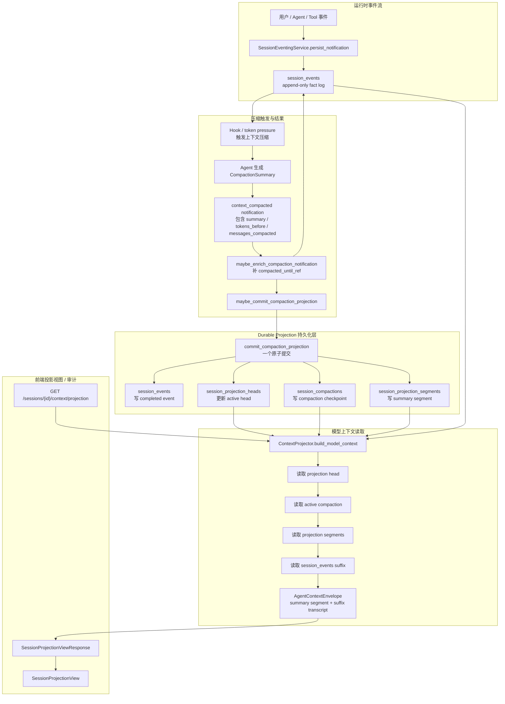
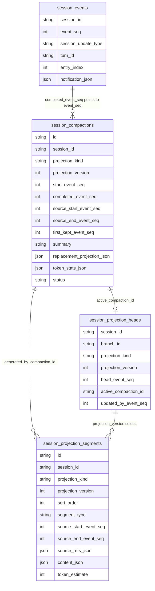
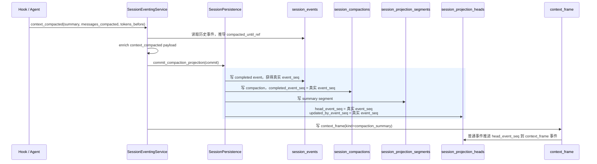
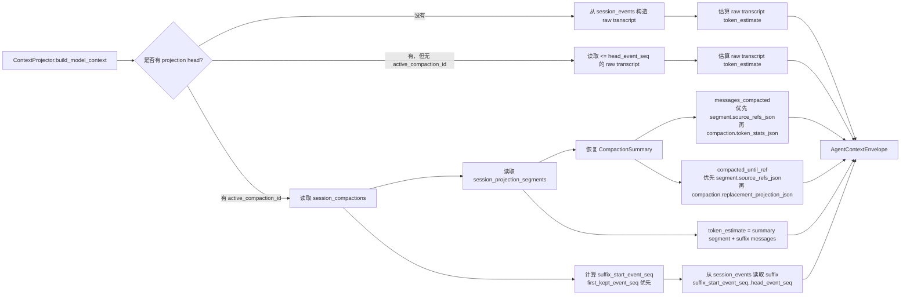
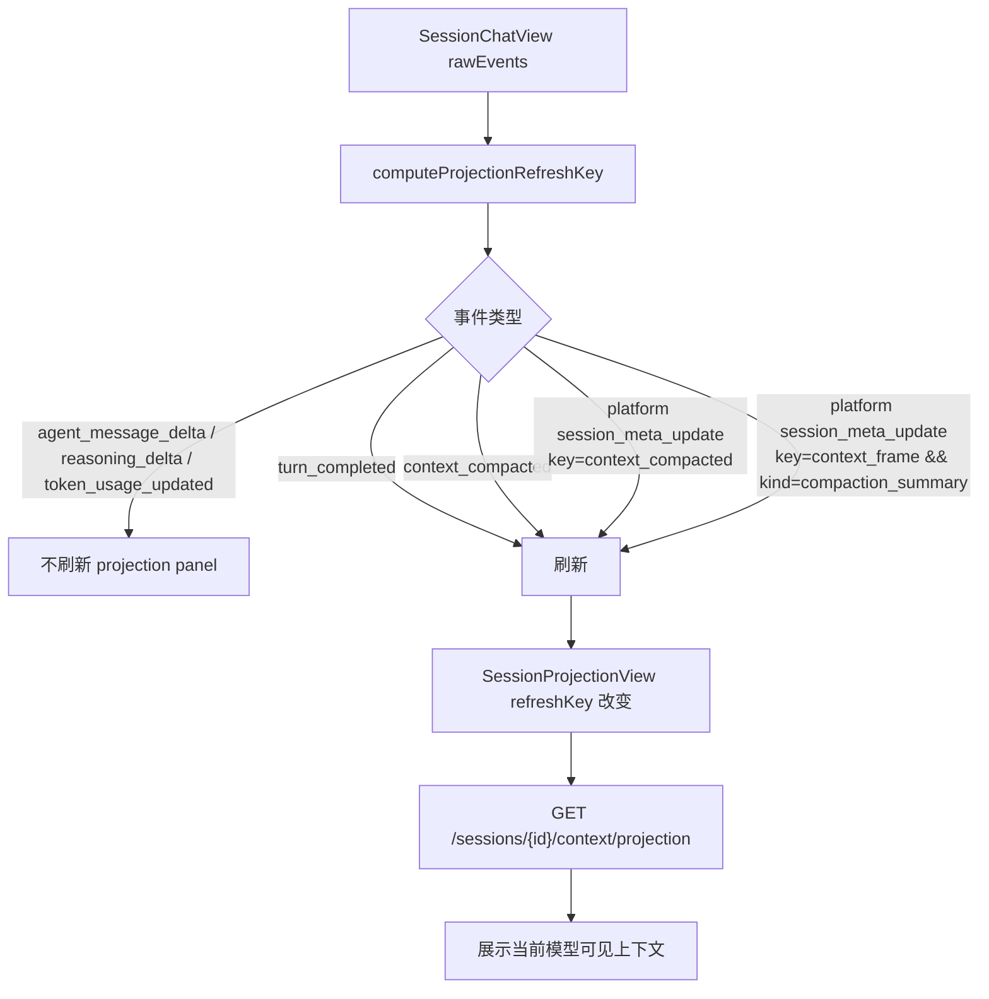
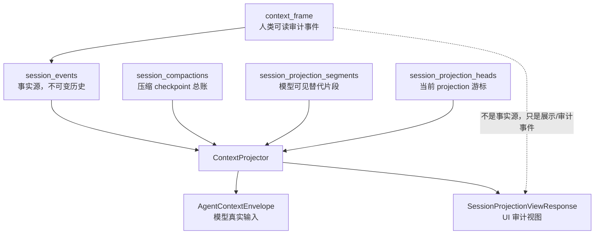
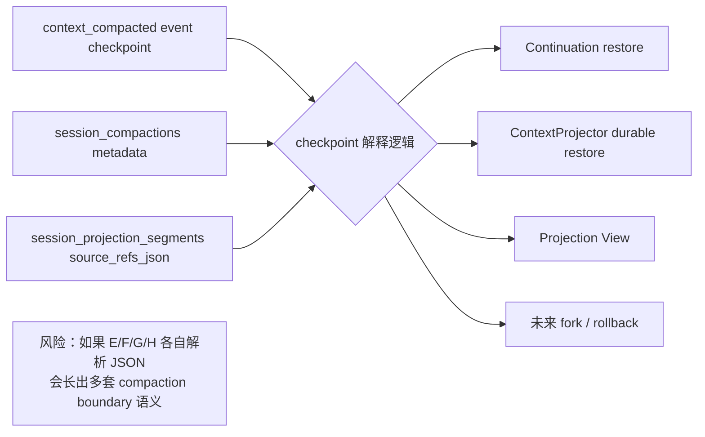

可以，我把它画成“事件事实层 + durable projection 层 + 模型读取层 + UI 审计层”四层来看。当前这套架构的核心思想是：**`session_events` 永远是事实源，compaction 不改历史；压缩结果作为 durable projection 持久化，模型上下文读取时用 projection summary + suffix events 重建当前可见上下文。**

更细一点，持久化表之间现在大概是这个关系：

一次成功压缩的写入时序是这样：

这里有一个容易混淆但很关键的点：
`session_projection_heads.head_event_seq` 不是“生成 summary 的那条事件”，而是**当前 projection + suffix 覆盖到的最后事件**。所以 compaction commit 当下它等于 completed event seq；如果随后又写入 `context_frame`，head 会继续推进，表示模型上下文 suffix 可以覆盖到更靠后的事件。

读取模型上下文时，当前路径是：

前端现在的投影视图刷新也有自己的边界控制：

从职责边界看，当前架构可以压缩成这张 mental model：

我会特别记住三个架构不变量：

1. **事实历史只在 `session_events`**
   压缩不会删除、重写、截断历史事件。它只是提交一个新的 projection checkpoint。

2. **模型上下文不是直接等于事件流**
   有 durable projection 后，模型看到的是：`CompactionSummary segment + suffix transcript`。

3. **边界语义必须来自 checkpoint metadata**
   `messages_compacted` 是消息数，不是 event seq 数；`compacted_until_ref` 是稳定消息引用，不应该靠 event range 临时猜。

当前我最担心的潜在分叉点，也可以直接放在图上看：

所以我的架构建议很明确：下一步如果继续打磨，不是大拆，而是抽一个小的 `CompactionCheckpoint` 解析层，把下面这些规则集中起来：

- `messages_compacted`: segment `source_refs_json` > compaction `token_stats_json` > `0`
- `compacted_until_ref`: segment `source_refs_json` > compaction `replacement_projection_json` > `None`
- `source_range`: segment range > compaction range
- `token_estimate`: projection/fallback summary + suffix transcript

这样 #33 做 fork / rollback 时就不会自己再发明一套“恢复上下文”的逻辑。当前体系的骨架是对的，最需要防的是这些边界规则散落在 continuation、projector、UI view、lineage API 里慢慢分叉。
