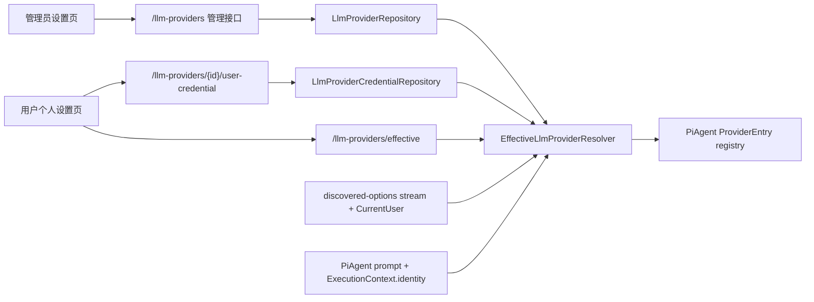

# BYOK 与设置页信息架构重构技术设计

## Architecture Summary

现有 LLM Provider 是系统级 catalog + 系统级 credential 的合体。本设计把它拆成三层事实：

1. **Provider Catalog**：管理员维护的全局 Provider metadata、模型列表、策略和排序。
2. **Credential Ownership**：全局凭据与用户 BYOK 凭据分别存储、分别授权。
3. **Effective Provider Runtime**：按当前 `AuthIdentity` 和 Provider 凭据策略解析出的运行态 Provider 列表。

设置页同步拆成 shell + feature panel。页面壳只决定当前面板、权限和 Project/desktop 状态；具体业务表单进入对应 feature 模块。



## Data Model

### Provider Catalog

`agentdash-domain::llm_provider::LlmProvider` 增加：

```rust
#[derive(Debug, Clone, Copy, PartialEq, Eq, Serialize, Deserialize)]
#[serde(rename_all = "snake_case")]
pub enum LlmCredentialMode {
    GlobalOnly,
    GlobalOrUser,
    UserRequired,
}

pub struct LlmProvider {
    pub credential_mode: LlmCredentialMode,
    pub global_api_key_ciphertext: String,
    // existing metadata fields stay in the catalog
}
```

`api_key` 不再作为领域实体的明文字段出现。运行态只消费 resolver 产出的 `ResolvedLlmProvider`：

```rust
pub enum LlmCredentialSource {
    GlobalDb,
    GlobalEnv,
    UserByok,
    None,
}

pub struct ResolvedLlmProvider {
    pub provider: LlmProvider,
    pub api_key: String,
    pub credential_source: LlmCredentialSource,
}
```

### User Credentials

新增领域实体与 repository：

```rust
pub struct LlmProviderUserCredential {
    pub id: Uuid,
    pub provider_id: Uuid,
    pub user_id: String,
    pub api_key_ciphertext: String,
    pub created_at: DateTime<Utc>,
    pub updated_at: DateTime<Utc>,
}

#[async_trait]
pub trait LlmProviderCredentialRepository: Send + Sync {
    async fn get_for_user_provider(
        &self,
        user_id: &str,
        provider_id: Uuid,
    ) -> Result<Option<LlmProviderUserCredential>, DomainError>;
    async fn list_for_user(&self, user_id: &str) -> Result<Vec<LlmProviderUserCredential>, DomainError>;
    async fn upsert_for_user_provider(&self, credential: &LlmProviderUserCredential) -> Result<(), DomainError>;
    async fn delete_for_user_provider(&self, user_id: &str, provider_id: Uuid) -> Result<bool, DomainError>;
}
```

### PostgreSQL Migration

新增 `0065_llm_provider_byok.sql`，建议结构：

```sql
ALTER TABLE llm_providers
    ADD COLUMN IF NOT EXISTS credential_mode TEXT NOT NULL DEFAULT 'global_only',
    ADD COLUMN IF NOT EXISTS global_api_key_ciphertext TEXT NOT NULL DEFAULT '';

CREATE TABLE IF NOT EXISTS llm_provider_user_credentials (
    id TEXT PRIMARY KEY,
    provider_id TEXT NOT NULL REFERENCES llm_providers(id) ON DELETE CASCADE,
    user_id TEXT NOT NULL,
    api_key_ciphertext TEXT NOT NULL,
    created_at TEXT NOT NULL DEFAULT CURRENT_TIMESTAMP,
    updated_at TEXT NOT NULL DEFAULT CURRENT_TIMESTAMP,
    UNIQUE(provider_id, user_id)
);

CREATE INDEX IF NOT EXISTS idx_llm_provider_user_credentials_user
    ON llm_provider_user_credentials(user_id);
```

迁移完成后 repository 主线只读写 `global_api_key_ciphertext` 和 `llm_provider_user_credentials.api_key_ciphertext`。旧 `api_key` 不进入运行态；开发环境中的旧 DB-backed Key 由管理员重新保存或改用 `env_api_key`，让新密钥模型从第一版 BYOK 起具备一致语义。

## Secret Storage

新增 infrastructure 级 `SecretCipher`：

- 使用服务器管理的 32-byte master key。部署可以通过 `AGENTDASH_SECRET_KEY` 显式指定；未指定时服务端在 AgentDash 数据根下创建并复用本地 master key 文件。
- DB-backed global key 与 user BYOK key 保存前加密，读取后只在 resolver 内解密成运行态字符串。
- 如果显式配置的 master key 或本地 master key 文件格式无效，服务端启动或 API 读写返回明确配置错误。
- API response 只返回：
  - `global_api_key_configured: bool`
  - `user_api_key_configured: bool`
  - `effective_api_key_source: "global_db" | "global_env" | "user_byok" | "none"`
  - `api_key_preview: string | null`

`env_api_key` 不进入 DB 加密流程，它是管理员声明的运行期环境变量名。

## Effective Provider Resolver

新增 resolver 放在 `agentdash-executor` 可消费的边界内，避免 executor 反向依赖 application。推荐放在 domain value object + executor helper 组合：

- domain 定义 `LlmCredentialMode`、credential entity、repository trait。
- infrastructure 实现 repository 和 secret encryption。
- executor 的 provider registry 接收 `LlmProviderRepository`、`LlmProviderCredentialRepository`、`SecretCipher` port 或 decrypt helper，构建 `ResolvedLlmProvider`。

解析规则：

| credential_mode | 当前用户有 BYOK | 全局 DB Key / env | 结果 |
| --- | --- | --- | --- |
| `global_only` | 忽略 | 有 | 使用全局 |
| `global_only` | 忽略 | 无 | 不可执行 |
| `global_or_user` | 有 | 任意 | 使用用户 BYOK |
| `global_or_user` | 无 | 有 | 使用全局 |
| `global_or_user` | 无 | 无 | 不可执行 |
| `user_required` | 有 | 任意 | 使用用户 BYOK |
| `user_required` | 无 | 任意 | 不可执行 |

OpenAI-compatible 本地无 Key endpoint 保持由 Provider protocol/base_url 规则决定是否可执行，但 resolver 仍要产出 `credential_source = none`，方便 UI 解释状态。

## Connector Discovery Identity

当前 `AgentConnector::discover_options_stream(executor, working_dir)` 无身份参数。BYOK 需要让 discovery 与 prompt 使用同一用户上下文，因此调整 SPI：

```rust
pub struct DiscoveryContext {
    pub working_dir: Option<PathBuf>,
    pub identity: Option<AuthIdentity>,
}

async fn discover_options_stream(
    &self,
    executor: &str,
    context: DiscoveryContext,
) -> Result<BoxStream<'static, json_patch::Patch>, ConnectorError>;
```

更新点：

- `routes/discovered_options.rs` 增加 `CurrentUser` extractor，传入 `DiscoveryContext.identity`。
- `CompositeConnector` 转发完整 context。
- `PiAgentConnector` 在 discovery 中调用 `load_provider_runtime_state(identity.as_ref())`。
- Codex bridge、relay connector、测试 fake connector 忽略 identity，只读取 `working_dir`。
- prompt 路径已通过 `ExecutionContext.session.identity` 获得身份，改为同样调用 `load_provider_runtime_state(context.session.identity.as_ref())`。

## API Design

### Admin Provider API

现有 `/llm-providers` 继续表达全局 catalog 管理，但 DTO 进入 `agentdash-contracts::llm_provider`：

- `LlmProviderAdminDto`
- `CreateLlmProviderRequest`
- `UpdateLlmProviderRequest`
- `ReorderLlmProvidersRequest`
- `ProbeLlmProviderModelsRequest`

响应新增：

- `credential_mode`
- `global_api_key_configured`
- `global_api_key_preview`
- `effective_api_key_source`（管理员视角可预览全局解析）

### User BYOK API

新增 authenticated routes：

- `GET /llm-providers/effective`
  - 返回当前用户视角的 Provider catalog、credential policy、用户 key 状态、effective source、是否 executable。
- `PUT /llm-providers/{id}/user-credential`
  - body: `{ "api_key": "..." }`
  - 仅在 `global_or_user` / `user_required` 下允许。
- `DELETE /llm-providers/{id}/user-credential`
  - 删除当前用户自己的 BYOK。
- `POST /llm-providers/{id}/probe-models`
  - 使用 body 中临时 key 或当前用户已保存 key。
  - 普通用户不能让该接口使用 global DB/env key。

现有 admin `probe-models` 可以保留给管理员编辑 Provider 表单；普通用户 probe 走 provider-scoped route。

## Frontend Information Architecture

目标目录：

```text
packages/app-web/src/
  pages/
    SettingsPage.tsx                 # shell only
  features/settings/
    model/settingsPanels.ts
    ui/SettingsShell.tsx
    ui/SettingsPanelNav.tsx
    ui/SettingsNotice.tsx
  features/llm-providers/
    model/types.ts
    model/adminStore.ts
    model/byokStore.ts
    model/modelConfig.ts
    ui/AdminProviderPanel.tsx
    ui/UserByokPanel.tsx
    ui/ProviderRow.tsx
    ui/ProviderCredentialForm.tsx
    ui/ModelManagementSection.tsx
    ui/ModelEditRows.tsx
  features/backend-settings/
    ui/BackendManagementPanel.tsx
  features/agent-settings/
    ui/PiAgentSettingsPanel.tsx
    ui/DefaultExecutorPanel.tsx
```

`SettingsPage.tsx` 只保留：

- 当前用户和权限判断。
- 当前 Project 读取。
- desktop local runtime 是否可用判断。
- panel navigation state。
- 面板装配。

面板拆分：

| 面板 | 可见性 | 内容 |
| --- | --- | --- |
| 平台配置 | 管理员 / personal | Backend 管理、全局 LLM Provider、Pi Agent 系统配置、系统默认 Executor |
| 个人设置 | 所有用户 | BYOK Provider Key、个人默认模型偏好、DebugPrefs |
| 项目设置 | 选中 Project 时 | 跳转当前 Project settings |
| 本机运行时 | desktop 环境 | `LocalRuntimeView` |

UI 规则：

- 使用 `@agentdash/ui` 的 `Button`、`Card`、`Field`、`TextInput`、`Select`、`Notice`、`Badge`、`ConfirmDialog` 等 primitive。
- Provider row、credential form、model chips 不互相嵌套卡片；行项可用描边容器，面板只提供一层 surface。
- 图标按钮保留 tooltip/`title`，避免用长文字挤压紧凑表单。
- 模型 chip 的字面色收敛到语义 token 或局部 primitive，减少当前 `blue/emerald/red` 业务色散落。

## Cross-Layer Contracts

新增 `crates/agentdash-contracts/src/llm_provider.rs`，导出生成到：

```text
packages/app-web/src/generated/llm-provider-contracts.ts
```

前端 API 层从 generated type 接收 wire DTO，service mapper 只做 `unknown -> generated type` 基础验证和 UI view model 归一化，不重声明 enum 字符串联合。

## Error Handling

- 用户对 `global_only` Provider 写 BYOK 返回 403，错误消息说明该 Provider 由平台统一管理。
- 用户执行引用 `user_required` Provider 但未配置 Key 时，connector 返回 `InvalidConfig`，消息指向个人 BYOK 设置。
- master key 无法解析或密文无法解密时返回配置错误；不把 Key 写入明文列。
- 解密失败视为配置损坏：Provider 不进入 effective executable 列表，管理员接口显示需要重新保存 Key。

## Validation Strategy

后端：

- `LlmCredentialMode` serde roundtrip 与 resolver matrix 单元测试。
- `PostgresLlmProviderRepository` / `PostgresLlmProviderCredentialRepository` migration integration 测试。
- API route auth 测试：非管理员无法写全局 Provider；用户只能写自己的 credential；普通用户 probe 不使用 global key。
- PiAgent connector 测试：discovery/prompt 分别覆盖 `global_only`、`global_or_user`、`user_required`。
- Composite/Codex/Relay connector discovery signature 编译与最小测试更新。

前端：

- BYOK store mapper 测试：generated DTO 到 view model，credential source/status 显示正确。
- Settings shell 渲染测试：管理员、普通用户、desktop availability、无 Project。
- ModelManagementSection 提取后保留现有模型 override/block 行为测试。
- 类型、lint、contracts check。

## Operational Notes

- 由于项目处于预研阶段，schema 直接收敛到新的密钥模型；不保留旧明文字段作为运行时兼容路径。
- Rust 后端更新后调试需重启 `pnpm dev` 启动的 Rust binary。
