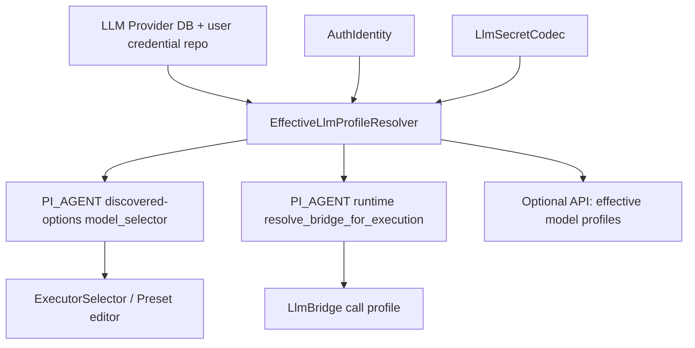

# Design

## Architecture

新增后端 effective model profile resolver，作为 PI_AGENT LLM Provider 可用性与模型调用 profile 的唯一事实源。

建议归属：

- `agentdash-executor::connectors::pi_agent::bridges::provider_registry` 保留协议桥、模型探测和 provider entry 构建能力。
- 在同一模块或相邻模块新增 profile resolver 类型，避免把运行态 bridge 细节泄漏到 API 层。
- `agentdash-contracts::llm_provider` 新增面向前端和 discovered-options 的 profile DTO。
- `agentdash-api::routes::discovered_options` 仍调用 connector discovery；PI_AGENT connector 内部改为返回 profile resolver 的 model selector。
- `PiAgentConnector::prompt` / `resolve_bridge_for_execution` 使用 profile resolver 的结果进行 provider/model/profile 校验。

核心原则：前端只消费后端已经确认的 profile，不再自行合并 `/llm-providers/effective` 与 discovery 结果。

## Proposed Domain Types

后端内部类型建议：

```rust
pub struct EffectiveLlmProfileCatalog {
    pub providers: Vec<EffectiveLlmProviderProfile>,
}

pub struct EffectiveLlmProviderProfile {
    pub provider_id: String,
    pub provider_name: String,
    pub enabled: bool,
    pub executable: bool,
    pub credential_mode: LlmCredentialMode,
    pub credential_source: LlmCredentialSource,
    pub unavailable_reason: Option<EffectiveLlmUnavailableReason>,
    pub call_profile: Option<LlmCallProfile>,
    pub models: Vec<EffectiveLlmModelProfile>,
    pub default_model: Option<String>,
    pub discovery_status: ModelDiscoveryStatus,
}

pub struct LlmCallProfile {
    pub provider_id: String,
    pub protocol: WireProtocol,
    pub resolved_wire_api: Option<ResolvedOpenAiWireApi>,
    pub base_url: Option<String>,
    pub discovery_url: Option<String>,
    pub credential_source: LlmCredentialSource,
}

pub struct EffectiveLlmModelProfile {
    pub id: String,
    pub name: String,
    pub provider_id: String,
    pub reasoning: bool,
    pub supports_image: bool,
    pub context_window: u64,
    pub blocked: bool,
    pub source: ModelProfileSource,
}
```

`EffectiveLlmUnavailableReason` 使用枚举表达，不用散落字符串判断。API DTO 可以序列化为 snake_case enum + message。

`ModelDiscoveryStatus` 至少表达：

- `not_supported`
- `skipped_no_credential`
- `ok`
- `failed`

## Data Flow



## Resolver Responsibilities

1. Load enabled providers in sort order.
2. For each provider, resolve effective credential by `credential_mode` and `AuthIdentity`.
3. Resolve OpenAI-compatible `wire_api` from config + base_url.
4. Parse configured models and blocked models once.
5. Run supported dynamic model discovery only when provider is executable and protocol supports it.
6. Merge model sources:
   - dynamic discovered models are base facts.
   - configured models override matching dynamic model attributes.
   - configured-only models are included as `source=configured`.
   - default_model is included if absent as `source=default`.
   - blocked flag is applied from provider blocked_models.
7. Produce call profile for executable providers.
8. Produce explicit unavailable/discovery status for non-executable or partially failed providers.

## Runtime Validation

`resolve_bridge_for_execution` should no longer search raw `ProviderEntry` only.

Expected behavior:

- Missing provider_id and model_id: use first executable provider default profile.
- provider_id present:
  - if provider unavailable: return unavailable reason.
  - if model_id absent: use provider default model if valid and not blocked.
  - if model_id unknown: return unknown model error.
  - if model_id blocked: return blocked model error.
  - otherwise create bridge from provider call profile.
- provider_id absent, model_id present:
  - find exactly one executable provider with unblocked model.
  - if multiple providers expose same model ID, return ambiguity error and require provider_id.
  - if none, return unknown model error.

## Frontend Contract

前端 `ModelInfo` 可以继续作为 UI view model，但 wire DTO 应由 `agentdash-contracts` 生成。

建议 DTO：

```rust
pub struct EffectiveLlmModelSelectorDto {
    pub providers: Vec<EffectiveLlmModelProviderDto>,
    pub models: Vec<EffectiveLlmModelProfileDto>,
    pub default_model: Option<String>,
}
```

如果只通过 discovered-options 输出，也应让 connector 输出同等字段；可后续把 DTO 独立 API 化。

前端改动：

- 删除 `useEffectiveLlmModelSelector` 或改为只消费后端 profile endpoint，不再调用 `/llm-providers/effective` 拼模型。
- `SessionChatView` 恢复直接消费 `discovered.options.model_selector`。
- `PresetFormFields` 恢复直接消费 `discovered.options.model_selector`。
- `ExecutorSelector` 仅过滤 `blocked` 用于展示，但 runtime 仍作为最终校验。

## Settings Page

设置页仍允许管理员/用户临时 probe provider 模型，原因是编辑表单需要即时验证草稿 key/base_url。

限制：

- 临时 probe 结果不进入“当前用户可调用模型列表”事实源。
- 保存 provider 或 BYOK 后，通过 discovered-options/profile refresh 展示真实生效结果。
- 若要展示 profile 状态，读取后端 profile resolver 输出，而不是重算。

## Migration

默认不需要数据库迁移。profile 可请求期解析，动态 discovery 可沿用现有 in-memory cache。

若实现时发现动态 discovery 对性能影响明显，再单独设计 profile cache 与迁移；本任务优先修正确性。

## Rollback Considerations

- 当前已提交的前端 `useEffectiveLlmModelSelector` 路线应在实现中删除或替换。
- 保留上一轮提交中“不可用 Provider 原因”的后端结构可以复用，但应被新的 profile resolver 吸收，避免新增第二套 unavailable reason。
- 未提交的半成品前端补丁不要继续扩展，应在实现第一步清理。
