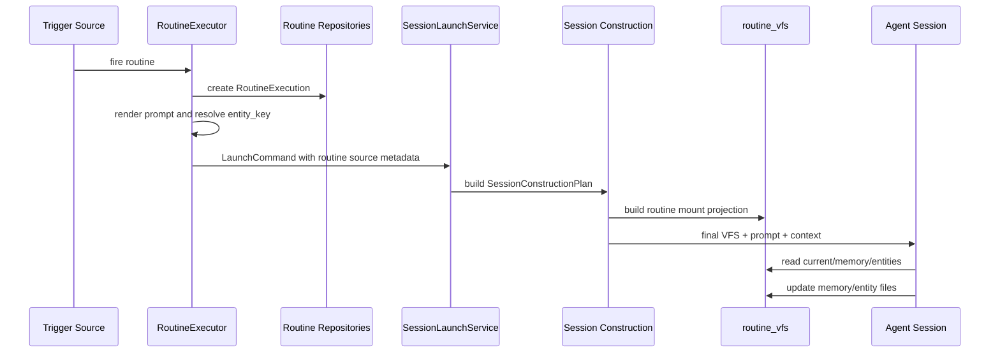

# Routine mount 与跨轮次上下文设计

## Summary

Routine mount 是 Routine 触发 Session 时自动注入的 Agent-facing VFS 投影。它承载当前触发事实、Routine 级长期 memory、per-entity memory 与后续执行摘要入口，让 Routine 能跨多次触发延续上下文。

设计目标是把 Routine 的长期上下文从 prompt template 和 session history 中分离出来，形成稳定、可审计、可被 Agent 读写的资源空间。

## Architecture Boundary

### Domain

Routine 领域继续保持自动化规则与执行审计的边界：

- `Routine` 表达触发规则、Project Agent 绑定、prompt template 与 session strategy。
- `RoutineExecution` 表达一次触发的 dispatch 审计。
- 新增 Routine memory 时，领域层只暴露必要聚合或 repository trait，不在 `RoutineExecution` 内承载长期 memory。

### Application

Application 层负责：

- 根据 `routine_id`、`execution_id`、`entity_key` 构建 Routine mount。
- 在 Session construction 阶段把 Routine mount 合并进 final VFS。
- 提供 `routine_vfs` provider，投影 Routine memory 与当前 execution facts。
- 调用 embedded skill / SkillAsset projection 机制，让 Routine 信息管理 skill 能被 Session 发现。

### API

API 层在 MVP 中不需要新增专用 Routine memory CRUD。Routine memory 浏览/编辑应复用通用 VFS Browser 与既有 VFS 访问协议；Routine 页面后续只需要增加一个打开当前 Routine mount 的入口。

### Infrastructure

持久化优先复用已有 inline/context file 模型。如果现有模型无法表达 Routine owner，应新增最小表：

```text
routine_context_files
  id
  routine_id
  entity_key nullable
  path
  content
  created_at
  updated_at
```

唯一键建议为 `(routine_id, entity_key, path)`。`entity_key = null` 表示 Routine 级 memory，非空表示 per-entity memory。

## Mount Contract

建议新增 provider：

```text
provider = "routine_vfs"
mount id = "routine"
root_ref = "routine://routine/{routine_id}"
```

mount metadata：

```json
{
  "routine_id": "...",
  "execution_id": "...",
  "trigger_source": "webhook",
  "entity_key": "PR-123",
  "directory_hint": []
}
```

Capabilities：

- `Read`
- `List`
- `Search`
- `Write`，路径级限制由 provider 执行

初版目录：

```text
current/
  trigger.json
  execution.json
  resolved-prompt.md
memory/
  brief.md
  facts.md
  decisions.md
  open-items.md
  changelog.md
entities/
  {entity_key}/
    brief.md
    facts.md
    open-items.md
    last-run.md
```

后续目录：

```text
executions/
  {execution_id}/
    trigger.json
    resolved-prompt.md
    result.md
    error.md
skills/
  routine-memory/
    SKILL.md
    references/
```

`current/*` 是当前触发投影，来源于 `RoutineExecution` 与 trigger payload。`memory/*` 是 Routine 级长期 memory。`entities/{entity_key}/*` 是 entity-scoped memory。

## Write Policy

MVP 推荐路径级写入：

- 允许写入 `memory/*.md`
- 允许写入当前 `entities/{entity_key}/*.md`
- 允许写入 `entities/{entity_key}/last-run.md`
- `current/*` 作为触发事实投影，保持只读
- 非当前 `entities/{other_key}/*` 不在当前 Routine Session 中开放写入
- `executions/*` 在 MVP 中只作为后续只读投影预留，不开放 Agent 直接写入

这样 Agent 可以维护长期记忆，同时触发事实仍由后端事实源提供。

## Session Integration

Routine 当前通过 `RoutineExecutor` 构造 `LaunchCommand::routine_executor_input(...)` 并调用 `SessionLaunchService`。根据 Session startup 契约，`LaunchCommand` 只表达来源意图，最终 VFS 应在 Construction 阶段产出。

建议步骤：

1. 扩展 Routine source metadata，让 `LaunchCommand` 或其 source contract 携带 `routine_id`、`execution_id`、`trigger_source`、`entity_key`。
2. 在 Session construction provider 中识别 Routine source。
3. 构建 `routine` mount 并合并到 final VFS。
4. 让 `CapabilityState.vfs.active` 与 `SessionConstructionPlan.surface.vfs` 保持一致。
5. Skill baseline 从 final VFS 与 Routine source 派生，保证 Routine 信息管理 skill 默认对 connector 侧可见。

RoutineExecutor 仍负责：

- 创建 execution
- 渲染 prompt
- 解析 session id
- 设置 system routine identity
- 调用 launch service

RoutineExecutor 不负责直接组装最终 VFS。

## Skill Strategy

新增 embedded skill bundle：

```text
routine-memory
  SKILL.md
  references/memory-model.md
```

该 skill 说明：

- 如何读取 `routine://memory/brief.md`
- 如何在 per-entity 触发中读取与更新 `routine://entities/{entity_key}/...`
- 如何归纳事实、决策、待办和失败恢复点
- 如何把 transient trigger payload 转为长期 memory
- 如何在运行结束时维护 `last-run.md` 与 `open-items.md`

Routine 信息管理 skill 默认注入所有 Routine Session。默认注入表达的是“Routine Session 总是具备这套信息管理协议”，不表达“Agent 每轮必须读写 Routine memory”；是否使用由当前 prompt、skill 内容和 Agent 对任务需要的判断决定。

实现上复用 embedded skill bundle / project SkillAsset projection。Routine mount provider 可以通过 metadata 暴露关联 skill key，但 skill 文件内容由统一 skill asset provider 管理。

## Data Flow



## Trade-offs

### Routine memory vs Session history

Routine memory 只保存提炼后的长期工作记忆，Session history 继续保存对话事件。这样 Routine 可以跨 session strategy 保持稳定上下文，并避免依赖单个 Session 是否仍存在。

### File memory vs Structured memory

MVP 采用 markdown/json 文件化 memory。原因是 Agent 可以直接读写，VFS provider 容易实现，且符合现有 mount 工具体系。结构化 facts/tasks 可以在 memory 形态稳定后再引入。

### Dedicated Routine UI vs VFS Browser

Routine memory 首版不做专用前端编辑器。只要 `routine_vfs` 协议遵守通用 VFS access contract，通用 VFS Browser 就可以承担浏览/编辑入口。Routine 页面后续可以补一个跳转入口，但不需要在本任务中实现专用 UI。

### Skill projection inside mount

Routine 信息管理 skill 应作为 Routine Session 的默认能力基线出现。为了保持 provider 职责清晰，skill 内容由 embedded skill bundle 与 skill asset projection 管理；Routine mount 只承担 Routine state projection。

## Migration Notes

如果复用现有 inline/context file owner 模型，只需要新增 owner type 或 owner namespace，并补 repository 查询。

如果新增 `routine_context_files`，需要：

- 新增 migration
- 新增 domain repository trait
- 新增 Postgres repository
- 新增 provider 读写测试

Routine 原有表和 API 不需要兼容字段迁移；项目当前处于预研阶段，可以直接保持目标模型正确。

## Open Risks

- Session construction 当前 Routine source metadata 是否足够表达 `execution_id` 与 `entity_key`，需要实现前核对 launch command 类型。
- VFS mount id `routine` 需要进入 reserved mount id 校验，避免用户自定义 mount 冲突。
- Routine memory 写入需要处理并发触发。MVP 可以采用路径级最后写入策略，后续再引入 revision 或 optimistic lock。
- Execution result 自动归档依赖 turn completion 语义，本任务先把目录契约预留出来。
