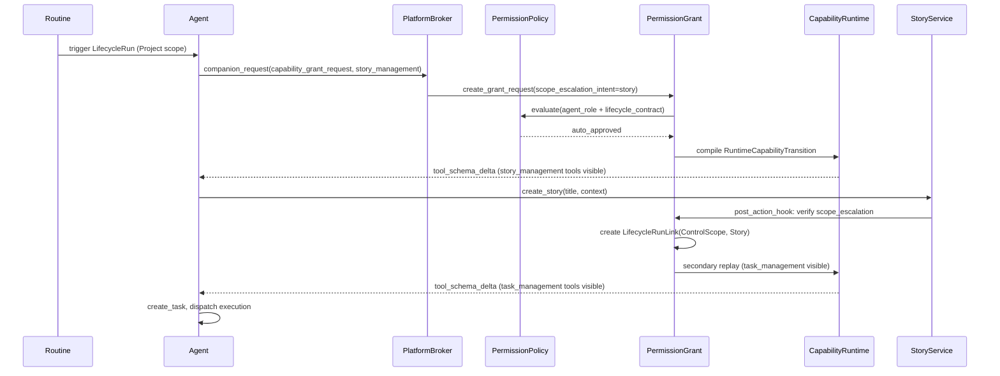
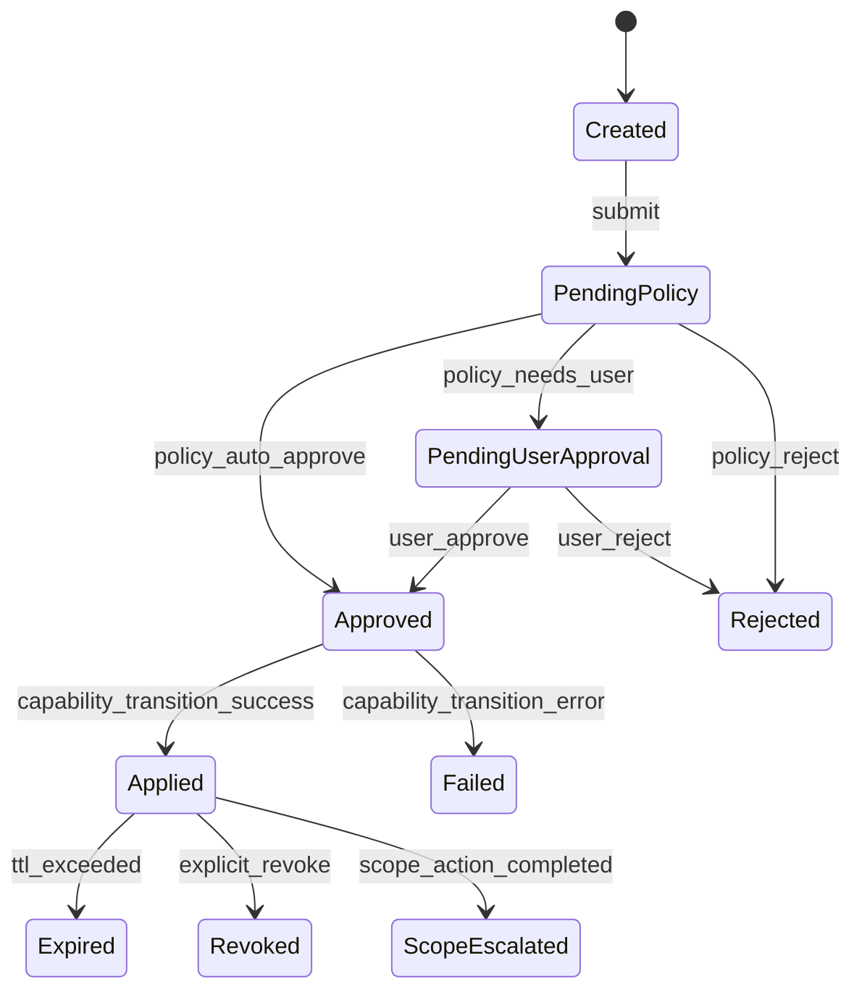

# Agent Permission System 完整设计

## 驱动用例：巡检 Agent 全链路




---

## Phase 0: 残余清理（前置工作）

清理 SessionBinding 遗留的注释和无用代码（不含 TODO 处的实际查询逻辑实现）：

- 删除 `orchestrator.rs`、`task/entity.rs`、`assembler.rs`、`session_bridge.rs` 中提及 SessionBinding 的文档注释
- 删除 `hooks/provider.rs` 中 `"session_binding_found"` diagnostic code
- 删除 `acp_sessions.rs` 中 `get_session_bindings` 兼容端点
- 清理 `session_bridge.rs` 中 `clear_task_session_binding` 空壳函数
- 相关 TODO 注释保留但更新措辞：标注为 "Permission System 将接管"

---

## Phase 1: Domain Entity — `agentdash-domain::permission`

新增 `crates/agentdash-domain/src/permission/` 模块：

### 核心实体

```rust
pub struct PermissionGrant {
    pub id: Uuid,
    pub run_id: Uuid,                       // 来源 LifecycleRun
    pub session_id: String,                 // 来源 session
    pub source_turn_id: Option<String>,     // 触发的 turn
    pub source_tool_call_id: Option<String>,// 触发的 tool call
    pub requested_paths: Vec<ToolCapabilityPath>,
    pub reason: String,
    pub grant_scope: GrantScope,            // turn / session / workflow_step
    pub expires_at: Option<DateTime<Utc>>,
    pub scope_escalation_intent: Option<ScopeEscalationIntent>,
    pub status: GrantStatus,
    pub policy_decision: Option<PolicyDecision>,
    pub approved_by: Option<String>,        // user_id or "system"
    pub created_at: DateTime<Utc>,
    pub updated_at: DateTime<Utc>,
}
```

### 状态机




### 值对象

- `GrantScope`: enum { Turn, Session, WorkflowStep }
- `GrantStatus`: enum { Created, PendingPolicy, PendingUserApproval, Approved, Rejected, Applied, Failed, Expired, Revoked, ScopeEscalated }
- `ScopeEscalationIntent`: struct { target_scope: CapabilityScope, target_subject_kind: RunLinkSubjectKind }
- `PolicyDecision`: struct { outcome: PolicyOutcome, matched_rules: Vec, reason: String }
- `ToolCapabilityPath`: 已存在于 `agentdash-spi`，复用

### Repository Trait

```rust
#[async_trait]
pub trait PermissionGrantRepository: Send + Sync {
    async fn create(&self, grant: &PermissionGrant) -> Result<(), DomainError>;
    async fn update(&self, grant: &PermissionGrant) -> Result<(), DomainError>;
    async fn find_by_id(&self, id: Uuid) -> Result<Option<PermissionGrant>, DomainError>;
    async fn list_active_by_session(&self, session_id: &str) -> Result<Vec<PermissionGrant>, DomainError>;
    async fn list_active_by_run(&self, run_id: Uuid) -> Result<Vec<PermissionGrant>, DomainError>;
    async fn expire_overdue(&self) -> Result<u64, DomainError>;
}
```

---

## Phase 2: Policy Engine — `agentdash-application::permission`

### Policy 数据来源

1. **Agent Role 声明**：`ProjectAgent.config` 中新增 `auto_grantable_capabilities: Vec<ToolCapabilityPath>` 字段
2. **Lifecycle Contract 声明**：`WorkflowContract` 中新增 `requestable_capabilities: Vec<ToolCapabilityPath>` 字段
3. **合并策略**：Agent 声明的 auto_grantable 与 Lifecycle 声明的 requestable 取交集 → 自动批准范围

### PermissionPolicyService

```rust
pub struct PermissionPolicyService {
    repos: RepositorySet,
}

impl PermissionPolicyService {
    pub async fn evaluate(&self, grant: &mut PermissionGrant) -> PolicyDecision {
        // 1. 加载 agent config → auto_grantable_capabilities
        // 2. 加载 active lifecycle → contract.requestable_capabilities
        // 3. 计算交集
        // 4. 判断 requested_paths 是否全部落在交集内
        //    → 全部命中: auto_approve
        //    → 部分命中: split (auto + pending_user)
        //    → 全不命中: pending_user_approval
    }
}
```

---

## Phase 3: Grant Compiler — Capability Runtime 集成

### PermissionGrantCompiler

位于 `agentdash-application::permission::compiler`，负责将 approved grant 翻译为 `RuntimeCapabilityTransition`：

```rust
pub struct PermissionGrantCompiler;

impl PermissionGrantCompiler {
    pub fn compile(grant: &PermissionGrant, current_state: &CapabilityState) -> RuntimeCapabilityTransition {
        // requested_paths → ToolCapabilityDirective(Add) 列表
        // 如果涉及 MCP scope → SetMcpServerSetEffect
        // 如果涉及 tool_policy → SetToolAccessEffect
    }
}
```

### 集成点

修改 `crates/agentdash-application/src/companion/tools.rs` 中 `execute_platform_request`：

- `capability_grant_request` 不再直接转成 human approval
- 改为调用 `PermissionGrantService.request()` → policy → auto/human → compile → apply

Live apply 路径复用现有：

```
compile → RuntimeCapabilityTransition
       → replay_runtime_capability_transition
       → replace_current_capability_state
       → update_session_tools
       → emit tool_schema_delta
```

---

## Phase 4: Scope Escalation 与 LifecycleRunLink 自动关联

### 设计要点

Grant 审批时 `scope_escalation_intent` 预声明目标 scope。当 Agent 使用 granted tool 执行 scope-creating action（如 create_story）时：

1. `create_story` 工具执行成功后，检查当前 session 是否有 active grant with `scope_escalation_intent`
2. 验证新创建的 Story 与 intent 匹配
3. 创建 `LifecycleRunLink(run_id, Story, story_id, ControlScope)`
4. 更新 `CapabilityScopeCtx` → Story level
5. 触发 secondary capability replay → task_management 等 Story scope tools 变为可见
6. Grant status → `ScopeEscalated`

### 实现位置

在 `StoryService::create_story` 或其 application-layer post-hook 中：

```rust
async fn post_create_story_hook(&self, story_id: Uuid, session_id: &str) {
    if let Some(grant) = self.permission_service
        .find_active_escalation_grant(session_id, CapabilityScope::Story).await {
        // create LifecycleRunLink
        // trigger scope upgrade
        // mark grant as ScopeEscalated
    }
}
```

---

## Phase 5: Infrastructure — 持久化 + Migration

### 新增 Database Table

```sql
CREATE TABLE permission_grants (
    id UUID PRIMARY KEY,
    run_id UUID NOT NULL REFERENCES lifecycle_runs(id),
    session_id TEXT NOT NULL,
    source_turn_id TEXT,
    source_tool_call_id TEXT,
    requested_paths JSONB NOT NULL,
    reason TEXT NOT NULL,
    grant_scope TEXT NOT NULL,
    expires_at TIMESTAMPTZ,
    scope_escalation_intent JSONB,
    status TEXT NOT NULL DEFAULT 'created',
    policy_decision JSONB,
    approved_by TEXT,
    created_at TIMESTAMPTZ NOT NULL DEFAULT now(),
    updated_at TIMESTAMPTZ NOT NULL DEFAULT now()
);

CREATE INDEX idx_permission_grants_session ON permission_grants(session_id) WHERE status IN ('applied', 'scope_escalated');
CREATE INDEX idx_permission_grants_run ON permission_grants(run_id);
```

### Agent Config 扩展

`ProjectAgent` config 新增字段（JSONB 内）：

```json
{
  "auto_grantable_capabilities": ["story_management::*", "task_management::*"]
}
```

### WorkflowContract 扩展

```json
{
  "requestable_capabilities": ["story_management::create_story", "task_management::*"]
}
```

---

## Phase 6: API Layer

### 新增 API 端点

- `GET /permission-grants?session_id=&status=` — 查询 grant 列表
- `POST /permission-grants/{id}/approve` — 用户批准
- `POST /permission-grants/{id}/reject` — 用户拒绝
- `POST /permission-grants/{id}/revoke` — 主动撤销

### 修改 companion platform broker

`execute_platform_request` 路径重构：

- `capability_grant_request` → PermissionGrantService.request()
- 如果 policy 判定需要用户审批 → 创建 human approval interaction（复用 companion_request → human 路径）
- 审批回调 → PermissionGrantService.approve() → compile → apply

---

## Phase 7: 前端审批 UI 骨架

### 最小 UI 模型

- **PermissionGrantCard**：展示 requested_paths、reason、scope、TTL、Agent 信息
- **Approval Actions**：批准/拒绝按钮（调用 API）
- **Grant Status Badge**：applied/expired/revoked 状态展示
- **Tool Schema Delta Notice**：已有 ContextFrame 机制展示新增工具

### 集成位置

- Session 页面的 companion request card 区域
- Story 详情页的 Agent 权限面板（展示当前 Story scope 下的 active grants）

---

## Phase 8: CapabilityVisibilityRule 演进

当前 `CapabilityVisibilityRule` 的 `auto_granted` / `agent_can_grant` / `workflow_can_grant` 静态规则将逐步被 PermissionGrant 查询替代：

- **短期**：保留静态规则作为 baseline（无 grant 时的默认行为）
- **目标**：`is_capability_visible` 改为先查 active grants，再 fallback 到静态规则
- **最终**：所有非基础能力（file_read/file_write/shell）均需通过 grant 获得

---

## 关键文件清单


| 层级             | 路径                                                          | 变更类型                  |
| -------------- | ----------------------------------------------------------- | --------------------- |
| Domain         | `crates/agentdash-domain/src/permission/`                   | 新增                    |
| SPI            | `crates/agentdash-spi/src/platform/tool_capability.rs`      | 扩展 ToolCapabilityPath |
| Application    | `crates/agentdash-application/src/permission/`              | 新增                    |
| Application    | `crates/agentdash-application/src/companion/tools.rs`       | 修改 broker 路径          |
| Application    | `crates/agentdash-application/src/capability/resolver.rs`   | 集成 grant 查询           |
| Infrastructure | `crates/agentdash-infrastructure/src/persistence/postgres/` | 新增 grant repo         |
| Infrastructure | `migrations/0071_permission_grants.sql`                     | 新增                    |
| API            | `crates/agentdash-api/src/routes/permission_grants.rs`      | 新增                    |
| Frontend       | `packages/app-web/src/features/permission/`                 | 新增                    |


---

## 风险与 Trade-offs

- **Scope Escalation 的验证时机**：选择在 action 完成后验证（而非预创建），确保只有实际成功的操作才触发升级
- **Policy 评估粒度**：初期 per-path 判断，后续可扩展为 expression-based policy
- **TTL 过期处理**：需要后台 job 或 lazy check（session 活跃时检查）
- **与 WorkflowBindingKind 的关系**：本系统不直接替换 binding_kinds（那是 definition catalog filter），但 capability contract 会从 binding_kinds 语义中拆出来

# 用户提示

请分阶段妥善处理提交