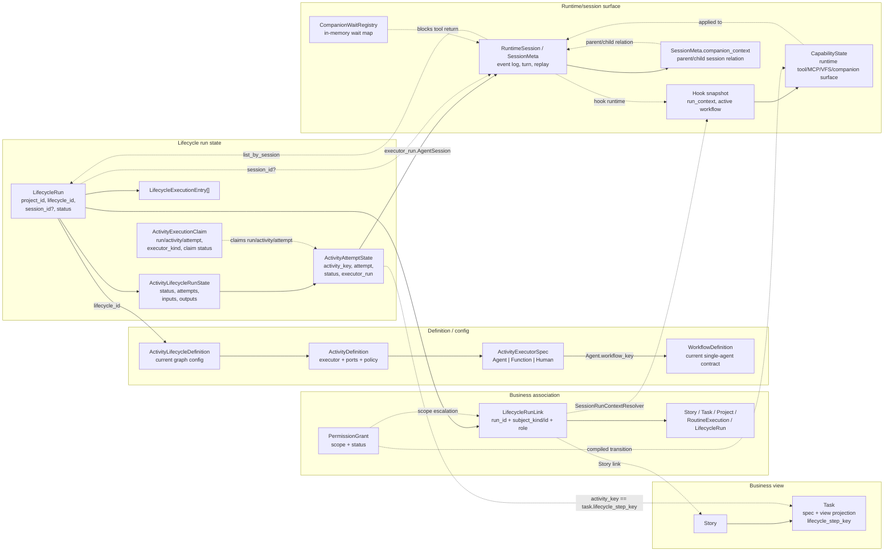
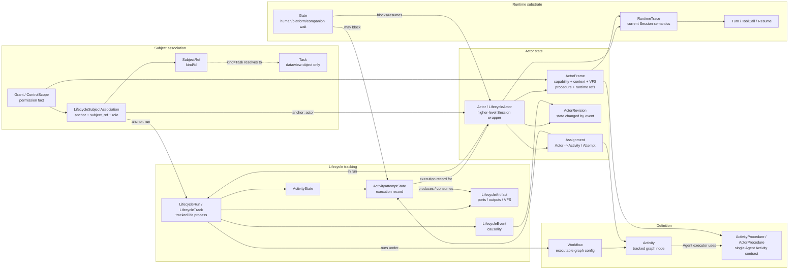
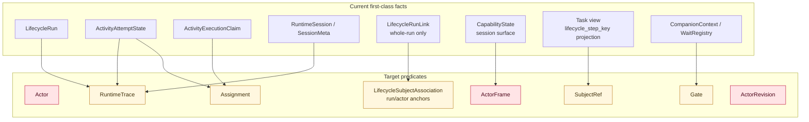

# Agent 运转谓词现状对比

## Purpose

本文重新从当前项目实现里抽取 Agent 运转相关谓词，并与目标谓词体系对比。它服务概念讨论，不直接承诺 schema 或接口修改。

这里的“谓词”不是指代码里已有同名函数，而是指系统当前能稳定表达的事实句式，例如：

```text
run R has attempt A#1
session S backs attempt A#1
run R links to Story X
StepActivation builds CapabilityState for activity A
```

目标是判断：哪些谓词已经是一等事实，哪些只是从 Session / Run / Task view 里临时反推，哪些目标谓词当前完全缺失。

## Evidence

本轮重新查看的实现入口包括：

- `crates/agentdash-domain/src/workflow/entity.rs`
  - `LifecycleRun`
  - `ActivityExecutionClaim`
- `crates/agentdash-domain/src/workflow/value_objects/run_state.rs`
  - `ActivityLifecycleRunState`
  - `ActivityAttemptState`
  - `ExecutorRunRef`
- `crates/agentdash-domain/src/workflow/run_link.rs`
  - `LifecycleRunLink`
  - `RunLinkSubjectKind`
  - `RunLinkRole`
- `crates/agentdash-domain/src/workflow/value_objects/activity_def.rs`
  - `ActivityDefinition`
  - `ActivityExecutorSpec`
  - `AgentSessionPolicy`
- `crates/agentdash-application/src/workflow/scheduler.rs`
  - ready attempt claim 与 executor start
- `crates/agentdash-application/src/workflow/session_association.rs`
  - `session_id -> running/claiming ActivityAttemptState`
- `crates/agentdash-application/src/workflow/session_run_context_resolver.rs`
  - `LifecycleRunLink -> SessionRunContext`
- `crates/agentdash-application/src/workflow/step_activation.rs`
  - `StepActivationInput -> CapabilityState / VFS / MCP / kickoff prompt`
- `crates/agentdash-application/src/task/service.rs`
  - direct Task execution session launch
- `crates/agentdash-application/src/task/view_projector.rs`
  - `ActivityAttemptState -> Task view`
- `crates/agentdash-application/src/companion/tools.rs`
  - companion dispatch、workflow overlay、companion context
- `crates/agentdash-application/src/session/companion_wait.rs`
  - companion wait registry
- `crates/agentdash-domain/src/permission/*`
  - `PermissionGrant` 与 `LifecycleRunLink(ControlScope)`

## Current Predicate Graph

当前实现的 Agent 运转关系可以跑通，但中心仍然是 `LifecycleRun`、`ActivityAttemptState` 与 `RuntimeSession` 的组合；Agent 本身没有独立状态锚点。



## Current Predicate Inventory

| Predicate family | 当前可表达的谓词 | 当前事实源 | 语义质量 |
| --- | --- | --- | --- |
| Run identity | `run_tracks_lifecycle(run, lifecycle_id)`、`run_status(run, status)` | `LifecycleRun` | 一等事实 |
| Activity execution | `run_has_attempt(run, activity_key, attempt, status)` | `ActivityLifecycleRunState.attempts` | 一等事实 |
| Executor claim | `claim_controls_start(run, activity_key, attempt, executor_kind)` | `ActivityExecutionClaim` | 一等事实，但不表达 Agent actor |
| Runtime backing | `attempt_backed_by_executor_run(attempt, ExecutorRunRef)` | `ActivityAttemptState.executor_run` | 一等事实 |
| Session reverse lookup | `session_resolves_to_running_attempt(session, run, activity_key, attempt)` | `LifecycleRunRepository.list_by_session` + active attempt scan | 派生事实，session-first |
| Subject association | `run_link(run, subject_kind, subject_id, role)` | `LifecycleRunLink` | 一等事实，但只有 whole-run anchor |
| Session owner context | `session_context(session, project/story/task/scope)` | `SessionRunContextResolver` | 派生事实，由 run links 排序选择 |
| Capability surface | `activation_builds_surface(scope, activity, workflow, run)` | `StepActivationInput/StepActivation` | 纯计算事实，结果落到 session surface |
| Runtime capability mutation | `session_capability_changed_by(transition)` | `RuntimeCapabilityTransition` / `SessionCapabilityService` | 一等 runtime 事实，但不是 Actor revision |
| Task projection | `task_status_projected_from_attempt(task, activity_key, attempt_status)` | `Task.lifecycle_step_key` + `ActivityAttemptState` | 派生投影，Task 仍残留 step 映射 |
| Direct Task execution | `task_execution_session(task) -> session_id` | `LifecycleRunLink(Task) -> LifecycleRun.session_id` / service TODO | 迁移态，实际启动仍偏 task session |
| Companion dispatch | `companion_dispatch(parent_session, child_session, dispatch_id)` | `SessionMeta.companion_context` | runtime/session fact，不是 lifecycle association |
| Companion workflow overlay | `companion_session_has_lifecycle_run(child_session, run)` | `setup_companion_workflow` creates `LifecycleRun(session_id=child)` | 部分事实，缺 parent/run links |
| Wait/gate | `companion_wait(request_id, session, turn)` | `CompanionWaitRegistry` | runtime map，非 durable lifecycle gate |
| Permission | `grant_active(grant)`、`grant_compiles_to_capability_transition(grant)` | `PermissionGrant` | 一等权限事实 |
| Control scope | `run_link(run, subject, ControlScope)` | `LifecycleRunLink(ControlScope)` | 一等事实，但仍是 run-level |

## Target Predicate Graph

目标体系不是否定当前 `ActivityAttemptState`，而是把 `Actor` 定义为 `RuntimeSession` 之上的高层封装，并让 Subject / Capability / Context / RuntimeTrace 都能明确挂到 Actor / ActorFrame 上。ActivityAttemptState 继续作为执行记录，通过 Actor assignment 被追溯，不作为 Subject association anchor。



## Target Predicate Reference

目标谓词清单由 `agent-operation-predicates.md` 维护。本文只记录相对当前实现的差异：目标模型把 scattered runtime facts 收束到 `LifecycleRun -> Actor -> ActorFrame -> RuntimeSession` 这条主线，并让 Activity / ActivityAttemptState 只承担 graph execution 与 execution record 语义。

## Gap Map



## Comparison Matrix

| Concern | Current predicate shape | Target predicate shape | Gap |
| --- | --- | --- | --- |
| Agent identity | 隐含在 `AgentActivityExecutorSpec.workflow_key`、launch command、executor config、companion `agent_name` 中 | `Actor` 是 RuntimeSession 之上的高层运行封装 | 缺一等 Actor |
| Agent current position | 通过 `ActivityAttemptState.status` 与 `session_id -> running attempt` 反推 | `Assignment(Actor -> Activity / ActivityAttemptState)` | 缺 assignment fact |
| Runtime trace | `LifecycleRun.session_id` + `ActivityAttemptState.executor_run.AgentSession` | RuntimeTrace 由 Actor / ActorFrame 管理，attempt 通过 assignment 追溯 | 当前仍容易 session-first |
| Subject / Task | `LifecycleRunLink(run, Task)` 或 `Task.lifecycle_step_key == activity_key` | `SubjectRef(kind=Task)` 由 `LifecycleSubjectAssociation` 锚到 run / Actor | 缺 SubjectRef 与 Actor anchor |
| Task status | Activity attempt 状态投影到 Task view | Task view 从 SubjectRef + Actor + ActivityAttemptState + Artifact 投影 | 当前仍有 Task step key 残留 |
| Capability | `StepActivation` 计算 `CapabilityState`，应用到 session/hook runtime | `ActorFrame` 持有 effective capability/context/VFS/procedure revision | 缺 ActorFrame |
| Context scope | `SessionRunContextResolver` 从 whole-run links 选择 Task/Story scope | Actor/SubjectAssociation 共同定义 context projection | 当前 context 选择过粗 |
| Companion | SessionMeta parent/child context + runtime event + wait registry | Companion Agent 是 Actor；等待是 Gate；关系是 SubjectAssociation/Assignment | 当前 companion 未进入 lifecycle predicate |
| Permission | `PermissionGrant` + runtime transition + `LifecycleRunLink(ControlScope)` | Grant 解释 ActorFrame 能力来源，也可形成 subject association | 当前 grant 与 Actor 状态未接上 |
| Causality | `LifecycleExecutionEntry` + runtime capability transitions | ActorRevision 由 LifecycleEvent / RuntimeCommand / Grant / Gate response 改变 | 缺 Actor state revision |

## Main Re-evaluation

当前实现已经有三组很扎实的事实：

1. `LifecycleRun -> ActivityAttemptState -> ExecutorRunRef` 能表达 Activity 执行记录。
2. `LifecycleRunLink(run, subject, role)` 能表达 run 与业务对象的关系。
3. `StepActivation -> CapabilityState / VFS / MCP / prompt` 能表达某个 activity 激活时的 runtime surface。

但这些事实还不能自然回答“这个 Agent 正在如何运转”，因为 Agent 被拆散在：

- `ActivityAttemptState.executor_run`
- `RuntimeSession / SessionMeta`
- `StepActivation / CapabilityState`
- `LaunchCommand / executor_config`
- `CompanionContext`
- `PermissionGrant / RuntimeCapabilityTransition`

因此目标谓词体系的核心不是重命名 `ActivityAttemptState`，而是补上：

```text
Actor
ActorFrame
Assignment
SubjectRef
LifecycleSubjectAssociation(anchor = run | actor)
Gate
ActorRevision
```

这能把当前分散句式：

```text
session S belongs to run R,
run R has running activity A#1,
activity A uses workflow W,
activation gives session S capability C,
run R links to Task T,
Task T status is projected from A
```

收敛成目标句式：

```text
Actor X in LifecycleRun R
acts on SubjectRef(kind=Task, id=T),
wraps RuntimeTrace S,
is assigned to Activity A / ActivityAttemptState #1,
uses ActivityProcedure P,
has ActorFrame revision F with Capability C and Context K,
and its state changed by LifecycleEvent E.
```

## Conceptual Implications

- `ActivityAttemptState` 可以继续保留现名。它是 Activity execution record，不需要额外改叫 `ActivityInvocation`。
- `Task` 不应拥有 runtime 谓词。runtime 谓词应作用于 `SubjectRef(kind=Task)`，Task view 只投影结果。
- `LifecycleRunLink` 的演化重点不是改名本身，而是从 whole-run link 变成 run / Actor scoped subject association。
- `Workflow` 应作为可执行图配置；当前 `WorkflowDefinition` 更像单 Activity 的 `ActivityProcedure / ActorProcedure`。
- Companion 的目标形态应进入 Actor/Gate/SubjectAssociation 通道，而不是继续停留在 SessionMeta companion context。
