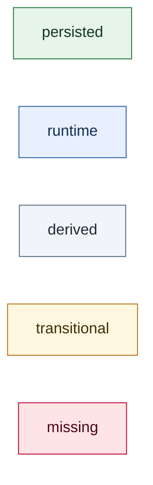
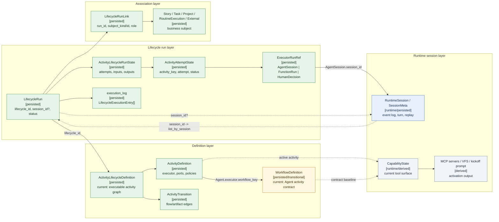
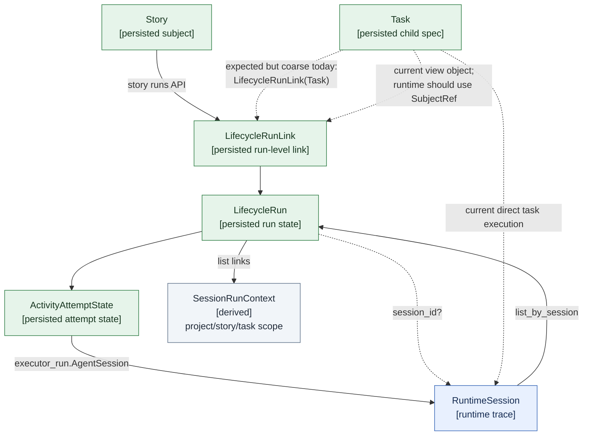
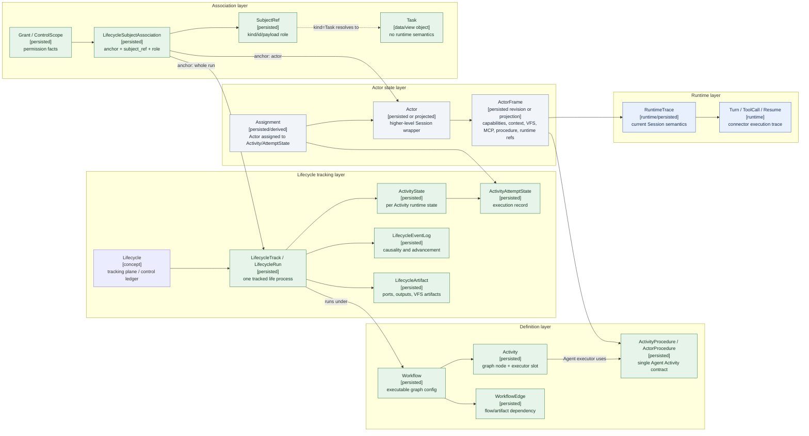
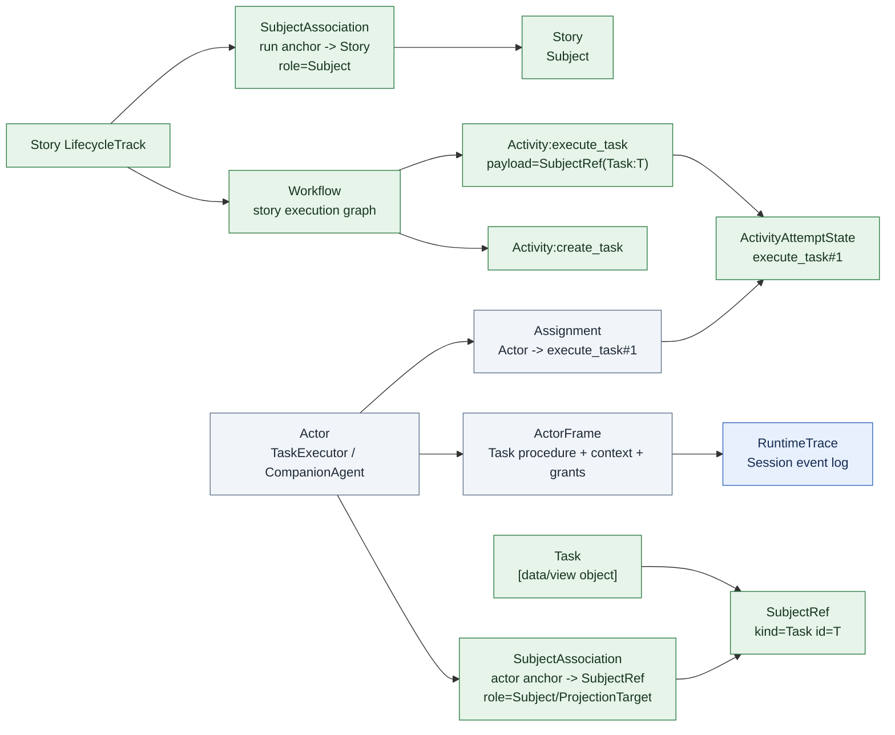
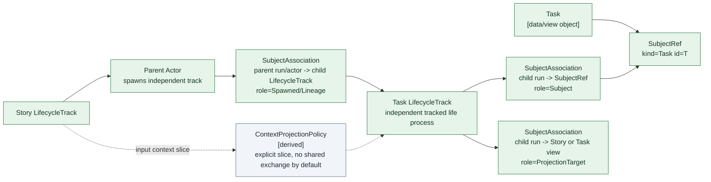

# Lifecycle 关联实体对照图

## Purpose

这篇文档对照当前实现中的 Lifecycle 相关逻辑实体，以及预期迭代后的实体关系。它服务概念关联、事实源边界与后续设计讨论。

目标是把讨论中的几个容易缠在一起的问题拆开：

- `Lifecycle` 是生命周期追踪平面，不是可执行图配置本身。
- `Workflow` 应指在 Lifecycle 下生效的可执行图配置。
- 单个 Agent Activity 内部的行为/能力/上下文约束，应从当前 `WorkflowDefinition` 语义里拆成 `ActivityProcedure` / `ActorProcedure`。
- `Session` / `RuntimeSession` 的目标职责是运行轨迹载体；业务归属、Agent 状态锚点与 Lifecycle ownership 需要落在更明确的关联实体上。
- `Task` 本身只是业务数据载体、用户关联查看对象，或 Activity payload 指向的数据对象；它不拥有 runtime 语义。
- Runtime 侧关联的是 `SubjectRef(kind=Task, id=...)`，不是 Task entity 本身。当前 `LifecycleRunLink` 是这个方向的雏形，目标上应演化为 subject association，并允许 subject 关联到 whole run 或 Actor。

## Evidence

本图基于以下当前项目事实整理：

- `crates/agentdash-domain/src/workflow/entity.rs`
  - `WorkflowDefinition`
  - `ActivityLifecycleDefinition`
  - `LifecycleRun`
- `crates/agentdash-domain/src/workflow/value_objects/activity_def.rs`
  - `ActivityDefinition`
  - `ActivityExecutorSpec`
  - `AgentActivityExecutorSpec.workflow_key`
  - `ActivityTransition`
- `crates/agentdash-domain/src/workflow/value_objects/run_state.rs`
  - `ActivityLifecycleRunState`
  - `ActivityAttemptState`
  - `ExecutorRunRef`
- `crates/agentdash-domain/src/workflow/run_link.rs`
  - `LifecycleRunLink`
  - `RunLinkSubjectKind`
  - `RunLinkRole`
- `crates/agentdash-application/src/workflow/step_activation.rs`
  - `StepActivationInput`
  - `StepActivation`
- `crates/agentdash-application/src/workflow/session_association.rs`
  - `resolve_activity_session_association`
  - `lifecycle_activity:*` label
- `crates/agentdash-application/src/workflow/session_run_context_resolver.rs`
  - `session_id -> run -> links -> SessionRunContext`
- `crates/agentdash-application/src/companion/tools.rs`
  - workflow-backed companion 当前通过 `workflow_key` 创建 child session/run
- `crates/agentdash-application/src/task/service.rs`
  - Task direct execution 当前走 task session launch，不挂 `lifecycle_activity:*`
- `.trellis/spec/backend/workflow/lifecycle-run-link.md`
- `.trellis/spec/backend/story-task-runtime.md`

## Status Legend

```text
[persisted]     当前已有持久化事实源或 domain entity。
[runtime]       当前已有运行时事实或运行时承载。
[derived]       当前可从已有事实计算出来，但不是独立事实源。
[transitional]  当前存在，但语义与目标模型已经错位。
[missing]       目标模型需要，但当前没有清晰实体或关联。
```

Mermaid 图中颜色含义：



## Current Entity Map

当前实现里，定义层、运行层、关联层、Session runtime 层已经初步分开，但仍有三类耦合：

- 可执行图配置叫 `ActivityLifecycleDefinition`，而单 Activity Agent 契约叫 `WorkflowDefinition`，命名方向与目标语义相反。
- `LifecycleRun.session_id` 与 `ActivityAttemptState.executor_run.AgentSession.session_id` 同时把 RuntimeSession 接入 Lifecycle，导致查询路径仍偏 session-first。
- `LifecycleRunLink` 只挂 whole run，无法表达某个 `SubjectRef` 当前由哪个 Actor 处理，以及 Actor 到具体 Activity 执行记录的追溯关系。



### Current Query / Dispatch Paths



当前主要状态判断：

| 关系 | 当前状态 | 说明 |
| --- | --- | --- |
| `ActivityLifecycleDefinition -> ActivityDefinition -> ActivityTransition` | [persisted] | 当前就是 activity graph 配置，目标上应命名为 `Workflow`。 |
| `ActivityDefinition.Agent.workflow_key -> WorkflowDefinition` | [persisted/transitional] | 当前用 `WorkflowDefinition` 表达 Agent Activity 的局部契约，目标上更像 `ActivityProcedure` / `ActorProcedure`。 |
| `LifecycleRun.lifecycle_id -> ActivityLifecycleDefinition` | [persisted] | Run 持有图配置实例引用，并追踪运行状态。 |
| `LifecycleRun.activity_state -> ActivityAttemptState` | [persisted] | Activity / Attempt 状态是 Lifecycle tracking 的核心运行事实。 |
| `ActivityAttemptState.executor_run -> RuntimeSession` | [persisted/runtime] | Agent attempt 通过 `ExecutorRunRef::AgentSession` 接到 runtime session。 |
| `LifecycleRun.session_id -> RuntimeSession` | [transitional] | 字段注释已降级为 runtime association，但仍承担 root/current session 快捷入口。 |
| `LifecycleRunLink(run_id, subject_kind, subject_id, role)` | [persisted] | 已替代旧 SessionBinding，但粒度仍停在 whole run。 |
| `SubjectRef(kind=Task) -> Actor -> ActivityAttemptState` | [missing/transitional] | 旧 spec 里有 `lifecycle_step_key`，但目标语义里 Task 本体不入 runtime；runtime 只携带 SubjectRef，再经由 Actor assignment 追溯 Activity 执行记录。 |
| `StepActivation -> CapabilityState/MCP/VFS/prompt` | [derived] | 当前是 activation 计算结果，目标上应成为 ActorFrame / effective surface。 |
| workflow-backed companion -> run links / lineage | [missing/transitional] | 当前能创建 child session/run，但未完整建立 `SpawnedBy` / `Subject` / `ControlScope` 等 lifecycle associations。 |
| direct Task execution -> LifecycleRun | [missing/transitional] | 当前 Task service 明确不挂 `lifecycle_activity:*`，运行主要落到 task session launch；目标上应改为 SubjectRef-driven dispatch/projection。 |

## Current Conceptual Pressure Points

### 1. Definition Names Are Inverted

当前：

```text
ActivityLifecycleDefinition = graph config
WorkflowDefinition = single Agent Activity contract
```

目标：

```text
Workflow = graph config
ActivityProcedure / ActorProcedure = single Agent Activity contract
```

因此当前 `WorkflowDefinition` 的名字会持续诱导实现把“单节点 Agent 行为契约”和“整张可执行图”混起来。

### 2. RuntimeSession Still Looks Like A Lifecycle Anchor

当前 `LifecycleRun.session_id` 和 `ExecutorRunRef::AgentSession { session_id }` 都指向 RuntimeSession。它们可以让系统从 session 反查 run，但也让 RuntimeSession 看起来像业务归属或 Agent 状态锚点。

目标上 RuntimeSession 应降级为 `RuntimeTrace`：它记录 turn、event log、tool call、resume/debug，不拥有 Lifecycle progress、business subject 或 Agent effective state。

### 3. Run-Level Subject Link Cannot Explain Same-Run Execution Projection

如果 `SubjectRef(kind=Task)` 作为 Story LifecycleRun 内的 payload / work subject 被处理，whole-run link 只能表达：

```text
SubjectRef(Task:T) belongs to / projects from Run R
```

它不能表达：

```text
SubjectRef(Task:T) is acted on by Actor X,
and Actor X is assigned to Activity A / ActivityAttemptState #n
```

因此 runtime 的主关联对象应是 `SubjectRef`，Task entity 只作为该 ref 指向的数据/视图对象。Actor 是处理该 SubjectRef 的运行主体；Activity / ActivityAttemptState 是 Actor 当前或历史执行位置。目标上不宜新增平行的 `ActivitySubjectLink`，也不需要 Activity / Attempt subject anchor；应把 `LifecycleRunLink` 演化为支持 run / Actor anchor 的统一 lifecycle subject association。

### 4. Actor State Has No Dedicated Anchor

当前 Agent 的有效状态被拆在：

- `ActivityAttemptState.executor_run`
- `RuntimeSession`
- `CapabilityState`
- `StepActivation`
- Session construction / runtime transition

这些事实能让系统跑起来，但无法清晰陈述“某个 Agent/actor 在某个 LifecycleRun 中当前处于什么状态、由哪个 Activity 改变、拥有哪个有效工具面、背后有哪些 RuntimeTrace”。

## Expected Entity Map

目标模型中，`Lifecycle` 作为 tracking plane；`Workflow` 是该 tracking plane 下生效的图配置；`Actor` 是 RuntimeSession 之上的高层运行封装，也是 Lifecycle 内可被 Activity 改变的 Agent 状态锚点；`ActorFrame` 是某个 revision 的有效运行表面与自上而下事实源；`LifecycleSubjectAssociation` 是 SubjectRef、权限范围、lineage 与 run/actor anchor 的统一关联层。



### Expected Same-Run Subject Execution

当 StoryAgent 在同一个 Story LifecycleTrack 中创建并处理一个 Task 数据对象时，不需要默认创建 independent child LifecycleRun。Runtime 里携带的是 `SubjectRef(kind=Task)`：它可以作为 Activity payload，也可以作为 Actor 的工作 subject；Task 本体只提供数据和用户可查看投影。



这条链路回答的问题是：

```text
Task T
  -> represented in runtime as SubjectRef(kind=Task, id=T)
  -> SubjectRef anchored to Actor A in LifecycleTrack R
  -> Actor A wraps RuntimeTrace S
  -> Actor A assigned to Activity execute_task / ActivityAttemptState #1
  -> user-facing Task view projected from SubjectAssociation, Actor assignment, ActivityAttemptState and LifecycleArtifact
```

Task 本身仍是业务数据 + view projection，不直接持有 runtime truth。

### Expected Independent Task Lifecycle

当某个 SubjectRef 需要独立生命周期、独立上下文信道、独立权限边界、独立导航或脱离 Story run 继续执行时，可以创建独立 LifecycleTrack。Task 仍只是这个 SubjectRef 指向的数据/视图对象；独立的是 lifecycle tracking boundary，不是 Task 本体获得 runtime 语义。



这里的关键不是“child lifecycle”这个名称，而是：

- 子执行拥有自己的 tracking boundary。
- 子执行不默认共享父 run 的 artifact namespace、event timeline 或 shared context。
- 父子之间通过 lineage association 与 projection policy 交换必要上下文。

## Current To Target Mapping

| 当前名称 / 关系 | 当前职责 | 目标名称 / 关系 | 目标职责 |
| --- | --- | --- | --- |
| `ActivityLifecycleDefinition` | Activity graph definition | `Workflow` | Lifecycle 下生效的可执行图配置 |
| `WorkflowDefinition` | 单个 Agent Activity 的 contract | `ActivityProcedure` / `ActorProcedure` | Agent Activity 的行为、能力、上下文和完成约束 |
| `LifecycleRun` | 一次 run，持有 activity_state 与可选 session_id | `LifecycleTrack` / `LifecycleRun` | 一个被追踪的执行生命过程 |
| `ActivityDefinition` | 图节点定义 | `Activity` | Workflow 中可调度、可观察、可完成的执行节点 |
| `ActivityAttemptState` | Activity 的 attempt 状态与 executor_run | `ActivityAttemptState` | 保留当前名称，解释为 Activity 的一次 executor execution record |
| `ExecutorRunRef::AgentSession` | attempt 到 session 的 runtime ref | `Actor.runtime_trace_ref` | Actor 到 RuntimeTrace 的承载关系；attempt 通过 assignment 追溯 Actor |
| `LifecycleRun.session_id` | run 到 runtime session 的快捷关联 | 移入 Actor / ActorFrame | RuntimeTrace 不再作为 ownership anchor |
| `LifecycleRunLink` | run-level subject association | `LifecycleSubjectAssociation` | SubjectRef 关联到 whole run / Actor |
| `CapabilityState` + MCP + VFS + kickoff prompt | StepActivation 派生结果 | `ActorFrame` | Actor 某个 revision 的有效运行表面 |
| `SessionRunContext` | 从 session 反推 run links 得到 scope | `ActorFrame.context_scope` / `LifecycleSubjectAssociation` projection | 从 lifecycle anchor 和 subject associations 推导上下文 |
| `Task.lifecycle_step_key` | 旧 step 映射 | `SubjectRef(kind=Task)` + `Assignment(Actor -> ActivityAttemptState)` | Task 不入 runtime；SubjectRef 关联 Actor，再追溯执行记录 |

## Expected Subject Association Shape

目标上的统一 subject association 可以先按这个形状讨论：

```text
LifecycleSubjectAssociation
  id
  anchor_run_id
  anchor_actor_id: Option<String>
  subject_kind
  subject_id
  subject_payload_ref: Option<String>
  role
  metadata
  created_at
```

约束：

```text
anchor_actor_id = null
  -> whole lifecycle association

anchor_actor_id != null
  -> Actor-level association
```

它需要覆盖的典型语义：

| Anchor | Subject | Role | 用途 |
| --- | --- | --- | --- |
| whole run | Story | Subject | Story root run |
| whole run | Project | ControlScope | Project-level tool / permission scope |
| whole run | RoutineExecution | Source | Routine 触发的 run |
| Actor | SubjectRef(kind=Task) | Subject / ProjectionTarget | 某个 Task subject ref 由同一 run 中某个 Actor 承担 |
| whole run | LifecycleTrack | SpawnedBy / Lineage | 独立 run 记录来源 run |
| Actor | LifecycleTrack | Spawned / Lineage | 某个 Actor 派生了独立 run |

最后两行暴露了一个仍需命名收束的小问题：当前 `SpawnedBy` 的方向性适合“child run 被 parent run 派生”，但如果我们要用同一个 association 表达“parent actor 派生 child run”，role 名可能需要改成更中性的 `Lineage` / `DerivedFrom` / `SpawnedRun`，或在 metadata 中携带 parent actor。这个问题不需要新增一套 link 概念，但需要把 role 的谓词方向说清楚。

## Iteration Target Summary

预期迭代后的清晰模型应满足：

- `Lifecycle` 负责追踪，不负责冒充 Workflow graph。
- `Workflow` 是可执行图配置，Activities 是图节点。
- `ActivityProcedure` / `ActorProcedure` 是单个 Agent Activity 的局部执行契约。
- `LifecycleTrack` 追踪 Activity/ActivityAttemptState/Event/Artifact 的实际演化。
- `Actor` 是 RuntimeSession 之上的高层运行封装，锚定 Agent 在 LifecycleTrack 中的状态。
- `ActorFrame` 持有某个 revision 的有效能力、上下文、VFS、MCP、Procedure 与 RuntimeTrace refs，是 runtime surface 的自上而下事实源。
- `RuntimeTrace` 记录 turn/event/tool/resume/debug，不拥有业务归属。
- `LifecycleSubjectAssociation` 用一个概念覆盖 whole-run、actor-level 的 subject/projection/control/lineage 关系。
- 同一 LifecycleTrack 内的并发 subagent 通过 lifecycle-level ports/artifacts/VFS/context projection 交换信息。
- Independent LifecycleTrack 只在独立生命周期、独立上下文信道、独立控制边界或跨对象投影成立时创建。
