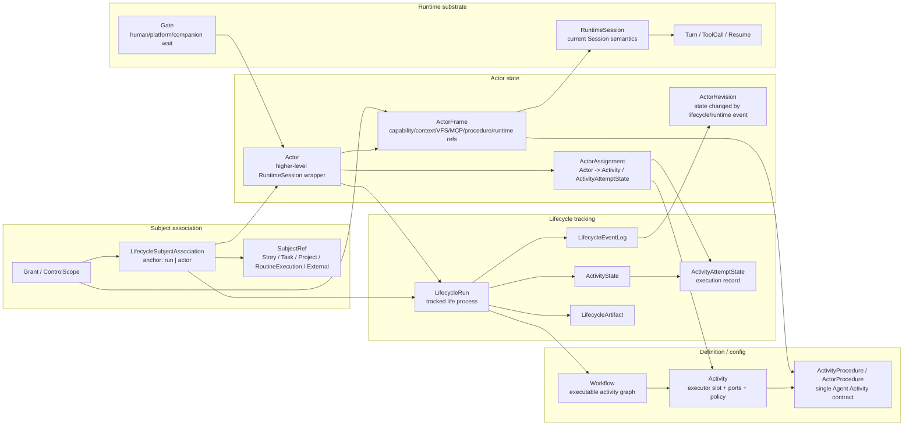

# Lifecycle 模块差距分析

## Purpose

本文整合本轮四个 subagent 切片与本地复核结果，给出当前模块对 `lifecycle`、`session`、`workflow`、`task`、`companion` 等运行谓词的真实依赖，并对照目标谓词体系判断迁移归属。

目标体系采用：

```text
LifecycleRun -> Actor -> ActorFrame -> RuntimeSession
```

其中 `LifecycleRun` 追踪执行生命过程，`Actor` 是 RuntimeSession 之上的 Agent 运行封装，`ActorFrame` 是 capability/context/VFS/MCP/procedure/runtime refs 的自上而下事实源，`RuntimeSession` 保留 turn/event/tool/resume/debug 轨迹。

## Research Inputs

- `research/backend-core-gap.md`
- `research/business-modules-gap.md`
- `research/persistence-contracts-gap.md`
- `research/frontend-gap.md`
- 本地复核：`workflow/activity_run.rs`、`workflow/orchestrator.rs`、`workflow/agent_executor.rs`、`workflow/step_activation.rs`、`workflow/session_association.rs`、`task/service.rs`、`task/view_projector.rs`、`companion/tools.rs`、`routine/executor.rs`、`permission/*`、`hooks/*`、contracts 与前端 services/stores/pages。

## Integrated Target Graph



## Module Gap Matrix

| Module | Current dependency | Current fields / surfaces | Gap | Target migration |
| --- | --- | --- | --- | --- |
| Domain workflow definitions | `WorkflowDefinition` is a single-agent contract; `ActivityLifecycleDefinition` is the graph. | `WorkflowDefinition.contract`, `ActivityLifecycleDefinition.activities/transitions`, `AgentActivityExecutorSpec.workflow_key`. | 名称与目标语义反向，graph 与 procedure 容易互相冒充。 | 将 graph 概念收束为 `Workflow`；将当前 `WorkflowDefinition` 收束为 `ActivityProcedure` / `ActorProcedure`；`workflow_key` 改为 procedure reference。 |
| Lifecycle run state | `LifecycleRun` owns activity state and also stores optional root session. | `LifecycleRun.session_id`, `activity_state`, `execution_log`, `active_node_keys`. | `session_id` 让 run 看起来由 RuntimeSession 拥有，无法表达同 run 多 Actor / 多 runtime trace。 | `LifecycleRun` 只保留 tracking state；root/child runtime refs 迁到 ActorFrame；run 查询改用 run/actor/subject/ref index。 |
| Activity attempt evidence | Attempt records executor run directly. | `ActivityAttemptState.executor_run`, `ActivityExecutionClaim.executor_run_ref`. | Attempt 记录证据没问题，但 `AgentSession` 变成唯一 Agent 身份。 | 保留 `ActivityAttemptState`；新增 `ActorAssignment` 连接 Actor 与 Activity/Attempt；executor runtime ref 成为 assignment/frame 下的 evidence。 |
| Workflow engine/scheduler | Engine advances attempts; scheduler claims and launches ready attempts. | `ActivityEvent::ExecutorStarted`, `ActivityExecutionClaim`, `record_executor_started`. | 这层相对干净，缺的是 launch 前后的 Actor 分配事实。 | Scheduler 先 resolve/create Actor + ActorFrame，再写 attempt evidence；engine 仍只通过 ActivityEvent 推进。 |
| Activity run/orchestrator | Start/terminal/advance 都以 session 作为入口。 | `StartActivityLifecycleRunCommand.session_id`, `list_by_session`, `resolve_activity_session_association(session_id)`, `run.session_id.unwrap_or_default()`. | session 同时承担 root actor、current attempt、terminal event provenance。 | run start 创建 LifecycleRun + root Actor；terminal/advance 由 RuntimeSession ref 解析 ActorFrame -> Assignment -> Attempt。 |
| Agent executor / step activation | `SpawnChild` creates child session; `ContinueRoot` mutates root session capability/context. | `AgentActivityLaunchContext.root_session_id`, `AgentSessionPolicy`, `StepActivation`, pending runtime transitions. | Spawn/continue 是 runtime binding policy，却被写成 session policy；StepActivation 结果落到 session/hook runtime。 | 将 session policy 改成 Actor runtime binding policy；`StepActivation` 产出 ActorFrame revision；RuntimeSession 只消费 frame snapshot。 |
| Session construction / launch | Session construction gathers owner, context, capability, workflow projection. | `SessionConstructionPlan`, `LaunchCommand::{TaskService,RoutineExecutor,CompanionDispatch,WorkflowOrchestrator}`, `SessionPromptLifecycle`. | 形态上已经像 ActorFrame builder，但所有入口/输出仍以 session 命名。 | 拆成 `ActorFrameConstructionPlan` 与 `RuntimeSessionLaunchPlan`；LaunchCommand 输入变成 Actor/Subject execution intent。 |
| Session runtime registry | Runtime map stores live execution state keyed by session. | `SessionRuntimeRegistry<HashMap<session_id, SessionRuntime>>`, `SessionProfile`, `TurnExecution`, hook runtime. | Live runtime 与 ActorFrame cache 混在一起。 | Runtime registry 保留 transport/turn/cancel；ActorFrame 管理 capability/context/hook/pending actions/revision。 |
| Hook provider/runtime | Hook snapshot resolves active workflow from session and run links. | `SessionHookSnapshot`, `HookSessionRuntime`, `WorkflowSnapshotBuilder.resolve_active_workflow(session_id)`. | Hook runtime 事实上在驱动 Activity advance 和 context injection，却被 session 拥有。 | Hook snapshot 变成 ActorFrame snapshot；RuntimeSession callback 附带 actor/frame refs；hook resolution 写 ActorRevision/Gate/ActivityEvent。 |
| Capability service/state | Capability state is stored in construction output, session runtime, pending command, hook runtime. | `CapabilityState`, `RuntimeContextTransition`, `PendingCapabilityStateTransition`, `SessionCapabilityService`. | capability/context 没有一个自上而下的 durable fact source。 | ActorFrame owns effective capability/context/VFS/MCP/procedure revision；RuntimeSession gets a delivery snapshot and provenance. |
| Permission | Grant is run+session scoped and compiles to runtime transition. | `PermissionGrant.run_id`, `session_id`, `GrantScope::Session/WorkflowStep`, `list_active_by_session`. | Grant explains session capability, but target需要解释 ActorFrame capability source。 | Add actor/frame anchor and keep source runtime session/turn/tool as provenance；scope language aligns with ActorFrame/activity/turn. |
| Context / model projection | Context bundle, hook injections, context frames and model context all use session. | `ContextFrame`, `ContextProjector.build_model_context(session_id)`, `SessionContextSnapshot`. | durable context facts and delivery frames are not separated. | ActorFrame context projection is fact source；RuntimeSession event projection is trace/detail。 |
| VFS / MCP / Canvas surface | Runtime surface keyed by session and capability state; lifecycle VFS reads session refs from run/attempt. | `ResolvedVfsSurfaceSource::SessionRuntime`, lifecycle VFS `runs/session/items`, canvas visible mounts on session. | UI/tool surface already resembles ActorFrame, but is indexed by RuntimeSession. | ActorFrame owns visible mounts, lifecycle/routine VFS, MCP servers; RuntimeSession remains low-level address. |
| Task / Story | Domain Task comments say view/projection, application still launches task session. | `Task.lifecycle_step_key`, `Task.agent_binding`, `StoryStepActivationService.start_task`, `TaskSessionPayload.session_id`. | Task is still treated as runnable owner in service/API/UI. | Task start becomes SubjectRef execution intent；Task view derives from SubjectAssociation + ActorAssignment + ActivityAttemptState + artifacts。 |
| Companion / subagent | Dispatch uses parent/child session context and in-memory wait registry. | `SessionMeta.companion_context`, `CompanionWaitRegistry`, `setup_companion_workflow` creates run by child `session_id`. | Companion Agent and wait/gate are outside lifecycle predicate channel. | Companion dispatch creates child Actor and Gate; inherited slice is ActorFrame contribution; workflow overlay uses same Lifecycle/Actor dispatch path. |
| Routine | Routine execution resolves session by Fresh/Reuse/PerEntity and marks completed when prompt dispatched. | `Routine.session_strategy`, `RoutineExecution.session_id/status/entity_key`. | Routine status is dispatch status, not lifecycle/agent terminal truth. | RoutineExecution is Source SubjectRef; session strategy becomes Actor reuse policy; run/actor terminal updates RoutineExecution projection。 |
| ProjectAgent | ProjectAgent opens a session first, then starts default/freeform lifecycle. | `default_lifecycle_key`, `is_default_for_story/task`, `OpenProjectAgentSessionResult.session_id/binding_id`. | ProjectAgent is high-level actor profile but has no Actor runtime identity. | Opening ProjectAgent creates/selects Actor under Lifecycle; response returns run/actor/frame/runtime refs. |
| Persistence / API / contracts | Tables and DTOs expose session-first lifecycle shape. | `lifecycle_runs.session_id`, `/lifecycle-runs/by-session`, `StoryRunOverviewDto.session_id`, `ExecutorRunRef.AgentSession`, `TaskResponse.lifecycle_step_key`. | Wire contract makes session the public runtime root and Task a runtime projection owner. | Introduce generated Actor/Lifecycle/SubjectExecution DTOs; move route-local DTOs into contracts; then drop session-first run APIs. |
| Frontend | UI groups and navigates by session owner/parent relation. | `runsBySessionId`, `ProjectSessionEntry.owner_type`, `/session/:sessionId`, Task drawer `start/continue`, Story session binding. | Frontend creates an implicit session tree as product runtime model. | Add ActorFrameRuntimeView, LifecycleRunView, SubjectExecutionView, ProjectActiveActorsView; SessionPage becomes RuntimeSession trace detail. |

## Field Split Inventory

| Current field / surface | Current meaning | Target owner | Split / migration note |
| --- | --- | --- | --- |
| `lifecycle_runs.session_id` | root/current runtime session shortcut for a run | `ActorFrame.runtime_session_refs` | Backfill root Actor for each run/session pair; remove run-level session ownership. |
| `ActivityAttemptState.executor_run.AgentSession.session_id` | concrete execution evidence for attempt | `ActorAssignment` + `RuntimeSessionRef` evidence | Attempt keeps status/timestamps/summary; assignment explains which Actor executed it. |
| `activity_execution_claims.executor_run_ref` | launcher evidence and idempotency marker | `ActivityExecutionClaim` + assignment ref | Claim can keep evidence, but actor assignment becomes the semantic bridge. |
| `sessions.project_id` | project list/index and owner shortcut | denormalized runtime index | Control scope comes from `LifecycleSubjectAssociation` / ActorFrame; session keeps index only for listing/trace. |
| `SessionMeta.companion_context` | dispatch, lineage, inheritance, agent name, wait correlation | `ActorLineage`, `Gate`, `ActorFrameContribution`, runtime provenance | Split into durable gate/lineage/frame contribution; keep child session id as trace ref. |
| `SessionMeta.bootstrap_state` | owner-aware launch bootstrap state | ActorFrame launch state + RuntimeSession delivery state | ActorFrame records what context/capability/procedure revision should be delivered. |
| `SessionMeta.visible_canvas_mount_ids` | session-local visible canvas assets | ActorFrame visible surface | Canvas remains project asset; frame records which mounts are visible to current Actor. |
| `session_runtime_commands` | pending runtime/capability transition by session | ActorFrame transition / revision log | RuntimeSession command queue becomes delivery mechanism, not control-plane truth. |
| `session_compactions/projection_heads` | model context projection by session | ActorFrame context projection with runtime provenance | RuntimeSession event seq remains source evidence. |
| `session_lineage` | child/parent session relation | Actor lineage + RuntimeSession trace lineage | Use actor lineage for lifecycle semantics; session lineage stays trace UI. |
| `permission_grants.session_id` | grant applies to session surface | `actor_id` / `actor_frame_id` plus source runtime refs | `source_runtime_session_id` remains audit provenance. |
| `permission_grants.run_id` | grant source lifecycle run | run/actor/frame scope | Keep run for coarse scope; add actor/frame for effective surface. |
| `LifecycleRunLink.run_id` | whole-run subject association | `LifecycleSubjectAssociation.anchor_run_id` | Extend with nullable `anchor_actor_id`; Activity/Attempt stay evidence via assignment. |
| `RunLinkSubjectKind::Task` | task subject at run level | `SubjectRef(kind=Task)` | Task can be subject ref, not runtime owner. |
| `Task.lifecycle_step_key` | authoring/projection selector for activity key | `SubjectExecutionView` / association metadata | Remove from Task spec once actor assignment projection exists. |
| `Task.status/artifacts` | persisted view projection in Story aggregate | Task projection cache | Keep only as cache with source revision, or provide derived view from lifecycle facts. |
| `Task.agent_binding` | per-task execution override | Subject execution request / ActorProcedure override | Move execution policy out of Task data if it affects runtime. |
| `RoutineExecution.session_id/status` | dispatch result and session id | Source association + run/actor projection | Add run/actor refs; status differentiates trigger dispatch and lifecycle terminal. |
| `ProjectAgent.default_workflow_key` request | convenience single-agent contract shortcut | `ActivityProcedure` reference or explicit Workflow graph | Remove once Workflow/Procedure naming is split. |
| `OpenProjectAgentSessionResult.binding_id` | duplicate session id | Actor/session association id if needed | Replace with `actor_id`, `actor_frame_id`, `lifecycle_run_id`, `runtime_session_id`. |
| `EffectiveSessionContract.active_step_key` | current active step/activity | ActorFrame active activity/procedure | Rename to activity wording and move from Session contract to frame projection. |
| `LifecycleExecutionEntry.step_key` | execution log activity id | `activity_key` | Rename stored JSON and generated contracts with Activity vocabulary. |

## Repeated Fact Clusters

### Runtime ownership

Current repeated facts:

- `LifecycleRun.session_id`
- `ActivityAttemptState.executor_run.AgentSession`
- `SessionMeta.project_id`
- `ProjectSessionEntry.owner_type/owner_id`
- Story session binding response built from run links and session id

Target source:

```text
LifecycleSubjectAssociation + Actor + ActorFrame.runtime_session_refs
```

### Capability and tool visibility

Current repeated facts:

- `SessionConstructionPlan.projections.capability_state`
- `SessionProfile.capability_state`
- `HookSessionRuntime.capabilities`
- `PendingCapabilityStateTransition`
- `PermissionGrant` compiled transitions

Target source:

```text
ActorFrame revision
```

`RuntimeCapabilityTransition` becomes the event/provenance that changes a frame, while RuntimeSession only receives the resulting execution snapshot.

### Context and model projection

Current repeated facts:

- `ContextBundle`
- hook injections
- `ContextFrame`
- turn runtime injection fragments
- session projection heads/segments
- lifecycle VFS / routine VFS / canvas visible surface

Target source:

```text
ActorFrame context projection
```

RuntimeSession events stay as provenance for transcript/model-context reconstruction.

### Task execution projection

Current repeated facts:

- `Task.lifecycle_step_key`
- `Task.status/artifacts`
- `LifecycleRunLink(Task)`
- Task direct execution session
- Task terminal hook effect

Target source:

```text
SubjectRef(kind=Task) -> LifecycleSubjectAssociation(anchor=actor) -> ActorAssignment -> ActivityAttemptState + LifecycleArtifact
```

Task remains data/view object; runtime state lives in the lifecycle predicate chain.

### Companion and wait state

Current repeated facts:

- `SessionMeta.companion_context`
- `CompanionWaitRegistry`
- hook payload `dispatch_id` / `companion_session_id`
- child session lineage
- optional companion workflow run by child session

Target source:

```text
Parent Actor -> Gate / ActorLineage / child Actor -> ActorFrame
```

The same dispatch surface can then handle Companion Agent, TaskExecutorAgent, and future constrained business agents.

## Priority Risk Areas

1. `LifecycleRun.session_id` is the largest coupling point because it powers run start conflict checks, active workflow projection, hook snapshot, orchestrator terminal association, frontend run cache, and story/session APIs.
2. Direct Task execution currently writes no durable lifecycle/subject link even though read paths expect `LifecycleRunLink(Task)`. This makes Task runtime semantics both present and incomplete.
3. Companion workflow overlay can create a child lifecycle run without parent/source/subject/gate association. This is the strongest signal that child run semantics need a single dispatch model.
4. `StepActivation` is the closest existing candidate for ActorFrame construction, but its output is still applied to session runtime and pending session commands.
5. Contracts expose session-first shape to the frontend, so backend refactors will not converge unless Actor/SubjectExecution DTOs are generated before UI migration.

## Proposed Target View Models

| View model | Query key | Purpose |
| --- | --- | --- |
| `LifecycleRunView` | `run_id` | graph metadata, activity state, actors, subject associations, artifacts, events |
| `ActorFrameRuntimeView` | `actor_id` / `actor_frame_id` | effective procedure, capability, context, VFS/MCP/canvas, gates, runtime sessions |
| `SubjectExecutionView` | `SubjectRef(kind,id)` | runs/actors/assignments/attempts/artifacts for Story/Task/External subject pages |
| `ProjectActiveActorsView` | `project_id` | replace active session tree with actor/subject/lifecycle grouping |
| `RuntimeSessionTraceView` | `runtime_session_id` | current SessionPage-level event stream, transcript, projection, lineage detail |
| `PermissionGrantFrameView` | `actor_frame_id` / `run_id` / `subject_ref` | grant source, scope, frame revision, approval/action state |

## Acceptance For This Analysis

- Current module dependencies are mapped to concrete fields and surfaces.
- Target owner is specified for every repeated runtime fact cluster.
- Task, Companion, Routine, ProjectAgent and frontend session tree are treated as first-class migration concerns rather than edge cases.
- `ActivityAttemptState` remains execution evidence; missing concepts are Actor, ActorFrame, Assignment, SubjectRef, Gate and ActorRevision.
