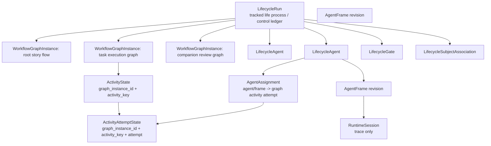

# Session / Lifecycle 存量结构与迁移决策

## 1. 分支观察

当前分支 `codex/refactor-lifecycle-control-plane` 相对 `main` 的新增内容只有文档，没有产品代码实现。

相关提交：

- `653acb38 docs(lifecycle): 梳理 Agent 运行时收束模型`
- `5c191de8 docs(lifecycle): 补全控制面重构评估计划`
- `e5f80577 docs(lifecycle): 梳理Agent控制面抽象边界`

相关文档集中在 `.trellis/tasks/06-01-lifecycle-control-plane-concept-alignment/`。这些文档已经形成方向：`Session` 降级为 runtime substrate，控制面收束到 `LifecycleRun -> LifecycleAgent -> AgentFrame -> RuntimeSession`。但实现与部分 spec 仍有旧结构残留，需要本任务把迁移决策固定下来。

本轮结构盘点覆盖的一级来源：Session persistence SPI、session construction / launch / context、connector execution frame、hook runtime snapshot、workflow domain entity / value objects / run link、API DTO、frontend generated contracts / services，以及 migrations 中的 session、lifecycle、link、permission 表结构。

## 2. Lifecycle 容器语义

原始讨论里的核心约束是：`LifecycleRun` 是 tracked life process / control ledger，不是一个 `WorkflowGraph` 的 run。多 Activity graph 本身不是 child run 判据；只要仍属于同一个被追踪的执行生命过程，复杂子图、并发 agent、companion/task executor graph 都应留在同一个 `LifecycleRun` 容器内。

因此目标模型必须支持：

- 一个 `LifecycleRun` 内挂载多个 `WorkflowGraphInstance`。
- 每个 graph instance 引用一个 `WorkflowGraph` 定义，并有自己的 entry、activity state、attempt namespace、artifact/port scope。
- 多个 graph instance 共享同一个 lifecycle-level causality、gate、artifact exchange surface、subject associations 与 agent/frame 体系。
- 只有出现独立生命周期、独立上下文信道、独立权限/控制边界、独立导航管理或跨对象长期投影时，才升级为 linked/spawned `LifecycleRun`。



当前代码里的 `LifecycleRun.lifecycle_id -> ActivityLifecycleDefinition` 是单 graph pointer；目标上应迁为 root `WorkflowGraphInstance`，而不是继续把 `LifecycleRun` 建模成某张图的直接 run。

## 3. 目标词汇

| 目标名 | 目标语义 | 当前主要来源 |
| --- | --- | --- |
| `RuntimeSession` | turn、tool call、event log、resume、debug、context projection 的运行轨迹容器 | 当前 `Session` / `SessionMeta` / `session_events` |
| `LifecycleRun` | 一个被追踪的执行生命过程；可容纳多个 WorkflowGraphInstance | 当前 `LifecycleRun` |
| `WorkflowGraph` | Lifecycle 下可生效的可执行 Activity graph 配置；产品侧可简称 Workflow | 当前 `ActivityLifecycleDefinition` |
| `WorkflowGraphInstance` | 某个 WorkflowGraph 在 LifecycleRun 内的一次生效实例；Activity state/attempt namespace 归它区分 | 当前缺失；由 `LifecycleRun.lifecycle_id` 迁出 root instance |
| `AgentProcedure` | 单个 Agent Activity 的行为、context、capability、hook 契约 | 当前 `WorkflowDefinition` 的目标语义 |
| `LifecycleAgent` | 某个 LifecycleRun 内的一等 Agent 运行身份 | 新增 |
| `AgentFrame` | LifecycleAgent 某个 revision 的 effective runtime surface：procedure、capability、context、VFS、MCP、runtime refs | 新增；从 `SessionConstructionPlan` / hook runtime / capability state 收束 |
| `AgentAssignment` | LifecycleAgent 到 Activity / ActivityAttemptState 的执行证据桥 | 新增 |
| `LifecycleSubjectAssociation` | SubjectRef 与 run / LifecycleAgent anchor 的关系：subject、source、projection、control scope、lineage | 当前 `LifecycleRunLink` 演化 |
| `LifecycleGate` | human / companion / permission / platform wait-resume 的 durable gate | 新增；替代 in-memory wait 与 session companion context 的混合职责 |
| `RuntimeTraceView` | 面向 UI / debug 的 RuntimeSession 投影，不是领域事实源 | 当前 `/session/:id` 产品视图目标语义 |

## 4. Ownership

| Owner | 拥有的事实 | 不拥有 |
| --- | --- | --- |
| Story | 业务标题、上下文、任务集合、用户可见业务投影 | Runtime session、Agent 状态、工具面、Activity terminal truth |
| Task | 业务工作项 spec；必要时保存 authoring preference | executor session、runtime ownership、Activity 位置 truth |
| LifecycleRun | 生命周期容器、多个 WorkflowGraphInstance、lifecycle-level artifact/gate/event causality、agent 集合 | 业务对象本体、RuntimeSession event log、Agent effective surface、WorkflowGraph 定义本体 |
| WorkflowGraph | Activity graph definition、activities、transitions、ports、artifact binding | LifecycleRun state、runtime trace、业务 subject ownership |
| WorkflowGraphInstance | 某张 graph 在某个 LifecycleRun 内的生效状态命名空间 | Graph definition 本体、RuntimeSession event stream |
| ActivityAttemptState | 某个 Activity 的一次 executor execution record | Subject ownership、Agent capability/context、业务 projection cache |
| LifecycleAgent | run 内 Agent 运行身份、状态、lineage | Runtime event log 细节、Story/Task spec |
| AgentFrame | 某个 revision 的 procedure、capability、context slice、VFS、MCP、runtime refs | 业务 truth、完整 session event stream |
| RuntimeSession | turn / tool / event / resume / debug trace | Story/Task ownership、permission scope、Lifecycle progress truth |
| PermissionGrant | 授权请求、决策、effect provenance | 工具面最终 projection cache |
| Projection | UI/read model 聚合状态 | command input、事实源写入 |

## 5. 存量结构迁移表

| 存量结构 | 使用意图 | 当前作用 | 迁移决策 | 目标映射 |
| --- | --- | --- | --- | --- |
| `sessions` table / `SessionMeta` | 保存 runtime session 元数据 | session 列表、权限检查、恢复、title、executor resume、project 过滤 | 保留为 `RuntimeSession` 元数据；修复 `project_id` 持久读写；不得表达业务 owner | `RuntimeSessionMeta` |
| `session_events` / `PersistedSessionEvent` / `BackboneEnvelope` | 保存 runtime event stream | NDJSON、前端 timeline、replay、projection 输入 | 保留；作为 trace / projection input | `RuntimeSession.events` |
| `session_terminal_effects` | terminal event durable outbox | terminal 后业务副作用异步执行 | 保留；effect 必须通过 AgentFrame / Assignment 找回控制面，不直接反推业务 owner | `RuntimeSessionTerminalEffect` |
| `session_runtime_commands` / `RuntimeCommandRecord` | 保存 runtime capability / phase transition command | pending runtime command replay 与 apply 状态 | 拆分：delivery queue 留在 RuntimeSession，transition truth 迁到 AgentFrame revision / AgentFrame event | `AgentFrameRevision` + `RuntimeDeliveryCommand` |
| `PendingCapabilityStateTransition` | 旧 pending transition JSON 表达 | 已由 `session_runtime_commands` 承接，仍作为 payload 类型 | 迁出 Session 命名；作为 AgentFrame transition value object 或删除旧名 | `AgentFrameTransition` |
| `session_compactions` / `session_projection_segments` / `session_projection_heads` | 保存 session context compaction 与 projection | context query、model context restore、timeline/audit/handoff projection | 保留为 RuntimeSession projection store；若 projection 服务 AgentFrame，新增 frame ref provenance | `RuntimeSessionProjectionStore` |
| `session_lineage` / `SessionLineageRecord` | 保存 session fork / companion / spawned / rollback branch | session lineage UI 与 fork/rollback | 保留但降级为 trace lineage；Agent spawn / companion lineage 不再只靠 session lineage | `RuntimeSessionLineage` + `AgentLineage` |
| `SessionMetaStore` / `SessionPersistence` | Session 持久化 repository 边界 | create/list/update/event/command/projection/lineage 的统一 SPI | 语义改为 RuntimeSession persistence；业务关联查询迁到 association / frame repository | `RuntimeSessionPersistence` |
| `SessionContextBundle` | session 业务上下文 fragment 主数据面 | construction、audit、assembler、continuation context 输入 | 作为 AgentFrame context slice 的输入来源；不再作为跨业务模块事实源 | `AgentFrame.context_slice` |
| `SessionConstructionPlan` / `ResolvedSessionOwner` / `ConstructionProjections` / `ConstructionResolutionPlan` / `SessionConstructionContextProjection` | 组装 launch-ready final facts | owner、workspace、VFS、MCP、capability、context、identity 汇聚 | 降为 `AgentFrameBuilder` 内部 plan；业务模块通过 dispatch/frame 读取稳定结果 | `AgentFrameConstructionPlan` private |
| `LaunchPlan` / `LaunchPlanInput` / `LaunchSummary` / `LifecycleLaunchPlan` / `RuntimeCommandLaunchPlan` / `ConnectorInputPlan` | session launch 的最终投影 | 把 construction 结果拆成 lifecycle、runtime command、connector input | 作为 RuntimeSession adapter 的中间 DTO；目标由 AgentFrame 生成，不保留业务 owner 语义 | `RuntimeLaunchRequest` / connector projection |
| `ExecutionContext` / `ExecutionSessionFrame` / `ExecutionTurnFrame` / `RestoredSessionState` | connector-facing execution frame | connector 启动、恢复、runtime delegate、turn 注入 | 保留为 connector adapter 输入；session frame 的上游事实来自 AgentFrame | `ConnectorExecutionFrame` |
| `CapabilityState` / `SessionMcpServer` | runtime 能力与 MCP surface | connector tool/capability 注入与恢复 | 能力 surface 的权威 revision 迁到 AgentFrame；connector 只消费投影 | `AgentFrame.capability_surface` / `mcp_surface` |
| `SessionContextSnapshot` / `SessionOwnerContext` / `SessionExecutorSummary` / `SessionEffectiveContext` | 展示 session 构造上下文 | `/sessions/{id}/context` 与前端 context 面板 | 迁为 read projection；owner level 来自 `LifecycleSubjectAssociation` / AgentFrame | `AgentFrameContextView` |
| `SessionHookSnapshot` / `SessionSnapshotMetadata` / `HookSessionRuntimeSnapshot` / `HookPendingAction` / `ContextFrame` / `ContextFrameSection` | hook runtime live snapshot、trace、pending action、context frame | hook 执行、workflow advance、frontend hook runtime panel | Hook runtime 成为 AgentFrame runtime facet；session-indexed API 只提供 trace adapter | `AgentFrameHookRuntime` |
| `HookSessionRuntimeAccess` / `HookEvaluationQuery` / `HookResolution` / `HookStepAdvanceRequest` | hook 查询与推进 API | hook script 读取 runtime state 并推进 lifecycle | 改为 AgentFrame / LifecycleRun scoped query；advance request 使用 activity vocabulary | `AgentFrameHookRuntimeApi` |
| `ActiveWorkflowMeta.step_key` / `EffectiveSessionContract.active_step_key` | 表示当前 workflow 节点 | hook metadata、script engine、frontend active workflow | 改为 activity vocabulary；不再使用 step 命名表达目标结构 | `active_activity_key` / `AgentProcedure` |
| `WorkflowDefinition` | 当前保存 workflow contract / hook / capability | 实际更像单 Agent Activity contract | 目标改名为 `AgentProcedure`；迁移可分阶段，不继续扩展其 graph 语义 | `AgentProcedure` |
| `ActivityLifecycleDefinition` | 当前保存 executable graph | lifecycle editor、run 初始化、validation | 目标命名为 `WorkflowGraph`；产品侧可简称 Workflow，但代码和 contract 要避免和 AgentProcedure 混线 | `WorkflowGraph` |
| `LifecycleRun.lifecycle_id` | 当前 run 到单个 graph definition 的直接指针 | run 初始化和 API 默认假设 1 run = 1 graph | 迁为 root `WorkflowGraphInstance`；禁止继续扩大为 lifecycle 容器唯一 graph | `WorkflowGraphInstance(role=root)` |
| `ActivityDefinition` / `ActivityExecutorSpec` | graph node 与 executor 配置 | scheduler、orchestrator、frontend editor | 保留；节点归 `WorkflowGraph`，运行时 state 必须带 graph instance namespace；Agent executor 只引用 `AgentProcedure` | `WorkflowGraphActivity` |
| `AgentSessionPolicy` | Activity 到 Session 的创建/复用策略 | spawn_child / continue_root / attach_existing | 迁为 Agent policy；不得作为 Activity 直接 session binding 规则长期存在 | `AgentPolicy` |
| `ActivityTransition` / `ArtifactBinding` | graph flow / artifact 数据流 | lifecycle editor、engine 推进 | 保留；artifact edge 归 WorkflowGraph，runtime artifact exchange 归 LifecycleRun / graph instance | `WorkflowGraphTransition` |
| 旧 step columns：`entry_step_key` / `steps` / `edges` / `step_states` | 旧 step lifecycle 模型 | 已由 0050/0068 迁移删除 | 保持删除；不再恢复 step 结构 | 无 |
| `LifecycleRun` | 一次 lifecycle run 状态 | `activity_state`、`execution_log`、`session_id`、run API；当前仍隐含单 graph | 保留为生命周期容器；`session_id` 迁出后删除；graph 运行状态拆为多个 `WorkflowGraphInstance` 下的 activity state | `LifecycleRun` |
| `LifecycleRun.session_id` | run 到 runtime session 快捷关系 | terminal callback、list_by_session、frontend run view、debug | P0 懒变量：迁入 AgentFrame.runtime refs；backfill root agent/frame 后删除 | `AgentFrame.runtime_session_refs` |
| `LifecycleRunRepository::list_by_session` | 从 session 反查 run | workflow terminal、VFS lifecycle provider、projection、task projector | 删除；只允许 RuntimeSession -> AgentFrame -> LifecycleAgent -> run 的 trace lookup | `AgentFrameRepository::find_by_runtime_session` |
| `ActivityLifecycleRunState` | run 的 Activity 状态机 | attempt、outputs、inputs、status | 保留但增加 graph instance namespace；作为 LifecycleRun 下各 WorkflowGraphInstance 的运行状态 | `WorkflowGraphInstance.activity_state` |
| `ActivityAttemptState` | Activity 的一次 execution record | status、executor_run、started/completed、summary | 保留；不作为 subject anchor；通过 AgentAssignment 关联 Agent；attempt key 必须能区分 graph instance | `ActivityAttemptState(graph_instance_id, activity_key, attempt)` |
| `ExecutorRunRef::AgentSession` | attempt 到 runtime session 的证据 | scheduler、journey VFS、frontend generated contracts | 降级为 runtime evidence；新增 assignment/frame refs 后不再作为 routing root | `AgentAssignment` + `RuntimeSessionRef` |
| `LifecycleExecutionEntry.step_key` / `StepActivated` / `StepCompleted` | execution log | 记录 lifecycle 执行日志 | 改成 activity vocabulary；迁移旧 event kind / field 命名 | `LifecycleExecutionEntry.activity_key` |
| `activity_execution_claims` / `ActivityExecutionClaim` | Activity 执行 claim 与幂等 | scheduler claim、executor start | 保留；claim key 增加 graph instance 维度，并与 AgentAssignment 建立明确对应关系 | `ActivityExecutionClaim` + `AgentAssignment` |
| `LifecycleRunLink` / `lifecycle_run_links` | run 与 Story/Task/Project/Routine/External 的关系 | 替代 SessionBinding 的 run-level ownership | 演化为 `LifecycleSubjectAssociation`，新增 actor anchor；role 语义继续保留 | `LifecycleSubjectAssociation(anchor_run_id, anchor_agent_id?)` |
| `session_bindings` | 旧 session -> owner binding | 已由 0071 删除 | 保持删除；不得用 DTO 名义复活 | 无 |
| `SessionBindingOwnerResponse` / `SessionBindingResponse` / `binding_id` | route-local binding 形状 | Story/Project session 列表、session owner 响应 | 改为 Subject / Agent / Runtime refs；不再叫 binding | `SubjectExecutionView` / `LifecycleSubjectAssociationDto` |
| `ListSessionsQuery.owner_type/owner_id` | 旧 owner 过滤 | session list 目前主要按 project 过滤 | 改为 runtime trace query；业务过滤走 subject / agent view | `RuntimeSessionQuery` |
| `ProjectSessionEntry` / session grouping owner tree | 项目 active sessions UI | 按 project/story/task/orphan 与 parent session 分组 | 迁为 ProjectActiveAgents / SubjectExecutionView；Session tree 降为 trace drilldown | `ProjectActiveAgentsView` |
| `StorySessionEntry` / Story session panel | Story 级 session 列表 | Story 页面运行入口 | 迁为 Story subject runs / agents | `SubjectExecutionView(kind=Story)` |
| `WorkflowRun` frontend type / `runsBySessionId` | 前端 workflow run read model | `session_id` 为主索引，后端已可空；命名也暗示 run=workflow graph run | 改为 `runsById` + agent/subject indexes；`LifecycleRunView` 包含多个 graph instances；`session_id` 只在 trace view 可选 | `LifecycleRunView.workflow_graph_instances` |
| `SessionRunContext` / `SessionReturnTarget` | session 页面导航与返回目标 | `/session/:id` 根据 run_context 回 Story/Task/Project | 迁为 RuntimeTraceView 的反查 projection；主导航从 Subject/Agent 进入 | `RuntimeTraceNavigation` |
| `Task.lifecycle_step_key` | Task 指向 workflow step/activity | task view projector 与 Story page 展示 | P0 懒变量：Task 不保存 runtime 位置；迁到 SubjectRef + AgentAssignment projection | `SubjectExecutionView.task_projection` |
| `Task.status` / `Task.artifacts` | Task view 状态与产物 | 当前可由 ActivityAttemptState 回投影 | 拆成 projection cache 或完全派生；若缓存必须带 source refs | `TaskProjection(source_run_id, agent_id, activity_key, attempt)` |
| `Task.agent_binding` | Task 希望使用的 agent 配置 | Task direct execution 与默认 agent 感知 | 不作为 runtime owner；迁为 dispatch policy / request override / authoring preference | `ExecutionIntent.procedure_override` / dispatch policy |
| `SessionMeta.companion_context` / companion wait registry | companion parent-child、slice、wait/adoption | session 上混合 companion lineage、gate、context slice | 拆成 AgentLineage、LifecycleGate、AgentFrame context slice、runtime provenance | `AgentLineage` + `LifecycleGate` |
| `permission_grants.session_id/run_id` | permission request / grant provenance | session active grants、run index | source runtime session 只作 provenance；effect anchor 到 AgentFrame revision，scope 通过 association | `PermissionGrant(effect_frame_id, source_runtime_session_id)` |
| `CancelSessionResponse` / `SessionEventResponse` / `SessionForkResponse` / `SessionProjectionViewResponse` / `SessionLineageViewResponse` | session route generated contracts | cancel、event polling、fork、projection、lineage 页面契约 | 保留为 RuntimeTrace contracts；不扩展为业务控制面 | `RuntimeTraceContracts` |
| `StartWorkflowRunRequest` / `StoryRunOverviewDto` / `TaskSessionResponse` | lifecycle/task API route DTO | 从 story/task/workflow 页面启动或展示 run/session 关系 | 输入改为 `ExecutionIntent`，输出改为 subject/run/agent/frame/runtime refs | `ExecutionDispatchResult` / `SubjectExecutionView` |

## 6. P0 迁移决策

### 6.1 LifecycleRun 是多 WorkflowGraph 容器

`LifecycleRun` 是生命周期容器，不是某个 `WorkflowGraph` 的 run。目标上一个 `LifecycleRun` 可以包含多个 `WorkflowGraphInstance`，用于表达 root flow、same-run task execution graph、companion/review graph、routine phase graph 等同一生命过程内的可执行拓扑。

目标结构方向：

```text
LifecycleRun
  -> WorkflowGraphInstance(run_id, graph_id, role, status, activity_state)
  -> LifecycleAgent
  -> AgentAssignment(run_id, graph_instance_id, activity_key, attempt)
  -> ActivityAttemptState(graph_instance_id, activity_key, attempt)
```

child / spawned `LifecycleRun` 只表达新的生命周期控制边界，不表达“出现了子图”。如果仍共享同一 lifecycle-level ports/artifacts/VFS/timeline/gates，复杂 graph 应作为同一 `LifecycleRun` 内的 `WorkflowGraphInstance`。

### 6.2 RuntimeSession 只保留运行轨迹

`RuntimeSession` 保留 event、turn、tool、resume、debug、projection、compaction、trace lineage。任何 Story / Task / Project / Permission ownership 都不能从 RuntimeSession 本体直接推导。

正确查询方向：

```text
RuntimeSession
  -> AgentFrame(runtime_session_ref)
  -> LifecycleAgent
  -> LifecycleSubjectAssociation
  -> SubjectRef
```

### 6.3 LifecycleRunLink 升级为 actor-aware association

目标结构：

```text
LifecycleSubjectAssociation
  id
  anchor_run_id
  anchor_agent_id?
  subject_kind
  subject_id
  role
  metadata
  created_at
```

约束：

- `anchor_agent_id = null` 表示 whole-run association。
- `anchor_agent_id != null` 表示某个 LifecycleAgent 正在处理或投影该 subject。
- Activity / ActivityAttemptState 不作为 subject anchor；它们通过 AgentAssignment 和 artifact/event 提供执行证据。

### 6.4 AgentFrame 是 runtime surface 事实源

`AgentFrame` 以 revision row 为首选建模方式。每次 capability / context / VFS / MCP / procedure / runtime refs 有控制面意义的变化，写新 frame revision 或 frame event，并更新 agent current frame。

目标字段：

```text
agent_frames
  id
  agent_id
  revision
  procedure_id
  activity_key?
  effective_capability_json
  context_slice_json
  vfs_surface_json
  mcp_surface_json
  runtime_session_refs_json
  created_by_kind
  created_by_id
  created_at
```

### 6.5 ActivityAttemptState 保留，但不再承载 Agent 身份主线

`ActivityAttemptState` 继续记录 attempt 状态、executor terminal、artifact evidence。Agent 身份、frame revision、runtime refs 通过 `AgentAssignment` 连接：

```text
LifecycleAgent
  -> AgentAssignment(run_id, graph_instance_id, activity_key, attempt)
  -> ActivityAttemptState(graph_instance_id, activity_key, attempt)
```

### 6.6 Task 不拥有 runtime truth

Task 是业务 spec / 用户查看对象。执行入口是：

```text
SubjectRef(kind=Task, id=task_id)
  -> ExecutionIntent
  -> LifecycleDispatchService
  -> LifecycleAgent / AgentFrame / AgentAssignment
```

`Task.lifecycle_step_key`、`Task.status`、`Task.artifacts`、`Task.agent_binding` 不再作为运行事实源。

## 7. 优先复核点

`SessionMeta.project_id` 已在 SPI 类型和 migration 中存在，并且 API create/list/permission 依赖它；但 `PostgresSessionRepository` 的 `INSERT` / `SELECT` 列表当前未包含 `project_id`。这不是本任务的实现范围，但应作为后续 `target-anchors-schema` 或 `spec-update` 的首个验证项，因为它会影响 RuntimeSession 是否真的只作为 project-scoped trace 被查询。

证据：

- `crates/agentdash-spi/src/session_persistence.rs:261`
- `crates/agentdash-infrastructure/migrations/0071_drop_session_bindings.sql:6`
- `crates/agentdash-infrastructure/src/persistence/postgres/session_repository.rs:155`
- `crates/agentdash-infrastructure/src/persistence/postgres/session_repository.rs:184`

## 8. 需要同步的 Spec

| Spec | 需要同步的点 |
| --- | --- |
| `.trellis/spec/project-overview.md` | 移除 Story durable session / LifecycleRun 1:1 Story session 的旧表述 |
| `.trellis/spec/backend/story-task-runtime.md` | 更新 `LifecycleRun.session_id`、`Task.lifecycle_step_key`、Task projection 归属 |
| `.trellis/spec/backend/session/session-startup-pipeline.md` | 移除 freeform `SessionBinding(owner_type=Project)` 旧启动表述 |
| `.trellis/spec/backend/workflow/lifecycle-run-link.md` | 从 run-level link 更新为 actor-aware subject association |
| `.trellis/spec/backend/workflow/activity-lifecycle.md` | 明确 `LifecycleRun` 可包含多个 `WorkflowGraphInstance`，当前 `lifecycle_id` 只是 root graph 迁移来源 |
| `.trellis/spec/backend/session/architecture.md` | 明确 Session -> RuntimeSession demotion，与 AgentFrame projection 边界 |
| `.trellis/spec/frontend/workflow-activity-lifecycle.md` | 更新 run view 不再以 `session_id` 为主索引 |
