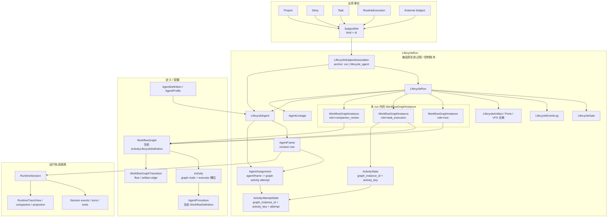

# Session / Lifecycle 目标状态蓝图

## 目的

本文是 Session / Lifecycle 控制面重构的最终目标状态蓝图。它用于锁定验收结果，防止实现阶段把旧 `Session`、旧 `Lifecycle`、旧 `Workflow`、旧 `Activity` 概念换名后继续贯穿新链路。

`design.md` 负责存量结构迁移矩阵；`concept-boundaries.md` 负责新增概念的职责与腐化信号；本文负责定义最终状态、命名落点、事实源边界、阶段出口和全局验收。

本文复核来源：

- `.trellis/tasks/06-01-lifecycle-control-plane-concept-alignment/semantic-inventory.md`
- `.trellis/tasks/06-01-lifecycle-control-plane-concept-alignment/lifecycle-entity-association-map.md`
- `.trellis/tasks/06-01-lifecycle-control-plane-concept-alignment/agent-operation-predicates.md`
- `.trellis/tasks/06-01-lifecycle-control-plane-concept-alignment/refactor-plan.md`

## 重构模式

本轮重构采用 breaking-mode 迁移窗口：

- 允许重构期间系统不可启动、接口不可用、前端页面崩溃、局部测试失败。
- 不保留兼容双轨，不写 fallback，不为了中间态稳定继续维护旧字段。
- 优先先删除旧入口和旧事实源，再补齐新链路；避免旧链路在实现过程中继续被消费。
- 子任务的验收重点是蓝图不变量是否推进，而不是中间产品体验是否稳定。
- 只在每个子任务退出时要求能证明该切片的目标事实源成立；跨子任务期间允许代码处于不完整迁移状态。
- 若“保持系统可用”和“切断旧语义”冲突，优先切断旧语义。

## 原始讨论复核结论

原始讨论文档中已经形成的硬约束如下：

- `Lifecycle` 是执行生命过程的追踪控制平面 / 控制账本，不是可执行图配置，也不是 runtime session 容器。
- `LifecycleRun` 保留为代码名，语义必须解释为被追踪的生命过程。它不是 `RuntimeSession` 容器，也不是单个 `WorkflowGraph` 的 run。
- `Workflow` 应留给可执行图配置。为了避免和旧 `WorkflowDefinition` 混线，代码 / contract 目标名使用 `WorkflowGraph`，产品侧可简称 Workflow。
- 当前 `ActivityLifecycleDefinition` 是图配置，应迁为 `WorkflowGraph`。
- 当前 `WorkflowDefinition` 是单个 Agent Activity 的行为、context、capability、hook 契约，应迁为 `AgentProcedure`。
- 多 Activity graph / subgraph 本身不是 child run 判据；同一被追踪生命过程中的复杂 graph、Task executor graph、companion review graph 可以同时存在于同一个 `LifecycleRun`。
- child / linked / spawned `LifecycleRun` 只表达新的生命周期、上下文信道、权限/控制边界、导航管理边界或跨对象长期投影边界。
- `ActivityAttemptState` 保留为 Activity 的一次 executor 执行记录，不作为 subject 锚点，也不承载 Agent 身份主线。
- `LifecycleSubjectAssociation` 只使用 run / `LifecycleAgent` 锚点；Activity / Attempt 通过 `AgentAssignment` 与 artifact/event 提供执行证据。
- `RuntimeSession` 只表达 turn、tool call、event log、resume/debug、trace/projection，不拥有业务归属、权限范围、Lifecycle 进度或 Agent 生效运行面。

## 最终架构



## 词汇锁定

| 当前/旧结构 | 目标名称 | 最终含义 | 迁移规则 |
| --- | --- | --- | --- |
| `Session` / `SessionMeta` | `RuntimeSession` / `RuntimeSessionMeta` | runtime event/turn/tool/resume/debug trace | 保留 session 持久化作为 trace；移除 business owner/control 含义。 |
| `Lifecycle` | `Lifecycle` | 追踪控制平面 / 控制账本 | 永远不作为 graph config 或 session container。 |
| `LifecycleRun` | `LifecycleRun` | 一个被追踪的执行生命过程；容纳 agents、gates、associations、events 和多个 graph instances | 保留名称；删除 `session_id`；将 `lifecycle_id` 迁到 root graph instance。 |
| `LifecycleRun.lifecycle_id` | `WorkflowGraphInstance(role=root)` | run 到单个 graph definition 的过渡指针 | backfill root instance；新状态使用 graph instances。 |
| `ActivityLifecycleDefinition` | `WorkflowGraph` | 可执行 activity graph definition | 在破坏性窗口重命名 table/type/API。 |
| `WorkflowDefinition` | `AgentProcedure` | 单个 Agent Activity 的 behavior/capability/context/hook contract | 重命名；`workflow_key` 改为 procedure reference。 |
| `ActivityDefinition` | `Activity` / `WorkflowGraphActivity` | 带 executor、ports、policy 的 graph node | runtime identity 是 `(graph_instance_id, activity_key)`。 |
| `ActivityTransition` / `ArtifactBinding` | `WorkflowGraphTransition` / graph artifact binding | graph-level flow 和 artifact dependency | runtime exchange 归 LifecycleRun / graph instance。 |
| `ActivityLifecycleRunState` | `WorkflowGraphInstance.activity_state` | 某个 graph instance 下的 Activity state | 增加 graph instance 命名空间。 |
| `ActivityAttemptState` | `ActivityAttemptState` | 某次 activity attempt 的执行证据 | 用 `graph_instance_id + activity_key + attempt` 定位；通过 assignment 关联 Agent。 |
| `ActivityExecutionClaim` | `ActivityExecutionClaim` | 某次 activity attempt 的持久 claim / 幂等锚点 | 增加 graph instance 命名空间和 assignment ref。 |
| `ExecutorRunRef::AgentSession` | `RuntimeSessionRef` evidence under `AgentAssignment` / `AgentFrame` | runtime evidence，不是 agent identity | 保留 provenance；停止通过它路由。 |
| `LifecycleRunLink` | `LifecycleSubjectAssociation` | SubjectRef 到 whole run 或 LifecycleAgent 的关系 | 增加 `anchor_agent_id`；Activity/Attempt 保持为 evidence。 |
| `CapabilityState` / `PendingCapabilityStateTransition` | `AgentFrame` / `AgentFrameTransition` | 生效 capability surface 和 revision cause | Frame 是权威；RuntimeSession 只接收 delivery snapshot。 |
| `SessionConstructionPlan` / `LaunchPlan` | `AgentFrameConstructionPlan` / `RuntimeLaunchRequest` | frame builder 的内部输出和 runtime adapter 请求 | 业务模块消费 dispatch/frame refs，不消费 construction plan。 |
| `HookSessionRuntime` / `SessionHookSnapshot` | `AgentFrameHookRuntime` | AgentFrame 的 live/runtime facet | session-indexed access 只保留 trace adapter。 |
| `SessionContextBundle` / `ContextFrame` | `AgentFrame.context_slice` / context projection | AgentFrame 可见的生效 context | RuntimeSession projection 只是 provenance/read model。 |
| `SessionMcpServer` / VFS / canvas surface | `AgentFrame.mcp_surface` / `vfs_surface` | AgentFrame 的生效 runtime surface | runtime connector 只消费投影后的 surface。 |
| `SessionLineage` | `RuntimeSessionLineage` + `AgentLineage` | trace lineage 和 agent spawn/delegation lineage | UI control tree 使用 AgentLineage；session lineage 保持为 debug trace。 |
| `SessionBinding*` DTO / `binding_id` | `LifecycleSubjectAssociationDto` / subject execution refs | route-local legacy owner shape | 移除 binding vocabulary。 |
| `ListSessionsQuery.owner_type/owner_id` | runtime trace query + subject/agent views | 只作为 debug/listing filter | 业务过滤通过 subject/agent views。 |
| `WorkflowRun.session_id` / `runsBySessionId` | `LifecycleRunView` / run-subject-agent indexes | frontend lifecycle read model | Run view 包含 graph instances 和 runtime trace refs。 |
| `Task.lifecycle_step_key` | `SubjectExecutionView.task_projection` | 从 subject association + assignment 派生的 projection | 从 Task spec 移除。 |
| `Task.status` / `Task.artifacts` | `TaskProjection` | 带 source refs 的 derived/cached projection | 若持久化，只能带 source run/agent/graph/activity/attempt revision。 |
| `Task.agent_binding` | dispatch policy / procedure override / authoring preference | request-time policy，不是 runtime owner | 从 Task runtime truth 中移出。 |
| `permission_grants.session_id/run_id` | `PermissionGrant(effect_frame_id, source_runtime_session_id)` + control-scope association | grant source/effect split | Frame 接收 capability revision；runtime session 保留 audit provenance。 |
| `RoutineExecution.session_id/status` | routine source association + dispatch status + execution projection | trigger truth 与 lifecycle terminal projection 分离 | status 不表示 Agent 工作完成，除非来自 run/agent projection。 |
| `ProjectAgent.default_workflow_key` | AgentProcedure selection 或 explicit WorkflowGraph selection | 旧 single-agent shortcut | WorkflowGraph / AgentProcedure 拆开后移除。 |

## 概念边界锁定

新增概念的职责边界以 [concept-boundaries.md](./concept-boundaries.md) 为准。任何子任务引入或修改这些概念时，必须能说明它推动了哪个事实源、不变量、查询边界或生命周期；不能只把旧字段搬进新名字。

## 目标最小合同

本节是执行锁。后续实现可以调整字段命名，但不能改变事实归属、创建者和查询方向。

| 概念 | 最小事实 | 身份 / 唯一性 | 创建 / 更新者 | 主查询方向 |
| --- | --- | --- | --- | --- |
| `RuntimeSession` | event stream、turn/tool log、resume/debug、projection/compaction、trace lineage | `runtime_session_id` | runtime connector / session persistence | trace view；反查只能走 `RuntimeSession -> AgentFrame -> LifecycleAgent -> LifecycleRun` |
| `LifecycleRun` | tracked life process、lifecycle events、gates、artifacts、agents、graph instances、subject associations | `run_id` | `LifecycleDispatchService` 或迁移 backfill | `run_id -> graph instances / agents / associations / gates` |
| `WorkflowGraph` | Activity graph definition、activities、transitions、ports、artifact bindings | `graph_id` / stable graph key | definition/editor service | definition lookup；不持有 runtime state |
| `WorkflowGraphInstance` | graph 在某个 run 内的一次生效实例、role、status、activity state namespace | `graph_instance_id`；root 通过 `(run_id, role=root)` 唯一 | dispatch / schema backfill / scheduler | `run_id -> graph_instance_id -> activity state / attempts` |
| `LifecycleAgent` | run-scoped Agent runtime identity、role、status、lineage、current frame pointer | `agent_id`，且只属于一个 `run_id` | dispatch / companion / routine policy | `run_id -> agents`；`agent_id -> frames / assignments / subject associations` |
| `AgentFrame` | procedure、capability、context slice、VFS/MCP surface、runtime session refs、revision provenance | `(agent_id, revision)`；`current_frame_id` 指向当前 revision | AgentFrame builder / permission / context transition | `agent_id -> frame revisions`；`runtime_session_id -> frame` 只作为 trace 反查 |
| `AgentAssignment` | agent/frame 到 graph activity attempt 的执行桥、lease/provenance | `assignment_id`；必须包含 `run_id + graph_instance_id + activity_key + attempt` | scheduler / orchestrator | `graph_instance_id + activity_key + attempt -> assignment -> agent/frame` |
| `ActivityAttemptState` | attempt status、executor terminal、timestamps、outputs/artifacts evidence | `graph_instance_id + activity_key + attempt` | workflow scheduler / terminal handling | attempt evidence；不直接持有 subject 或 agent truth |
| `LifecycleSubjectAssociation` | `SubjectRef` 到 whole run 或 `LifecycleAgent` 的 role/source/projection/control/lineage metadata | `association_id`；anchor 只能是 run 或 agent | dispatch / task / companion / routine / permission policy | `subject -> associations`；`run/agent -> subjects` |
| `LifecycleGate` | durable wait/review/resume 点、correlation、payload、status、resolver | `gate_id` / correlation id | companion / human / permission / platform wait path | `run/agent/frame -> open gates`；gate resolution resumes agent/frame context |
| `AgentLineage` | agent spawn/delegation/companion relation | child agent + parent agent/run relation | dispatch / companion policy | control tree；不从 session lineage 推断 ownership |
| `TaskProjection` | 从 lifecycle facts 派生的 status/artifact/current agent view | source refs + projection revision | projection service | UI read model；不能作为 command input |

## 标准谓词

任何实现切片完成后，都必须能用下面的谓词回答运行状态：

```text
LifecycleAgent A in LifecycleRun R
acts on SubjectRef S,
uses AgentFrame F,
is assigned to WorkflowGraphInstance G / Activity X / Attempt N,
sees capabilities/context/VFS/MCP from F,
and emits RuntimeSession RS only as trace.
```

标准正向链路：

```text
SubjectRef
  -> LifecycleSubjectAssociation(anchor_run_id, anchor_agent_id?)
  -> LifecycleRun / LifecycleAgent
  -> AgentFrame
  -> RuntimeSession trace refs

LifecycleRun
  -> WorkflowGraphInstance
  -> ActivityState / ActivityAttemptState
  -> AgentAssignment
  -> LifecycleAgent / AgentFrame
```

标准反向 trace 链路：

```text
RuntimeSession
  -> AgentFrame
  -> LifecycleAgent
  -> LifecycleRun
  -> LifecycleSubjectAssociation
```

如果一个 command path 必须从 `RuntimeSession`、`SessionBinding`、`owner_type/owner_id`、`Task.lifecycle_step_key` 或 top-level `WorkflowRun.session_id` 开始才能找到业务归属，它没有达到目标状态。

## 蓝图阶段

### B0. 词汇与契约冻结

目标：规格文档与 route/generated contracts 不再错误描述旧目标。

退出状态：

- `LifecycleRun` 被文档化为可容纳多个 `WorkflowGraphInstance` 的容器。
- `WorkflowGraph` 是当前 `ActivityLifecycleDefinition` 的目标。
- `AgentProcedure` 是当前 `WorkflowDefinition` 的目标。
- `RuntimeSession`、`LifecycleAgent`、`AgentFrame`、`AgentAssignment`、`LifecycleSubjectAssociation`、`LifecycleGate` 成为稳定契约名。
- command input 使用稳定 refs/intents，而不是 read views。
- `concept-boundaries.md` 中的概念边界被写入持久规格文档，或被模块 spec 显式引用。

### B1. 目标锚点 Schema

目标：在删除旧快捷路径之前先建立目标事实源。

退出状态：

- `lifecycle_workflow_instances`、`lifecycle_agents`、`agent_frames`、`agent_assignments`、`lifecycle_subject_associations`、`lifecycle_gates`、`agent_lineages` 的 tables/entities/repositories 已存在。
- 现有 `LifecycleRun.lifecycle_id` 已 backfill 到 `WorkflowGraphInstance(role=root)`。
- 现有 `LifecycleRun.session_id` 已 backfill 到 root `LifecycleAgent` / `AgentFrame.runtime_session_refs`。
- 现有 `LifecycleRunLink` 已 backfill 到 whole-run `LifecycleSubjectAssociation`。
- `SessionMeta.project_id` 的持久化读写已验证并修复。

### B2. Lifecycle Dispatch

目标：所有业务执行从 intent 开始，并明确选择 same-run graph instance 或 linked run。

退出状态：

- `ExecutionIntent` 能表达 `SubjectRef`、graph/procedure selection、dispatch policy、context/capability policy 与 runtime policy。
- `ExecutionDispatchResult` 返回 run、graph instance、agent、frame、runtime session、gate 与 subject execution refs。
- ProjectAgent open、Task execution、Companion dispatch 与 Routine fire 可以共用同一个 dispatch service。
- Dispatch 可以向现有 `LifecycleRun` 追加 `WorkflowGraphInstance`，不必创建 child run。

### B3. AgentFrame Construction

目标：生效 runtime surface 只有一个权威事实源。

退出状态：

- StepActivation、SessionConstructionPlan、Hook runtime、capability/context/VFS/MCP projection 收束进 `AgentFrame` / frame builder。
- Runtime launch 从 `AgentFrame` 投影到 connector `ExecutionContext`。
- Pending capability/context transitions 创建 frame revisions 或 frame events。
- 业务模块不能 import runtime launch/construction internals。

### B4. Activity Execution 与 Assignment

目标：scheduler/orchestrator/terminal callbacks 停止把 session 当作 lifecycle route。

退出状态：

- Scheduler 在 attempt 执行证据之前或同时创建 `AgentAssignment`。
- Activity claim、assignment、attempt key 都包含 `graph_instance_id + activity_key + attempt`。
- Runtime terminal callback 通过 `RuntimeSession -> AgentFrame -> LifecycleAgent -> AgentAssignment -> ActivityAttemptState` 解析。
- advance、terminal、hook 或 VFS lifecycle resolution 不再需要 `LifecycleRun.session_id` 与 `list_by_session`。

### B5. Business Subject Migration

目标：Story / Task / Companion / Routine / Permission 成为 lifecycle facts 的消费者，而不是 runtime owner。

退出状态：

- Task execution 使用 `SubjectRef(kind=Task)`，并产出 `SubjectExecutionView` / `TaskProjection`。
- Companion wait/adoption 使用 durable `LifecycleGate`、`AgentLineage` 与 frame contributions。
- RoutineExecution 记录 dispatch/source truth，并单独投影 run/agent terminal status。
- Permission grant 拆分 source/effect；capability effect 落在 `AgentFrame`，control scope 落在 association。
- ProjectAgent 是 `LifecycleAgent` 的 profile/source，不是 session owner。

### B6. Contracts 与前端视图

目标：UI 读取目标模型，而不是重建 session tree。

退出状态：

- generated contracts 暴露 `LifecycleRunView`、`WorkflowGraphInstanceView`、`LifecycleAgentView`、`AgentFrameRuntimeView`、`SubjectExecutionView`、`ProjectActiveAgentsView`、`RuntimeSessionTraceView`。
- 前端 stores 按 run、graph instance、subject、agent、frame 归一化。
- `/session/:id` 是 runtime trace view，不是业务运行根入口。
- Project / Story / Task 页面从 subject/agent views 导航，并可下钻到 runtime trace。

### B7. Legacy API 与字段移除

目标：移除会让旧语义复活的快捷路径。

退出状态：

- `lifecycle_runs.session_id` 已删除。
- `LifecycleRunRepository::list_by_session` 与 `/lifecycle-runs/by-session/{session_id}` 已删除，或只保留为 trace-only adapters。
- `LifecycleRun.lifecycle_id` 不再作为 public DTO 中唯一 graph pointer 出现。
- `SessionBinding*`、`binding_id`、`owner_type`、`owner_id` 等 route-local control shapes 已删除。
- `Task.lifecycle_step_key`、session-first task execution responses、前端 `runsBySessionId`、step vocabulary 与顶层 `WorkflowRun.session_id` 已删除。
- `ActivityLifecycleDefinition` / `WorkflowDefinition` 的大范围重命名已完成，或已锁进显式最终重命名任务，期间不允许新增旧语义使用。

### B8. Verification

目标：证明目标状态不仅被建模，而且可运行验证。

退出状态：

- 同一个 `LifecycleRun` 可以容纳多个 `WorkflowGraphInstance`，即使 activity key 重名也不会发生状态污染。
- 同一个 `LifecycleRun` 可以容纳多个并发 `LifecycleAgent`，各自拥有独立 frame 与 runtime session。
- Task projection 可以按 `SubjectRef -> LifecycleSubjectAssociation -> LifecycleAgent -> AgentAssignment -> ActivityAttemptState -> artifacts` 追溯。
- RuntimeSession trace 可以按 `RuntimeSession -> AgentFrame -> LifecycleAgent -> LifecycleRun -> SubjectAssociation` 反查。
- Permission capability changes 可以解释为 `Grant -> AgentFrame revision -> runtime delivery`。
- Child/linked `LifecycleRun` 只因独立 lifecycle/context/control/navigation/projection 边界存在。
- 每个新增概念都通过 `concept-boundaries.md` 的评审清单。

## 子任务映射

| 子任务 | 蓝图阶段 | 必须贡献 |
| --- | --- | --- |
| `06-01-session-lifecycle-spec-convergence` | B0 | 更新 specs，让后续实现先读到目标名称与边界。 |
| `06-01-session-lifecycle-target-anchors-schema` | B1 | 新增 graph instances、agents、frames、assignments、associations、gates、agent lineages 的目标 schema/repositories/backfills。 |
| `06-01-lifecycle-dispatch-service` | B2 | 引入 intent/result service，创建或复用 run、graph instance、agent、frame、runtime refs。 |
| `06-01-agent-frame-construction-migration` | B3 | 将 StepActivation、SessionConstruction、Hook runtime、capability/context/VFS/MCP projection 迁入 AgentFrame construction。 |
| `06-01-workflow-agent-assignment-migration` | B4 | 将 activity execution identity 从 session/attempt 迁到 graph-instance-scoped assignments。 |
| `06-01-task-subject-execution-migration` | B5 | 将 Task execution 改为 SubjectRef dispatch 和 projection。 |
| `06-01-companion-gate-lineage-migration` | B5 | 将 companion execution 默认改为 same-run agent/graph/gate，只有边界成立时才 linked run。 |
| `06-01-routine-run-source-migration` | B5 | 将 routine execution 改为 source association + dispatch/execution projection。 |
| `06-01-frontend-actor-subject-views` | B6 | 用 lifecycle graph instance、subject、agent、frame、runtime trace views 替代 session tree UI。 |
| `06-01-session-first-api-demotion` | B7 | 移除保留 session-first 或 single-graph 语义的 legacy fields/APIs/DTOs。 |

## 最终验收锁

只有以下条件全部成立，才算完成本轮重构：

- product/control-plane commands 从 `ExecutionIntent`、`SubjectRef`、run/agent/frame refs 或 graph instance refs 开始。
- 没有 product command 需要 `RuntimeSession` id 来发现 business ownership、current lifecycle progress、permission scope 或 active Agent surface。
- `LifecycleRun` 可以包含多个 `WorkflowGraphInstance` records；activity state、attempts、claims、assignments 都以 graph instance 为命名空间。
- `WorkflowGraph` 与 `AgentProcedure` 在代码、contracts 或 UI 命名中不再混淆。
- `RuntimeSession` 仍完整支持 event stream、replay、resume、debug、compaction 与 trace view。
- `LifecycleSubjectAssociation` 与 `AgentAssignment` 能共同回答哪个 business subject 由哪个 Agent 处理，以及哪个 Activity attempt 产出了证据。
- `AgentLineage` 回答 Agent spawn/delegation/companion control tree；`RuntimeSessionLineage` 只保留 trace/debug/fork 语义。
- Task、Companion、Routine、ProjectAgent、Permission 路径都使用同一套 lifecycle/agent/frame dispatch vocabulary。
- 旧 `SessionBinding`、`LifecycleRun.session_id`、session-first run lookup、Task runtime fields、step vocabulary 不能作为新实现捷径。
