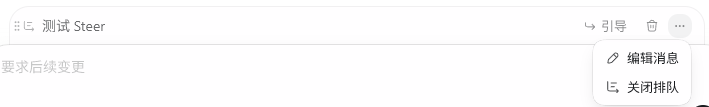

# 排队消息 UI 参考（用户截图）

原图：

## 已排队消息行（pending message row）

```
┌────────────────────────────────────────────────────────────┐
│ ⋮↪ 测试 Steer                          ↪ 引导   🗑   ⋯       │
└────────────────────────────────────────────────────────────┘
                                              ┌─ ⋯ 菜单 ──────┐
                                              │ ✏️ 编辑消息    │
                                              │ ↪ 关闭排队    │
                                              └──────────────┘
┌────────────────────────────────────────────────────────────┐
│ 要求后续变更                                                  │  ← 下方正常 composer
└────────────────────────────────────────────────────────────┘
```

- 行首：拖拽手柄(⋮)+图标 + 消息预览（图中「测试 Steer」）。
- 行尾动作：
  - **「↪ 引导」**：把这条排队消息立即作为 steer 注入运行中 turn（pending → steer 提升）。
  - **🗑 删除**：移除这条排队消息。
  - **「⋯」更多** → **「✏️ 编辑消息」**：业务 = 后端把该排队消息**取消（出队）**，内容**回退到前端 composer 输入框**供用户编辑，用户改完再自行发送/重新排队。
  - （「关闭排队」本期**先不加**。）
- 下方仍是正常 composer（占位「要求后续变更」）：排队的同时可继续输入下一条。
- 拖拽手柄 ⋮ 暗示多条排队可**排序**。

## 键盘分流（用户最终确认）

- **Enter = 排队发送（pending）**：running 态排队、等当前 turn 完成自动接续；idle 态直接发送（新 turn）。
- **Ctrl+Enter = 强制发送（force）**：跳过排队立即送 —— running 态 = 立即 steer 注入；idle 态 = 直接发送。
- **Shift+Enter = 换行**。

（这套取代了之前 Ctrl+Enter 提交的旧方案；@ 文件选择器打开时 Enter 仍优先用于确认选中项，需在 design 消解优先级。）

## 范围修正

- **无语音输入**：所有截图里的麦克风忽略，不实现；发送区只保留单个上箭头/停止方块按钮（形态见 child-3 reference）。
