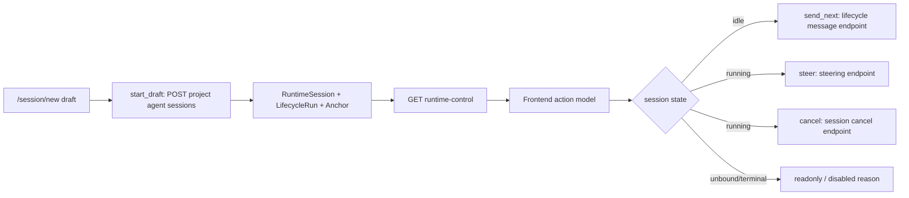

# 技术设计：Session 控制动作模型

## Problem Shape

当前链路把多个不同概念压成了一个 `can_send/customSend`：

- RuntimeSessionExecutionAnchor 是否存在：表示 session 是否能关联到 lifecycle agent 控制面。
- 下一轮用户消息是否可发送：idle 且 agent/frame 可用时才成立。
- 当前 turn 是否 running：决定是否可 cancel，也决定普通 send 是否应该禁用。
- 运行中 steer 是否可用：取决于 active runtime 与 connector steering 支持。

这些概念不能互相替代。正确设计是让后端返回动作能力，前端只渲染能力，不再本地猜测业务事实。

## Backend Contract

更新 `SessionRuntimeControlView`，移除单一 `can_send/send_unavailable_reason` 作为前端控制事实源，改为 action set：

```rust
pub struct SessionRuntimeControlView {
    pub runtime_session_ref: RuntimeSessionRefDto,
    pub session_meta: SessionShellDto,
    pub control_plane: SessionRuntimeControlPlaneDto,
    pub anchor: Option<RuntimeSessionExecutionAnchorDto>,
    pub run: Option<LifecycleRunView>,
    pub agent: Option<LifecycleAgentView>,
    pub frame_runtime: Option<AgentFrameRuntimeView>,
    pub subject_associations: Vec<LifecycleSubjectAssociationDto>,
    pub actions: SessionRuntimeActionSetDto,
}

pub struct SessionRuntimeControlPlaneDto {
    pub status: SessionRuntimeControlPlaneStatus,
    pub reason: Option<String>,
}

pub enum SessionRuntimeControlPlaneStatus {
    UnboundTrace,
    AnchoredIdle,
    AnchoredRunning,
    Terminal,
    FrameMissing,
}

pub struct SessionRuntimeActionSetDto {
    pub send_next: SessionRuntimeActionAvailabilityDto,
    pub steer: SessionRuntimeActionAvailabilityDto,
    pub cancel: SessionRuntimeActionAvailabilityDto,
}

pub struct SessionRuntimeActionAvailabilityDto {
    pub enabled: bool,
    pub unavailable_reason: Option<String>,
}
```

生成的 TypeScript contract 同步更新，前端只消费 `actions`。

## Runtime Control Semantics

`GET /sessions/{id}/runtime-control` 返回 session meta 与 control/action 状态：

| 状态 | 判定 | send_next | steer | cancel |
| --- | --- | --- | --- | --- |
| `unbound_trace` | session 存在但没有 RuntimeSessionExecutionAnchor | false | false | false |
| `anchored_idle` | anchor/run/agent/frame 存在，非 terminal，非 running | true | false | false |
| `anchored_running` | anchor/run/agent/frame 存在，当前 session running | false | true if connector supports steering | true |
| `terminal` | lifecycle agent terminal | false | false | false |
| `frame_missing` | anchor/agent 存在但没有可投递 frame | false | false | running 时可 cancel |

权限仍由 route 按 run.project_id 做 `View` 校验；steer/send/cancel 入口做 `Edit` 校验。

## Steer API

新增显式运行中 steer endpoint：

```text
POST /lifecycle-agents/by-runtime-session/{runtime_session_id}/steering-messages
```

Request:

```json
{
  "prompt_blocks": [{ "type": "text", "text": "..." }]
}
```

Response:

```json
{
  "runtime_session_id": "...",
  "accepted": true,
  "state": { "status": "running", "turn_id": "..." }
}
```

应用层新增 `LifecycleAgentSteeringService`：

1. 解析 RuntimeSessionExecutionAnchor。
2. 校验 run/agent/frame 一致性。
3. 读取 session execution state，只有 running 才接受 steer。
4. 校验 agent 非 terminal。
5. 调用 session control 的显式 steer port。

不要复用 `LifecycleAgentMessageService.dispatch_user_message`，因为它代表新 turn prompt。

## Connector Steering

`AgentConnector` 增加显式能力：

```rust
pub struct ConnectorCapabilities {
    pub supports_steering: bool,
    // existing fields...
}

async fn steer_session(
    &self,
    session_id: &str,
    prompt_blocks: Vec<ContentBlock>,
) -> Result<(), ConnectorError>;
```

现有 `push_session_notification` 保留给能力变更、系统通知等 out-of-band notice。用户 steer 使用 `steer_session`，原因是它是用户输入动作，需要保留 prompt block 语义并在 UI / API / audit 上与 notification 区分。

in-process PiAgent connector 将 prompt blocks 转换为 `AgentMessage::User` content 后调用底层 `agent.steer(...)`。不支持 steering 的 connector 返回明确错误，runtime-control 的 `actions.steer` 同步为 disabled。

relay/codex connector 必须实现 steering。当前 relay 实际只承载 codex 通道，因此实现不做“首版 unsupported”分支：应用层将 prompt blocks 以 steer 命令转发到 relay transport，local/remote codex backend 按协议把消息注入运行中 session。relay steering 失败应返回明确 connector error，并在前端展示为 steer 动作失败，而不是退回新 prompt。

## Frontend Action Model

`SessionPage` 生成 `SessionChatControlState`，传给 `SessionChatView`：

```ts
type SessionChatPrimaryAction =
  | { kind: "start_draft"; enabled: boolean; reason?: string }
  | { kind: "send_next"; enabled: boolean; reason?: string }
  | { kind: "steer"; enabled: boolean; reason?: string }
  | { kind: "none"; enabled: false; reason: string };

interface SessionChatControlState {
  mode: "draft" | "runtime";
  controlPlaneStatus: string;
  primaryAction: SessionChatPrimaryAction;
  cancelAction: { enabled: boolean; reason?: string };
}
```

`SessionChatView` 不再通过 `customSend` 是否存在判断 dispatcher。它只根据 control state：

- `start_draft`：调用 ProjectAgent session start。
- `send_next`：调用 lifecycle message endpoint。
- `steer`：调用 steering endpoint。
- `cancelAction.enabled`：渲染独立取消按钮。

运行中输入框可编辑并显示 steer 占位文案；如果 steer disabled 但 cancel enabled，则输入禁用、取消可用。

## Data Flow



## Relay / Codex Protocol

relay transport 增加运行中控制命令：

```rust
async fn relay_steer(
    &self,
    backend_id: &str,
    session_id: &str,
    prompt_blocks: serde_json::Value,
) -> Result<(), TransportError>;
```

codex 本机后端收到后转换为对应 codex session steering 协议。该链路必须保持同一个 runtime session id，不重新创建 backend execution lease，不触发 `prompt`。

## Migration Notes

本任务预期不新增数据库字段。action state 由 session meta、execution state、anchor、agent、frame、connector capabilities 派生。

若实现时发现必须持久化用户 steer 队列或审计记录，必须创建新的 migration 文件；禁止修改既有 migration。

## Tradeoffs

- 直接替换 `can_send` 而不是兼容旧字段：项目尚未上线，保持 contract 正确比保留错误字段更重要。
- steer 与 send_next 分 endpoint：让并发 prompt 与运行中 steer 在后端边界上不可混淆，避免前端误调用。
- relay/codex 同步贯通：当前 relay 没有多 executor 抽象分歧，省掉这段只会留下交互断层；正确做法是一次性把控制语义穿透到底层 codex 协议。
- cancel 独立按钮：运行中用户既可能 steer，也可能取消，二者不是互斥的 primary action。
