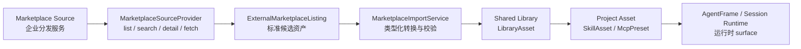

# Design · 外部市场来源接入规划

## 1. 设计立场

外部市场来源是 Marketplace 的发现入口，不是新的运行事实源。首期来源只由源码级 Host Integration 注册，用于接企业分发服务；来源集合跟随企业版发布节奏审查、部署和回滚。

核心链路：



这样做的原因：

- Shared Library 已经承载版本、digest、source-status、安装来源和 Marketplace UI 状态。
- Project Asset 是运行时唯一消费面，可以保持 session construction / AgentFrame 的事实源稳定。
- 企业分发服务的协议差异被收束在 provider 和 import service，不扩散到各业务资源运行链路。

## 2. 概念模型

### MarketplaceSourceDescriptor

用于 UI 和 API 展示来源能力。

```rust
pub struct MarketplaceSourceDescriptor {
    pub source_key: String,
    pub display_name: String,
    pub description: Option<String>,
    pub provider_kind: MarketplaceSourceProviderKind,
    pub supported_asset_types: Vec<LibraryAssetType>,
    pub trust_level: MarketplaceSourceTrustLevel,
    pub enabled: bool,
}
```

首期 `provider_kind`：

- `integration`：由 Host Integration 注册。
- `builtin`：开源版内置 curated source。

建议的 `trust_level`：

- `curated`：平台或部署方维护的受控目录。
- `organization`：组织内部来源。
- `public_index`：公开目录，导入时展示更明确的来源提示。

### MarketplaceSourceProvider

SPI 放在轻量 crate，Integration API 只 re-export trait，不透出 `reqwest`、`sqlx`、`rmcp` 等运行时依赖。

```rust
#[async_trait]
pub trait MarketplaceSourceProvider: Send + Sync {
    fn descriptor(&self) -> MarketplaceSourceDescriptor;

    async fn list_assets(
        &self,
        query: MarketplaceAssetQuery,
    ) -> Result<MarketplaceAssetPage, MarketplaceSourceError>;

    async fn get_asset_detail(
        &self,
        external_id: &str,
    ) -> Result<MarketplaceAssetDetail, MarketplaceSourceError>;

    async fn fetch_asset_payload(
        &self,
        external_id: &str,
    ) -> Result<MarketplaceFetchedAsset, MarketplaceSourceError>;
}
```

`AgentDashIntegration` 可新增：

```rust
fn marketplace_source_providers(&self) -> Vec<Arc<dyn MarketplaceSourceProvider>> {
    vec![]
}
```

宿主启动时收集 source provider，`source_key` 冲突 fail-fast。来源集合跟随企业版源码和部署发布节奏变化，由 Host Integration 装配面统一治理。

### Enterprise Marketplace Listing

Listing 是跨来源的统一候选视图，只承载发现和预览需要的信息。

```rust
pub struct MarketplaceAssetListing {
    pub source_key: String,
    pub external_id: String,
    pub asset_type: LibraryAssetType,
    pub key: String,
    pub display_name: String,
    pub description: Option<String>,
    pub version: String,
    pub tags: Vec<String>,
    pub author: Option<String>,
    pub digest: Option<String>,
    pub updated_at: Option<DateTime<Utc>>,
    pub install_requirements: Vec<MarketplaceInstallRequirement>,
}
```

`external_id` 只在 source 内唯一。导入到 Shared Library 后，建议 `source_ref` 使用：

```text
market:{source_key}:{external_id}
```

### MarketplaceFetchedAsset

Fetched payload 进入 application import service 后按 `asset_type` 强类型转换。

```rust
pub enum MarketplaceFetchedAsset {
    Skill(SkillMarketplacePayload),
    McpServer(McpMarketplacePayload),
}
```

首期只实现 Skill / MCP；枚举保留扩展点给 Capability Pack。

## 3. Skill 来源设计

现状已有：

- `RemoteSkillSource::fetch(url)`：按 URL 拉取 Skill 文件。
- `HttpRemoteSkillSource`：支持 GitHub / ClawHub / skills.sh。
- `SkillAssetService::import_remote`：执行文件定型、metadata 解析、digest、Project SkillAsset 创建。

新增 catalog discovery 后，Skill 市场分两层：

1. Catalog provider 负责 list/search/detail，返回 listing 和可拉取定位。
2. Fetch/import 负责拿到 `SKILL.md` 和附属文件，转换为 `skill_template` LibraryAsset。

建议首期 payload：

```rust
pub struct SkillMarketplacePayload {
    pub source_url: String,
    pub files: Option<Vec<RemoteSkillFile>>,
}
```

规则：

- provider 若只返回 `source_url`，import service 复用 `RemoteSkillSource::fetch` 拉文件。
- provider 若直接返回 files，仍复用 application 层 content typing 与 `validate_skill_files`。
- 文件数量、单文件大小、总大小、根目录 `SKILL.md` 继续由后端统一约束。
- 导入到 Shared Library 时生成 `LibraryAssetPayload::SkillTemplate`，安装到 Project 时走现有 Skill install 语义。

## 4. MCP 来源设计

MCP catalog 只表达可安装模板，不携带用户私密连接材料。

建议 listing/detail 包含：

```rust
pub struct McpMarketplacePayload {
    pub transport_template: McpTransportTemplate,
    pub route_policy: McpRoutePolicy,
    pub parameter_schema: Option<serde_json::Value>,
    pub capabilities: Vec<String>,
    pub tool_preview: Vec<McpToolPreview>,
}
```

`McpTransportTemplate` 应区分模板变量和固定公开字段：

```rust
pub enum McpTransportTemplate {
    Http {
        url_template: String,
        headers_schema: Option<serde_json::Value>,
    },
    Sse {
        url_template: String,
        headers_schema: Option<serde_json::Value>,
    },
    Stdio {
        command_template: String,
        args_template: Vec<String>,
        env_schema: Option<serde_json::Value>,
    },
}
```

导入与安装规则：

- 导入 Shared Library 阶段只保存模板、参数 schema、能力摘要。
- 安装到 Project 时用户填写参数，后端生成 Project MCP Preset。
- 需要 credential/header/env 的值必须来自用户当前安装输入或用户级 connection，不进入公共 LibraryAsset payload。
- 后端继续使用现有 MCP safety mapper，拒绝本机路径、localhost/private network URL 等不适合市场分发的连接材料。
- 安装后可调用现有 probe 返回工具发现结果。

## 5. API 设计

建议新增外部市场 API：

```text
GET  /api/marketplace/sources
GET  /api/marketplace/external-assets?source_key=&asset_type=&query=&cursor=
GET  /api/marketplace/external-assets/{source_key}/{external_id}
POST /api/marketplace/external-assets/import
```

`import` 请求：

```json
{
  "source_key": "corp-skill-hub",
  "external_id": "research-writer",
  "asset_type": "skill_template",
  "import_mode": "upsert_library_asset"
}
```

返回 `LibraryAssetDto`。前端可随后调用现有 `installLibraryAsset(projectId, ...)`；产品体验上可以封装为“导入并安装”。

## 6. 前端体验

Marketplace 页面建议增加来源视图：

```text
浏览：公共资源库 / 外部来源
来源：全部 / 官方 Skill 市场 / 企业 MCP Registry / ...
类型：全部 / Agent / MCP / Workflow / Skill / VFS Mount / Extension
```

外部来源卡片：

- 展示 source、asset type、version、描述、tags、权限摘要。
- 主按钮为“导入”或“导入并安装”。
- 详情抽屉展示来源详情、安装后将创建的 Project 资源、MCP 参数需求和安全提示。

导入并安装流程：

1. 用户选择外部 listing。
2. 前端请求 detail。
3. 用户确认参数或安装选项。
4. 前端调用 import API 得到 `LibraryAssetDto`。
5. 前端调用现有 install API。
6. Marketplace 刷新 Shared Library list 和 source-status。

## 7. 数据与迁移

首期可以优先不新增外部 listing 持久表：

- 来源 descriptor 来自 registry。
- listing 由 provider 实时返回。
- 导入结果持久化为 `LibraryAsset`。
- `source_ref` 记录外部来源身份。

若需要缓存或离线浏览，再增加 `marketplace_source_cache` 表，字段至少包含 `source_key`、`external_id`、`asset_type`、`listing_payload`、`fetched_at`、`expires_at`、`digest`。该表只缓存发现信息，不参与运行事实。

## 8. 权限与信任

- Source registry 属于 system/admin scope。
- 浏览外部来源可按现有 Marketplace 可见性开放给项目用户。
- 导入 Shared Library 需要 Shared Library 写权限或系统策略允许的 curated import。
- 安装到 Project 继续要求 Project edit 权限。
- Integration provider 属于受信宿主扩展；其返回内容仍按 data asset validator 校验。

## 9. 与 Capability Pack 的关系

Capability Pack 后续可以作为新的 `LibraryAssetType` 接入同一管线：

```text
External listing -> CapabilityPack payload -> typed validator -> LibraryAsset -> AgentTemplate refs -> AgentFrame projection
```

首期把 source/listing/import 设计成 asset-type 可扩展，避免 Skill/MCP 特化 API 名称。

## 10. Child Task 建议

本任务建议作为 parent planning task，后续下挂 child：

1. Marketplace Source SPI 与 registry。
2. External marketplace API 与 contracts。
3. Skill catalog source 导入闭环。
4. MCP catalog source 导入闭环。
5. Marketplace 前端外部来源体验。
6. Integration / Shared Library 规格沉淀与验证收口。
