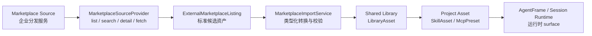

# Design · 外部市场来源接入规划

## 1. 设计立场

外部市场来源是 Marketplace 的发现入口，不是新的运行事实源。首期来源只由源码级 Host Integration 注册，用于接企业分发服务；来源集合跟随企业版发布节奏审查、部署和回滚。

核心链路：



这样做的原因：

- Shared Library 已经承载版本、digest、source-status、安装来源和 Marketplace UI 状态。
- Project Asset 是运行时唯一消费面，可以保持 session construction / AgentFrame 的事实源稳定。
- 企业分发服务的协议差异被收束在 provider 和 import service，不扩散到各业务资源运行链路。

## 2. 概念模型

### MarketplaceSourceDescriptor

用于 UI 和 API 展示来源能力。

```rust
pub struct MarketplaceSourceDescriptor {
    pub source_key: String,
    pub display_name: String,
    pub description: Option<String>,
    pub provider_kind: MarketplaceSourceProviderKind,
    pub supported_asset_types: Vec<LibraryAssetType>,
    pub trust_level: MarketplaceSourceTrustLevel,
    pub enabled: bool,
}
```

首期 `provider_kind`：

- `integration`：由 Host Integration 注册。
- `builtin`：开源版内置 curated source。

建议的 `trust_level`：

- `curated`：平台或部署方维护的受控目录。
- `organization`：组织内部来源。
- `public_index`：公开目录，导入时展示更明确的来源提示。

### MarketplaceSourceProvider

SPI 放在轻量 crate，Integration API 只 re-export trait，不透出 `reqwest`、`sqlx`、`rmcp` 等运行时依赖。

分页合同放在 provider trait 的输入/输出里，原因是企业分发服务通常已经有自己的搜索索引，平台不应要求 provider 一次返回完整目录。

```rust
pub struct MarketplaceAssetQuery {
    pub asset_type: Option<LibraryAssetType>,
    pub query: Option<String>,
    pub cursor: Option<String>,
    pub limit: Option<u32>,
}

pub struct MarketplaceAssetPage {
    pub items: Vec<MarketplaceAssetListing>,
    pub next_cursor: Option<String>,
}
```

```rust
#[async_trait]
pub trait MarketplaceSourceProvider: Send + Sync {
    fn descriptor(&self) -> MarketplaceSourceDescriptor;

    async fn list_assets(
        &self,
        query: MarketplaceAssetQuery,
    ) -> Result<MarketplaceAssetPage, MarketplaceSourceError>;

    async fn get_asset_detail(
        &self,
        external_id: &str,
    ) -> Result<MarketplaceAssetDetail, MarketplaceSourceError>;

    async fn fetch_asset_payload(
        &self,
        external_id: &str,
    ) -> Result<MarketplaceFetchedAsset, MarketplaceSourceError>;
}
```

`AgentDashIntegration` 可新增：

```rust
fn marketplace_source_providers(&self) -> Vec<Arc<dyn MarketplaceSourceProvider>> {
    vec![]
}
```

宿主启动时收集 source provider，`source_key` 冲突 fail-fast。来源集合跟随企业版源码和部署发布节奏变化，由 Host Integration 装配面统一治理。

首期 provider 只允许声明 `LibraryAssetType::SkillTemplate` 与 `LibraryAssetType::McpServerTemplate`。合同保持通用分页形态，但资产类型进入 import 阶段后必须落到对应 typed validator。

### Enterprise Marketplace Listing

Listing 是跨来源的统一候选视图，只承载发现和预览需要的信息。

```rust
pub struct MarketplaceAssetListing {
    pub source_key: String,
    pub external_id: String,
    pub asset_type: LibraryAssetType,
    pub key: String,
    pub display_name: String,
    pub description: Option<String>,
    pub version: String,
    pub tags: Vec<String>,
    pub author: Option<String>,
    pub digest: Option<String>,
    pub updated_at: Option<DateTime<Utc>>,
    pub install_requirements: Vec<MarketplaceInstallRequirement>,
}
```

`external_id` 只在 source 内唯一。导入到 Shared Library 后，建议 `source_ref` 使用：

```text
market:{source_key}:{asset_type}:{external_id}
```

`version` 是远端发布版本，必须非空；`digest` 是远端内容摘要，provider 能提供时必须透出。导入时平台把远端 identity、version、digest 固化到本地 `LibraryAsset`，显式刷新时再通过 provider listing/detail 比较，用于 Marketplace 的可更新提示。

### MarketplaceFetchedAsset

Fetched payload 进入 application import service 后按 `asset_type` 强类型转换。

```rust
pub enum MarketplaceFetchedAsset {
    Skill(SkillMarketplacePayload),
    McpServer(McpMarketplacePayload),
}
```

首期只实现 Skill / MCP。新的外部市场资产类型必须先拥有 Shared Library typed payload、安装语义和前端展示合同，再接入同一 source/list/detail/import 管线。

## 3. Skill 来源设计

现状已有：

- `RemoteSkillSource::fetch(url)`：按 URL 拉取 Skill 文件。
- `HttpRemoteSkillSource`：支持 GitHub / ClawHub / skills.sh。
- `SkillAssetService::import_remote`：执行文件定型、metadata 解析、digest、Project SkillAsset 创建。

新增 catalog discovery 后，Skill 市场分两层：

1. Catalog provider 负责 list/search/detail，返回 listing 和可拉取定位。
2. Fetch/import 负责拿到 `SKILL.md` 和附属文件，转换为 `skill_template` LibraryAsset。

现有 GitHub / ClawHub / skills.sh 单 URL 导入已经具备 fetch、文件数量/大小限制、内容定型和 `SKILL.md` 校验能力，但它当前在 Project 级 route 直接创建 `SkillAsset`。外部来源基线落地后，这条用户入口应改为单项远端来源导入：URL 解析和 fetch 继续走 `RemoteSkillSource`，写入动作改为生成 `LibraryAssetPayload::SkillTemplate`，随后通过 Shared Library install 入口创建 Project SkillAsset。原因是 URL import 和 catalog import 都是外部来源写入，统一到 LibraryAsset 能复用版本、digest、source-status、审计和 Marketplace 展示。

建议首期 payload：

```rust
pub struct SkillMarketplacePayload {
    pub source_url: String,
    pub files: Option<Vec<RemoteSkillFile>>,
    pub version: String,
    pub digest: Option<String>,
}
```

规则：

- provider 若只返回 `source_url`，import service 复用 `RemoteSkillSource::fetch` 拉文件。
- provider 若直接返回 files，仍复用 application 层 content typing 与 `validate_skill_files`。
- 文件数量、单文件大小、总大小、根目录 `SKILL.md` 继续由后端统一约束。
- 导入到 Shared Library 时生成 `LibraryAssetPayload::SkillTemplate`，安装到 Project 时走现有 Skill install 语义。
- `LibraryAsset.version` 使用远端 version，`payload_digest` 仍由平台 canonical payload 计算；远端 digest 可作为 source metadata 参与刷新比对。

建议抽出 `SkillTemplateImportService` 或等价 application helper，输入为 `RemoteSkillFetch` / `Vec<RemoteSkillFile>` / listing metadata，输出为：

```rust
pub struct MaterializedSkillTemplate {
    pub key: String,
    pub display_name: String,
    pub description: String,
    pub version: String,
    pub source_ref: String,
    pub payload: SkillTemplatePayload,
    pub remote_digest: Option<String>,
}
```

Catalog import 与 URL import 都调用该 helper，Project 级 `SkillAssetService::import_remote` 只保留文件定型/校验等可复用能力，或被新的 LibraryAsset import use case 取代。

## 4. MCP 来源设计

MCP catalog 只表达可安装模板，不携带用户私密连接材料。

建议 listing/detail 包含：

```rust
pub struct McpMarketplacePayload {
    pub transport_template: McpTransportTemplate,
    pub route_policy: McpRoutePolicy,
    pub parameter_schema: Option<serde_json::Value>,
    pub capabilities: Vec<String>,
    pub tool_preview: Vec<McpToolPreview>,
}
```

`McpTransportTemplate` 应区分模板变量和固定公开字段：

```rust
pub enum McpTransportTemplate {
    Http {
        url_template: String,
        headers_schema: Option<serde_json::Value>,
    },
    Sse {
        url_template: String,
        headers_schema: Option<serde_json::Value>,
    },
    Stdio {
        command_template: String,
        args_template: Vec<String>,
        env_schema: Option<serde_json::Value>,
    },
}
```

导入与安装规则：

- 导入 Shared Library 阶段只保存模板、参数 schema、能力摘要和远端 version/digest。
- 安装到 Project 时用户填写参数，后端生成 Project MCP Preset。
- 需要 credential/header/env 的值必须来自用户当前安装输入或用户级 connection，不进入公共 LibraryAsset payload。
- 后端继续使用现有 MCP safety mapper，拒绝本机路径、localhost/private network URL 等不适合市场分发的连接材料。
- 安装后可调用现有 probe 返回工具发现结果。

现有 `mcp_server_template` payload 是具体 `McpTransportConfig`。外部 MCP child 必须把 payload 扩展为可表达模板变量的 typed schema，并同步扩展 install API 的参数输入；不能在导入阶段把待填参数伪造成空 credential/header/env 或本机绑定配置。

## 5. API 设计

建议新增外部市场 API：

```text
GET  /api/marketplace/sources
GET  /api/marketplace/external-assets?source_key=&asset_type=&query=&cursor=
GET  /api/marketplace/external-assets/{source_key}/{external_id}
POST /api/marketplace/external-assets/import
POST /api/marketplace/external-assets/refresh
```

`import` 请求：

```json
{
  "source_key": "corp-skill-hub",
  "external_id": "research-writer",
  "asset_type": "skill_template",
  "import_mode": "upsert_library_asset"
}
```

返回 `LibraryAssetDto`。前端可随后调用 Shared Library install 入口；MCP 模板安装需要在同一入口提交参数输入。产品体验上可以封装为“导入并安装”。

`refresh` 用于按 `source_ref` 或 source query 显式检查远端版本。它只更新 Marketplace 可更新提示或本地 LibraryAsset 的可见版本候选，不修改 Project 资源。

## 6. 前端体验

Marketplace 页面建议增加来源视图：

```text
浏览：公共资源库 / 外部来源
来源：全部 / 官方 Skill 市场 / 企业 MCP Registry / ...
类型：全部 / MCP / Skill
```

外部来源卡片：

- 展示 source、asset type、version、描述、tags、权限摘要。
- 主按钮为“导入”或“导入并安装”。
- 详情抽屉展示来源详情、安装后将创建的 Project 资源、MCP 参数需求和安全提示。

导入并安装流程：

1. 用户选择外部 listing。
2. 前端请求 detail。
3. 用户确认参数或安装选项。
4. 前端调用 import API 得到 `LibraryAssetDto`。
5. 前端调用 Shared Library install 入口；MCP 模板携带用户参数输入。
6. Marketplace 刷新 Shared Library list 和 source-status。

现有 Skill 创建弹窗中的 URL Import 可继续作为用户入口，但提交后应走“URL -> import LibraryAsset -> install Project SkillAsset”的组合流程。导入成功后的反馈以 Project SkillAsset 安装结果为准，同时本地 Marketplace 能看到对应 `remote_imported` 的 `skill_template`。

## 7. 数据与迁移

首期可以优先不新增外部 listing 持久表：

- 来源 descriptor 来自 registry。
- listing 由 provider 实时返回。
- 导入结果持久化为 `LibraryAsset`。
- `source_ref` 记录外部来源身份。

若需要缓存或离线浏览，再增加 `marketplace_source_cache` 表，字段至少包含 `source_key`、`external_id`、`asset_type`、`listing_payload`、`fetched_at`、`expires_at`、`digest`。该表只缓存发现信息，不参与运行事实。

Skill URL Import 收束后，Project `skill_assets` 的外源身份应通过既有 `installed_source` 字段表达。`SkillAsset.source` 保持 Project 资产自身来源语义，例如用户创建或 builtin seed；远端 URL、provider、version、digest 归属到 `LibraryAsset.source_ref`、`LibraryAsset.version`、`LibraryAsset.payload_digest` 与 `InstalledAssetSource`。相应数据库迁移应让 `skill_assets.source`、`remote_source_url`、`remote_imported_at`、`remote_digest` 与新的归属关系一致，原因是外源版本和审计事实已经由 Shared Library 统一承载。

## 8. 权限与信任

- Source registry 属于 system/admin scope。
- 浏览外部来源可按现有 Marketplace 可见性开放给项目用户。
- 导入 Shared Library 需要 Shared Library 写权限或系统策略允许的 curated import。
- 安装到 Project 继续要求 Project edit 权限。
- Integration provider 属于受信宿主扩展；其返回内容仍按 data asset validator 校验。

## 9. 资产类型边界

外部市场来源的通用性停在 source/list/detail/import、分页和远端版本发现这一层。进入导入后必须按资产类型走 typed payload 和安装语义。

首期只覆盖 Skill 与 MCP，因为二者都能从外部目录读取候选内容，并标准化落成平台内部 `skill_template` / `mcp_server_template`。其他资产类型需要在自身模板、权限、安装和运行事实源稳定后单独设计。

## 10. Child Task 建议

本任务建议作为 parent planning task，后续下挂 child：

1. Marketplace Source SPI 与 registry。
2. External marketplace API 与 contracts。
3. Skill catalog source 导入闭环。
4. MCP catalog source 导入闭环。
5. Marketplace 前端外部来源体验。
6. Integration / Shared Library 规格沉淀与验证收口。
