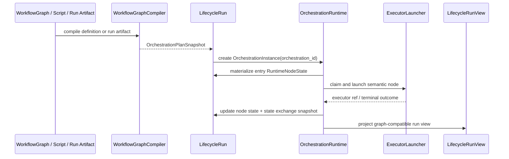

# Common Orchestration Runtime 正式接入设计计划

## 意图

本任务把 runtime 收敛到 common orchestration runtime。它只消费 compiler 输出的 `OrchestrationPlanSnapshot`，并把运行态写入 `LifecycleRun.orchestrations[]`。`OrchestrationInstance.orchestration_id` 是唯一运行实例身份；静态 `WorkflowGraph` 只是当前 compiler 输入之一，不决定 runtime identity。

## 运行时边界

目标模块位于 application 层，例如：

```text
crates/agentdash-application/src/workflow/orchestration/runtime.rs
crates/agentdash-application/src/workflow/orchestration/scheduler.rs
crates/agentdash-application/src/workflow/orchestration/resolver.rs
```

domain 层保留 plan/node/snapshot/journal value objects；infrastructure 只负责保存 `LifecycleRun` aggregate、必要 journal/lease/index 表和 trace anchors。definition provenance 可以保存在 plan metadata 或可选 source/provenance 字段中，但 runtime command、scheduler、terminal callback 和 projection 都以 `lifecycle_run_id + orchestration_id + node_path + attempt` 为坐标。

当前正式接入按两层边界推进：

- **Runtime reducer**：纯 application 状态机，只接收 `OrchestrationInstance`、plan rules 和 node event，负责更新 `RuntimeNodeState`、`StateExchangeSnapshot`、ready queue 和 orchestration status。
- **Executor launcher**：有副作用的 application adapter，负责把 ready semantic node 启动为 AgentRun / FunctionRun / local effect / HumanGate，并把启动结果写回 reducer。

第一实现切片先完成 reducer 与现有 terminal bridge 接入。这样可以先验证 plan IR、state exchange、successor activation 和 terminal idempotency 是否成立，再接 executor launcher，避免 dispatch service 继续私自启动 entry session。

## 状态流



## 核心合同

- `OrchestrationInstance`：保存 orchestration id、role/status、plan snapshot、activation、node tree、dispatch、state exchange、journal cursor。
- `PlanActivation`：保存 args、cursor、limits、ready roots。
- `RuntimeNodeState`：保存 node status、attempt、inputs/outputs、executor refs、trace refs、error、cache。
- `StateExchangeSnapshot`：保存变量、node outputs、artifact refs、cache refs。
- `OrchestrationJournalFact`：记录 PlanActivated、NodeReady、NodeStarted、NodeCompleted、NodeFailed、NodeCancelled、SnapshotMaterialized 等事实。
- `DispatchState` / `NodeDispatchLease`：只表达 operational claim / outbox，不表达业务状态。

## Executor 映射

| Plan node kind | 执行身份 | 适配方向 |
| --- | --- | --- |
| `AgentCall` | `AgentRun` + `RuntimeSession` | 复用现有 Agent activity executor 的 agent/frame/session 创建逻辑，写 runtime node trace refs。 |
| `Function` | `FunctionRun` | 复用 `FunctionRunner::run_api_request`，同步 terminal outcome 也必须经过 runtime node materialization。 |
| `LocalEffect` | `FunctionRun` 或 `EffectInvocation` | 复用 BashExec / 本机 bridge 能力，并把 permission/workspace/audit 作为 runtime executor surface。 |
| `HumanGate` | `HumanDecision` | 打开 human gate，等待 decision event 后 materialize outputs。 |

## Terminal Resolver

目标 resolver：

```text
runtime_session_id
  -> RuntimeTraceAnchor
  -> lifecycle_run_id / orchestration_id / node_path / agent_run_id / frame_id
  -> RuntimeNodeState terminal event
```

terminal resolver 只通过 lifecycle / orchestration / node / agent / frame 坐标定位执行节点。

## Projection

UI 直接消费 `LifecycleRunView.orchestrations[]`、`RuntimeNodeView` 与 `active_runtime_node_refs[]`。这些字段从 orchestration snapshot 投影，native orchestration progress tree 后续可在同一 contract 上继续增强。

## VFS / Session Surface

`lifecycle` 仍是面向主 AgentRun 的共同生命周期容器；`orchestration` 是 lifecycle 内部的运行态状态容器。session assembly、VFS mount 和 hook projection 通过 `LifecycleMountSurface` 这类窄接口传递：

```text
run_id + orchestration_id + node_path + attempt + writable_port_keys
```

这样 lifecycle VFS 的 `artifacts/*`、`records/*`、`session/*` 都从同一 runtime node 坐标解析。静态 graph 编译产物、后续 workflow script 和 run artifact 只要能落到同一 `OrchestrationPlanSnapshot`，就能复用相同 session/VFS surface。

## 仓储边界

- `LifecycleRun.orchestrations[]` 是 runtime snapshot 事实源。
- journal 只有在 resume/replay/增量订阅需要时拆成 append 表。
- lease/outbox 只有在多 worker claim 并发需要时拆表；拆表后也不能成为 node truth。
- runtime trace anchor 是反向索引，不是 runtime state。
- `LifecycleRunRepository` 持久化 aggregate；runtime snapshot 随 `LifecycleRun.orchestrations[]` 整体读写。

## 风险

- 最大风险是 command/scheduler 绕过 orchestration snapshot 判定状态。实现时 projection 可以为 UI 服务，但状态推进必须回到 runtime node event。
- orchestration identity 必须独立于 asset shape，原因是后续 script / run artifact 需要进入同一 runtime。
- Function/local effect 不能绕过 journal/snapshot，否则会在最早的非 Agent 节点上破坏 common runtime。
- terminal callback 必须幂等，否则 tool completion 和 session terminal callback 可能重复推进 successor。
