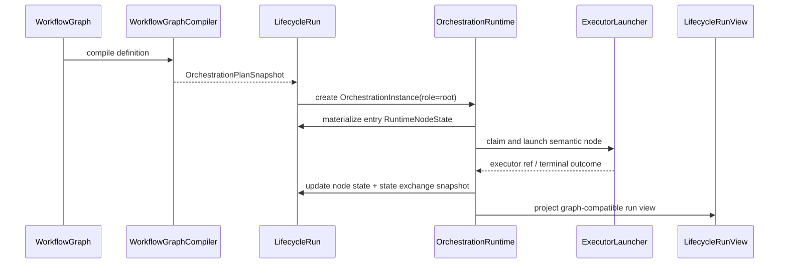

# Common Orchestration Runtime Static Graph 设计计划

## 意图

本任务把静态 graph 的 runtime 从 Activity-specific state machine 迁到 common orchestration runtime。它只消费 compiler 输出的 `OrchestrationPlanSnapshot`，并把运行态写入 `LifecycleRun.orchestrations[]`。旧 `WorkflowGraphInstance.activity_state` 是迁移来源和兼容投影，不再是目标事实源。

## 运行时边界

目标模块位于 application 层，例如：

```text
crates/agentdash-application/src/workflow/orchestration/runtime.rs
crates/agentdash-application/src/workflow/orchestration/scheduler.rs
crates/agentdash-application/src/workflow/orchestration/resolver.rs
```

domain 层保留 plan/node/snapshot/journal value objects；infrastructure 只负责保存 `LifecycleRun` aggregate、必要 journal/lease/index 表和 trace anchors。

## 状态流



## 核心合同

- `PlanActivation`：保存 args、cursor、limits、ready roots。
- `RuntimeNodeState`：保存 node status、attempt、inputs/outputs、executor refs、trace refs、error、cache。
- `StateExchangeSnapshot`：保存变量、node outputs、artifact refs、cache refs。
- `OrchestrationJournalFact`：记录 PlanActivated、NodeReady、NodeStarted、NodeCompleted、NodeFailed、NodeCancelled、SnapshotMaterialized 等事实。
- `DispatchState` / `NodeDispatchLease`：只表达 operational claim / outbox，不表达业务状态。

## Executor 映射

| Plan node kind | 执行身份 | 适配方向 |
| --- | --- | --- |
| `AgentCall` | `AgentRun` + `RuntimeSession` | 复用现有 Agent activity executor 的 agent/frame/session 创建逻辑，写 runtime node trace refs。 |
| `Function` | `FunctionRun` | 复用 `FunctionRunner::run_api_request`，同步 terminal outcome 也必须经过 runtime node materialization。 |
| `LocalEffect` | `FunctionRun` 或 `EffectInvocation` | 复用 BashExec / 本机 bridge 能力，并把 permission/workspace/audit 作为 runtime executor surface。 |
| `HumanGate` | `HumanDecision` | 打开 human gate，等待 decision event 后 materialize outputs。 |

## Terminal Resolver

目标 resolver：

```text
runtime_session_id
  -> RuntimeTraceAnchor
  -> lifecycle_run_id / orchestration_id / node_path / agent_run_id / frame_id
  -> RuntimeNodeState terminal event
```

旧 resolver 仍可作为迁移参考，但新 command path 不能同时读取 activity attempt 和 runtime node 两套事实源。

## Projection

第一版 UI 可以继续消费 graph-compatible `LifecycleRunView.workflow_graph_instances[]` 和 `active_activity_refs[]`。这些字段从 root orchestration snapshot 投影，不再从旧 `activity_state` 推进。native orchestration progress tree 可以后续新增。

## 仓储边界

- `LifecycleRun.orchestrations[]` 是 runtime snapshot 事实源。
- journal 只有在 resume/replay/增量订阅需要时拆成 append 表。
- lease/outbox 只有在多 worker claim 并发需要时拆表；拆表后也不能成为 node truth。
- runtime trace anchor 是反向索引，不是 runtime state。

## 风险

- 最大风险是新旧 runtime 双读 fallback。实现时允许短期生成兼容 projection，但不允许 command/scheduler 同时从两套 snapshot 判定状态。
- Function/local effect 不能绕过 journal/snapshot，否则会在最早的非 Agent 节点上破坏 common runtime。
- terminal callback 必须幂等，否则 tool completion 和 session terminal callback 可能重复推进 successor。
