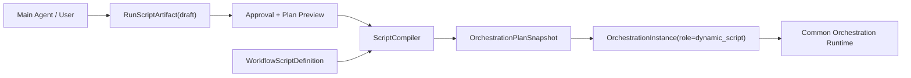
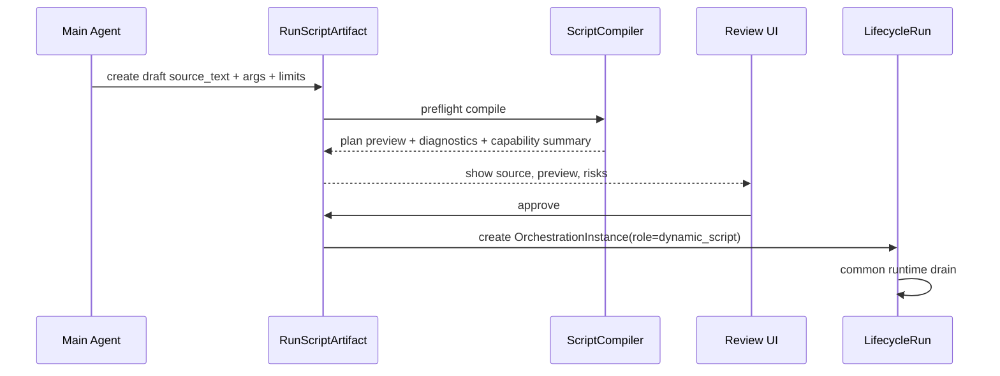

# Dynamic Script Artifact / Compiler 设计草案

## 意图

动态脚本是 Orchestration Plan 的第二个 compiler frontend。它承载 Claude Dynamic Workflows 启发下的脚本化编排体验：模型生成可审脚本、用户审批后运行、脚本变量承载中间结果、agent 节点扇出/扇入、进度树和 journal/cache/resume 语义。它不拥有独立 runtime。



## 模型

### RunScriptArtifact

本次运行产生的脚本草稿。它属于一个 Lifecycle / session 上下文，适合表达“模型刚生成，等待用户确认”的一次性编排。

建议字段：

| 字段 | 含义 |
| --- | --- |
| `artifact_id` | 运行内脚本草稿身份。 |
| `lifecycle_run_id` | 所属 Lifecycle。 |
| `runtime_session_id` | 生成或编辑该脚本的 session trace。 |
| `source_text` | 脚本源码。 |
| `source_digest` | 源码 digest。 |
| `args_schema` / `args` | 运行参数合同与当前参数。 |
| `limits` | agent/effect/concurrency/budget/time 上限。 |
| `capability_summary` | 编译出的能力需求摘要。 |
| `status` | draft / approved / rejected / compiled / launched。 |
| `compiled_plan_digest` | 审批时编译出的 plan digest。 |
| `provenance` | generated_by / edited_by / approved_by / timestamps。 |

### WorkflowScriptDefinition

可复用脚本资产。它与 `WorkflowGraph` 同属 definition input，可以安装、版本化、保存到 Shared Library。

建议字段：

| 字段 | 含义 |
| --- | --- |
| `id` | 资产身份。 |
| `project_id` | 所属项目。 |
| `key` / `name` / `description` | 可复用 workflow 标识。 |
| `source_text` | 脚本源码。 |
| `version` | 资产版本。 |
| `source_digest` | 源码 digest。 |
| `args_schema` | 运行参数 schema。 |
| `default_limits` | 默认限制。 |
| `installed_source` | library/marketplace/source provenance。 |

### Script AST

第一版 AST 应直接表达平台原语，而不是暴露宿主语言任意执行能力：

```text
WorkflowScript
  args_schema
  limits
  body: Vec<ScriptStatement>

ScriptStatement
  Phase { title, body }
  Log { message }
  Let { name, expr }
  Agent { name, prompt, procedure_key?, inputs, outputs, limits }
  Function { name, api_request, inputs, outputs }
  LocalEffect { name, bash_exec | capability_key, inputs, outputs }
  HumanGate { name, form_schema_key, decision_port }
  Parallel { branches }
  Pipeline { stages }
  If { condition, then, else }
```

脚本变量是 state exchange 的 source/target alias；不是 runtime 全局可变对象。compiler 负责把变量读写转成 `StateExchangeRule` 和 node input/output ports。

## Compiler 映射

| Script primitive | Plan IR |
| --- | --- |
| `phase(title)` | `PlanNodeKind::Phase` + child node path prefix |
| `log(message)` | `PlanNodeKind::Function` 或 metadata-only journal marker，取决于是否需要 runtime node |
| `agent(...)` | `PlanNodeKind::AgentCall` + `ExecutorSpec::AgentProcedure` |
| `function(api_request)` | `PlanNodeKind::Function` + `ExecutorSpec::Function(ApiRequest)` |
| `local_effect(bash_exec)` | `PlanNodeKind::LocalEffect` + `ExecutorSpec::Function(BashExec)` |
| `local_effect(capability_key)` | `PlanNodeKind::LocalEffect` + `ExecutorSpec::LocalEffect` |
| `human_gate(...)` | `PlanNodeKind::HumanGate` + `ExecutorSpec::Human` |
| `parallel([...])` | branch entry nodes + join/barrier activation rules |
| `pipeline([...])` | ordered transition chain |
| variable binding | `StateExchangeRule` |
| args / limits | `PlanActivation.args` / `OrchestrationLimits` / plan metadata |

## Diagnostics

Diagnostics 必须带 source path，例如：

```text
body[2].parallel.branches[1].agent.prompt
```

首批 blocking diagnostics：

- unknown primitive
- duplicate node name in scope
- unknown variable ref
- unresolved procedure key
- missing output binding
- unbounded loop/fanout
- unsupported dynamic expression
- capability declaration missing
- budget/limit missing for multi-agent fanout
- human gate decision port mismatch

## 审批流



审批通过后写入的 `OrchestrationInstance.plan_snapshot` 是不可变事实。后续保存脚本资产或编辑脚本，只产生新 definition revision，不改已运行 instance 的 plan snapshot。

## 仓储边界

- `RunScriptArtifact` 可以先作为 Lifecycle scoped artifact/value object 保存；若需要列表、审批队列或大源码读取，再拆独立 repository。
- `WorkflowScriptDefinition` 是 definition asset，适合与 `WorkflowGraph` / Shared Library asset 管理路径对齐。
- 编译后的 runtime 状态不进入脚本仓储，只进入 `LifecycleRun.orchestrations[]`。
- `plan_digest` 来自 canonical AST + compiler schema version + source digest；运行实例身份仍是 `orchestration_id`。

## 开放问题

- 首版脚本表层语法选 JSON/YAML DSL、Rhai-like DSL，还是 TypeScript-like restricted DSL。
- `log()` 是否需要 runtime node，还是只进入 journal/projection。
- run script draft 是否直接复用现有 lifecycle VFS artifact，还是新增一张轻量 draft 表。
- 保存为 workflow 时是否同时生成 visual graph projection。
