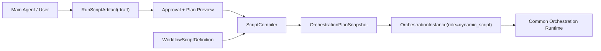
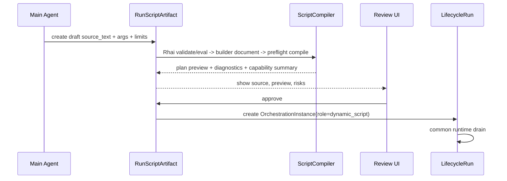

# Dynamic Script Artifact / Compiler 设计草案

## 意图

动态脚本是 Orchestration Plan 的第二个 compiler frontend。它承载 Claude Dynamic Workflows 启发下的脚本化编排体验：模型生成可审脚本、用户审批后运行、脚本变量承载中间结果、agent 节点扇出/扇入、进度树和 journal/cache/resume 语义。它不拥有独立 runtime。



## 模型

## 语法选择：Restricted Rhai Builder DSL

首版选择 Rhai，而不是 JSON/YAML DSL 或 TypeScript-like DSL。

原因：

- Hook 规则已经使用 Rhai，动态 workflow 经常需要表达 hook/gate/policy 约束；统一脚本语言可以复用验证、沙箱、AST 缓存、helper 注册和错误展示。
- Rhai 与 Rust / `serde_json::Value` 互操作已经在 `RhaiHookScriptEvaluator` 中验证。
- JSON/YAML 对分支、变量、复用和条件表达力不足；TypeScript-like DSL 会引入新的 parser/sandbox/toolchain。
- Rhai 可以被解释执行，但本任务只允许它执行“编译期 builder”，输出结构化 AST 或 plan builder document，不允许直接执行 workflow 副作用。

推荐脚本表层形态是“Rhai 函数返回结构化 builder 值”：

```rust
workflow(#{
  name: "research_review",
  args: #{ topic: "string" },
  limits: #{ max_agents: 6, max_effects: 4 },
  body: [
    phase("collect", [
      parallel([
        agent("scan_docs", #{
          procedure: "researcher",
          prompt: "Scan docs for {{args.topic}}",
          outputs: ["notes"]
        }),
        function("fetch_index", api_request(#{
          method: "GET",
          url: "https://example.test/index"
        }))
      ]),
      human_gate("approve_notes", #{
        form_schema: "workflow.approval",
        decision_port: "decision"
      })
    ])
  ]
})
```

这些 helper 只构造 serializable map/array，不触发 AgentRun、HTTP、shell 或文件系统。真正的执行仍发生在 common orchestration runtime 中。

## 公共 Rhai 脚本内核

当前 `RhaiHookScriptEvaluator` 同时承担了 Rhai engine、sandbox limits、AST cache、preset cache 和 hook helper 注册。动态 workflow 接入前应先抽出公共内核，避免复制第二套 Rhai wrapper。

建议拆分：

```text
agentdash-infrastructure::script_runtime
  RhaiScriptRuntime
    - compile / validate
    - eval_script(ctx) -> serde_json::Value
    - eval_ast(ctx) -> serde_json::Value
    - AST cache
    - sandbox limits
    - module/helper registration

agentdash-infrastructure::hooks::RhaiHookScriptEvaluator
  - 注册 hook helpers: block/inject/approve/complete/log/...
  - 实现 agentdash_spi::HookScriptEvaluator
  - 解析 preset cache 语义

agentdash-infrastructure::workflow::RhaiWorkflowScriptEvaluator
  - 注册 workflow builder helpers: workflow/phase/agent/parallel/pipeline/function/local_effect/human_gate/...
  - 实现新的 workflow script evaluator SPI
  - 返回 workflow builder document JSON
```

如果后续多个 crate 都需要直接复用，可再提升为独立 workspace crate，例如 `agentdash-script-runtime`。首批更适合先放在 infrastructure 内部模块，原因是当前唯一具体脚本引擎实现已经在 infrastructure，且 application 只应依赖 SPI port。

公共内核不理解 Hook，也不理解 Workflow。它只提供安全 Rhai 执行能力。业务 surface 由 adapter 注册：

| 层 | 职责 | 不应承担 |
| --- | --- | --- |
| `RhaiScriptRuntime` | sandbox、AST cache、serde bridge、helper registration | hook decision / workflow AST 语义 |
| `RhaiHookScriptEvaluator` | hook ctx eval、hook helper、decision JSON | workflow plan builder |
| `RhaiWorkflowScriptEvaluator` | workflow builder helper、builder document JSON | runtime side effect |
| `ScriptCompiler` application service | builder document -> `OrchestrationPlanSnapshot` | Rhai engine 细节 |

### 为什么不直接让 Rhai 编译成 Plan

Rhai helper 可以构造接近 plan 的 builder document，但最终 `OrchestrationPlanSnapshot` 仍由 application `ScriptCompiler` 生成。原因：

- compiler 需要复用 WorkflowGraph compiler 的 canonical digest、diagnostics、path normalization 和 IR helper。
- application 层拥有 `PlanNodeKind` / `ExecutorSpec` / `ActivationRule` 的业务映射；infrastructure Rhai adapter 不应依赖这些领域细节。
- 这样未来若替换脚本表层语法，只要产出同一 builder AST，common compiler 后半段仍可复用。

### RunScriptArtifact

本次运行产生的脚本草稿。它属于 Lifecycle 上下文，适合表达“模型刚生成，等待用户确认”的一次性编排。首版 draft 储存跟随 Lifecycle：可以作为 `LifecycleRun` context / scoped artifact / view projection 的一部分保存，暂不需要全局资产仓储。

建议字段：

| 字段 | 含义 |
| --- | --- |
| `artifact_id` | Lifecycle 内脚本草稿身份。 |
| `lifecycle_run_id` | 所属 Lifecycle。 |
| `runtime_session_id` | 生成或编辑该脚本的 session trace，可选。 |
| `source_text` | 脚本源码。 |
| `source_digest` | 源码 digest。 |
| `args_schema` / `args` | 运行参数合同与当前参数。 |
| `limits` | agent/effect/concurrency/budget/time 上限。 |
| `builder_document` | Rhai builder DSL 解释得到的结构化中间产物。 |
| `capability_summary` | compiler 从 builder document / plan preview 汇总出的能力需求。 |
| `status` | draft / approved / rejected / compiled / launched。 |
| `compiled_plan_digest` | 审批时编译出的 plan digest。 |
| `provenance` | generated_by / edited_by / approved_by / timestamps。 |

### WorkflowScriptDefinition

可复用脚本资产。它与 `WorkflowGraph` 同属 definition input，可以安装、版本化、保存到 Shared Library。

建议字段：

| 字段 | 含义 |
| --- | --- |
| `id` | 资产身份。 |
| `project_id` | 所属项目。 |
| `key` / `name` / `description` | 可复用 workflow 标识。 |
| `source_text` | 脚本源码。 |
| `version` | 资产版本。 |
| `source_digest` | 源码 digest。 |
| `args_schema` | 运行参数 schema。 |
| `default_limits` | 默认限制。 |
| `installed_source` | library/marketplace/source provenance。 |

### Script AST

第一版 AST / builder document 应直接表达平台原语，而不是暴露宿主语言任意执行能力：

```text
WorkflowScript
  args_schema
  limits
  body: Vec<ScriptStatement>

WorkflowBuilderStatement
  Phase { title, body }
  Log { message }
  Let { name, expr }
  Agent { name, prompt, procedure_key?, inputs, outputs, limits }
  Function { name, api_request, inputs, outputs }
  LocalEffect { name, bash_exec | capability_key, inputs, outputs }
  HumanGate { name, form_schema_key, decision_port }
  Parallel { branches }
  Pipeline { stages }
  If { condition, then, else }
```

脚本变量是 state exchange 的 source/target alias；不是 runtime 全局可变对象。compiler 负责把变量读写转成 `StateExchangeRule` 和 node input/output ports。

## Compiler 映射

| Script primitive | Plan IR |
| --- | --- |
| `phase(title)` | `PlanNodeKind::Phase` + child node path prefix |
| `log(message)` | `PlanNodeKind::Function` 或 metadata-only journal marker，取决于是否需要 runtime node |
| `agent(...)` | `PlanNodeKind::AgentCall` + `ExecutorSpec::AgentProcedure` |
| `function(api_request)` | `PlanNodeKind::Function` + `ExecutorSpec::Function(ApiRequest)` |
| `local_effect(bash_exec)` | `PlanNodeKind::LocalEffect` + `ExecutorSpec::Function(BashExec)` |
| `local_effect(capability_key)` | `PlanNodeKind::LocalEffect` + `ExecutorSpec::LocalEffect` |
| `human_gate(...)` | `PlanNodeKind::HumanGate` + `ExecutorSpec::Human` |
| `parallel([...])` | branch entry nodes + join/barrier activation rules |
| `pipeline([...])` | ordered transition chain |
| variable binding | `StateExchangeRule` |
| args / limits | `PlanActivation.args` / `OrchestrationLimits` / plan metadata |

## Diagnostics

Diagnostics 必须带 source path，例如：

```text
body[2].parallel.branches[1].agent.prompt
```

首批 blocking diagnostics：

- unknown primitive
- duplicate node name in scope
- unknown variable ref
- unresolved procedure key
- missing output binding
- unbounded loop/fanout
- unsupported dynamic expression
- capability declaration missing
- budget/limit missing for multi-agent fanout
- human gate decision port mismatch

## 审批流



审批通过后写入的 `OrchestrationInstance.plan_snapshot` 是不可变事实。后续保存脚本资产或编辑脚本，只产生新 definition revision，不改已运行 instance 的 plan snapshot。

## 仓储边界

- `RunScriptArtifact` 首版跟随 Lifecycle 保存；若需要跨 Lifecycle 列表、审批队列或大源码读取，再拆独立 repository。
- `WorkflowScriptDefinition` 是 definition asset，适合与 `WorkflowGraph` / Shared Library asset 管理路径对齐。
- 编译后的 runtime 状态不进入脚本仓储，只进入 `LifecycleRun.orchestrations[]`。
- `plan_digest` 来自 canonical AST + compiler schema version + source digest；运行实例身份仍是 `orchestration_id`。

## 后续议题

- `log()` 是否需要 runtime node，还是只进入 journal/projection。
- 保存为 workflow 时是否同时生成 visual graph projection。
- 全局注册 workflow script asset 的 API 和 Shared Library 安装路径。
- 是否在公共 Rhai 内核稳定后提升为独立 workspace crate。
