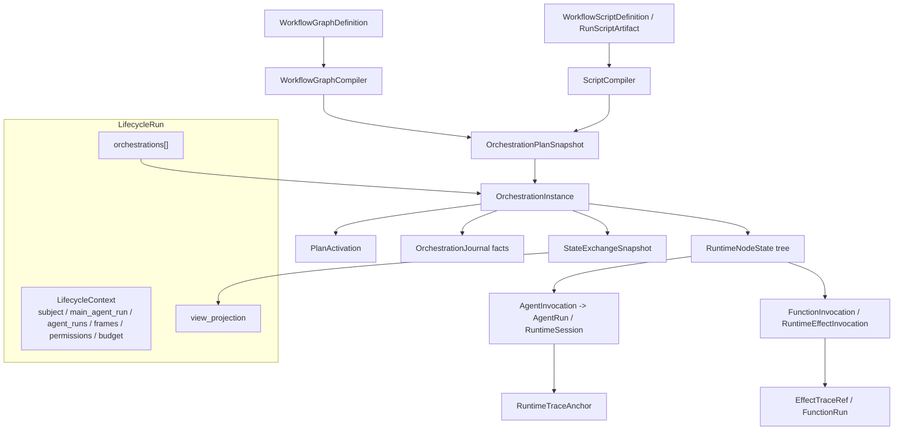
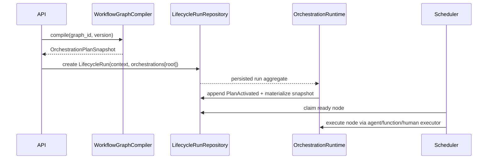
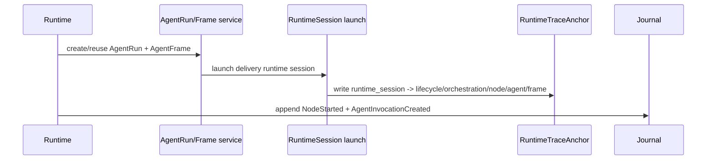
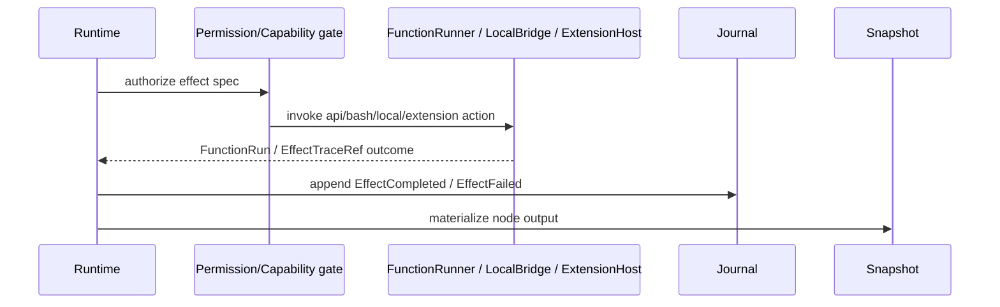

# Dynamic Workflow / Lifecycle 实现设计草案

本文把 research 结论收敛成正式实现前的设计稿。它仍处于 planning 阶段，不代表已经允许进入代码实现；启动实现前需要用户 review 并执行 Trellis task start 流程。

## 目标

本轮实现目标不是先做 Claude Code 风格的完整脚本运行器，而是先把 AgentDash 的 Lifecycle / WorkflowGraph 运行态收敛到可承载动态 workflow 的共同地基：

- `LifecycleRun` 作为完整上下文容器，管理主 Agent、派生 AgentRun、权限、预算和 trace refs。
- `LifecycleRun.orchestrations[]` 作为 0..N 个内部 `OrchestrationInstance`，承载 plan activation、node state、dispatch、journal/cache/snapshot。
- 静态 `WorkflowGraph` 与未来动态 script 都编译为 `OrchestrationPlanSnapshot`，共享 runtime rule、state exchange snapshot、journal、权限和观察模型。
- Agent 执行、本机 function/bash/API/extension effect、人类决策都进入 typed execution identity，而不是伪装成同一种 AgentRun。
- runtime session 入口 command API 收敛为 `/sessions/{runtime_session_id}/...`，路径语义聚焦 session delivery/control command。

## 范围边界

- Claude Code 资料作为核心 workflow 语义覆盖基准：重点吸收脚本化编排、隔离运行时、typed execution、journal/cache/snapshot、权限/预算/观察能力；命令名、目录名、UI、默认限制数值和产品权限选择由 AgentDash 自己的模型决定。
- 第一阶段聚焦共同 runtime 地基，完整 JS/TS script runtime 放到 graph compiler 与 common orchestration runtime 成立之后。
- scheduler 以 `OrchestrationPlanSnapshot` 为共同入口，静态 graph 与动态 script 共享同一运行规则。
- 物理仓储按 owning aggregate、读取粒度、写入并发和生命周期拆分；append journal、反向索引、并发 lease 或冷大对象满足拆分理由时再独立。
- 项目仍处预研期，迁移可以直接朝目标状态走，避免把旧 API / 旧字段做成长期兼容路径。

## 当前事实

- 当前静态 workflow 定义是 `WorkflowGraph`，Activity executor 已覆盖 Agent / Function / Human。
- 当前运行态集中在 `LifecycleRun`、`WorkflowGraphInstance.activity_state`、`ActivityExecutionClaim`、`AgentAssignment`、`RuntimeSessionExecutionAnchor`，过程状态分散。
- 当前 function executor 已有 `ApiRequest` / `BashExec` 与 `ExecutorRunRef::FunctionRun`，因此 common runtime 不能只支持 Agent node。
- 当前 runtime session 控制面已经有 `/sessions/{id}/runtime-control`、`/sessions/{id}/trace`、tool approval 等 session-scoped API；AgentRun command 也应挂在 session 入口下。

## 目标架构



## 核心合同

### LifecycleContext

`LifecycleContext` 是 `LifecycleRun` 内的上下文面，建议最小字段：

| 字段 | 含义 |
| --- | --- |
| `main_agent_run_id` | 主 AgentRun。 |
| `agent_runs` | 同一 Lifecycle 内的 AgentRun 摘要与状态。 |
| `frame_refs` | AgentFrame revision 引用，不要求内嵌完整大 surface。 |
| `permission_scope` | 当前 lifecycle / project / runtime surface 的权限摘要。 |
| `budget` | lifecycle 级预算、已用量与策略。 |

### OrchestrationInstance

`OrchestrationInstance` 是 Lifecycle 内部状态容器，建议最小字段：

| 字段 | 含义 |
| --- | --- |
| `orchestration_id` | instance 内部唯一 ID。 |
| `role` | root / dynamic_script / review / subworkflow 等。 |
| `source_ref` | graph version、script artifact revision 或 workflow asset ref。 |
| `status` | pending / running / paused / completed / failed / cancelled。 |
| `plan_snapshot` | 编译后的不可变 plan。 |
| `activation` | args、cursor、limits、budget、ready roots。 |
| `node_tree` | RuntimeNodeState tree。 |
| `dispatch` | ready queue / leases / outbox 摘要。 |
| `cache` | agent/effect cache refs 与 digest。 |
| `journal_cursor` | 已 materialize 的 journal seq。 |

### OrchestrationPlanSnapshot

`OrchestrationPlanSnapshot` 是 graph/script 的共同 runtime 输入。最小能力闭包应覆盖：

- `PlanNode(kind=agent_call|function|local_effect|extension_action|human_gate|phase|parallel_group|pipeline|barrier|subworkflow|activity)`
- `ActivationRule`：entry、condition、artifact binding、join policy、iteration/retry policy。
- `ExecutorSpec`：AgentProcedure、continue root、function API/bash、human decision、effect capability key。
- `ResultContract`：output ports、schema、terminal status、cache key inputs。
- `Limits`：concurrency、total agent/effect count、budget、timeout、max traversals。

`activity` 不是 graph compiler 的默认运行节点类型。它只保留为 legacy/source projection 语义。静态 graph 的 Agent / API / Bash / Human activity 应编译成 `agent_call` / `function` / `local_effect` / `human_gate` 等语义节点；source activity key、旧 UI label 和 activity-compatible projection 放在 metadata 或 read projection 中。

### RuntimeNodeState

`RuntimeNodeState` 取代 `ActivityAttemptState` 的中心地位，但可以生成 Activity-compatible projection。它至少需要：

- `node_id` / `node_path`
- `kind`
- `status`
- `attempt`
- `inputs` / `outputs`
- `executor_run_ref`
- `children`
- `phase_path`
- `started_at` / `completed_at`
- `error`
- `trace_refs`

### Journal / Snapshot

`OrchestrationJournal` 保存 append-only facts，`StateExchangeSnapshot` 保存可恢复物化状态。第一阶段可以把 snapshot 内聚到 `lifecycle_runs.orchestrations[]`，journal 是否拆表取决于运行规模；如果需要增量订阅、resume/replay 或长历史，拆 `lifecycle_orchestration_journal_entries`。

### Trace

`RuntimeTraceAnchor` 是 runtime session 到 Lifecycle / orchestration / node / AgentRun / frame 的反向索引。非 conversation runtime 的 function/local effect 可以先在 node state + journal 里记录 `EffectTraceRef`；只有出现外部 call id 高频反查或长流式输出，再拆窄 effect trace index。

## API 命名

runtime session 入口 command API 目标命名：

```text
POST   /sessions/{runtime_session_id}/messages
POST   /sessions/{runtime_session_id}/steering
GET    /sessions/{runtime_session_id}/pending-messages
POST   /sessions/{runtime_session_id}/pending-messages
DELETE /sessions/{runtime_session_id}/pending-messages/{message_id}
POST   /sessions/{runtime_session_id}/pending-messages/{message_id}/promote
```

这些路径表达“对当前 runtime session 发起 delivery/control command”。后端内部通过 `RuntimeTraceAnchor` 解析到 `AgentRun` 和 `LifecycleRun`；URL 层保持 session delivery/control 语义。

显式资源管理路径另行使用：

```text
GET /lifecycles/{lifecycle_run_id}/agent-runs
GET /lifecycles/{lifecycle_run_id}/agent-runs/{agent_run_id}
```

## 数据流

### 静态 WorkflowGraph 启动



### Agent node 执行



### Function / local effect node 执行



## 分阶段制作方案

### Phase 1：命名与 API 收敛

- 将外露 `lifecycle-agents` API 迁移到 session-scoped command routes。
- 将 DTO / service 层逐步从 `LifecycleAgent*` 命名迁到 `AgentRun*` 语义。
- 保持 `Lifecycle` 作为顶层容器名。

这一阶段可以独立验证，风险低，能先清掉最刺眼的外露命名债。

### Phase 2：Runtime IR 与 aggregate contract

- 新增 `OrchestrationPlanSnapshot`、`PlanNode`、`RuntimeNodeState`、`OrchestrationInstance`、`StateExchangeSnapshot` 领域值对象。
- 在 `LifecycleRun` 上增加 `context` / `orchestrations` / `view_projection` 目标字段。
- 定义 journal fact enum，但早期可先内嵌或以最小 append 表实现。
- 保留现有 `WorkflowGraphInstance.activity_state` 作为迁移来源或兼容 projection，不能继续作为新 runtime 事实源。

### Phase 3：WorkflowGraph compiler

- 实现 `WorkflowGraph -> OrchestrationPlanSnapshot`。
- 覆盖 Activity executor、transition condition、artifact binding、join/iteration policy、attempt policy，并把旧 graph 的 flow edge / artifact edge 规范化为控制流与状态交换两个维度。
- 将 Agent / API request / BashExec / Human activity 分别编译成 `agent_call` / `function` / `local_effect` / `human_gate` 语义节点；不要用脚本模拟 graph，也不要统一落成 `activity` wrapper。

这一阶段的目标是证明现有静态 graph 能落到 common runtime IR。

### Phase 4：Common orchestration runtime

- 实现 plan activation、ready node materialization、node state transition、dispatch lease、snapshot materialization。
- 先跑静态 graph 的最小闭包：entry agent activity、function activity、human decision、condition transition、artifact binding。
- 生成 `LifecycleRunView` projection，保留 UI 可观察能力。

### Phase 5：Repository convergence

- 将 `WorkflowGraphInstance.activity_state`、`ActivityExecutionClaim`、`AgentAssignment` 的职责逐项降级为 projection / lease / trace index，或并入 `LifecycleRun.orchestrations[]`。
- 只在证明需要时拆 journal / dispatch lease / trace index 表。
- 更新 specs 和 migration，保持仓储边界与 owning aggregate 一致。

### Phase 6：Dynamic script front-end

- 新增 `RunScriptArtifact` 与可复用 `WorkflowScriptDefinition`。
- 脚本 compiler 只输出 `OrchestrationPlanSnapshot`，不拥有独立 runtime。
- 最小原语优先：`phase()`、`log()`、`agent()`、`parallel()`、`pipeline()`、`function()` / `local_effect()`。
- 接入审批、args、limits、budget、cache key、resume。

## 迁移策略

- 因为项目未上线，不保留旧字段/旧 API 的兼容层。
- 迁移顺序应先引入新 contract，再把静态 graph 编译进去，最后移除旧 runtime truth path。
- 如果发现现有 UI 或 hooks 强依赖 Activity attempt，可先生成兼容 projection，但 projection 不成为第二事实源。
- 所有数据库变更必须更新 migration，并运行 `pnpm run migration:guard`。

## 风险与判断

- 最大风险是把 dynamic script runtime 作为捷径直接加进现有 graph runtime，导致双 runtime。阶段设计必须以 `OrchestrationPlanSnapshot` 为共同入口。
- 第二风险是过早拆表。除 append journal、runtime trace anchor 和被并发证明的 dispatch lease 外，默认内聚在 Lifecycle aggregate。
- 第三风险是 Function/local effect 被忽略。当前系统已有 BashExec / shell_execute / extension process execution，common runtime 必须支持 typed effect node。
- 第四风险是 API 名称迁移触及 generated contract / frontend service / backend route，多层要一次性闭合。

## 待用户确认

推荐把第一个实现任务定为 Phase 1 + Phase 2 的前半段：先完成 session-scoped API 命名和 AgentRun 外露语义，再落最小 OrchestrationPlanSnapshot / OrchestrationInstance domain contract。这样既能快速清理外露命名，也为后续 graph compiler 提供稳定目标。
