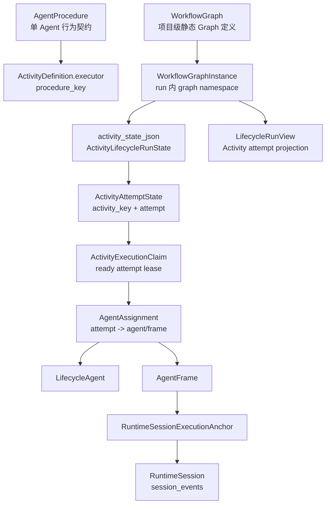
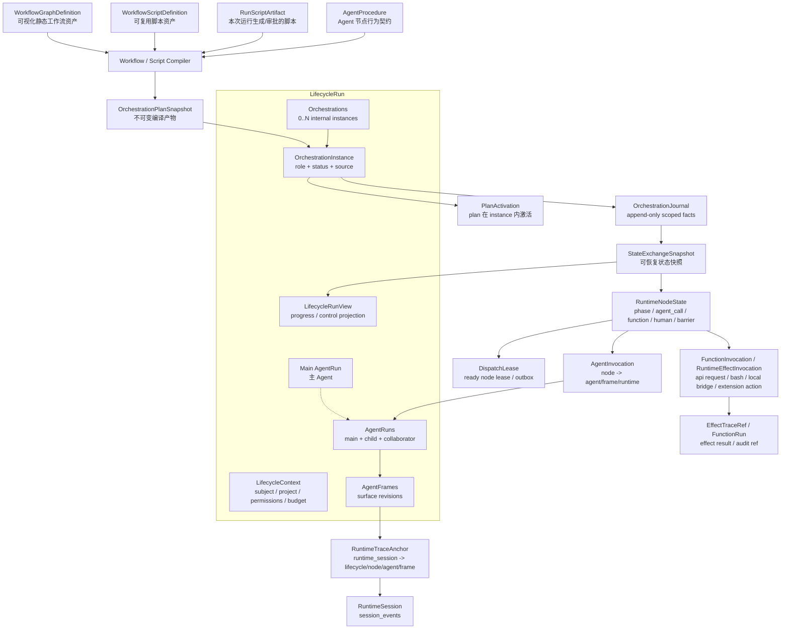
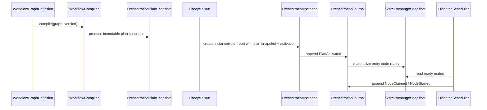
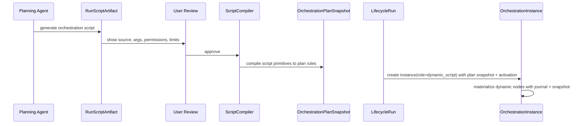

# Target Model Sketch：Lifecycle Context 与 Orchestration Instances

本文是 Dynamic Workflow / Lifecycle Activity 预研的目标模型讨论稿，不是最终 `design.md`。它把当前模型、目标模型、命名和仓储边界放在同一处，便于后续确认 `WorkflowGraphInstance`、`LifecycleAgent`、runtime snapshot / journal 等概念如何迁移。

本模型的验收标准不是“看起来像动态编排”，也不是一比一复刻 Claude Code，而是能承载 `research/claude-dynamic-workflows-official-doc-zh-cn.md` 与 `research/claude-dynamic-workflows-article-zhihu-simpread.md` 描述的核心 workflow 语义，并让后续扩展自然落入同一套模型。具体行为覆盖矩阵见 `research/claude-workflow-behavior-coverage.md`；后续 design 若无法解释这些行为族如何落到 Lifecycle / Orchestration / typed execution identity / trace surface，则目标架构不算通过。

## 本轮上下文口径

本稿基于 2026-06-06 重新复核的任务文档、Claude Dynamic Workflows 资料副本、workflow / session / repository specs，以及当前 domain / application / API / frontend / migration 源码事实。当前 `.trellis/spec/backend/workflow/*` 仍把 `WorkflowGraphInstance.activity_state` 写成 Activity runtime 的权威状态源，这应视为当前快速重构阶段的迁移来源，而不是 Dynamic Workflow 方向的最终目标。

## Lifecycle 定位

`Lifecycle` 不应重命名。它是 AgentDash 的核心领域定义：用于把主 Agent 及其派生/协作的所有 AgentRun 管理到同一个共同生命周期容器中。Dynamic Workflow 学习的是 Lifecycle 容器内部的编排能力，而不是用另一个运行容器取代 Lifecycle。

更准确的分层是：

```text
LifecycleRun                  -> 全部上下文容器，面向主 Agent
LifecycleContext              -> subject / project / permissions / main agent / shared budget
AgentRun / AgentFrame         -> Lifecycle 内 Agent execution 与 surface revision
Orchestrations                -> Lifecycle 内部的编排实例集合，可 0..N 并发
OrchestrationInstance         -> 单个内部编排状态容器
OrchestrationPlanSnapshot     -> graph/script 编译后的不可变运行规则
PlanActivation                -> plan snapshot 在某个 OrchestrationInstance 内的激活状态
RuntimeNodeState              -> phase / agent_call / function / human / barrier 等节点状态
OrchestrationJournal          -> scoped by lifecycle_run_id 的恢复 facts
StateExchangeSnapshot         -> 可恢复状态交换快照
RuntimeTraceAnchor            -> runtime_session -> lifecycle / node / agent / frame 的反向索引
FunctionRun / EffectInvocation -> API / bash / local bridge / extension action 等非 Agent 执行身份
EffectTraceRef                 -> 非 conversation runtime effect 的审计与结果引用
```

`Orchestration` 的位置应更窄：它不是 Lifecycle 的同层概念，而是 `LifecycleRun` 内部的一组状态容器。一个 Lifecycle 可以同时拥有多个 `OrchestrationInstance`，例如 root execution、companion review、routine phase 或后续动态脚本展开出的独立编排实例。每个 instance 可以拥有 plan、node、journal、dispatch、resume、cache、artifact exchange 等运行状态；它不能拥有整个 Lifecycle 的 subject、主 Agent、权限、frame surface、runtime trace 归属。

## 行为覆盖基准

目标架构必须至少支持这些 Claude Workflow 行为族：

- script lifecycle：模型生成脚本、运行前审批、源码可见、保存为可复用 workflow、结构化 `args`。
- runtime primitives：`agent()`、`parallel()`、`pipeline()`、`phase()`、`log()`、`workflow()`、budget / model routing。
- execution isolation：脚本在独立编排运行时推进，主 AgentRun 不接收所有中间结果。
- state and recovery：journal、snapshot、agent call cache、pause/resume、stop、restart single agent、编辑脚本后部分重跑。
- safety and limits：脚本无未建模 raw host access；本机/system bridge 能力必须作为声明式 function/local effect/extension action 节点进入 capability、permission、workspace root、审计和 trace；并发上限、agent 总数上限、成本预算。
- observability：阶段树、agent prompt/result、工具调用 trace、token/cost/elapsed time、progress control actions。

这些不是 UI 细节，而是架构压力。它们要求 `OrchestrationInstance` 拥有足够表达力的 plan IR、node state、journal/snapshot、cache key、limits 和 projection；也要求 `AgentRun` / `FunctionRun` / effect invocation / `AgentFrame` / `RuntimeTraceAnchor` 能承接真实执行身份和 trace 反查。

## 判断起点

当前 `WorkflowGraphInstance` 的名字强调“某张 Graph 在 run 内的一次实例”。这在静态 Activity DAG 时代成立，但在新方向下会变得不准确：

- 静态 `WorkflowGraph` 和动态 script 都只是 definition input。
- 真正运行的对象应是编译后的 plan snapshot 和内部 orchestration state，而不是某一种定义形态。
- 动态 script 会在运行中展开 phase、agent call、parallel group、pipeline、barrier、cache entry；这些不一定是 graph definition 里的 Activity。
- 运行状态需要 journal / snapshot / cursor，而不是只围绕 graph instance 的 `activity_state_json`。

因此目标模型应保留 `LifecycleRun` 作为完整上下文容器，把 `WorkflowGraphInstance` 的目标语义改为 `OrchestrationInstance`，并把 `PlanActivation` 作为 `OrchestrationInstance` 内部的 plan binding / activation 状态。

## 当前模型



当前模型的问题不是“错”，而是它的运行时事实过早绑定到静态 Graph：

- `WorkflowGraphInstance.activity_state_json` 同时承担 namespace、当前状态、artifact exchange、attempt projection。
- `ActivityExecutionClaim` 是调度 lease，但也承载部分 executor run ref。
- `AgentAssignment` 是 Activity attempt 到 agent/frame 的桥接，但动态 runtime 需要更通用的 node binding。
- `LifecycleRun.execution_log` 适合摘要，不适合作为恢复用 journal。
- `RuntimeSessionExecutionAnchor` 的方向是对的，但 anchor 目标应从 activity attempt 泛化到 runtime node。

## 目标模型

下图里的节点是领域职责，不表示必须一一对应物理仓储。物理表应按读取粒度、写入并发和生命周期边界收敛，而不是按每个领域名词拆仓储。



关键变化：

- `LifecycleRun` 是完整上下文容器，不只是 graph run ledger。
- `Orchestrations` 是 `LifecycleRun` 内部的编排状态集合，可以同时存在多个 `OrchestrationInstance`。
- `WorkflowGraph` 不再直接等于 runtime state；它只是 `WorkflowGraphDefinition`。
- 动态脚本可以是 `WorkflowScriptDefinition` 或 `RunScriptArtifact`，与 graph 一样编译为 `OrchestrationPlanSnapshot`。
- `OrchestrationInstance` 替代 `WorkflowGraphInstance` 的目标语义：它表达“Lifecycle 内一个可独立推进的内部编排实例”，不关心来源是 graph 还是 script。
- `PlanActivation` 是 `OrchestrationInstance` 的子状态：它表达“某份 plan snapshot 在该 instance 内被激活”。
- `RuntimeNodeState` 替代 `ActivityAttemptState` 的中心地位：节点可以是 activity、phase、agent call、function、local effect、extension action、human gate、parallel group、barrier、subworkflow。
- `OrchestrationJournal` 是编排 facts；`StateExchangeSnapshot` 是可恢复快照；read model 从二者投影。
- `AgentRun` 属于 Lifecycle context，不属于 Orchestration。Orchestration node 可以调起、复用或引用 AgentRun；多个 OrchestrationInstance 可以引用同一个 AgentRun，也可以各自创建子 AgentRun。
- `RuntimeTraceAnchor` 保留当前 anchor 的优点，但目标指向 `runtime_node_id` / `node_path`，而不是只指向 `graph_instance_id + activity_key + attempt`。

## 推荐命名

| 当前概念 | 目标概念 | 建议 |
| --- | --- | --- |
| `WorkflowGraph` | `WorkflowGraphDefinition` | 保留 graph 资产语义，强调它是 definition input。代码可先保留旧名，目标契约里使用新语义。 |
| 新增 | `WorkflowScriptDefinition` | 可复用脚本工作流资产，和 graph 同属 definition input。 |
| 新增 | `RunScriptArtifact` | 本次运行由模型生成并经审批的脚本，不污染项目资产列表。 |
| `LifecycleRun` | `LifecycleRun` | 不重命名。它是完整 Lifecycle 上下文容器，面向主 Agent，管理主 Agent 及派生/协作 AgentRun。 |
| 新增 | `LifecycleContext` | `LifecycleRun` 内的上下文面：subject、project、权限、预算、main agent、AgentRun refs。 |
| 新增 | `Orchestrations` | `LifecycleRun` 内部的编排实例集合，支持 0..N 个 instance 同时运行。 |
| `WorkflowGraphInstance` | `OrchestrationInstance` | 最关键的替换。它不再说“graph instance”，而是说“Lifecycle 内一个可独立推进的内部编排状态容器”。 |
| 新增 | `OrchestrationPlanSnapshot` / scoped `PlanSnapshot` | graph/script 编译后的不可变 runtime plan。命名上带 `Orchestration` 是为了强调它只属于内部状态面。 |
| 新增 | `PlanActivation` | 某个 plan snapshot 在某个 `OrchestrationInstance` 内的激活状态。 |
| `ActivityDefinition` | `PlanNodeDefinition` / graph asset 内仍可叫 Activity | graph 编辑器里可以继续叫 Activity；runtime IR 中应叫 PlanNode。 |
| `ActivityAttemptState` | `RuntimeNodeState` / `NodeRun` | 泛化为运行时节点状态，可表达 phase、agent call、barrier 等。 |
| `ActivityExecutionClaim` | `DispatchLease` / `NodeDispatchClaim` | 明确这是调度 lease/outbox，不是业务状态。 |
| `AgentAssignment` | `AgentInvocation` / `RuntimeNodeBinding` | 表达某个 runtime node 调起或复用一个 Agent runtime。 |
| `FunctionActivityExecutorSpec` / `ExecutorRunRef::FunctionRun` | `FunctionInvocation` / `RuntimeEffectInvocation` | 非 Agent 执行也必须是 typed execution identity，可表达 API request、bash、本机 bridge 或 extension action。 |
| `LifecycleAgent` | `AgentRun` | 支持重命名。它是 LifecycleRun 内的一次 Agent execution identity，比 `LifecycleAgent` 更清晰。 |
| `RuntimeSessionExecutionAnchor` | `RuntimeTraceAnchor` | 保留 runtime session 反查控制面能力，但不把名字限定为 execution attempt。 |

命名原则：

- 顶层领域用 `Lifecycle`：它是主 Agent 的共同生命周期容器，管理同一生命周期内所有 AgentRun。
- Lifecycle 内的 Agent execution 用 `AgentRun`：避免 `LifecycleAgent` 把容器名和执行主体硬粘在一起。
- `Orchestration` 只用于 Lifecycle 内部状态面：`Orchestrations`、`OrchestrationInstance`、`OrchestrationPlanSnapshot`、`OrchestrationJournal` 这类名字成立，`OrchestrationRun` 不成立。
- 产品和资产层用 `Workflow`：用户理解的是工作流。
- 编译产物用 `Plan`：Graph 和 Script 都编译成 Plan。
- 运行单元用 `Node`：Activity 是 graph definition 的节点类型之一，不再是唯一运行单元。

## 仓储方案：逻辑职责不等于物理表

上一版把 definition、runtime truth、operational lease、projection 写成多组 store，容易误导成“每个领域对象都拆一张表”。更合适的方向是反过来：先确定 owning aggregate 和读取粒度，能作为一个 aggregate 里的结构化 JSON 管好的状态就不要拆。

### 拆物理表的门槛

只有满足下面至少一类理由时，才值得拆成独立物理表 / repository：

| 理由 | 判断标准 |
| --- | --- |
| 独立生命周期 | 对象能脱离 owning run/asset 独立创建、更新、删除、授权或发布。 |
| 无界 append | 数据会持续增长，且需要按时间/seq 增量读取，例如 session events 或 orchestration journal。 |
| 反向索引热路径 | 需要从外部 key 高频反查 run/node，例如 `runtime_session_id -> lifecycle/node/frame`。 |
| 并发锁粒度 | 单个 run row 锁无法满足调度并发，必须让多个 worker 独立 claim node。 |
| 大对象/冷数据 | 内容很大、很少读取，放在主 aggregate 会拖慢常用读取。 |
| 安全边界 | 需要不同授权、审计或加密策略。 |

不满足这些理由的对象，应优先作为 owning aggregate 内的结构化 JSON 字段：node tree、plan activation、agent invocation、artifact refs、变量摘要、ready queue、budget summary、UI progress projection 都可以先内聚在 `LifecycleRun` aggregate 内。

这里不再用 `_json` / `_jsonb` 作为新目标字段后缀。当前项目数据库规范写着“复杂值对象以 JSON 文本存入 `TEXT`”，但 JSON 只是存储方式，不应该反向污染 `LifecycleRun` 的目标命名。新增目标字段和本轮新增列统一写 `context`、`orchestrations`、`view_projection`；旧 schema 中已有的 `activity_state_json` 等列只作为历史事实和迁移来源看待。

### 推荐的最小物理仓储

| Physical store | 关键字段 | 职责 |
| --- | --- | --- |
| `workflow_assets` 或保留现有资产表 | `kind`, `project_id`, `key`, `definition`, `version`, `source` | 保存可复用定义资产。可以物理上继续分 `agent_procedures` / `workflow_graphs`，但目标 repository 不应为每个 runtime 概念继续拆。 |
| `lifecycle_runs` | `id`, `project_id`, `subject_ref`, `status`, `source_ref`, `context`, `orchestrations`, `view_projection`, `seq`, `updated_at` | 一个 Lifecycle 的主要事实聚合。`context` 保存主 Agent、AgentRun、subject、权限和预算摘要；`orchestrations` 是 0..N 个 `OrchestrationInstance`，每个 instance 保存 plan activation、node tree、dispatch、agent invocation、artifact refs、cache/cursor。 |
| `lifecycle_orchestration_journal_entries` | `lifecycle_run_id`, `orchestration_id`, `seq`, `event_kind`, `event`, `created_at` | 只承担无界 append facts。若早期运行规模小，也可先按 chunk 存入 `orchestrations[].journal_chunks`；一旦需要 resume/replay/增量订阅，再独立成表。`orchestration_id` 是必要维度，因为同一个 Lifecycle 可并发多个 instance。 |
| `runtime_trace_anchors` | `runtime_session_id`, `lifecycle_run_id`, `orchestration_id`, `runtime_node_id/node_path`, `agent_run_id`, `frame_id`, `anchor` | 反向索引热路径。它是索引/证据，不应成为 runtime state 的第二事实源。 |
| `session_events` | 现有 session event schema | 保持 conversation runtime 的事实流，不混入 workflow 编排事实。 |

这个最小方案下，`OrchestrationInstance` 不需要独立表；它是 `lifecycle_runs.orchestrations[]`。`PlanActivation` 不需要独立表；它是 `orchestrations[].activation`。`RuntimeNodeState` 不需要独立表；它是 `orchestrations[].node_tree`。`AgentInvocation` 不需要独立表；它挂在 node state 或 `orchestrations[].agent_invocations`。

`FunctionInvocation` / `RuntimeEffectInvocation` 也默认不拆表；它应挂在 node state、effect result refs 或 journal facts 上。只有当本机 bridge / extension action 需要高频按外部 call id 反查、长流式输出、独立审计 retention 或跨 Lifecycle 统计时，才增加窄 `runtime_effect_traces` / `effect_call_index`，并保持它是 trace/index 而不是第二事实源。

`AgentRun` 属于 `LifecycleRun.context.agent_runs`，并通过 `main_agent_run_id` 明确主 Agent。只有跨 Lifecycle 查询、权限检查、frame hot update 或并发写入证明需要时，再拆出窄索引或表格化 projection。`AgentFrame` 的完整 surface 可能因为 capability / VFS / MCP JSON 较大而继续拆出 frame surface store，但它仍是 Lifecycle context 的 frame revision，不应反过来拥有 Lifecycle。

`DispatchLease` 也不必立即独立表；早期可以是 `orchestrations[].dispatch.leases`，用 run row 的乐观版本或行锁保证一致性。只有调度并发证明单 row 锁不够时，再拆独立 outbox/lease 表。若并发主要发生在多个 orchestration instance 之间，可以先考虑按 `orchestration_id` 拆热索引或 lease 表，而不是把所有 node state 表格化。

### 何时再拆

拆表应由实际读取/写入压力驱动：

- 如果 UI 只需要整棵 progress tree，`view_projection` 放在 `lifecycle_runs` 上最直接。
- 如果 UI 需要跨 run 查询“所有 running node”，再增加窄索引表或 generated index，不需要把所有 node state 表格化。
- 如果 scheduler 需要多个 worker 同时 claim 同一个 run 内的大量 ready nodes，再把 `DispatchLease` 拆成独立 outbox/lease 表。
- 如果 AgentRun 需要按 `agent_run_id` 跨 Lifecycle 统计或审计，再拆窄索引，但仍从 Lifecycle context 派生。
- 如果 plan snapshot 需要跨 run 复用和缓存，再拆 `orchestration_plan_snapshots`；否则每个 `OrchestrationInstance` 内复制一份不可变 `plan_snapshot` 更简单，也更利于审计复现。

目标不是“没有表”，而是让物理仓储反映真实访问边界。默认从一个 Lifecycle aggregate 加一个 append journal 和少数反向索引开始，避免重演当前 process state 被多仓储共同持有的问题。

## 静态 Graph 如何落入目标模型



静态 graph 的 Activity 不应默认编译成 `PlanNode(kind=activity)`。`Activity` 是 graph definition / 旧 UI projection 的概念；进入 runtime IR 时应按 executor 编译成语义节点：Agent activity -> `agent_call`，API request -> `function`，BashExec / 本机桥接 -> `local_effect`，Human approval -> `human_gate`。transition 编译成控制 activation rule，artifact binding 编译成状态交换 / 变量绑定 rule。这样现有 graph runtime 先进入统一 plan runtime，动态 script 后续只是第二种 compiler frontend。

## 动态 Script 如何落入目标模型



脚本本身不获得未建模的宿主文件系统或 shell 能力。它只能通过平台原语产生 runtime node：`agent()`、`phase()`、`parallel()`、`pipeline()`、`human_gate()`、`artifact()`、`function()`、`local_effect()`、`extension_action()` 等。Agent 副作用由 AgentFrame / capability / permission surface 控制；API request、bash、本机 bridge、extension action 等非 Agent 副作用也必须作为 typed effect invocation 进入权限、workspace root、journal、结果引用和审计。

## 迁移策略草案

正式制作方案已移到 `design.md` 与 `implement.md`。本模型层只保留三条迁移原则：

- 先定义 common runtime contract，再让静态 `WorkflowGraph` 和动态 script 都编译到 `OrchestrationPlanSnapshot`。
- 先证明静态 graph 能通过 `OrchestrationInstance` + journal/snapshot runtime 执行，再引入动态 script compiler。
- 现有 `WorkflowGraphInstance.activity_state`、`ActivityExecutionClaim`、`AgentAssignment` 作为迁移来源、projection、lease 或 trace index 重新定位，不作为新 runtime 的第二事实源。

## 仍需确认的问题

最关键的产品/命名决策已经收敛为：`Lifecycle` 不重命名；它是主 Agent 视角的完整上下文容器。`Orchestration` 只作为 `LifecycleRun` 内部状态容器存在。

推荐答案是：顶层坚持 `LifecycleRun`，将 `LifecycleAgent` 目标命名为 `AgentRun`；内部使用 `Orchestrations` / `OrchestrationInstance` / `OrchestrationPlanSnapshot` / `PlanActivation` / `RuntimeNodeState` / `OrchestrationJournal`。这样能清楚表达四层关系：

```text
WorkflowGraph / WorkflowScript / AgentProcedure  -> definition inputs
LifecycleRun                                     -> full context container
Orchestrations / OrchestrationInstance           -> 0..N internal state containers
AgentRun / AgentFrame / RuntimeTraceAnchor       -> execution identity and trace refs
```

如果继续使用 `WorkflowGraphInstance`，动态脚本运行时会被错误绑定到 Graph；如果把顶层改成 Orchestration，会丢掉项目的核心产品概念。`LifecycleRun + AgentRun + OrchestrationInstance + PlanActivation` 是更清晰的目标模型。

### API 命名草案

当前 `/lifecycle-agents/by-runtime-session/{runtime_session_id}/messages` 这类端点同时暴露了内部旧名和反查机制。目标上，前端拿到的是 runtime session id，用户动作也是“对当前会话发送/排队/steer 输入”；后端内部再通过 `RuntimeTraceAnchor` 解析到 `LifecycleRun` / `AgentRun` / `AgentFrame`。因此 session-scoped command API 更自然：

```text
POST   /sessions/{runtime_session_id}/messages
POST   /sessions/{runtime_session_id}/steering
GET    /sessions/{runtime_session_id}/pending-messages
POST   /sessions/{runtime_session_id}/pending-messages
DELETE /sessions/{runtime_session_id}/pending-messages/{message_id}
POST   /sessions/{runtime_session_id}/pending-messages/{message_id}/promote
```

这里选择直接使用 `/sessions/{runtime_session_id}` 作为 command 入口。`run` 中间层会让路径看起来像在选择某个 `AgentRun` 或 `LifecycleRun` 资源，而这些 command 的入口事实是 runtime session；它们是否更新 `AgentRun`、pending queue、session event 或 runtime command outbox 是 application service 的内部职责，URL 层聚焦用户实际操作的 session delivery/control surface。

如果需要显式管理 Lifecycle 内 AgentRun 资源，而不是通过 session 投递 command，可以在 Lifecycle 作用域内使用 `agent-runs`：

```text
GET /lifecycles/{lifecycle_run_id}/agent-runs
GET /lifecycles/{lifecycle_run_id}/agent-runs/{agent_run_id}
```

命名原则是：session delivery/control commands 挂在 `/sessions/{id}` 下；Lifecycle aggregate 和 AgentRun 资源管理挂在 `/lifecycles/{id}` 下；`RuntimeTraceAnchor` 作为解析机制留在 application service 内部。

具体改动顺序、风险文件和验证命令见 `implement.md` 的 `agent-run-api-naming` 任务。
