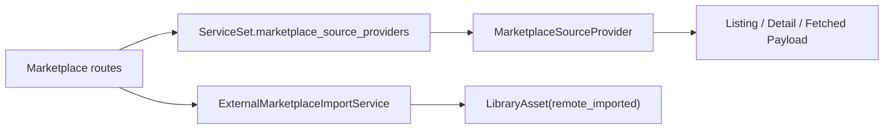

# Design · Enterprise Marketplace API 与 Contracts

## 边界

本 child 把 Marketplace Source registry 投射为 HTTP API 和共享 DTO。它不实现具体 provider，也不改变 Project install 语义。



## Contracts

建议新增 `crates/agentdash-contracts/src/external_marketplace.rs` 并纳入 TS 生成。

核心 DTO：

```rust
pub struct MarketplaceSourceDto {
    pub source_key: String,
    pub display_name: String,
    pub description: Option<String>,
    pub provider_kind: MarketplaceSourceProviderKindDto,
    pub supported_asset_types: Vec<LibraryAssetType>,
    pub trust_level: MarketplaceSourceTrustLevelDto,
    pub enabled: bool,
}

pub struct ListExternalMarketplaceAssetsQuery {
    pub source_key: Option<String>,
    pub asset_type: Option<String>,
    pub query: Option<String>,
    pub cursor: Option<String>,
    pub limit: Option<u32>,
}

pub struct ExternalMarketplaceAssetPageDto {
    pub items: Vec<ExternalMarketplaceAssetListingDto>,
    pub next_cursor: Option<String>,
}

pub struct ImportExternalMarketplaceAssetRequest {
    pub source_key: String,
    pub external_id: String,
    pub asset_type: String,
    pub import_mode: String,
}
```

`import_mode` 首期只接受 `upsert_library_asset`。后续如需要“只预览不写入”应新增 mode，不复用现有写入 mode。

## Route Behavior

### `GET /api/marketplace/sources`

返回 registry 中所有 provider descriptor。disabled source 仍可展示，但 listing/import 可以按后续策略拦截；本 child 至少透出 `enabled`。

### `GET /api/marketplace/external-assets`

行为：

- `source_key` 缺省时聚合所有 enabled providers。
- `source_key` 存在时只查询指定 provider。
- `asset_type` 解析为 `LibraryAssetType`，只允许 `skill_template` / `mcp_server_template`。
- 对 provider 传入 `MarketplaceAssetQuery { asset_type, query, cursor, limit }`。
- 聚合多来源时 `next_cursor` 语义复杂，首期应要求分页 cursor 绑定单一 source；未指定 `source_key` 且带 `cursor` 返回 BadRequest。

### `GET /api/marketplace/external-assets/{source_key}/{external_id}`

查找 source 后调用 `get_asset_detail`。provider `NotFound` 映射 404。

### `POST /api/marketplace/external-assets/import`

行为：

1. 查找 provider。
2. 调用 `fetch_asset_payload(external_id)`。
3. 校验 fetched asset type 与请求 `asset_type` 一致。
4. 使用 fetched payload 的 `payload: Value` 构造 `LibraryAsset`，source 为 `remote_imported`。
5. `source_ref = market:{source_key}:{asset_type}:{external_id}`。
6. identity 建议为 `asset_type + user/system scope + key`；首期 scope 可沿用 Shared Library 现有 API 可写 scope 策略，若权限尚未精细化，使用 system/org/user 的选择必须在实现中固定并测试。
7. `payload_digest` 使用平台 canonical JSON 规则计算，不使用远端 digest 覆盖平台 digest。

导入只写 Shared Library，不安装 Project 资源。

### `POST /api/marketplace/external-assets/refresh`

首期返回比较结果，不写 Project 资源：

```rust
pub struct RefreshExternalMarketplaceAssetResponse {
    pub source_ref: String,
    pub remote_version: Option<String>,
    pub remote_digest: Option<String>,
    pub local_version: Option<String>,
    pub local_digest: Option<String>,
    pub status: ExternalMarketplaceRefreshStatus,
}
```

`status` 至少包含 `up_to_date`、`update_available`、`source_missing`、`not_imported`。

## Application Service

建议在 `agentdash-application/src/shared_library/` 增加外部市场 import helper，API route 不直接拼装 `LibraryAsset` 细节。若现有 shared_library service 已承担 list/install/publish，可放在同一模块中：

```rust
pub async fn import_external_marketplace_asset(
    repos: &RepositorySet,
    input: ImportExternalMarketplaceAssetInput,
    fetched: MarketplaceFetchedAsset,
) -> Result<LibraryAsset, ImportExternalMarketplaceAssetError>
```

## Validation & Errors

| 条件 | HTTP |
| --- | --- |
| `source_key` 不存在 | 404 |
| `asset_type` 非法 | 400 |
| `cursor` 跨多 source 使用 | 400 |
| provider `BadRequest` | 400 |
| provider `NotFound` | 404 |
| provider `Unavailable` | 502 或 503 |
| provider `Internal` | 500 |
| payload validator 失败 | 400 |

## Tests

- 使用测试 provider 覆盖 list/detail/import/refresh。
- 验证 query 参数透传到 provider。
- 验证 import 写入 `remote_imported`、`source_ref` 和 `LibraryAsset.payload_digest`。
- 验证请求 asset_type 与 fetched asset type 不一致时失败。
- 验证 refresh 不创建 Project 资源。
