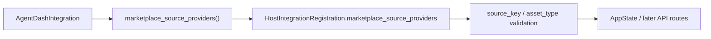

# Design · Marketplace Source SPI 与 Integration Registry

## 边界

本 child 只建立 source provider 的注册和发现基础，不处理 HTTP API、LibraryAsset import、远端刷新和前端展示。

数据流：



## SPI 类型

建议在 `agentdash-spi/src/platform/marketplace_source.rs` 新增轻量类型，并从 `agentdash-spi::lib` re-export。

核心类型草图：

```rust
pub enum MarketplaceSourceProviderKind {
    Integration,
    Builtin,
}

pub enum MarketplaceSourceTrustLevel {
    Curated,
    Organization,
    PublicIndex,
}

pub struct MarketplaceSourceDescriptor {
    pub source_key: String,
    pub display_name: String,
    pub description: Option<String>,
    pub provider_kind: MarketplaceSourceProviderKind,
    pub supported_asset_types: Vec<LibraryAssetType>,
    pub trust_level: MarketplaceSourceTrustLevel,
    pub enabled: bool,
}

pub struct MarketplaceAssetQuery {
    pub asset_type: Option<LibraryAssetType>,
    pub query: Option<String>,
    pub cursor: Option<String>,
    pub limit: Option<u32>,
}

pub struct MarketplaceAssetPage {
    pub items: Vec<MarketplaceAssetListing>,
    pub next_cursor: Option<String>,
}
```

`MarketplaceAssetListing` 必须包含远端身份和版本字段：

```rust
pub struct MarketplaceAssetListing {
    pub source_key: String,
    pub external_id: String,
    pub asset_type: LibraryAssetType,
    pub key: String,
    pub display_name: String,
    pub description: Option<String>,
    pub version: String,
    pub tags: Vec<String>,
    pub author: Option<String>,
    pub digest: Option<String>,
    pub updated_at: Option<DateTime<Utc>>,
    pub install_requirements: Vec<MarketplaceInstallRequirement>,
}
```

`MarketplaceFetchedAsset` 首期只承载 Skill / MCP 两类 payload。payload 的最终字段可在后续 import child 细化，但 enum variant 要能表达 asset type 分派。

```rust
#[async_trait]
pub trait MarketplaceSourceProvider: Send + Sync {
    fn descriptor(&self) -> MarketplaceSourceDescriptor;

    async fn list_assets(
        &self,
        query: MarketplaceAssetQuery,
    ) -> Result<MarketplaceAssetPage, MarketplaceSourceError>;

    async fn get_asset_detail(
        &self,
        external_id: &str,
    ) -> Result<MarketplaceAssetDetail, MarketplaceSourceError>;

    async fn fetch_asset_payload(
        &self,
        external_id: &str,
    ) -> Result<MarketplaceFetchedAsset, MarketplaceSourceError>;
}
```

## Integration API

`agentdash-integration-api` 新增 re-export，并在 `AgentDashIntegration` 上增加：

```rust
fn marketplace_source_providers(&self) -> Vec<Arc<dyn MarketplaceSourceProvider>> {
    vec![]
}
```

该入口与 `library_asset_seeds()` 一样由宿主统一收集。Integration 只声明 provider，不直接写数据库，也不持有 API route 逻辑。

## Registry Validation

`agentdash-api/src/integrations.rs` 扩展 `HostIntegrationRegistration`：

```rust
pub marketplace_source_providers: Vec<Arc<dyn MarketplaceSourceProvider>>,
```

收集每个 provider 时读取 descriptor 并校验：

- `source_key` 非空。
- `source_key` 全局唯一。
- `supported_asset_types` 非空。
- `supported_asset_types` 只包含 `SkillTemplate` 与 `McpServerTemplate`。
- descriptor 的 `source_key` 与 listing 中返回的 `source_key` 在后续 API 层保持一致。

冲突错误沿用现有 `IntegrationRegistrationError` 风格，包含 source key、first owner、second owner。

## First-Party Source

First-party integration 增加一个空/示例 provider，用于合同测试。该 provider 可以返回空 page 和 not found detail/fetch 错误，重点是验证：

- trait 对企业接入者可实现。
- host registration 能收集 provider。
- registry 能读取 descriptor。
- duplicate source key 测试有实际 provider 样例。

## 依赖约束

SPI 与 Integration API 可使用 `serde`、`async-trait`、`chrono`、轻量领域类型。不得把 HTTP client、database、web framework 或 MCP runtime 依赖引入 contract crate。
