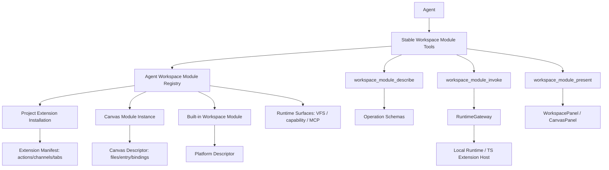

# Design · Agent Workspace Module Registry 与 Canvas Extension 协作面预研

## 1. 核心判断

Agent 与插件/Canvas 的关系不应建模为“Agent 拿到越来越多离散工具”。更合适的抽象是：

> Agent 通过稳定的 Workspace Module Tools 与当前 AgentFrame/Session 可见的工作台协作模块交互；Extension、Canvas、Protocol Adapter、平台内置面板只是 Workspace Module 的不同来源。

这个模型把“可视化 GUI 协作”和“接口式 action/channel 协作”放在同一个 Workspace Module 视角下：

- GUI 面：workspace tab、webview、canvas panel、present/open。
- 接口面：runtime action、protocol channel method、built-in operation。
- 状态面：enabled/unavailable、backend placement、package artifact、permission decision、trace metadata。
- 身份面：module_id、source_kind、source_ref、project/session/agent frame scope。

## 2. 术语边界：Workspace Module vs Runtime Surface

本项目已有两套相关但不等价的词：

| 术语 | 适用层 | 含义 | 示例 |
|---|---|---|---|
| Workspace | 前端工作台 / GUI 协作层 | 用户与 Agent 共同打开、排列、交互的工作台空间 | `WorkspacePanel`、`WorkspaceRuntimeData`、`workspace_tabs`、`TabTypeDescriptor` |
| Workspace Module | Agent/前端协作模块 | 可被 Agent 发现、展开、调用、展示的工作台模块 | Extension tab/action/channel、Canvas、built-in panel |
| Runtime Surface | 后端运行时投影层 | 已解析给执行器或运行时使用的底层能力面 | `capability_surface`、`vfs_surface`、`mcp_surface`、`ResolvedVfsSurface` |

因此本任务的顶层命名使用 **Workspace Module**，避免和前端现有命名割裂；`surface` 保留给底层 runtime projection，不作为 Agent 协作入口的主命名。

## 3. 概念定义

| 概念 | 定义 | 权威事实源 | 运行时投影 |
|---|---|---|---|
| Workspace Module Definition | 模块声明了哪些 UI、operation、channel、permission 和 bundle | Extension manifest、Canvas descriptor、built-in descriptor | WorkspaceModuleDescriptor |
| Workspace Module Instance | 某个定义在 Project/Session/AgentFrame 中的可用实例 | ProjectExtensionInstallation、Canvas、AgentFrame visible module refs | RuntimeWorkspaceModuleInstance |
| Workspace Module Registry | 当前 AgentFrame/Session 可见 workspace modules 的聚合索引 | 多来源聚合，不自成业务事实源 | AgentWorkspaceModuleProjection |
| Workspace Module Tools | Agent 使用的稳定工具组 | 平台内置 Agent tools | `workspace_module_list` / `workspace_module_describe` / `workspace_module_invoke` / `workspace_module_present` |

Workspace Module 是 Agent/前端视角的协作投影，不替代 Shared Library、Project extension installation、Canvas、RuntimeGateway 等事实源。

## 4. 数据流草图

## 5. 为什么选择稳定元工具

逐个 extension action 注入 Agent tools 的优点是 schema 直达、调用短路；但它把可视化协作模块扁平化为函数集合，长期会带来三个问题：

1. Project 安装越多，工具列表越膨胀，Agent 的工具选择成本和上下文成本上升。
2. GUI 模块天然包含 view、state、operation、event、artifact，不适合作为单个函数集合呈现。
3. Canvas 与 Extension 的共性在“工作台协作模块”层，而不是“action 函数”层；稳定元工具更容易把动态 Canvas instance 纳入同一协议。

本设计选择稳定元工具，是为了让 Agent 先识别“当前 Workspace 里有哪些可协作模块”，再按需展开具体能力。工具数量稳定，schema 按需获取，trace 和权限也有统一入口。

## 6. Workspace Module Tools 初版形态

### `workspace_module_list`

返回当前 AgentFrame/Session 可见 module 的短摘要：

- `module_id`
- `kind`: `extension` / `canvas` / `builtin` / `protocol_adapter`
- `title`
- `description`
- `source`
- `ui_summary`
- `operation_summary`
- `status`

不返回完整 JSON schema，避免把 Project 所有插件能力一次性塞给模型。

### `workspace_module_describe`

输入 `module_id`，返回该 module 的详细 descriptor：

- UI entries：tab type、renderer kind、uri scheme、present/open 参数。
- Operations：action/channel/built-in operation key、description、input_schema、output_schema、permission summary。
- State：是否可执行、缺失 backend/artifact/permission 时的诊断。
- Runtime backing：必要时引用底层 runtime surface，例如 VFS surface 或 extension runtime projection。

### `workspace_module_invoke`

输入 `module_id + operation_key + input`。宿主负责：

- 根据 current RuntimeSession / AgentFrame 解析 Project、Session、Backend、Workspace、底层 runtime surface。
- 校验 operation 是否属于该 module。
- 按 operation schema 校验 input。
- 进入 RuntimeGateway 或对应 application service。
- 记录 module source、operation、trace、permission decision、backend。

### `workspace_module_present`

输入 `module_id + view_key + optional payload`，请求宿主向用户展示 GUI：

- Extension webview tab。
- Canvas panel。
- Built-in runtime panel。

是否立即打开 UI 取决于当前执行器与前端能力；不能打开时返回可操作诊断。

## 7. Extension 映射

Extension manifest 当前已经包含：

- `runtime_actions`
- `protocol_channels`
- `extension_dependencies`
- `workspace_tabs`
- `permissions`
- `bundles`

映射规则：

| Manifest 字段 | Workspace Module 投影 |
|---|---|
| `extension_id` / Project installation key | `module_id` 与 source metadata |
| `workspace_tabs` | UI entries |
| `runtime_actions` | operations |
| `protocol_channels.methods` | provider operations，**确定挂在 provider extension module 下**（D3），不独立成 module |
| `extension_dependencies` | consumer binding metadata，用于 alias 解析与诊断 |
| `permissions` / action permissions | permission summary 与 invoke 裁决输入 |
| `bundles` / package artifact | executable status 与 local runtime activation 输入 |

Extension module 的 action 调用继续通过 `ExtensionRuntimeActionProvider` 和 RuntimeGateway，不让 Workspace Module Registry 直接执行 TS host。

## 8. Canvas 映射

Canvas 可以被视为动态 workspace module instance：

- Definition 来自 Canvas files、entry、bindings、sandbox config、runtime bridge requirements。
- Instance 来自 Project Canvas 或 AgentFrame visible canvas mount。
- UI entry 是 Canvas tab / runtime preview。
- Operations 来自 Canvas bindings 与 bridge usage，也可以先从 built-in canvas operations 提供。
- Promote 后生成 Extension package，但协作协议仍是 workspace module：同一模块从 `canvas` source 变成 `extension` source。

生命周期建议：

1. Agent 创建或选择 Canvas module。
2. Agent 写入/更新 Canvas files 与 bindings。
3. Agent 使用 `workspace_module_present` 展示给用户。
4. 用户/Agent 通过公共 bridge 调用 module operations。
5. Canvas 稳定后发布为 packaged extension。

这能解释为什么 Canvas 不是 Extension Package 本身，而是 Extension Runtime 的动态 authoring 形态。

## 9. AgentFrame 与 Session 边界（D4 修正）

> 代码现状修正：`AgentFrame` 当前只有 `visible_canvas_mount_ids_json`（见 `crates/agentdash-domain/src/workflow/agent_frame.rs`），**没有 extension/module 可见性字段**；extension 可见性现在的事实源是 Project-scoped（前端 `SessionPage` 按 owner Project 拉 `GET /projects/{id}/extension-runtime`）。因此"以 AgentFrame 为锚"在 extension 一侧目前不成立，必须由 Child 1 显式补齐，而不是当作既有事实。

定稿方案（D4）：

- 可见性的**默认全集** = Project enabled extension installations + project visible canvas，保持现有 Project-scoped 事实源不动。
- AgentFrame **预留可见性裁切字段**（与 `visible_canvas_mount_ids_json` 同构的 `visible_*` 模式），用于 per-frame 收窄；但**裁切的解析走完整 Capability 能力通道**（`CapabilityState` / `effective_capability_json`），不另开旁路 projection。即：Workspace Module 可见性是 capability 解析的产物，不是 AgentFrame 直接驱动的第二套规则。
- RuntimeSession 仍是 delivery trace 和 transport，不作为业务事实源。
- Session launch 阶段把"经 capability 解析后的 visible workspace module projection"映射到 turn frame；Workspace Module Tools 运行时再按 current target 解析 Project/Backend/Workspace。
- **死字段收口（D6）**：现有 `FrameLaunchIntent.extension_runtime` / `ConstructionProjections.extension_runtime` 在 `frame_construction/mod.rs` 永远填 `None`、无生产消费。Child 1 必须接管为新 projection 或删除，不允许新旧两条投影并存。

这与现有 lifecycle mental model 对齐：定义与控制事实在 lifecycle/agent/frame + capability，runtime session 承担执行桥与 trace。

## 10. 权限与 schema

- `workspace_module_list` 只返回摘要，不暴露敏感参数或完整 schema。
- `workspace_module_describe` 返回 schema，但不授予调用权；调用权仍由 module status、capability、permission、backend availability 决定。
- `workspace_module_invoke` 必须在服务端校验 schema，拒绝未知 operation。
- Agent 不传 Project ID、Backend ID、Workspace root、AgentFrame ID；这些内部路由由宿主从当前 execution context 解析。
- trace 需要记录 module source 与 operation provenance，保证 Extension 与 Canvas 的调用可审计。

## 11. 与现有任务关系

- `06-04-plugin-extension-taxonomy` 解决命名与分层；本任务解决 Agent 运行时如何发现和协作。
- `05-26-ts-extension-host-sdk` 系列提供 Extension manifest、RuntimeGateway proxy、本机 TS host、WorkspacePanel 动态 tab。
- `05-26-canvas-promote-extension` 已证明 Canvas 能发布为 extension package；本任务把它提升为统一 workspace module lifecycle。

## 12. Child task 拆分（收口为 3 轮）

原 6 child 中 1+2 本属同一条"读路径"的契约与工具两面，4(present)/5(canvas authoring) 在 D2/D3 收口决策下不必各占一轮。重排为 3 child，读 / 操作 / 收尾各一刀，每轮独立可验收。

**Child 1 · `06-08-workspace-module-read-contract`（读路径 + 单一契约）** —— 原 1+2，吸收设置页契约
- 单一 Workspace Module projection DTO：聚合 extension（actions + channels-as-operations + tabs）/ canvas / builtin，只有一种 module 形态（D3）。
- `workspace_module_list` / `workspace_module_describe` 接入 session runtime tools。
- AgentFrame 预留可见性裁切字段，解析走 Capability 通道（D4）。
- 收口 `extension_runtime` 死字段（D6）。
- 同一份 projection 同时服务 Agent 工具与项目设置页 UI（D5 契约侧）。
- 零执行副作用，先验证发现路径（D1）。

**Child 2 · `06-08-workspace-module-operate`（invoke + present）** —— 原 3+4 + canvas invoke 分支
- `workspace_module_invoke`：按 module 来源**分支派发**——extension → `RuntimeGateway` / `ExtensionRuntimeActionProvider`；canvas → 包现有 canvas application service（D2，不另起 authoring）；builtin → 对应 service。服务端校验 operation 归属 + schema + 权限 + backend placement。
- `workspace_module_present`：best-effort GUI 推送（WorkspacePanel / CanvasPanel），无前端目标时返回可操作诊断。
- Canvas 首轮：read / present / invoke 走现有 service 即够用；Agent 主动 create/update authoring 作为本轮可选尾段或后续任务。

**Child 3 · `06-08-workspace-module-integration-ui`（集成 review + 管理 UI + 收尾）** —— 原 6 + D5 UI
- 统一 trace / 权限 / ContextFrame / UI 诊断。
- 实现项目设置页 WorkspaceModule 合并管理 UI，消费 Child 1 的 canonical projection。
- slug 改名（`...-surface-registry` → `...-workspace-module-registry`）与文档收尾。

## 13. 首轮建议（= Child 1）

首轮实现优先做只读 projection 与 `workspace_module_list/describe`（D1）。理由：

- 能最快验证 Agent 获取路径是否清晰。
- 不触碰 execution side effect，风险低。
- 可以同时把 Extension 与 Canvas 的 descriptor shape 与"单一 module 形态"定准。
- 后续 `workspace_module_invoke` 与 `workspace_module_present` 在 Child 2 独立验收。
