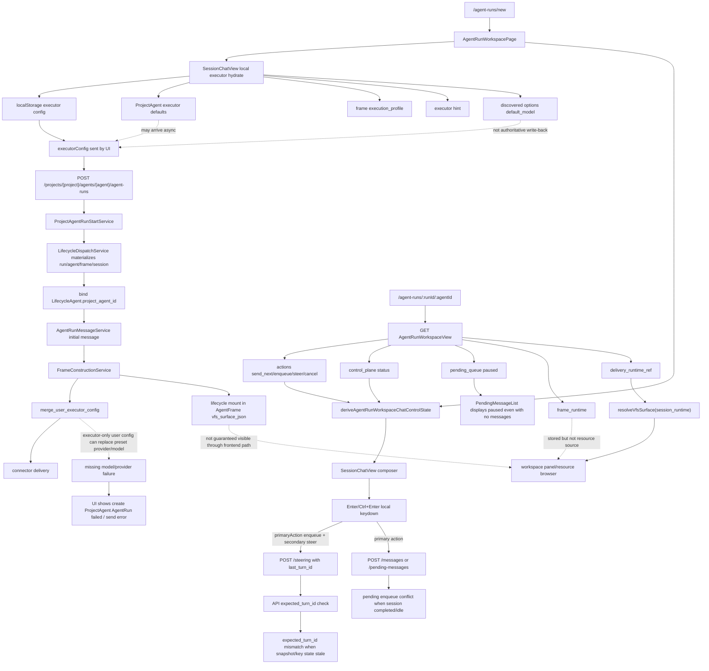
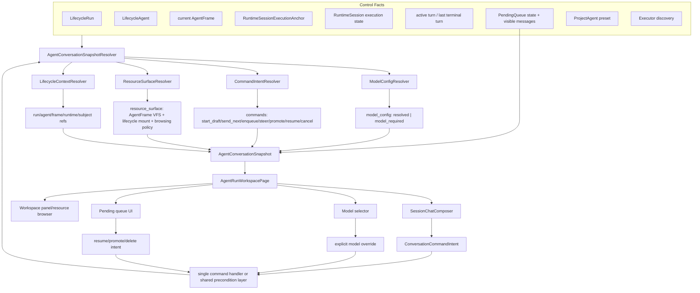
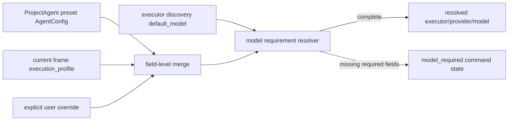
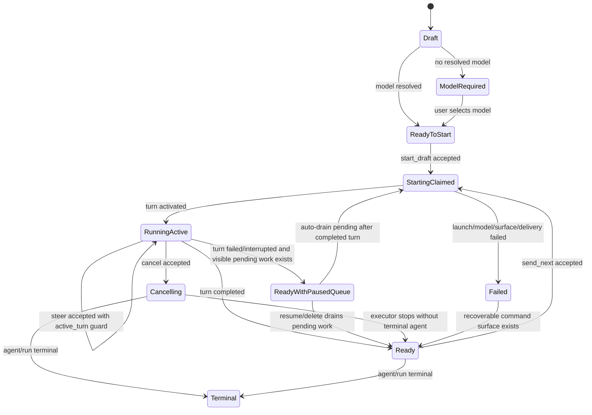
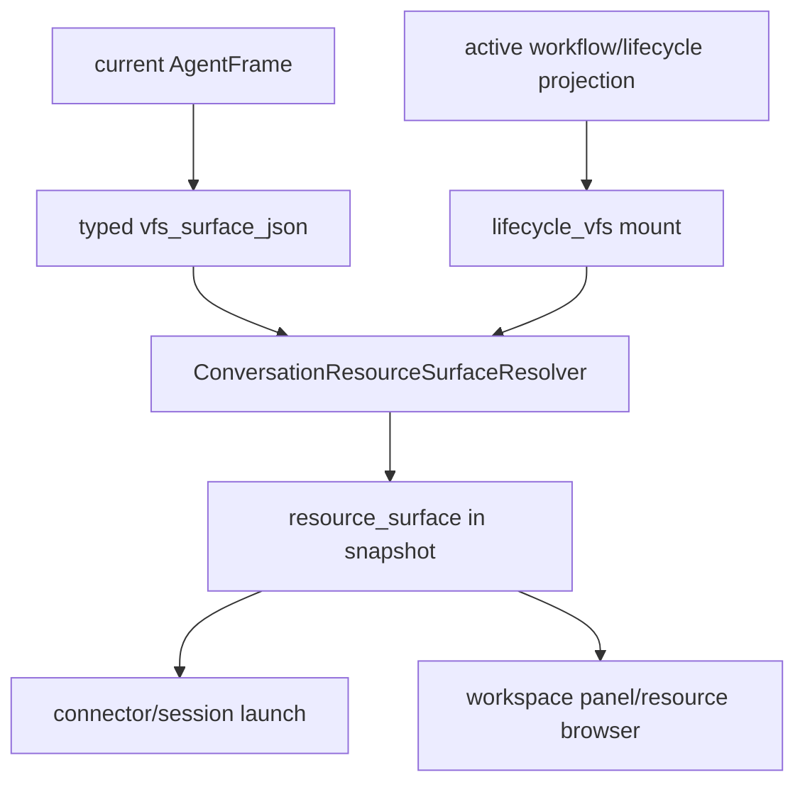
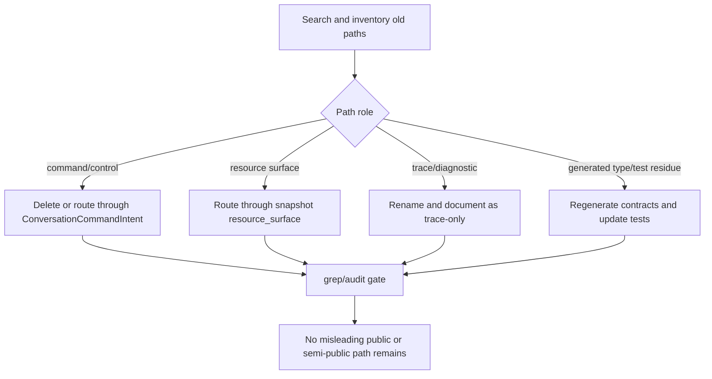

# 设计

## Architecture Goal

目标不是继续给 `start_draft`、`send_next`、`enqueue`、`steer`、pending queue、resource browser 各自补判断，而是建立一套 AgentRun conversation control model：

1. 后端用同一个 resolver 读取 run / agent / frame / runtime session / active turn / pending queue / model config / resource surface。
2. resolver 生成一份 `AgentConversationSnapshot`。
3. 前端只渲染 snapshot，不再本地解释业务状态。
4. 每次提交都带明确 `ConversationCommandIntent`，并由后端用 snapshot precondition 校验。
5. 模型配置和 resource surface 都是 snapshot 的一等字段。

## Current State



### Current Entry Inventory

| Entry | Current backend path | Current frontend path | Primary risk |
| --- | --- | --- | --- |
| ProjectAgent draft start | `project_agents.rs -> ProjectAgentRunStartService -> AgentRunMessageService` | `AgentRunWorkspacePage -> createProjectAgentRun` | executor-only config drops preset model/provider |
| Send next | `lifecycle_agents.rs /messages -> ensure_send_next_allowed` | primary action `send_next` | readiness split across workspace status and execution state |
| Enqueue | `/pending-messages -> ensure_pending_enqueue_allowed` | primary action `enqueue` when running | stale running state tries enqueue after completed/idle |
| Steer | `/steering -> expected_turn_id -> AgentRunSteeringService` | Ctrl/Cmd+Enter secondary action | stale turn id or idle state becomes steer |
| Promote pending | `/pending-messages/{id}/promote` | pending row action | depends on running active turn |
| Resume pending | `/pending-messages/resume` | pending queue banner action | pause visible even without visible pending work |
| Cancel | `/cancel` | cancel action | cancelling and terminal cleanup not part of one command state machine |
| Workspace resources | `session_runtime -> AgentFrame vfs` resolver | `resolveVfsSurface(session_runtime)` | AgentRun workspace and panel consume different resource facts |

## Target State



## Target Snapshot Contract

`AgentConversationSnapshot` can be implemented by extending `AgentRunWorkspaceView` first, but the contract should be modeled as a full conversation snapshot:

```rust
pub struct AgentConversationSnapshot {
    pub identity: AgentConversationIdentity,
    pub lifecycle_context: AgentConversationLifecycleContext,
    pub execution: ConversationExecutionView,
    pub model_config: ConversationModelConfigView,
    pub commands: ConversationCommandSetView,
    pub pending: ConversationPendingQueueView,
    pub resource_surface: ConversationResourceSurfaceView,
    pub diagnostics: Vec<ConversationDiagnosticView>,
}
```

### Command View

Each user-visible command should be projected as data rather than inferred by components:

```rust
pub struct ConversationCommandView {
    pub kind: ConversationCommandKind,
    pub enabled: bool,
    pub unavailable_reason: Option<String>,
    pub placement: ConversationCommandPlacement,
    pub shortcut: Option<ConversationShortcut>,
    pub requires_input: bool,
    pub executor_config_policy: ExecutorConfigPolicy,
    pub precondition: ConversationCommandPrecondition,
}
```

The frontend may map labels/icons locally, but `kind`, `enabled`, `shortcut`, `executor_config_policy`, and `precondition` come from the snapshot adapter.

### Model Config



Rules:

- Preset and frame defaults are authoritative persisted defaults.
- User override is field-level: executor/provider/model/thinking/permission replace only the fields supplied by the user.
- An executor-only override keeps preset provider/model when they are still valid for that executor.
- Discovery `default_model` may fill a missing model only when the backend marks it as valid for the selected executor/provider.
- If the selected executor requires explicit model selection and no valid model exists, snapshot enters `model_required` and command submission is disabled with a precise reason.
- ProjectAgent summary exposes `effective_executor_config` with `source` and `validity`; localStorage may provide recent choices, but not a ProjectAgent default.
- Command stores propagate API errors instead of converting command failure into `null`.

## Command State Machine



`StartingClaimed` maps to the existing session `TurnState::Claimed`: the session is reserved, but there is not yet an active turn that can accept steer/promote. `RunningActive` maps to `TurnState::Active(turn_id)` and is the only state that may expose steer or promote-to-steer.

### Keyboard Mapping

| Snapshot command mode | Enter | Ctrl/Cmd+Enter | Notes |
| --- | --- | --- | --- |
| `draft.ready_to_start` | `start_draft` | `start_draft` | model must be resolved |
| `model_required` | none | none | selector focused/displayed |
| `starting_claimed` | none | none | no active turn for steer/promote |
| `ready` | `send_next` | `send_next` | never steer when not running |
| `running_active.enqueue_only` | `enqueue` | `enqueue` | no hidden steer |
| `running_active.enqueue_and_steer` | `enqueue` | `steer` | steer command carries snapshot active turn token |
| `cancelling` | none | none | cancel/stop controls only |
| `terminal` | none | none | readonly |

The frontend should receive this mapping from snapshot, not reconstruct it from `primaryAction.kind`.

## Pending Queue Projection

```rust
pub struct ConversationPendingQueueView {
    pub visible_messages: Vec<PendingMessageView>,
    pub paused: bool,
    pub user_attention: bool,
    pub resume_command: Option<ConversationCommandAvailabilityView>,
    pub message: Option<String>,
}
```

Rules:

- `paused` records queue mechanics.
- `visible_messages` records user-visible queued work.
- `user_attention` is true only when the UI should render a banner.
- A terminal or stopped session with no visible pending messages does not show a pending banner.
- Resume is a command availability, not a direct function of paused.

## Resource Surface Projection



Rules:

- Agent execution and frontend workspace panel consume the same resource surface projection.
- `session_runtime` may remain a lookup key, but it is not the frontend's resource truth source.
- ProjectAgent explicit lifecycle uses ProjectAgent owner surface plus lifecycle mount.
- Workflow AgentCall uses node-scoped lifecycle surface plus node mount policy.
- The resolver validates three facts together: active workflow projection, persisted `AgentFrame.vfs_surface_json`, and resolved `ResolvedVfsSurface`. If active workflow exists but `lifecycle_vfs` is absent from persisted/resolved surface, the snapshot reports a resource diagnostic.
- For a delivery runtime session, `session_runtime` VFS resolution should use the delivery/accepted frame for that session, not an ambiguous `current_frame.or(anchor_frame)` choice unless the resolver proves they are the same resource surface.

## Implementation Shape

1. Add resolvers as application/domain services while keeping public endpoints in place.
2. Extend generated contracts to carry model state, command modes, pending user attention, and resource surface.
3. Route every command endpoint through the shared resolver/precondition checker.
4. Refactor frontend composer/model selector/pending/resource browser to consume snapshot.
5. Remove duplicate local inference after tests prove all entry points use snapshot.

## Misleading Path Eradication

The target architecture is valid only if old paths cannot silently keep shaping future code. Every path that still advertises a competing owner must be classified and removed or renamed as part of the implementation.



Cleanup rules:

- Session routes may remain for trace, events, approvals, context audit, lineage and terminal inspection, but not as user-facing AgentRun command control.
- `SessionRuntimeControlView` and `SessionRuntimeActionSetView` either disappear from interactive frontend consumption or are renamed/scoped as runtime diagnostics.
- ProjectAgent `/launch` and `ProjectAgentLaunchResult` must be removed or made an internal materialization helper that cannot be mistaken for the primary run start path.
- Frontend `primaryAction/secondaryAction` types must stop representing business command semantics after command list adoption.
- `useAgentRunWorkspaceState` must not call `resolveVfsSurface(session_runtime)` as the workspace panel source after snapshot `resource_surface` exists.
- Store actions for command APIs must not return `null` on failure; old null-return contracts should be removed from callers and tests.
- Tests that assert stale action bits, terminal enqueue/steer behavior, or session-runtime resource control must be rewritten around snapshot commands and diagnostics.
- Generated contracts must not continue exporting interactive control DTOs whose names imply RuntimeSession owns AgentRun commands.

## Review Question

唯一需要用户确认的产品命名决策：URL 和侧边栏是否继续叫 AgentRun。推荐保留 `AgentRun` 作为产品 identity，内部 contract 使用 conversation snapshot 来表达完整会话状态。
