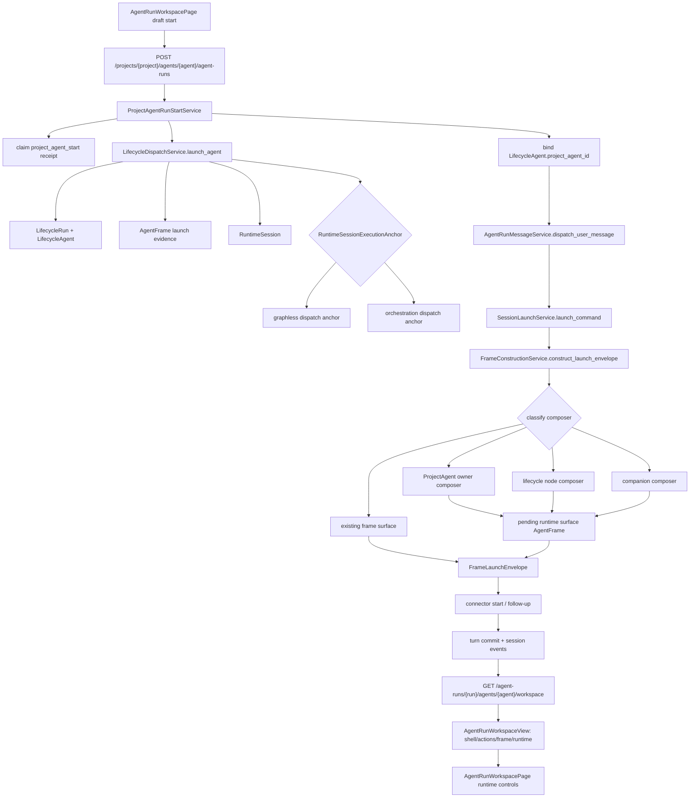
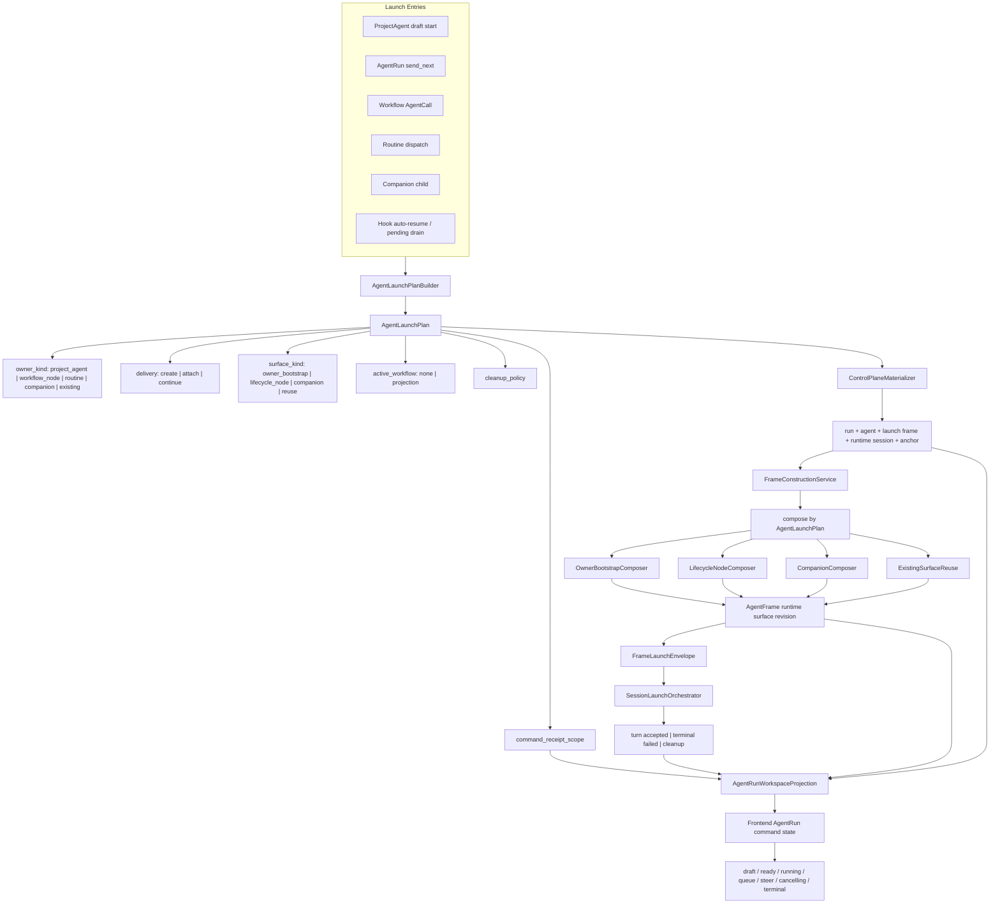
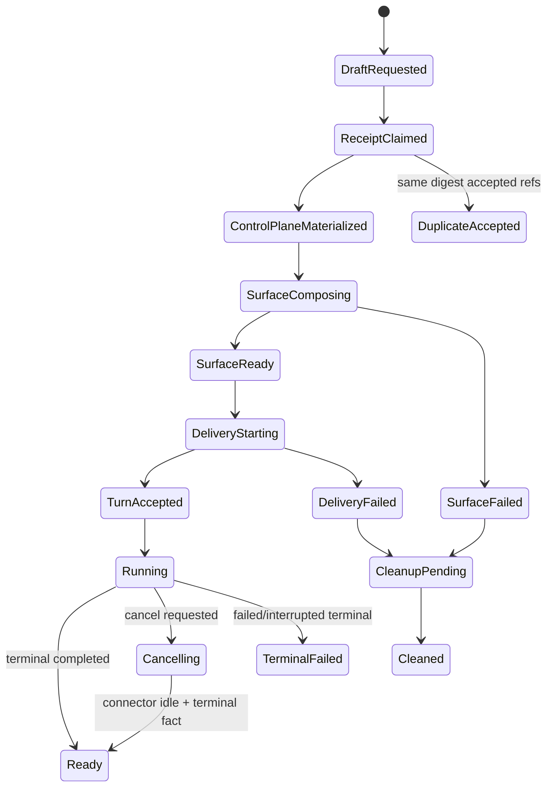
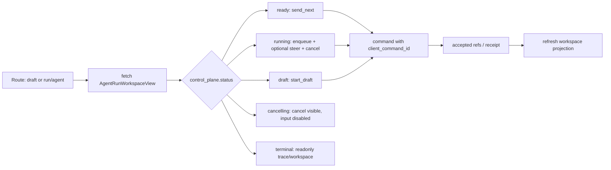

# 设计

## Architecture Goal

目标是建立一条明确的 AgentRun launch lifecycle：

1. 启动入口声明 owner 和 source intent。
2. 后端生成统一 launch plan。
3. dispatch 只 materialize control-plane evidence。
4. frame construction 按 launch plan 选择 composer 并写 runtime surface。
5. session launch 负责 connector delivery 和 turn commit。
6. AgentRun workspace projection 把 launch/control state 投影给前端。
7. 前端只消费 workspace contract 驱动 draft、send、enqueue、steer、cancel 和 retry。

## Current State



### Current Coupling Points

| Coupling | Current shape | Consequence |
| --- | --- | --- |
| owner/source intent | 分散在 `ExecutionSource`、`LifecycleAgent.project_agent_id`、`LaunchCommand.source`、anchor shape | composer 需要从多个事实猜启动意图 |
| dispatch evidence vs runtime surface | launch frame 已独立为 evidence revision | 需要统一 contract 保证后续 surface composer 一定接手 |
| active workflow | graph-backed anchor 和 active workflow projection 都存在 | ProjectAgent owner surface 与 lifecycle mount 需要明确组合方式 |
| workspace readiness | workspace API 通过 runtime/session/frame/action 现场聚合 | 前端拿到的是状态结果，但后端缺少 launch 阶段可观测状态 |
| tests | ProjectAgent start tests 使用 fake delivery | 真实 frame construction path 覆盖不足 |

## Target State



## Target Backend Contract

### AgentLaunchPlan

`AgentLaunchPlan` 是 application 层 launch contract。第一阶段建议作为 transient value object，由启动入口构造并传递给 dispatch/frame construction；后续若需要跨进程诊断或恢复，再投影为 read model。

```rust
pub struct AgentLaunchPlan {
    pub owner_kind: LaunchOwnerKind,
    pub source_kind: LaunchSourceKind,
    pub project_id: Uuid,
    pub subject_ref: Option<SubjectRef>,
    pub project_agent_id: Option<Uuid>,
    pub workflow_binding: Option<LaunchWorkflowBinding>,
    pub delivery_policy: LaunchDeliveryPolicy,
    pub frame_surface_kind: FrameSurfaceKind,
    pub command_scope: AgentRunCommandScope,
    pub cleanup_policy: LaunchCleanupPolicy,
}
```

| Field | Purpose |
| --- | --- |
| `owner_kind` | 决定 owner bootstrap 语义和前端 workspace identity |
| `source_kind` | 保留 ProjectAgent、Routine、Companion、Workflow node、pending drain 等来源 |
| `workflow_binding` | 显式 lifecycle / node binding，供 lifecycle mount 和 node composer 消费 |
| `frame_surface_kind` | 明确选择 owner bootstrap、lifecycle node、companion 或 reuse |
| `command_scope` | 统一 receipt 幂等 scope |
| `cleanup_policy` | 首轮失败、surface composition failure、delivery failure 的清理策略 |

### Surface Composition Rules

| Entry | Owner kind | Surface kind | Active workflow behavior |
| --- | --- | --- | --- |
| ProjectAgent graphless draft | `ProjectAgent` | `OwnerBootstrap` | none |
| ProjectAgent explicit lifecycle draft | `ProjectAgent` | `OwnerBootstrap` | attach lifecycle mount from active workflow projection |
| AgentRun send_next | existing agent owner | `Reuse` or owner rehydrate | reuse current frame unless bootstrap/rehydrate requires owner composer |
| Workflow AgentCall | `WorkflowNode` | `LifecycleNode` | node-scoped lifecycle mount |
| Routine dispatch | `Routine` | `OwnerBootstrap` | routine VFS + optional workflow projection |
| Companion child | `Companion` | `Companion` | parent slice + optional workflow projection |
| Pending queue drain | existing agent owner | same as AgentRun send_next | uses accepted command scope from pending message |

### RuntimeSessionExecutionAnchor Role

`RuntimeSessionExecutionAnchor` remains the authoritative reverse index:

```text
RuntimeSession -> run / agent / launch_frame / optional orchestration node
```

It should not be the primary composer classifier. Composer selection should come from `AgentLaunchPlan` or a deterministic projection from owner/source facts.

### Launch State Machine



## Target Frontend Contract

Frontend keeps route and command ownership:

```text
/agent-runs/new?projectId=&projectAgentId=
/agent-runs/:runId/:agentId
```

Backend workspace projection owns readiness:

| Workspace field | Frontend responsibility |
| --- | --- |
| `control_plane.status` | pick draft/runtime mode and disable/enable command surfaces |
| `actions` | choose primary/secondary/cancel commands |
| `frame_runtime.execution_profile` | hydrate executor selector for this AgentRun frame |
| `delivery_runtime_ref` | command transport target only |
| `delivery_trace_meta` | display trace facts and expected turn/runtime ids |
| `pending_queue` | show resume/pause semantics |
| `runtime_surface` / VFS surface | resource browser and workspace panel data |

Target frontend behavior:



## Migration Shape

1. Introduce launch plan value objects and adapters without changing public endpoints.
2. Make ProjectAgent start build and pass launch plan through dispatch/message delivery.
3. Make frame construction consume launch plan or launch-plan projection before falling back to existing classification.
4. Extend workspace projection with launch readiness details once backend state exists.
5. Tighten frontend command state to consume new readiness fields.
6. Remove redundant classification helpers after all entry points use launch plan.

## Trade-offs

- Transient launch plan is faster and keeps migration small; persistent read model improves diagnostics but adds migration and recovery semantics.
- Keeping `RuntimeSessionExecutionAnchor` as reverse index preserves trace lookup and existing APIs; making it a composer classifier again would blur owner/source intent.
- ProjectAgent explicit lifecycle should compose owner surface plus lifecycle mount; treating it as pure lifecycle node loses ProjectAgent preset/workspace identity.

## Review Question

The remaining product/architecture decision is whether launch readiness should become a persisted read model. Recommended answer: keep launch plan transient for the first implementation round, then add persistence only if UI recovery or diagnostics need it.
