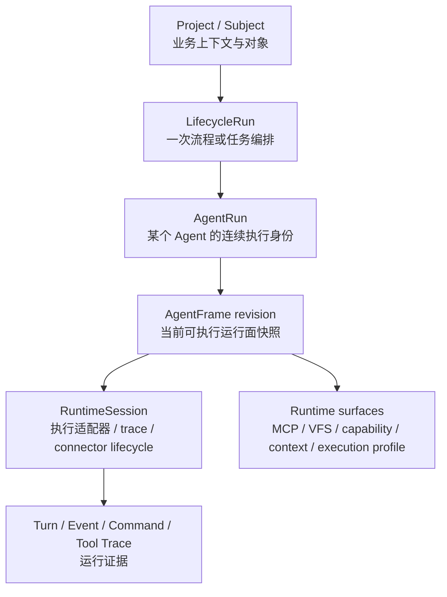
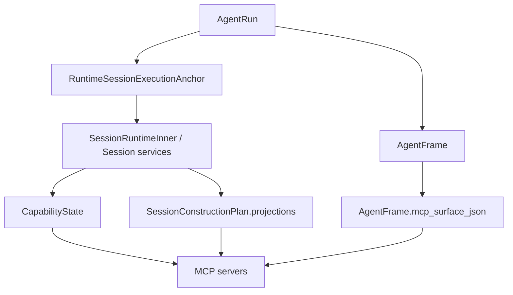
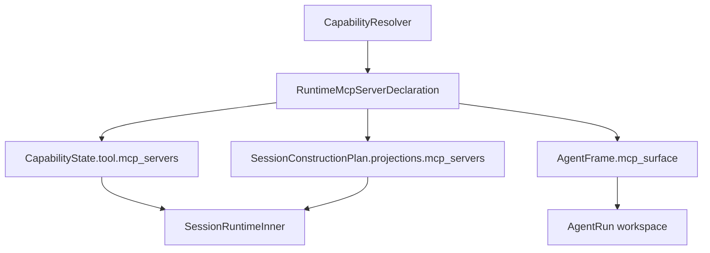
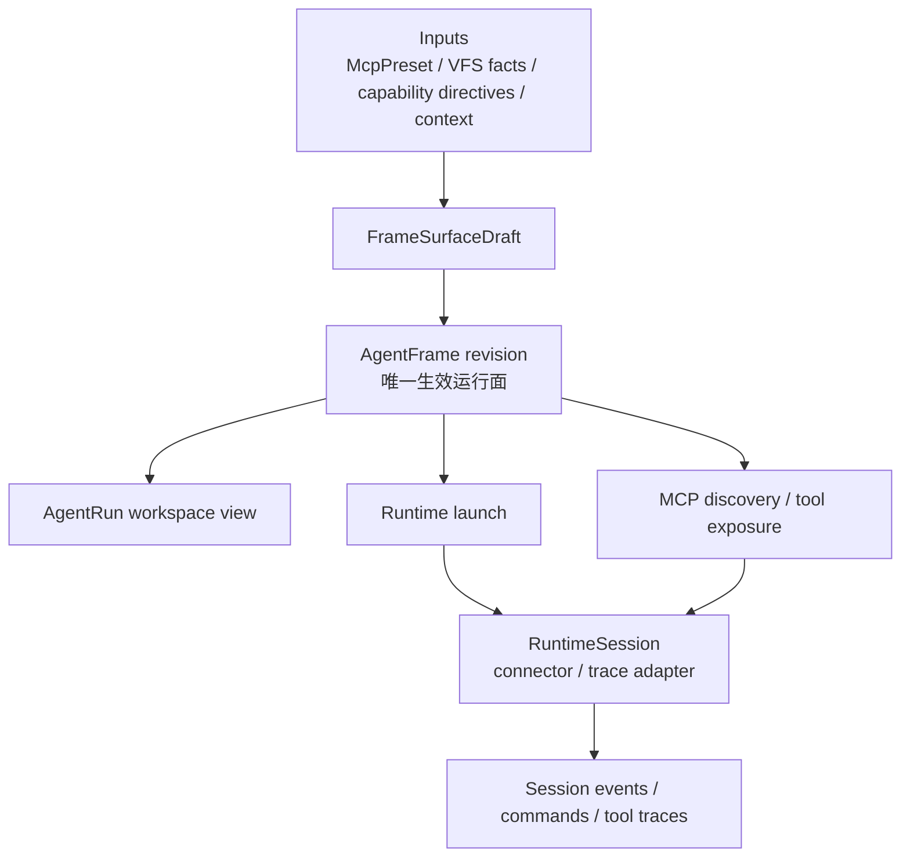
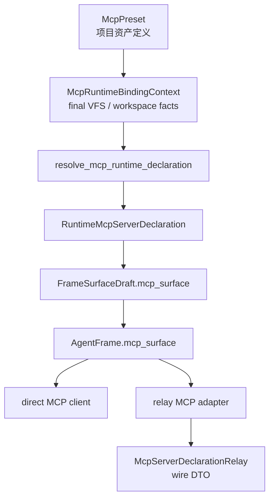

# AgentRun 与 RuntimeSession 层级关系收束设计

## Architecture Intent

本任务的目标模型是 AgentRun-first control plane 与 RuntimeSession trace adapter 的清晰分层。AgentRun/AgentFrame 表达用户可感知的执行身份和可执行运行面，RuntimeSession 表达底层 runtime connector 的一次执行载体和证据链。

目标层级：



核心原则：

```text
AgentRun 承担 continuity identity。
AgentFrame revision 承担 executable surface truth。
RuntimeSession 承担 execution adapter and trace。
Session persistence 保存 runtime 证据，不承载 AgentRun 当前运行面事实。
```

## Current Shape

当前系统正在迁移期内，AgentRun/AgentFrame 已经接管用户侧工作台语义，但 session construction 和 runtime hub 仍持有一些运行面事实或并列投影。



这类结构让读者需要追问：

```text
AgentFrame 是事实源，还是 SessionRuntime 当前 state 是事实源？
CapabilityState 是中间产物，还是长期运行态？
SessionConstructionPlan.projections 是构造草稿，还是并列投影？
```

如果系统需要持续通过 normalization 保证多处投影一致，说明事实源边界还没有完全稳定。

## Standard Convergence

标准收束主要修正命名和概念边界，不大幅改变运行数据流。



标准收束的价值：

- 以 `RuntimeMcpServerDeclaration` 作为 canonical runtime-resolved declaration。
- 以 `McpRuntimeBindingContext` 作为 MCP resolver context。
- 保留现有 projection 同步结构，降低第一阶段落地风险。

标准收束的限制：

- `CapabilityState`、`SessionConstructionPlan`、`AgentFrame` 仍然同时携带 MCP/VFS/capability surface。
- 运行面事实仍需要通过同步规则维护一致。
- Session construction 与 AgentFrame surface 的方向关系仍然不够硬。

## Target Convergence

目标收束将 AgentFrame revision 定义为 AgentRun 当前可执行运行面的唯一事实源。



目标收束的关键变化：

- `FrameSurfaceDraft` 成为 construction pipeline 的输出草稿。
- `AgentFrame revision` 持久化并固定 MCP/VFS/capability/context/execution profile surface。
- runtime launch、MCP discovery、workspace API 从 AgentFrame surface 读取生效事实。
- `SessionRuntimeInner` 专注执行适配、事件、命令、connector 生命周期。
- `RuntimeSessionExecutionAnchor` 保留 trace backlink 价值，用于从 runtime trace 定位 AgentRun/Frame，而不是承载运行面事实。

## Responsibility Table

| Concept | Target Responsibility | Notes |
|---|---|---|
| `LifecycleRun` | 业务流程或任务编排实例 | 组织 AgentRun、subject association、orchestration 状态。 |
| `AgentRun` | Agent 的连续执行身份 | 用户继续交互、命令投递、workspace shell 的主入口。 |
| `AgentFrame revision` | 当前可执行运行面的不可变快照 | MCP、VFS、capability、context、execution profile 的权威位置。 |
| `FrameSurfaceDraft` | 构造过程中生成 frame surface 的临时草稿 | 汇总 resolver、workspace facts、context builder、execution profile。 |
| `CapabilityState` | capability resolver 的结构化输出或 draft 输入 | 目标上不作为 AgentRun 长期事实源。 |
| `SessionConstructionPlan` | launch/construction 过程计划 | 目标上产出或携带 `FrameSurfaceDraft`，不维护并列 projections。 |
| `RuntimeSession` | connector 执行实例与 trace | 负责 turn、event、command、terminal effect、tool trace。 |
| `RuntimeSessionExecutionAnchor` | runtime trace 到 AgentRun/Frame 的 backlink | 支持从 trace 反查 control-plane context。 |
| `RuntimeGateway` | runtime action provider 编排 | action 可按 AgentRun 或 RuntimeSession 入口分流，但事实读取应回到目标 surface。 |

## MCP Model

MCP 不是单独的最终目标，但它是最清楚暴露层级问题的切口。

当前 canonical 名称：

```text
Runtime MCP declaration: RuntimeMcpServerDeclaration
Runtime binding context: McpRuntimeBindingContext
Declaration -> adapter read model: mcp_declaration_to_runtime_server
Adapter read model -> declaration: runtime_server_to_mcp_declaration
Relay/direct partition: partition_runtime_mcp_declarations
```

目标模型：



边界：

- `McpPreset` 是项目资产，保存 reusable transport、route policy、runtime binding declaration。
- `McpRuntimeBindingContext` 从 final VFS 读取本次运行的 workspace facts。
- `RuntimeMcpServerDeclaration` 保存本次运行已解析的 MCP 连接声明。
- `AgentFrame.mcp_surface` 保存 AgentRun 当前可执行 MCP surface。
- `McpServerDeclarationRelay` 是 relay wire DTO。

## API And Frontend Boundary

AgentRun workspace 应表达 AgentRun command/control 语义。RuntimeSession detail 可以继续表达 trace/control 语义。

推荐后续拆分：

```text
AgentRunWorkspaceControlPlaneView
AgentRunWorkspaceActionSetView
RuntimeSessionControlView
```

这样前端主工作台不需要把 `SessionRuntimeControl*` 当作 AgentRun 的用户侧模型，同时 runtime trace/detail 入口仍可使用 RuntimeSession 语义。

## Persistence And Migration Considerations

项目处于预研阶段，模型正确性优先。若后续事实源迁移需要数据库变化，应采用正常 migration：

- AgentFrame surface 字段若已有 JSON 结构可承载目标状态，优先收敛读写路径。
- 若需要新增 frame surface revision metadata，应设计为描述当前事实源和构造 provenance。
- RuntimeSession 相关表保留 trace、event、command、terminal effect、lineage 语义。
- anchor 表继续服务 trace backlink 与调试定位。

## Trade-Offs

标准收束：

- 优点：改动面较小，适合第一批命名和边界清理。
- 代价：多处 surface 同步仍存在，不能完全降低模型层级。

目标收束：

- 优点：事实源明确，AgentRun/AgentFrame/RuntimeSession 三者职责稳定，后续 MCP/VFS/capability/command/UI 都能按同一模型演进。
- 代价：改动涉及 construction、runtime launch、MCP discovery、API DTO、frontend workspace、persistence review，需要分阶段推进。

## Recommended Decision

以目标收束作为长期状态，标准收束作为第一阶段落地方式。第一阶段的命名应按目标状态设计，避免引入 `Session` 相关的新中间概念。
