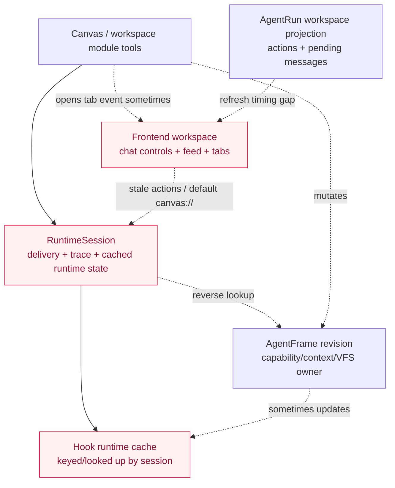
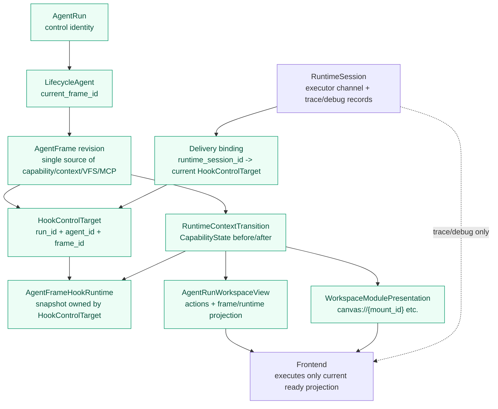
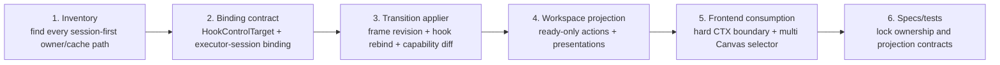
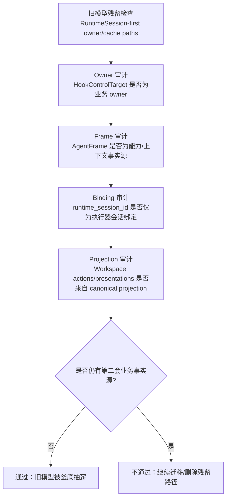

# Hook runtime ownership 模型收敛设计

## Target Model

Hook runtime 的业务身份由 `HookControlTarget` 表达：

```text
LifecycleRun -> LifecycleAgent -> AgentFrame -> HookRuntime
                                      |
                                      +-> RuntimeSession executor binding
```

`AgentFrame` 是 hook runtime 的控制面 owner，原因是 hook policy、workflow contribution、capability surface、context slice、VFS/MCP surface 都随 frame revision 生效。`RuntimeSession` 只表示一次具体执行器连接及其事件流归属，向 hook runtime 提供 runtime session id、turn id、executor、working directory 等运行记录来源。

## Refactor Mainline

本任务的主线不是 Canvas 功能增强，而是把当前混在 `RuntimeSession` 缓存、AgentFrame revision、Hook runtime snapshot、Workspace Panel 本地 tab 状态里的“运行控制权威”收敛成一条清晰链路。

### Current State



问题形态：

- `RuntimeSession` 同时像执行器连接、control lookup key、hook runtime cache key、workspace state source，导致 frame revision 变化后缓存仍指向旧 frame。
- Hook runtime 的 capability cache 反过来决定用户可见 diff，导致 lazy rebuild 后把已有 capability keys 当作全量新增。
- 前端输入区在 projection refresh 时继续使用旧 actions，造成非 running 态还会 steer 或 enqueue pending。
- Feed 把 `context_frame` 当 soft boundary，视觉上把上下文变化漂在工具聚合外面。
- Canvas 只是最容易触发这些问题的场景：create / present / user-open 都会同时碰到 frame revision、VFS、Skill、capability、workspace panel presentation。

### Target State



目标约束：

- AgentFrame revision 是 capability/context/VFS/MCP 的权威事实。
- Hook runtime 的业务 owner 是 `HookControlTarget`，delivery session lookup 只是 adapter binding。
- Runtime capability update 统一从 `CapabilityState before/after` 生成用户可见 diff 和 context frame。
- AgentRun Workspace actions 只能来自当前 ready 的 `AgentRunWorkspaceView`。
- Workspace Panel 只消费 canonical presentation，Canvas tab 可以多个，但每个 tab 必须绑定具体 `canvas://{mount_id}`。

### Implementation Spine



Canvas 相关工作归入第 3-5 步作为验证场景，而不是单独发明一套状态路径：Agent 创建 Canvas、Agent present Canvas、用户主动打开 Canvas、start 时恢复 Canvas，都必须复用同一个 exposure + capability transition + presentation contract。

## Boundary Decisions

- `AgentFrameHookRuntime` 持有 `HookControlTarget` 和 snapshot，snapshot 的 runtime adapter metadata 只记录 delivery provenance。
- `SessionRuntimeRegistry` 可以保留 delivery-session lookup，但 lookup value 需要表达“该 session 当前绑定的 hook target”，并在 AgentFrame revision 推进时统一同步或失效。
- `ExecutionHookProvider::resolve_runtime_hook_target` 是 RuntimeSession adapter 到 AgentFrame target 的边界；业务路径优先直接传递 `HookControlTarget` 或 `AgentFrameRuntimeTarget`。delivery-session 缓存命中但 target 不一致时，服务层应失效并按当前 target 重建，而不是把 mismatch 泄漏给 Canvas / workspace module 等工具路径。
- AgentRun message、steer、cancel、pending queue 和 workspace actions 使用 AgentRun Workspace identity；RuntimeSession endpoint 只提供 trace/debug 和只读 runtime control 视角。
- Canvas / workspace module / capability transition 工具路径消费已解析的 target，不负责修复 hook runtime ownership。
- capability context frame 的用户可见增量来自 `CapabilityState before/after` 的结构化 diff；`hook_runtime.update_capabilities` 的返回值只可用于内部 cache 同步和诊断，因为 hook runtime 可能刚经历 lazy rebuild 或 adapter 失效，不能作为 before-state authority。
- Session feed 聚合把 `context_frame` 当作运行期上下文变更硬边界：CTX 内部仍按连续帧聚合，但工具 burst 不能跨过 CTX 合并。这样 feed 顺序能表达“工具调用导致上下文变化，后续工具运行在新上下文下”。
- Workspace Panel 不根据 tab type 的默认 URI 推断业务关联。Canvas tab 的真实 URI 必须来自 `WorkspaceModuleDescriptor.ui_entries[].presentation_uri` 或 AgentRun workspace projection 中的等价 presentation；默认 `canvas://` 只表达“未选择具体 Canvas”。
- Canvas tab 是多实例 workspace module view：同一 session 可打开多个 `canvas://{mount_id}`，tab identity 由 `typeId + presentation_uri` 决定。用户主动打开 Canvas 和 Agent 触发 present 使用同一个 presentation contract。

## Data Flow

### Message / Next Turn

```text
AgentRun message command
  -> RuntimeSession delivery
  -> accepted turn commit
  -> AgentFrame revision persisted
  -> LifecycleAgent.current_frame_id updated
  -> hook runtime target sync / invalidation
  -> AgentRunWorkspaceView refresh exposes new actions/frame/runtime surface
```

### Runtime Tool Update

```text
tool / capability change
  -> resolve current AgentFrameRuntimeTarget
  -> ensure/rebind Hook runtime for target
  -> apply frame/runtime transition
  -> update live connector tools
  -> emit capability context frame from CapabilityState before/after
  -> keep hook runtime target aligned with effective AgentFrame
```

### Canvas Present

```text
workspace_module_present(canvas)
  -> resolve visible module
  -> expose existing canvas to delivery RuntimeSession
  -> resolve current AgentFrameRuntimeTarget
  -> ensure/rebind Hook runtime for target
  -> apply live VFS capability state with previous AgentFrame capability state
  -> emit workspace_module_presented after capability context frame
```

### Canvas Create / Start Projection

```text
AgentRun start with visible canvas frame surface
  -> build visible workspace module descriptors
  -> project canvas presentation_uri = canvas://{mount_id}
  -> Workspace Panel materializes available/openable Canvas target from projection

workspace_module_create(canvas)
  -> create/attach Canvas
  -> expose Canvas VFS mount and workspace module ref to current AgentFrame
  -> apply live capability transition
  -> emit or return canonical presentation payload matching workspace_module_presented
  -> Workspace Panel opens/activates canvas://{mount_id}
```

Canvas presentation 的 canonical payload 应复用 `WorkspaceModuleDescriptor.ui_entries` 的 `presentation_uri`，避免 `workspace_module_create`、`workspace_module_present`、AgentRun start projection 各自产生不同 URI 规则。

### User-Initiated Canvas Open

```text
Workspace Panel + Canvas
  -> list selectable Canvas modules for current Project/session
  -> user chooses canvas:{mount_id}
  -> backend attaches/exposes Canvas to current RuntimeSession when needed
  -> backend applies same capability transition and hook target alignment as Agent tool paths
  -> backend returns canonical presentation payload
  -> Workspace Panel opens/activates canvas://{mount_id}
```

选择器候选应来自已有 canonical 数据源：Project canvas 列表或 Project workspace module projection。打开动作不能只是前端本地 `openTab("canvas", "canvas://{mount_id}")`；当 session 上下文存在时，它还必须让后端完成 Canvas exposure，否则 Canvas preview 与 VFS/Skill/capability state 会继续漂移。

### Frontend Workspace

```text
turn event / command accepted / workspace module event
  -> fetch AgentRunWorkspaceView
  -> derive SessionChatControlState from actions
  -> execute only enabled action kind
```

刷新中的上一帧 workspace 只用于标题、feed、runtime surface 等展示连续性；输入区 command authority 必须要求当前 projection `status="ready"`，否则返回只读控制态。原因是 running -> ready / terminal 的边界会改变 enqueue、steer、send_next 的可执行性，旧 actions 在刷新窗口内不是可靠事实。

## Open Design Questions

- `SessionRuntimeRegistry` 是否继续直接存 `hook_runtime`，还是改成 `delivery_session_id -> hook_runtime_binding_id` 加 `HookRuntimeStore`。
- Hook snapshot 是否需要持久化 revision / digest，以便进程重启后从 AgentFrame target 恢复并避免重复解析。
- 多 RuntimeSession 绑定同一 AgentFrame 时，是否共享同一个 hook runtime snapshot，还是按 delivery session 保留独立 runtime adapter state。
- companion child / parent session 回流时，parent hook evaluation 应优先使用 parent AgentRun target 还是 gate 事件关联 target。

## Validation Strategy

- 后端 focused tests 覆盖 accepted turn frame switch、runtime capability transition、Canvas create/present/user-open、AgentRun start canvas projection、AgentRun steer、pending promote、companion gate 回流、capability context frame 增量基线。
- 前端 focused tests 覆盖 AgentRun Workspace action projection 刷新、Ctrl/Cmd+Enter 分流、context frame 截断工具聚合、Canvas presentation target 解析、空 `canvas://` 防误用、多 Canvas 选择与 tab 去重。
- Contract/migration 修改后运行 `pnpm run contracts:check`、`pnpm run migration:guard`。

### Final Architecture Gate

最终核验需要做一次架构切换审计，按“旧模型是否仍能生效”而不是“旧名词是否还存在”来判断。



Gate 输出必须包含：

- Hook runtime 入口清单：每个入口的 owner、target 解析、失效/重建行为。
- RuntimeSession 保留职责清单：执行器连接、事件流、trace/debug、connector continuation，并说明这些路径不写业务事实。
- AgentFrame transition 清单：frame revision 推进、capability transition、workspace module/canvas exposure、companion/gate 回流是否共用同一套 transition contract。
- Frontend authority 清单：输入区 actions、feed boundary、workspace presentations 是否只消费当前 projection。
- 残留路径处理结论：删除、迁移、或保留为 debug/trace，并给出理由。
