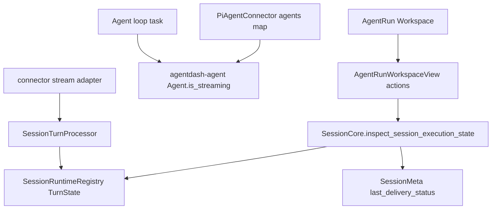
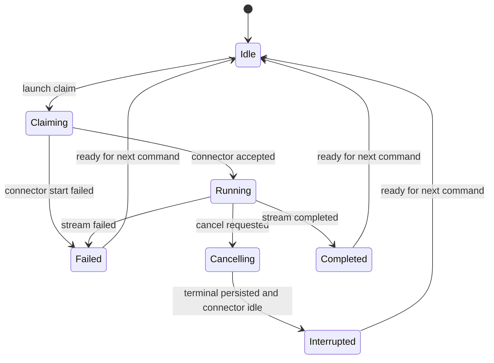
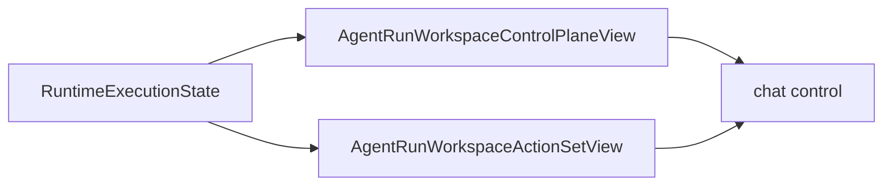
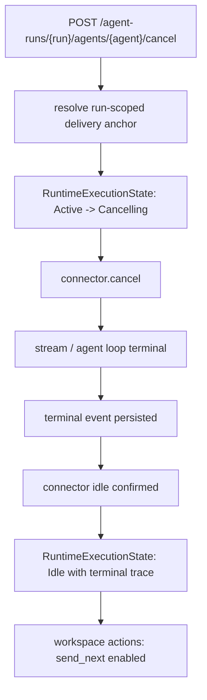

# 取消后会话运行态模型收敛设计

## Current State

当前运行态事实分散在四层：



`TurnState` 回到 idle 的时间早于 Pi Agent loop 完成收尾时，AgentRun Workspace 会显示 ready，但下一轮 prompt 实际进入仍 busy 的 `Agent`。取消路径把“已请求取消”“terminal 已落库”“执行器可复用”折叠成一个结果，导致 action projection 缺少中间状态。

## Target State

目标是让用户命令只消费一个统一运行态投影：



AgentRun Workspace 只在 `Idle` 且 delivery target、frame 和 agent status 都有效时展示 ready。`Cancelling` 是用户可见但不可发下一轮 prompt 的状态。

## Architecture

### Runtime Execution State

新增或扩展 application 层 projection，名称可沿用 `SessionExecutionState` 或引入更精确的 `RuntimeExecutionStateView`。该 projection 聚合：

- `SessionRuntimeRegistry` 中的 platform turn state。
- connector live session 状态。
- connector closing / cancelling 状态。
- `SessionMeta` terminal trace facts。
- active turn id 与 expected runtime refs。

原因是 workspace command 需要回答“现在能不能发下一轮 / steer / cancel”，这个问题不能由单一 `TurnState` 或单一 `SessionMeta` 回答。

### Turn State

`TurnState` 需要表达取消请求后的 closing 阶段。推荐形态：

```text
Idle
Claimed
Active(TurnExecution)
Cancelling(TurnExecution)
```

`request_cancel` 把 active turn 标记为 cancelling，并保留 turn id、processor tx、stream adapter handle 和 cancel requested marker。直到 terminal 已处理且 connector idle 已确认后，`clear_active_turn` 才能把状态转回 idle。

### Connector Cancel Contract

`AgentConnector::cancel` 当前只表达 cancel requested。目标 contract 需要支持执行器 idle 收口。可以通过返回结构或新增 companion method 表达：

```text
cancel requested -> connector loop observes cancel -> stream terminates -> agent idle confirmed
```

Pi Agent connector 的实现应在 cancel path 中调用不会丢通知的 `Agent::wait_for_idle` 或等价 primitive，并让 platform closing state 在 idle confirmed 前持续可见。

Relay connector 可以继续把 relay cancel accepted 作为 transport 边界，但 projection 需要保留 running / cancelling，直到 relay terminal event 或 interrupted recovery 完成。

### Terminal Processing

terminal processor 保持 terminal event 先持久化的原则。清理 platform turn 时需要满足：

- 正常 stream terminal：terminal fact 已落库。
- cancel terminal：terminal fact 已落库，connector idle / closing boundary 已确认或已由 connector-specific terminal event 证明。
- connector start failure：claim 被释放，terminal failure fact 以同一 command/turn 语义写入。

### AgentRun Workspace Projection

`build_agent_run_workspace_view` 不直接把 `inspect_session_execution_state == Running` 映射为全部 action。它消费统一运行态，并按状态构造 action set：



`send_next` 的唯一可用条件是 AgentRun workspace ready。`steer` 的唯一可用条件是 running、active turn id 存在且 connector 支持 steering。

### AgentRun Delivery Anchor

AgentRun workspace route 使用 `run_id + agent_id`。delivery runtime 解析也应在同一范围内完成：

```text
execution_anchor_repo.list_by_run(run_id)
  -> filter agent_id
  -> choose current delivery anchor by control-plane rule
```

这样 command target 与 workspace identity 一致，避免 agent 全局 latest 把其它 run 的 runtime 选进来。

## Data Flow



## Migration Notes

- 数据库可增加 runtime command / session meta 所需字段；预研期优先保持模型干净。
- Rust contract 变化后运行 `pnpm run contracts:check` 更新 generated TypeScript。
- 前端只消费 generated DTO 和 service projection，不维护平行 action 推断。

## Risks And Rollback Points

- cancel 状态收口涉及 session launch、stream adapter、connector 和 API projection，需分批提交，每批都有 focused tests。
- Relay connector 与 Pi connector 的 cancel completion 边界不同，projection 要表达共同语义并允许 connector-specific completion。
- `clear_active_turn` 当前承担多个失败路径的安全释放职责，改动时保留 terminal persist failure 仍释放资源的保障，同时让 workspace projection 能看到 closing / recovery 状态。

## Final Gate

最终 review 必须沿代码路径证明：

- AgentRun Workspace action 不再只由 platform active turn 推断。
- cancel 后 executor idle 确认前不会进入 ready。
- Pi Agent busy state 不会作为用户可见异常泄漏到第二轮发送。
- `latest_for_agent` 不再作为 AgentRun workspace command 的 delivery target 解析路径。
- 前后端 contract、service、chat control 和 tests 均体现统一运行态。
