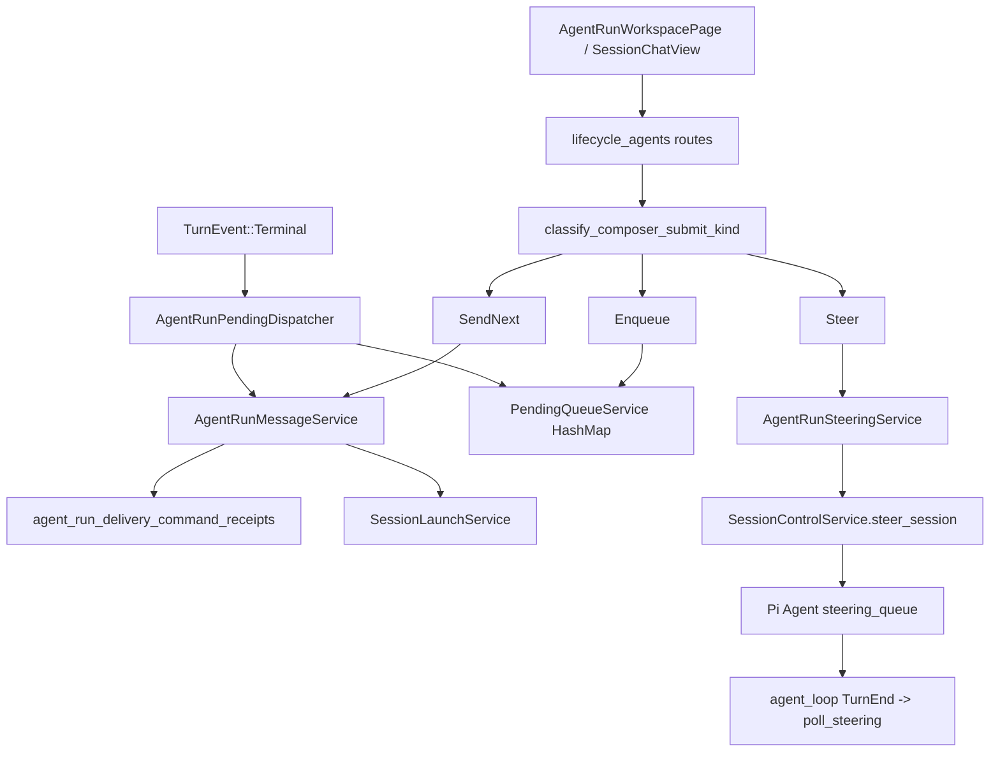
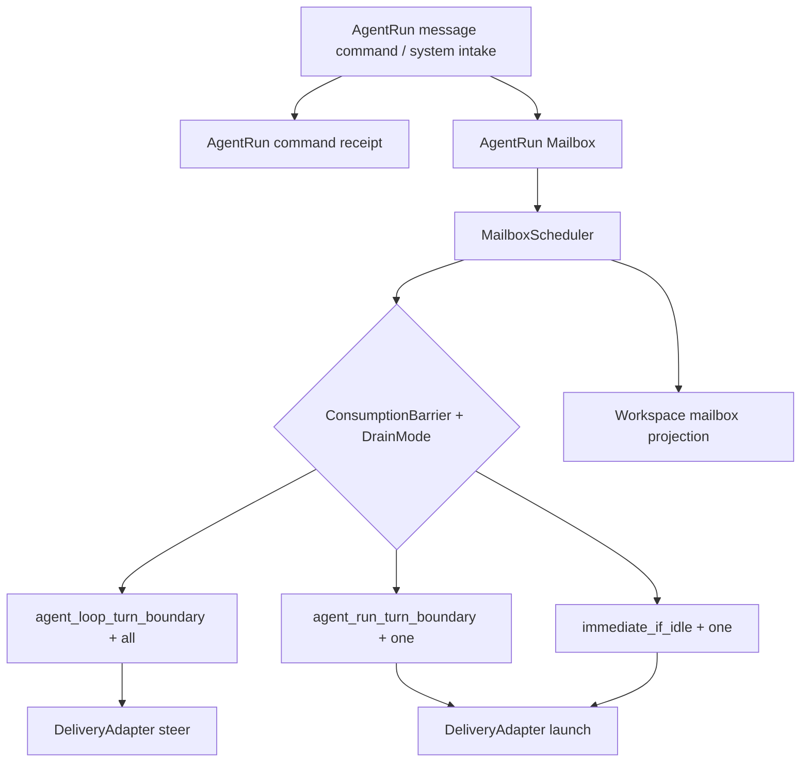

# Current State And Cut-Over Gates

## Purpose

本文件记录当前实现的事实源，以及本任务完成时必须切除或迁移的旧线条。它是实现门禁：如果 mailbox/barrier 新模型只是叠加在旧 pending queue / route-local branch 之上，而旧线仍在承担权威状态，本任务不算完成。

## Current Runtime Boundaries



## Current Facts

### Frontend command surface

- `AgentRunWorkspacePage.tsx` owns draft start, composer submit, cancel, promote pending, delete pending, and resume pending queue handlers.
- `SessionChatView.tsx` executes backend-projected conversation commands, including keyboard mappings.
- Generated frontend contracts still expose:
  - `pending_queue: PendingQueueStateView`
  - `pending_messages: PendingMessageView[]`
  - `ConversationCommandKind = start_draft | send_next | enqueue | steer | promote_pending | resume_pending_queue | cancel`

### API route-local branching

- `submit_agent_run_composer_input` resolves AgentRun context, reads `SessionExecutionState`, and calls `classify_composer_submit_kind`.
- The route branches into `SendNext`, `Enqueue`, and `Steer`.
- `Enqueue` writes directly to `state.services.pending_queue`.
- `Steer` calls `steer_runtime_session`, which returns a synthetic accepted receipt.
- `accepted_receipt(...)` still manufactures non-durable command receipt responses for paths that do not use `AgentRunMessageService`.

### Process-local pending queue

- `PendingQueueService` is an in-memory `HashMap<String, SessionPendingQueue>`.
- It owns pending message payload, preview, pause state, dequeue, requeue, take, delete, pause, and resume.
- `AppState` constructs it with `PendingQueueService::new()`.
- `SessionRuntimeControlView` and AgentRun workspace projection read pending list/pause state from this service.

### Pending terminal dispatch

- `AgentRunPendingDispatcher` drains `PendingQueueService` on completed terminal.
- It dispatches the dequeued message through `AgentRunMessageService`.
- Failed/interrupted terminal pauses the in-memory queue.
- Resume clears pause state and may immediately dispatch the front pending message.
- Pending drain currently creates a fresh `client_command_id` like `pending:{pending_message_id}:{uuid}` for each attempt.

### Steer small-turn reality

- Pi Agent `steer()` pushes an `AgentMessage` into `steering_queue`.
- `agent_loop` emits `AgentEvent::TurnEnd`, then runs after-turn hooks, then `poll_steering`.
- `QueueMode::All` drains all queued messages; `QueueMode::OneAtATime` drains one.
- Therefore `steer` is semantically consumed at the internal turn boundary, not at the HTTP request instant.

### Hook auto-resume

- `TerminalEffectType::HookAutoResume` is persisted in terminal effect outbox.
- `SessionTerminalEffectDispatcher` executes hook auto-resume by calling `request_hook_auto_resume`.
- `schedule_hook_auto_resume` directly launches a `LaunchCommand::hook_auto_resume_input(...)`.
- This is system-origin pending work, but today it does not share the AgentRun pending/message projection.

### Hook-produced delivery messages

- `agent_loop` runs hook delegates around agent turn boundaries and stop decisions.
- `AfterTurn` and `BeforeStop` hook decisions can append steering/follow_up messages directly into the current loop buffers.
- These hook-produced delivery messages currently bypass AgentRun pending/message projection.
- Hook strategy decisions, prompt rewriting, context injection, and tool approval are separate hook runtime concerns; only hook-produced delivery messages should be pulled into AgentRun mailbox.

## Target Authority After Refactor



After refactor:

- Mailbox is the only authoritative store for queued/paused/blocked/consuming message state.
- Scheduler is the only component mapping runtime state + barrier + drain mode to delivery action.
- Command receipt is only the idempotency/replay boundary.
- `BeforeStop`, terminal callback, and internal `TurnEnd` are scheduler triggers, not separate queue owners.

## Lines To Cut

### Cut 1: Process-local pending queue authority

Must remove or demote:

- `PendingQueueService` as authoritative storage.
- `state.services.pending_queue` from `AppState`.
- Direct `pending_queue.list/enqueue/delete/take/dequeue_front/requeue_front/pause/resume` calls in API routes.

Allowed end state:

- A short-lived compatibility facade only if it delegates to mailbox repository and is not exposed as domain authority.
- Prefer deleting/renaming it to `AgentRunMailboxService`.

Completion gate:

```powershell
rg -n "PendingQueueService|pending_queue\\.(enqueue|dequeue_front|requeue_front|take|pause|resume|delete|list)" crates packages
```

The command must not show production authority paths. Test names may remain only if migrated to mailbox semantics.

### Cut 2: Route-local SendNext/Enqueue/Steer as business model

Must remove or demote:

- `classify_composer_submit_kind` as the owner of delivery semantics.
- `submit_agent_run_composer_input` branching directly into launch / queue / steer side effects.
- `ConversationCommandKind::SendNext/Enqueue/Steer` as backend business result names.

Allowed end state:

- Public response may expose scheduler outcome for UI, but route must call mailbox intake + scheduler.
- Existing command ids can remain only as UI intent labels until frontend contract is renamed.

Completion gate:

```powershell
rg -n "classify_composer_submit_kind|ConversationCommandKind::SendNext|ConversationCommandKind::Enqueue|ConversationCommandKind::Steer" crates/agentdash-api crates/agentdash-application packages/app-web/src
```

Any remaining production hit must be projection-only or test-only with mailbox semantics.

### Cut 3: Synthetic accepted receipts

Must remove:

- `accepted_receipt(...)` for user-visible message/control commands.
- Any path where `client_command_id` can be retried but no durable command receipt claim exists.

Allowed end state:

- `accepted_receipt` may disappear entirely.
- Duplicate command replay uses stored receipt result plus mailbox envelope/delivery state.

Completion gate:

```powershell
rg -n "accepted_receipt\\(" crates/agentdash-api crates/agentdash-application
```

No production hit should remain for AgentRun message/control commands.

### Cut 4: Pending endpoints and DTO names as primary public model

Must rename or replace:

- `/pending-messages`
- `/pending-messages/resume`
- `/pending-messages/{message_id}/promote`
- `PendingMessageView`
- `PendingQueueStateView`
- frontend `PendingMessageRow` as primary mailbox row component

Allowed end state:

- `/mailbox/messages`
- `/mailbox/resume`
- `MailboxMessageView`
- `MailboxStateView`
- component names and tests aligned with mailbox semantics

Completion gate:

```powershell
rg -n "pending-messages|PendingMessageView|PendingQueueStateView|PendingMessageRow|resume_pending_queue|promote_pending" crates packages
```

Production hits should either be removed or explicitly transitional inside tests/spec migration notes.

### Cut 5: Terminal callback owns queue drain

Must remove:

- `AgentRunPendingDispatcher` as an independent queue drainer.
- terminal callback directly dequeuing and dispatching pending messages.

Allowed end state:

- `BeforeStop` calls `MailboxScheduler::schedule(trigger=AgentRunTurnBoundary)` while the active loop can still continue.
- terminal callback calls `MailboxScheduler::schedule(trigger=AgentRunTurnBoundary)` as fallback after the turn has terminalized.
- failed/interrupted terminal writes mailbox pause state.

Completion gate:

```powershell
rg -n "AgentRunPendingDispatcher|dispatch_next_pending|resume_queue|pending_message_command" crates/agentdash-api crates/agentdash-application
```

No production drainer outside mailbox scheduler should remain.

### Cut 6: Internal turn boundary not surfaced to scheduler

Must add:

- a reliable scheduler trigger after agent loop internal `TurnEnd` and before the next AgentLoopTurn consumes messages.
- a path for mailbox `AgentLoopTurnBoundary + DrainMode::All` messages to flow into existing steering ingestion.

Completion gate:

```powershell
rg -n "agent_loop_turn_boundary|MailboxDrainMode|QueueMode::All|TurnEnd" crates/agentdash-agent crates/agentdash-application crates/agentdash-api
```

The hits must show an intentional bridge from internal `TurnEnd` to mailbox scheduling, not just DTO definitions.

### Cut 7: Hook auto-resume bypasses AgentRun mailbox when anchored

Must change:

- anchored hook auto-resume should create system-origin mailbox envelope.
- mailbox scheduler should later consume it through the appropriate `LaunchSource`.

Allowed end state:

- non-AgentRun-owned runtime may keep direct auto-resume if no AgentRun anchor exists.

Completion gate:

```powershell
rg -n "schedule_hook_auto_resume|HookAutoResume|hook_auto_resume_input" crates/agentdash-application crates/agentdash-api
```

Anchored paths must route through mailbox or explicitly prove no AgentRun owner exists.

### Cut 8: Hook-produced steering and legacy follow-up bypass mailbox

Must change:

- AgentRun-anchored `AfterTurn` steering should create hook-origin mailbox envelopes.
- AgentRun-anchored `BeforeStop` steering and legacy follow_up should create hook-origin steering envelopes.
- AgentRun-anchored hook delivery messages should use `AgentLoopTurnBoundary + DrainMode::All` for normal AgentLoopTurn-boundary steering.
- AgentRun-anchored stop-boundary hook steering should use `AgentRunTurnBoundary` and continue the current loop.
- Hook runtime should keep direct ownership of non-delivery behavior such as prompt rewrite, context injection, trace, and tool approval.

Allowed end state:

- Non-AgentRun-owned runtime may keep direct hook message delivery if no AgentRun anchor exists.
- Hook envelopes must carry stable source deduplication keys so hook retry/replay does not duplicate mailbox messages.
- Existing hook `follow_up` outputs must be normalized to steering with stop-boundary continuation, not preserved as a mailbox delivery type.

Completion gate:

```powershell
rg -n "decision\\.steering|decision\\.follow_up|pending_follow_up_messages|run_after_turn_delegate|run_before_stop_delegate|HookTrigger::AfterTurn|HookTrigger::BeforeStop|HookTrigger::UserPromptSubmit" crates/agentdash-agent crates/agentdash-application
```

AgentRun-anchored delivery hits must route through mailbox intake or explicitly remain non-delivery hook runtime behavior.

## Completion Definition

The task is complete only when all of these are true:

- `AgentRun Mailbox` is the authority for queued/paused/blocked/consuming message state.
- `MailboxScheduler` is the authority for runtime state + barrier + drain mode -> delivery action.
- Runtime delivery preferentially maps to Codex app-server protocol-compatible `thread` / `turn` controls.
- AgentRun-only control semantics, when needed, are explicit backend envelope/domain extensions with typed adapters, not route-local or connector-private lifecycle branches.
- AgentLoopTurn messages use `AgentLoopTurnBoundary + DrainMode::All`.
- AgentRunTurn pending user messages use `AgentRunTurnBoundary + DrainMode::One`.
- AgentRun-anchored hook-produced delivery messages use mailbox steering envelopes instead of direct loop buffer mutation.
- Legacy hook follow_up is normalized to steering with stop-boundary continuation.
- AgentRun-anchored hook auto-resume uses mailbox envelopes and source deduplication instead of direct launch.
- New user messages on idle/completed/failed/interrupted runtime can resume/launch a new AgentRunTurn.
- All user-visible AgentRun commands have durable command receipts and duplicate replay.
- Frontend consumes mailbox projection and no longer treats pending queue names as the primary model.
- The cut-line grep commands above no longer find production authority paths from the old model.
