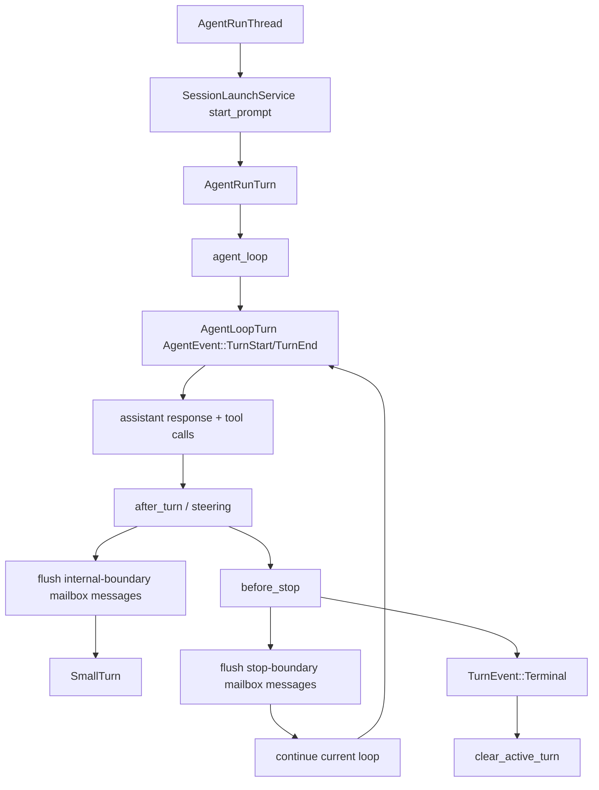
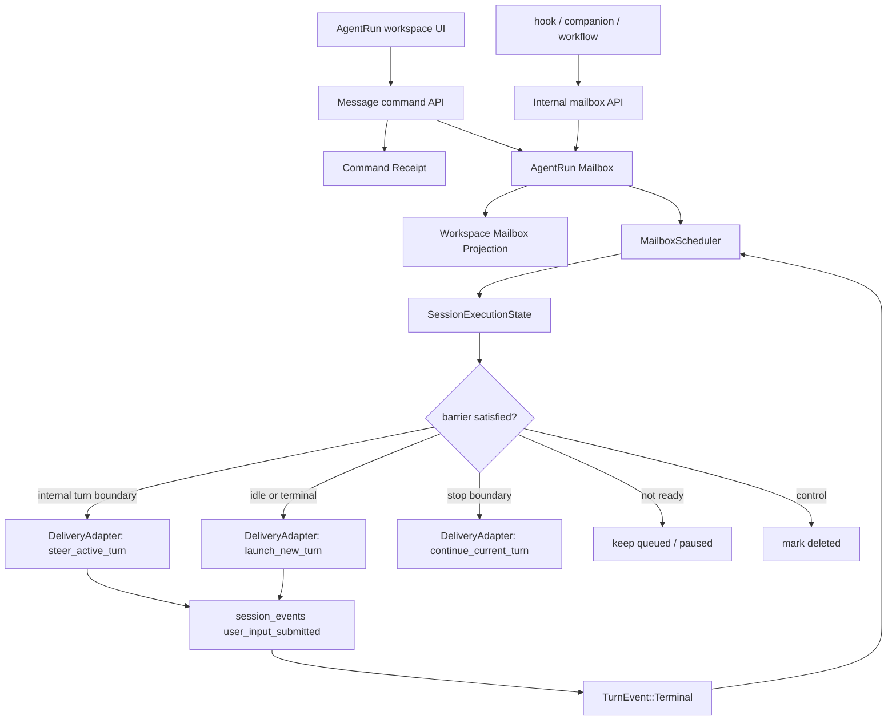
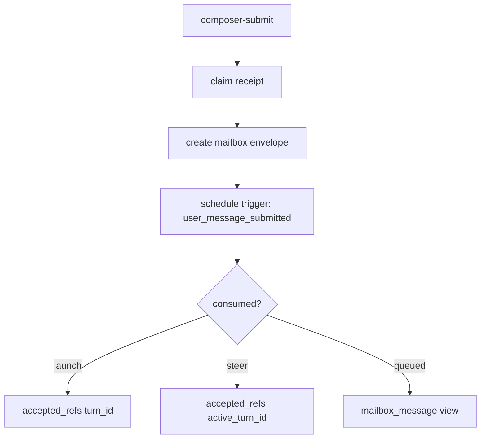
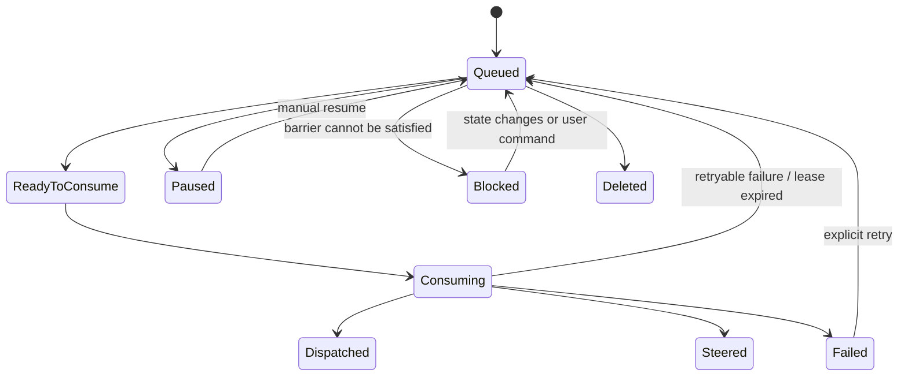

# AgentRun Mailbox / Consumption Barrier 设计

## Design Thesis

AgentRun workspace 需要的不是更多 command path，而是一个统一的 message mailbox。

所有“推进会话”的动作先被建模为 `MessageEnvelope`，然后由 `MailboxScheduler` 根据当前 runtime state、message policy 和 consumption barrier 决定消费方式。`send_next`、`enqueue`、`steer`、`promote_pending`、`resume_pending_queue` 都是 envelope 的状态迁移或消费结果，不是并列的根模型。

## Thread And Two Turn Layers

目标模型对齐 Codex 的 `Thread -> Turn`，同时用前缀区分 AgentRun 用户可见 turn 与 PiAgent/agent loop 内部 turn：



- AgentRunThread：AgentRun workspace 侧的会话容器，对齐 Codex `Thread`。
- AgentRunTurn：当前代码里对应 `TurnExecution`，生命周期是一次 `start_prompt -> TurnEvent::Terminal`，对齐 Codex 用户可见 `Turn`。
- AgentLoopTurn：当前代码里对应 PiAgent/agent loop 的 `AgentEvent::TurnStart/TurnEnd`，表示一次 assistant/tool cycle。
- Workspace execution state 只应以 AgentRunTurn 为准。
- Steer/hook 这类运行中消息的内部消费点就是 `AgentEvent::TurnEnd` 后、下一次 assistant response 前；它们仍属于同一个 AgentRunTurn。
- `BeforeStop` 是 AgentRunTurn 即将结束但尚未 terminal 的边界；如果这里消费到 steering 或一条 turn pending message，应继续当前 loop，而不是先 terminal 再重新 launch。

Naming rule:

- Use `AgentRunThread` for the AgentRun workspace-level conversation/execution container.
- Use `AgentRunTurn` for the user-visible execution period that starts from `SessionLaunchService::start_prompt` and ends at `TurnEvent::Terminal`.
- Use `AgentLoopTurn` / `agent_loop_turn` for PiAgent/agent loop `AgentEvent::TurnStart/TurnEnd` when referenced from AgentRun mailbox code.
- Do not use bare `Turn` in new AgentRun control-plane code. Existing `TurnExecution` can be mechanically renamed or wrapped by `AgentRunTurn` in the implementation slice.

## Codex Protocol Superset Contract

AgentDash 的 AgentRun 控制面事实源在 backend envelope、domain/application crates 和 durable repository。Codex app-server protocol 是优先复用和整体对齐的协议基线；AgentRun mailbox 可以表达 Codex protocol 的超集语义，但偏移必须显式、可适配、可测试。

Protocol mapping:

| AgentRun concept | Codex-compatible primitive |
| --- | --- |
| `AgentRunThread` | Codex `Thread` / runtime session projection; rehydrate through thread read/resume semantics. |
| `AgentRunTurn` | Codex `Turn`; start through `turn/start`, observe `turn/started` and `turn/completed`. |
| `LaunchOrContinueTurn` when idle | `turn/start` through `SessionLaunchService` or its Codex-compatible adapter. |
| `SteerActiveTurn` | `turn/steer` with `expected_turn_id` / active turn precondition. |
| cancel / interrupt | `turn/interrupt` with active turn precondition. |
| mailbox resume | AgentDash mailbox state transition, then scheduler chooses `turn/start` or `turn/steer`; it is not Codex `thread/resume`. |
| thread resume/read | Runtime/view rehydration only; does not imply mailbox drain. |

Superset rules:

- Backend envelope is authoritative for scheduling state, idempotency, drain policy, recovery, and UI projection.
- Codex-compatible thread/turn primitives are the preferred delivery substrate.
- Limited protocol deviations are allowed only when represented in mailbox schema/domain enums and implemented through a typed adapter boundary.
- A deviation must preserve a clear projection back to Codex-compatible concepts where possible: thread, turn, turn status, steer, interrupt, or resume/read.
- AgentDash-only behavior must not live as route-local branch logic or connector-private side effect.

`AgentLoopTurnBoundary` is an internal delivery phase, comparable to Codex core's pending-input drain inside a turn. It must not become a public AgentRun protocol method. If a behavior cannot be expressed through Codex-compatible thread/turn primitives, record it as an explicit AgentRun envelope extension with adapter mapping, not as an implicit parallel lifecycle protocol.

## Target Architecture



## Core Types

### MessageEnvelope

```rust
struct AgentRunMailboxMessage {
    id: Uuid,
    run_id: Uuid,
    agent_id: Uuid,
    runtime_session_id: String,
    origin: MailboxMessageOrigin,
    source: MailboxMessageSource,
    delivery: MailboxDelivery,
    barrier: ConsumptionBarrier,
    drain_mode: MailboxDrainMode,
    status: MailboxMessageStatus,
    priority: i32,
    order_key: i64,
    source_dedup_key: Option<String>,
    queued_agent_run_turn_id: Option<String>,
    consuming_agent_run_turn_id: Option<String>,
    expected_active_agent_run_turn_id: Option<String>,
    accepted_agent_run_turn_id: Option<String>,
    claim_token: Option<Uuid>,
    claimed_at: Option<DateTime<Utc>>,
    claim_expires_at: Option<DateTime<Utc>>,
    command_receipt_id: Option<Uuid>,
    payload_json: Option<Value>,
    executor_config_json: Option<Value>,
    preview: String,
    has_images: bool,
    retain_payload: bool,
    attempt_count: i32,
    last_error: Option<String>,
    created_at: DateTime<Utc>,
    updated_at: DateTime<Utc>,
    consumed_at: Option<DateTime<Utc>>,
}
```

### Origin

```rust
enum MailboxMessageOrigin {
    User,
    System,
    Hook,
    Companion,
    Workflow,
}
```

### Source

```rust
enum MailboxMessageSource {
    Composer,
    DraftStart,
    HookAutoResume,
    CompanionParentResume,
    WorkflowOrchestrator,
    RoutineExecutor,
    LocalRelayPrompt,
}
```

### Delivery

```rust
enum MailboxDelivery {
    LaunchOrContinueTurn,
    SteerActiveTurn { stop_effect: SteeringStopEffect },
    ResumeLaunchSource { launch_source: LaunchSourceTag },
}
```

Delivery maps to existing runtime services:

- `LaunchOrContinueTurn` -> Codex-compatible `turn/start` when no active turn exists; when consumed at stop boundary, inject through `turn/steer` and continue the current loop.
- `SteerActiveTurn` -> Codex-compatible `turn/steer(expected_turn_id)`; when `stop_effect=ContinueOnStop`, the same steering message prevents stop and behaves like the old follow-up effect.
- `ResumeLaunchSource` -> `LaunchCommand::{hook_auto_resume_input, companion_parent_resume_input, ...}`

```rust
enum SteeringStopEffect {
    None,
    ContinueOnStop,
}
```

There is no independent `follow_up` mailbox delivery. Existing hook/runtime follow-up outputs are normalized into `SteerActiveTurn { stop_effect: ContinueOnStop }`.

### Consumption Barrier

```rust
enum ConsumptionBarrier {
    ImmediateIfIdle,
    AgentLoopTurnBoundary,
    AgentRunTurnBoundary,
    ManualResume,
}
```

Barrier semantics:

| Barrier | Meaning |
| --- | --- |
| `ImmediateIfIdle` | runtime 没有 active AgentRunTurn 时可立即 launch/resume。 |
| `AgentLoopTurnBoundary` | 当前 AgentRunTurn 内的 AgentLoopTurn `TurnEnd` 后可消费；用于 steer/hook 这类要注入下一 AgentLoopTurn 的消息。 |
| `AgentRunTurnBoundary` | 当前 AgentRunTurn 到达 stop/terminal 边界后可消费；`BeforeStop` 时可继续当前 loop，terminal 后作为 launch fallback。 |
| `ManualResume` | queue 需要用户明确恢复后才可消费。 |

### Drain Mode

```rust
enum MailboxDrainMode {
    One,
    All,
}
```

Drain mode belongs to message policy, not delivery:

| Barrier | Typical drain mode | Reason |
| --- | --- | --- |
| `AgentLoopTurnBoundary` | `All` | AgentLoopTurn-boundary 消息通常需要在下一次 assistant response 前一次性灌入，和现有 `QueueMode::All` 对齐。 |
| `AgentRunTurnBoundary` | `All` for stop-boundary steering; `One` for turn input | `BeforeStop` 先批量消费 steering，再最多消费一条普通用户 pending message；terminal 后只保留 turn fallback。 |
| `ImmediateIfIdle` | `One` | 一次用户提交只启动一个新 AgentRunTurn。 |
| `ManualResume` | policy-specific | 恢复只是释放 paused 状态，实际消费仍按目标 barrier/drain mode 执行。 |

### Status

```rust
enum MailboxMessageStatus {
    Accepted,
    Queued,
    ReadyToConsume,
    Consuming,
    Dispatched,
    Steered,
    Paused,
    Blocked,
    Failed,
    Deleted,
}
```

`Accepted` 表示命令已被 mailbox 接受但 scheduler 尚未归类成 queued/ready。大多数用户命令会在同一事务内进入 `Queued` 或 `ReadyToConsume`。

## Scheduler

Scheduler 是唯一解释 runtime state 与 mailbox policy 的组件。

```text
schedule(run_id, agent_id, trigger)
  context = resolve AgentRun workspace + runtime state
  candidates = mailbox.list_pending(run_id, agent_id)
  drain_budget = budget_for(trigger, candidates)
  for candidate in order(priority desc, order_key asc):
    if !barrier_satisfied(candidate, context, trigger):
      continue
    claim candidate as Consuming
    result = delivery_adapter.consume(candidate, context)
    record result
    drain_budget.consume_one()
    if drain_budget.exhausted:
      break
```

Important scheduling rules:

- An AgentRunTurn boundary consumes at most one `AgentRunTurnBoundary + LaunchOrContinueTurn + drain_mode=One` envelope.
- At `BeforeStop`, the scheduler first drains all eligible steering messages, then may consume one eligible turn message. Any consumed message continues the current loop through steering semantics instead of letting the active turn terminalize.
- After `TurnEvent::Terminal`, the scheduler is a fallback for runtimes that did not or could not consume at `BeforeStop`; it still consumes at most one turn message.
- AgentLoopTurn boundary consumes all eligible `AgentLoopTurnBoundary + drain_mode=All` envelopes and injects them into the next AgentLoopTurn.
- Steer-capable envelopes require an active AgentRunTurn, but their consumption point is the AgentLoopTurn boundary rather than an arbitrary HTTP request instant.
- A failed/interrupted AgentRunTurn pauses envelopes whose policy requires human confirmation.
- A new user message submitted after failure/interruption can be accepted as a fresh `ImmediateIfIdle` envelope and resume the agent to a new AgentRunTurn.
- Manual resume does not mean “run arbitrary queue”; it releases paused envelopes and invokes scheduler once with `ManualResume` trigger.

## Command Receipt Boundary

Command receipt remains necessary, but it should not own the business model.

Receipt responsibilities:

- claim `client_command_id`
- validate request digest
- remember accepted envelope id or delivery result
- replay duplicate response
- report command-scoped terminal failure

Receipt table can be renamed from delivery-only to generic command receipt:

```text
agent_run_command_receipts
- id
- scope_kind
- scope_key
- command_kind
- client_command_id
- request_digest
- status
- mailbox_message_id
- result_json
- run_id / agent_id / frame_id / runtime_session_id / agent_run_turn_id / protocol_turn_id
- timestamps
```

The mailbox is the source of message status. The receipt is the source of command idempotency.

## Storage

Suggested tables:

```text
agent_run_mailbox_messages
- id text primary key
- run_id text not null references lifecycle_runs(id)
- agent_id text not null references lifecycle_agents(id)
- runtime_session_id text not null references sessions(id)
- origin text not null
- source text not null
- delivery text not null
- delivery_json text not null default '{}'
- barrier text not null
- drain_mode text not null
- status text not null
- priority integer not null default 0
- order_key bigint not null
- source_dedup_key text
- queued_agent_run_turn_id text
- consuming_agent_run_turn_id text
- expected_active_agent_run_turn_id text
- accepted_agent_run_turn_id text
- accepted_protocol_turn_id text
- claim_token text
- claimed_at timestamptz
- claim_expires_at timestamptz
- command_receipt_id text
- payload_json text
- executor_config_json text
- preview text not null default ''
- has_images boolean not null default false
- retain_payload boolean not null default false
- attempt_count integer not null default 0
- last_error text
- created_at timestamptz not null
- updated_at timestamptz not null
- consumed_at timestamptz
- deleted_at timestamptz
```

```text
agent_run_mailbox_states
- run_id text not null
- agent_id text not null
- runtime_session_id text not null
- paused boolean not null default false
- pause_reason text
- pause_message text
- updated_at timestamptz not null
- primary key (run_id, agent_id)
```

Payload policy:

- user-origin messages keep payload only until consumed or deleted.
- system/hook messages keep payload when `retain_payload=true`.
- preview and status remain available after payload cleanup.

## Message Intake

### Composer Submit



Composer submit no longer needs to expose `send_next/enqueue/steer` as separate business branches. The response may still include `accepted_kind` for UI compatibility, but that value is a scheduler outcome:

- `launched`
- `queued`
- `steered`
- `blocked`

### Promote

Promote is not a separate delivery path. It mutates one envelope:

```text
message.delivery = SteerActiveTurn
message.barrier = AgentLoopTurnBoundary
message.drain_mode = All
message.priority = high
schedule(trigger=promote)
```

### Resume

Resume clears mailbox pause state and schedules once:

```text
mailbox_state.paused = false
schedule(trigger=manual_resume)
```

### Delete

Delete is an envelope state transition:

```text
Queued/Paused/Blocked -> Deleted
```

Duplicate delete returns the same deleted result through command receipt.

## Runtime Integration

### Stop And Terminal Boundary

`BeforeStop` and terminal callback are both scheduler triggers for the same AgentRunTurn boundary. `BeforeStop` is preferred because the current loop can still continue; terminal callback remains the fallback after the active turn has already ended.

```text
on_before_stop(active_turn_id):
  schedule(trigger=agent_run_turn_boundary)
  if scheduler consumed steering or one turn envelope:
    continue current loop
  else:
    allow terminal

on_session_terminal(completed):
  schedule(trigger=agent_run_turn_boundary)

on_session_terminal(failed/interrupted):
  mailbox.pause(reason)
```

For `BeforeStop`, scheduler can consume both active-turn steering and one turn pending message. This gives steering the old follow-up effect without modeling follow-up as a separate delivery type.

For `completed`, scheduler consumes one eligible `AgentRunTurnBoundary + LaunchOrContinueTurn + drain_mode=One` envelope only if it was not already consumed at `BeforeStop`. This matches the desired “普通 pending message 在整个 AgentRunTurn 边界消费一条” behavior while avoiding repeated launch loops.

For `failed/interrupted`, existing queued messages pause. A subsequent new user message can still create an `ImmediateIfIdle` envelope and launch a new turn, because mailbox pause is not a global ban on all new intake.

### Internal Turn Boundary

The code currently exposes agent loop small-turn events as `AgentEvent::TurnStart/TurnEnd`, while AgentDash terminal processing does not treat them as workspace terminal. Mailbox must use this small-turn event as a first-class trigger:

```text
on_agent_internal_turn_end(turn_id):
  schedule(trigger=agent_loop_turn_boundary)
```

This is required because steer is semantically a message queued for the next AgentLoopTurn. The first implementation must route running steer/hook messages through `AgentLoopTurnBoundary` or `AgentRunTurnBoundary` instead of treating steer as an immediately-completed delivery side effect.

## Hook Path Convergence

Mailbox 收束的是 hook 产出的 delivery message，不是所有 hook 行为。

Hook 行为分层：

| Hook path | Mailbox role |
| --- | --- |
| `UserPromptSubmit` block/rewrite/context injection | 不进入 mailbox；它改写或阻止用户输入 envelope 的 intake。 |
| `UserPromptSubmit` 额外 steering | 进入 mailbox，origin=`Hook`，delivery=`SteerActiveTurn`，barrier=`AgentLoopTurnBoundary`，drain_mode=`All`。 |
| `AfterTurn` steering | 进入 mailbox，origin=`Hook`，delivery=`SteerActiveTurn`，barrier=`AgentLoopTurnBoundary`，drain_mode=`All`。 |
| `BeforeStop` steering / legacy follow-up | 进入 mailbox，origin=`Hook`，delivery=`SteerActiveTurn { stop_effect=ContinueOnStop }`，barrier=`AgentRunTurnBoundary`，drain_mode=`All`。 |
| `BeforeStop` stop-gate retry without input | 若只是要求继续当前 loop，应写入 hook-origin steering envelope；若必须 terminal 后恢复，再进入 mailbox，delivery=`ResumeLaunchSource(HookAutoResume)`，barrier=`ManualResume` 或 terminal effect outbox。 |
| `SessionTerminal` hook effects | 保持 terminal effect outbox；若 effect 产出 delivery message，再以 effect id 幂等写入 mailbox。 |
| tool approval / deny / rewrite | 不进入 mailbox；仍由 hook/tool runtime 决定。 |

`follow_up` is an implementation artifact, not a mailbox delivery class. When a hook currently returns `follow_up`, the AgentRun-anchored path should normalize it to steering with `ContinueOnStop`.

Hook mailbox envelope 必须带稳定 `source_dedup_key`：

```text
hook:{trigger}:{session_id}:{turn_id}:{event_seq_or_effect_id}:{index}
```

这样 terminal effect replay、after-turn retry 或 scheduler 重入不会重复创建同一条 system/hook message。

## Recovery And State Management

Mailbox 的恢复语义必须比当前进程内 pending queue 更强。目标不是绝对 exactly-once，而是 command/envelope 层可解释、可恢复、不会静默丢失。

### Status State Machine



State meanings:

| State | Meaning |
| --- | --- |
| `Queued` | durable, waiting for barrier. |
| `ReadyToConsume` | scheduler has observed the barrier; next step should claim. This can be transient or skipped. |
| `Consuming` | claimed by scheduler attempt; has `claim_token`, `claimed_at`, `claim_expires_at`, `attempt_count`. |
| `Dispatched` | launch accepted and accepted refs persisted. |
| `Steered` | AgentLoopTurn-boundary steer accepted into active AgentRunTurn. |
| `Paused` | queue-level or message-level human attention required. |
| `Blocked` | barrier cannot be satisfied now, for example active turn disappeared before an internal-boundary message was consumed. |
| `Failed` | non-retryable or max-attempt delivery failure until explicit retry. |
| `Deleted` | user/system removed the envelope. |

### Claim Lease

`claim_next(trigger)` must atomically:

- select eligible rows by barrier/drain mode/status/order
- move them to `Consuming`
- set `claim_token`
- increment `attempt_count`
- set `claim_expires_at`

Completion must compare `claim_token` before writing `Dispatched` / `Steered` / `Failed`.

Recovery job on startup or scheduler entry:

- `Consuming` with expired lease and retryable attempt -> `Queued`
- `Consuming` with accepted refs already recorded -> terminal status from receipt/result
- `AgentLoopTurnBoundary` message without live active AgentRunTurn -> `Blocked(active_turn_missing)`
- `AgentRunTurnBoundary` message after terminal state -> remains `Queued` and can be consumed by next scheduler trigger

### Idempotency Layers

| Layer | Idempotency key |
| --- | --- |
| user command | `client_command_id + request_digest` in command receipt |
| mailbox envelope | `source_dedup_key` or command receipt id |
| scheduler claim | `claim_token` |
| hook terminal effect | terminal effect id / event seq in `source_dedup_key` |
| delivery result | accepted refs stored in receipt/mailbox result |

### Recovery Projection

Workspace projection is rebuilt from:

- durable mailbox rows
- mailbox state row
- command receipts
- `SessionMeta.last_delivery_status/last_turn_id`
- in-process `TurnState` when present

Frontend never guesses recovery state. It renders backend-projected `status`, `barrier`, `delivery`, `pause_reason`, `blocked_reason`, and `attempt_count`.

## API Contract

Keep public command ownership at AgentRun workspace identity:

```text
POST /agent-runs/{run_id}/agents/{agent_id}/composer-submit
GET  /agent-runs/{run_id}/agents/{agent_id}/mailbox
DELETE /agent-runs/{run_id}/agents/{agent_id}/mailbox/messages/{message_id}
POST /agent-runs/{run_id}/agents/{agent_id}/mailbox/messages/{message_id}/promote
POST /agent-runs/{run_id}/agents/{agent_id}/mailbox/resume
```

Existing pending endpoints can be renamed in the current pre-release project rather than kept as compatibility aliases.

Response shape:

```text
AgentRunMessageCommandResponse
- command_receipt
- outcome: launched | queued | steered | deleted | resumed | blocked | failed
- mailbox_message?
- accepted_refs?
- runtime_state?
```

`PendingMessageView` should be renamed or generalized to `MailboxMessageView`:

```text
MailboxMessageView
- id
- origin
- source
- delivery
- barrier
- status
- preview
- has_images
- created_at
- updated_at
- can_promote
- can_delete
```

## Frontend Projection

Frontend should render mailbox state, not infer queue semantics.

- Composer submit receives a scheduler outcome and refreshes workspace projection.
- Pending rows become mailbox rows.
- Promote/delete/resume invoke envelope control commands.
- Keyboard mapping still comes from backend snapshot.
- UI text can say “已排队 / 正在注入 / 等待当前轮结束 / 等待恢复 / 已投递” based on `MailboxMessageView.status + barrier + delivery`.

## Migration

Add migration `0013_agent_run_mailbox.sql`:

- rename `agent_run_delivery_command_receipts` to `agent_run_command_receipts`
- add `command_kind`, `mailbox_message_id`, `result_json`
- add `agent_run_mailbox_messages`
- add `agent_run_mailbox_states`
- add schema readiness entries

No compatibility layer or backfill is needed beyond structural migration.

Mechanical rename scope:

- Rename public/domain concepts from pending queue to mailbox where mailbox is the new authority.
- Rename AgentRun-facing execution concepts to `AgentRunThread` / `AgentRunTurn`.
- Rename AgentRun mailbox references to PiAgent internal boundaries as `AgentLoopTurn` / `AgentLoopTurnBoundary`; existing runtime event names such as `AgentEvent::TurnEnd` can remain where they reflect the underlying PiAgent/connector API and are bridged by adapter code.
- Generated TypeScript contracts, frontend service names, tests, and DTOs should be regenerated/renamed with the Rust contract changes.
- Because the project is pre-release, do not preserve pending/turn alias endpoints or DTOs solely for compatibility.

## Trade-offs

- Mailbox/barrier makes the domain easier to reason about, but requires one real scheduler service instead of route-local branching.
- It gives a clean place for system pending messages without making user messages into a second transcript.
- It separates command idempotency from message lifecycle, reducing receipt overreach.
- It creates new terminology, so specs and frontend types should consistently use mailbox/message/barrier rather than pending/channel/command-kind.

## Verification Strategy

Backend:

- run the cut-line grep commands from `current-state.md` and inspect any remaining production hits
- mailbox repository ordering and claim tests
- scheduler tests for each barrier
- command receipt duplicate tests
- terminal callback schedule tests
- failed/interrupted pause plus new-user-message resume tests

Frontend:

- service DTO tests for mailbox endpoints
- row rendering tests for status/barrier/delivery
- composer submit tests that consume backend outcome only

Target commands:

```powershell
cargo check -p agentdash-api
cargo test -p agentdash-application mailbox
cargo test -p agentdash-infrastructure mailbox
pnpm --filter app-web typecheck
pnpm --filter app-web test -- SessionChatView
```
