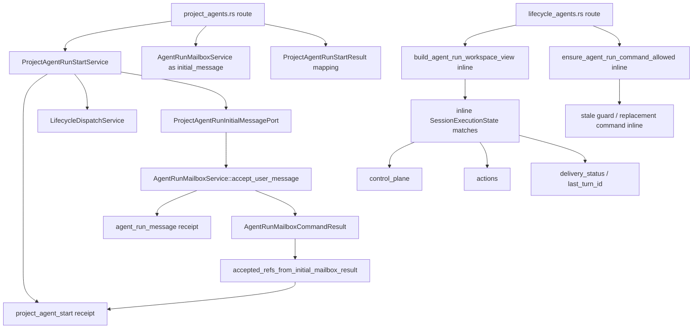
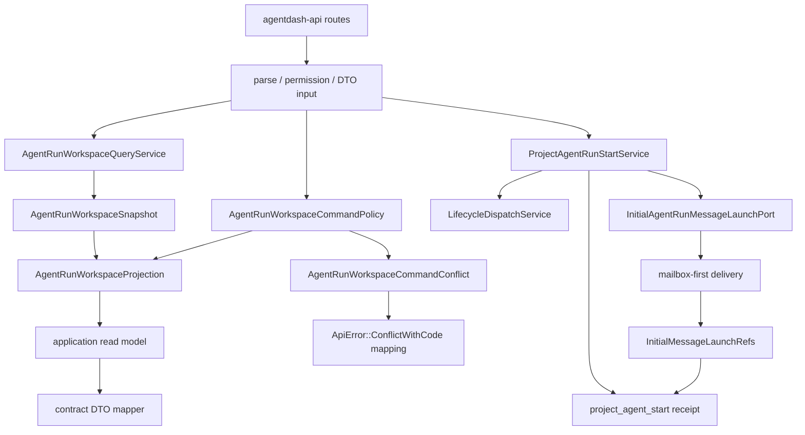

# AgentRun workspace 应用层重构设计

## Architecture Boundary

目标边界：

```text
agentdash-api
  -> permission / HTTP parse / contract mapping / ApiError mapping
agentdash-application
  -> AgentRun workspace read model
  -> AgentRun workspace command policy
  -> ProjectAgent start orchestration and command receipt semantics
agentdash-domain
  -> persisted entities, value objects, repository traits
agentdash-contracts
  -> browser-facing wire DTO and generated TypeScript
```

`agentdash-api` 继续拥有 Project permission loading 与 HTTP-specific mapping。AgentRun workspace 的业务判断进入 application，因为这些判断需要组合 LifecycleRun、LifecycleAgent、AgentFrame、RuntimeSessionExecutionAnchor、mailbox state、SessionExecutionState、command receipt 和 model/resource projection。

## Current State



## Target State



## Application Module Shape

Recommended module:

```text
crates/agentdash-application/src/workflow/agent_run_workspace/
  mod.rs
  query.rs
  projection.rs
  command_policy.rs
  types.rs
```

### `types.rs`

Application-owned types:

- `AgentRunWorkspaceQuery`
- `AgentRunWorkspaceSnapshot`
- `AgentRunWorkspaceShellModel`
- `AgentRunWorkspaceControlPlaneModel`
- `AgentRunWorkspaceActionSetModel`
- `AgentRunWorkspaceMailboxModel`
- `AgentRunWorkspaceCommandState`
- `AgentRunWorkspaceCommandConflict`
- `AgentRunWorkspaceAcceptedRefsModel`

These are application read models, not wire DTOs. API maps them to `agentdash_contracts::workflow`.

### `projection.rs`

`AgentRunWorkspaceProjection::derive(input)` owns all derivation from:

- `SessionExecutionState`
- terminal agent status
- delivery runtime presence
- current frame presence
- active turn id
- steering support
- mailbox pause/count facts

Output includes:

- control plane status and reason
- submit/cancel availability
- state code used by conversation snapshot/stale guard
- active turn id and last visible turn id
- delivery status
- runtime command state model
- replacement command suggestion

### `query.rs`

`AgentRunWorkspaceQueryService` resolves the workspace context and returns an application snapshot. It should own the business assembly now sitting in `build_agent_run_workspace_view`:

- delivery runtime session resolution from execution anchors
- SessionMeta / execution state lookup
- current AgentFrame and typed runtime surface
- run view / subject associations
- mailbox state/messages/user preferences
- model config resolution
- resource diagnostics
- conversation snapshot input assembly

API remains responsible for checking current user Project permission before calling the query.

### `command_policy.rs`

`AgentRunWorkspaceCommandPolicy` validates submitted workspace command preconditions:

- command kind and command id
- run / agent identity
- runtime session id
- frame id / revision snapshot
- active AgentRunTurn id
- snapshot id
- terminal-agent command availability
- promote/delete/resume/cancel specific availability

The policy returns application errors carrying:

- user-facing message
- stable error code
- replacement command if available
- structured detail JSON

API maps those to `ApiError::ConflictWithCode`.

## ProjectAgent Start Receipt Model

Current outer and inner command receipts have different meanings:

- outer `project_agent_start`: user command for creating and starting a ProjectAgent AgentRun
- inner `agent_run_message`: mailbox command for the initial user message envelope

Target implementation makes this explicit:

```rust
pub trait ProjectAgentRunInitialMessagePort: Send + Sync {
    async fn launch_initial_user_message(
        &self,
        command: ProjectAgentRunInitialMessageCommand,
    ) -> Result<ProjectAgentRunInitialMessageLaunch, WorkflowApplicationError>;
}

pub struct ProjectAgentRunInitialMessageLaunch {
    pub accepted_refs: AgentRunAcceptedRefs,
    pub runtime_state: Option<SessionExecutionState>,
}
```

The production adapter still calls `AgentRunMailboxService::accept_user_message`, requires `outcome == Launched`, validates mailbox accepted refs, and returns only launch refs. `ProjectAgentRunStartService` marks the outer receipt accepted with those refs. Duplicate start reads accepted refs from the outer receipt only.

## Contract Mapping

`agentdash-contracts` remains the wire source. API mappers convert application read models to:

- `AgentRunWorkspaceView`
- `AgentRunMessageCommandResponse`
- `ProjectAgentRunStartResult`
- `AgentRunCommandReceipt`
- `AgentRunAcceptedRefs`

Generated TypeScript remains the frontend source. Frontend changes should be limited to consuming any contract field shape changes created by the Rust contract generation.

## Error Model

Application command policy should return domain/application errors that preserve typed conflict details. API maps:

```text
AgentRunWorkspaceCommandConflict
  -> ApiError::ConflictWithCode {
       message,
       error_code,
       replacement_command,
       detail
     }
```

This keeps HTTP-specific response shape in API while moving command truth into application.

## Trade-offs

- Moving query assembly into application will increase short-term application dependencies on session/workflow/VFS services, but it matches the existing backend invariant that business orchestration belongs in application.
- Application read models add explicit mapping code in API, but they prevent wire DTOs from becoming the internal business model.
- Keeping Project permission checks in API avoids pulling auth/current-user HTTP concerns into application while still allowing application to own AgentRun state semantics.

## Migration Notes

The planned refactor is code-boundary and read-model oriented. It should not require database schema changes. If implementation discovers a need to persist new accepted refs or workspace projection facts, add a migration and run the project migration guard.
