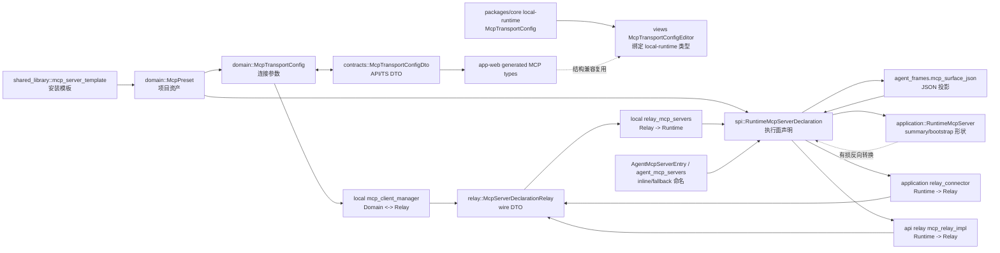
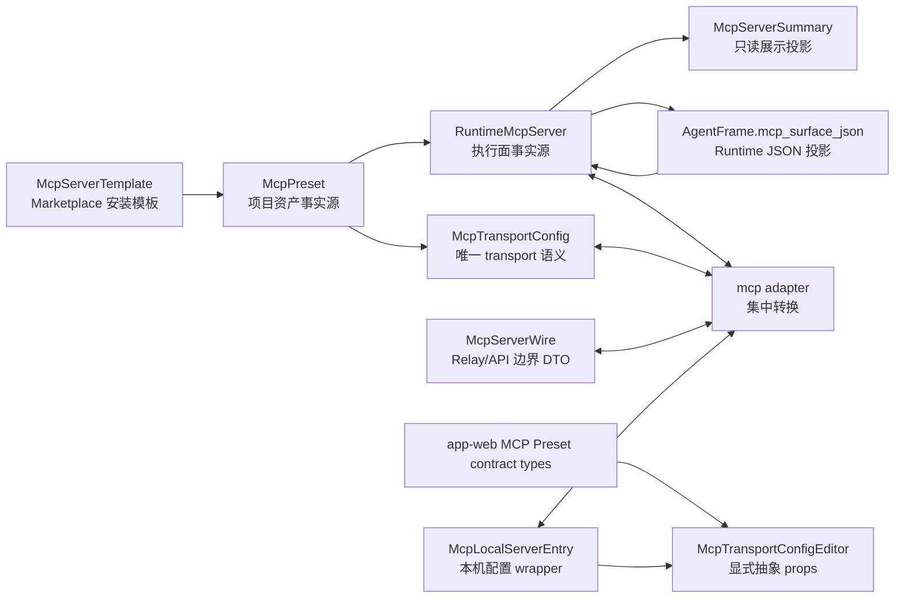

# MCP 概念模型收束设计

## Current Shape

## Target Shape

## Target Concepts

| Concept | Role | Ownership |
| --- | --- | --- |
| `McpTransportConfig` | 纯连接参数：HTTP/SSE/stdio、headers/env/cwd | domain；SPI 可 re-export |
| `McpPreset` | project 级可编辑、可安装、可引用资产 | domain/application/API |
| `RuntimeMcpServer` | 本次执行真实可用的 MCP server：name + transport + placement | SPI/application/session/executor |
| `McpServerWire` | Relay/API 边界 DTO | relay crate + adapter |
| `McpServerSummary` | 只读展示和 session plan 文案 | application/frontend |
| `McpServerTemplate` | Marketplace 安装模板 | shared_library |

## Architecture Boundaries

- Domain owns durable business meaning: preset, transport, template.
- SPI owns executable runtime surface: runtime server declaration and capability state.
- Relay owns wire shape only.
- Application owns resolution: preset refs, runtime binding, capability directives, AgentFrame projection.
- Local runtime owns machine config and connection lifecycle, but transport semantics come from domain or adapter.
- Frontend generated contract owns cloud MCP Preset API types; local runtime package owns desktop config types.

## Contract Lock Gate

本任务先交付一个目标 MCP contract lock，再进入模块级重构。Contract lock 需要在代码中固定以下内容：

| Locked Item | Target |
| --- | --- |
| Transport shape | domain `McpTransportConfig` 是唯一业务 transport 语义，其他 transport DTO 只在边界存在 |
| Runtime surface | SPI 执行面类型是唯一可执行 MCP server 事实源 |
| Summary shape | 展示 / markdown / plan 只能用 summary 类型，禁止反向生成 runtime surface |
| Wire adapter | Relay / local / API 只能通过统一 adapter 转换 |
| Frontend typing | Cloud preset contract type 与 local runtime config type 显式分流 |
| Legacy policy | 无业务价值的 inline MCP / fallback / duplicate helper 直接删除 |

Contract lock 完成前，模块级 subagent 不应各自引入临时结构或兼容转换。后续 subagent 的工作是沿锁定 contract 删除旧路径并替换调用点。

## Data Flow

1. Project Agent config stores `mcp_preset_keys`.
2. Construction planning resolves keys into `McpPreset`.
3. Frame construction applies runtime binding against final VFS facts.
4. Result becomes `RuntimeMcpServer`.
5. Capability state and AgentFrame surface persist that runtime surface.
6. Executor discovers direct or relay MCP tools from the runtime surface.
7. Relay/local boundaries convert through one adapter.
8. UI consumes generated DTOs or summary projections only.

## Subagent Refactor Boundaries

第一阶段由主会话完成 contract lock。之后按以下边界分派 subagent：

| Boundary | Scope | Expected Result |
| --- | --- | --- |
| Session / Capability | resolver、AgentFrame projection、runtime replay、launch surface | MCP runtime surface 单一化，inline/fallback 删除 |
| Relay / Local Runtime | relay protocol adapter、prompt payload、local manager、MCP probe/list/call | transport/server 转换集中，边界 DTO 不泄漏业务语义 |
| Frontend | generated contract、local-runtime config、shared editor、MCP preset UI | cloud/local 类型显式分流，editor 不再隐式绑定 local type |
| Marketplace / Shared Library | `mcp_server_template` publish/install、dependency display | template 只安装为 preset，不进入 runtime/capability |
| Docs / Specs / Verification | spec 更新、contract generation、targeted tests | 只记录目标模型原因，验证无重复概念回流 |

## Migration Notes

- Database changes are allowed to be hard changes. New migrations should remove unused MCP columns when the target model no longer needs them.
- Existing JSON payloads do not need backward compatibility migrations unless the current dev database must be transformed to keep tests or local dev usable.
- Generated TypeScript must be regenerated if Rust contract DTO names or shapes change.

## Trade-Offs

- Keeping boundary DTOs is acceptable when serialization ownership differs; keeping business logic or enum matching in multiple boundary modules is not.
- `mcp_server_template` remains separate because it models install-time parameterization, not execution. Its output must be `McpPreset`.
- Summary types remain useful for UI and markdown, but their naming must make one-way projection obvious.

## Risks

- Relay prompt and relay command paths currently use similar but separate conversions; moving them requires targeted tests on both cloud-to-local prompt and API relay MCP provider.
- Frontend editor typing may require small component API changes across app-web and desktop views.
- AgentFrame JSON projection must remain symmetrical with capability replay; this needs focused tests around `mcp_surface_json`.
