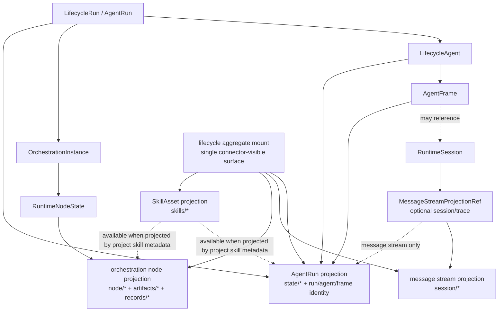

# Design

## Objective

AgentRun lifecycle surface 的构造应由一个标准 projector 承担。调用方只表达业务意图，projector 负责把 AgentRun control-plane anchor、Project SkillAsset projection、VFS mount metadata 和 resource/capability surface 收束成一致结果。

推荐目标链路：

```text
AgentRunLifecycleSurfaceInput
  -> AgentRunLifecycleSurfaceProjector
  -> AgentRunLifecycleSurface
  -> AgentFrame runtime surface / AgentRun workspace resource_surface / skill baseline
```

## Current Baseline

当前代码在 `lifecycle` provider 下有两类 scope metadata：

| Mount scope | Root | Purpose |
| --- | --- | --- |
| `agent_run_session` | `lifecycle://run/{run}/agent/{agent}/session/{session}` | 当前实现中的 AgentRun workspace message stream / trace evidence、skills projection |
| `node_runtime` | `lifecycle://run/{run}/orchestration/{orch}/node/{node}` | workflow node execution writes for artifacts/records |

上一轮已经新增 `build_agent_run_lifecycle_vfs_with_skills`，它能在替换 lifecycle mount 时保留并合并 SkillAsset metadata。

本任务继续把“何时调用哪个 helper、追加哪些 builtin skill、如何表达 preserve-only projection”提升为 typed projector contract。

## Domain Composition

`lifecycle` 是唯一 connector-visible 通用聚合面。它不会拆成 `lifecycle-session` / `lifecycle-node` 这类并行 mount，也不会在不同运行态暴露多个 lifecycle mount。

`node_runtime` 不应被收束成 `agent_run_session` 的子行为。它是 orchestration-owned execution projection；session 只是消息流 / connector trace substrate。

当前 `RuntimeSessionExecutionAnchor` 的名字和字段容易造成误读：它以 `runtime_session_id` 为 lookup key，并额外记录 optional `orchestration_id + node_path + attempt`。这不是“session 拥有 orchestration 关系”，而是 runtime trace 只能从 session_id 入口反查控制面时形成的 read-model index。

目标模型里，运行时对外业务入口统一是 AgentRun control-plane identity；除消息流读取/投递外，调用方不应以 `RuntimeSession` 作为 runtime surface 索引。

- `AgentRunRuntimeAddress`：run / agent / frame 的业务 runtime address。
- `MessageStreamProjectionRef`：可选 message stream / connector trace 引用，只服务 `session/*` 或 transcript 相关投影。
- `OrchestrationNodeProjection`：orchestration/node coordinate -> `node/*`、`artifacts/*`、`records/*` 的 projection fact。

`RuntimeSessionExecutionAnchor` 可以作为当前代码过渡期构造 `AgentRunRuntimeAddress` 与 `MessageStreamProjectionRef` 的 read model，但不应成为 projector 的核心 input，也不应成为 node ownership 的来源。

领域关系应理解为：



组合关系是 facet composition，而不是 ownership merge：

- `AgentRunIdentityFacet`：由 AgentRun runtime address 派生，投影 run / agent / frame identity。
- `MessageStreamFacet`：由 optional message stream ref 派生，投影 `session/*`，只读，用于消息流和 connector trace evidence。
- `OrchestrationNodeExecutionFacet`：由 active workflow node 派生，投影 `node/*`、`artifacts/*`、`records/*`，其中 artifacts/records 可按 node projection input 写入。
- `SkillProjectionFacet`：由 project + SkillAsset keys 派生，投影 `skills/*`，使 connector 能从同一个 `lifecycle:/skills/*` surface 读取技能。

Agent 状态决定通用聚合面下有哪些路径投影：

| Runtime mode | Lifecycle projections | Ownership note |
| --- | --- | --- |
| Workspace read / query | AgentRun identity, optional `session/*`, optional `skills/*` | AgentRun 是外部索引，session 只服务消息流 |
| Graphless ProjectAgent launch | AgentRun identity, optional `session/*`, optional `skills/*` | 无 orchestration node |
| Plain companion child | AgentRun identity, optional `session/*`, `skills/*` | companion 的业务身份是 AgentRun |
| Workflow node execution | AgentRun identity, optional `session/*`, `node/*`, `artifacts/*`, `records/*`, optional `skills/*` | node data belongs to orchestration/node |
| Companion + workflow child | AgentRun identity, optional `session/*`, `node/*`, `artifacts/*`, `records/*`, `skills/*` | AgentRun/lineage 反查 child identity |

因此 projector 的职责不是在多个 lifecycle mount 之间选择，而是根据 typed input 生成单个 `lifecycle` aggregate mount 的 projection set，并复用同一套 skill projection、metadata typing 和 preservation 规则。

## Proposed API

```rust
pub struct AgentRunLifecycleSurfaceInput {
    pub base_vfs: Option<Vfs>,
    pub address: AgentRunRuntimeAddress,
    pub message_stream: Option<MessageStreamProjectionRef>,
    pub project_id: Uuid,
    pub mode: AgentRunLifecycleSurfaceMode,
    pub explicit_skill_asset_keys: Vec<String>,
    pub builtin_skills: BuiltinLifecycleSkillPolicy,
    pub node_projection: Option<OrchestrationNodeProjectionInput>,
}

pub enum AgentRunLifecycleSurfaceMode {
    WorkspaceReadSurface,
    LaunchEvidenceSurface,
    CompanionChildSurface,
    WorkflowNodeExecutionSurface,
}

pub enum BuiltinLifecycleSkill {
    CompanionSystem,
    WorkspaceModuleSystem,
    RoutineMemory,
}

pub enum BuiltinLifecycleSkillPolicy {
    PreserveProjected,
    EnsureAndProject(Vec<BuiltinLifecycleSkill>),
}

pub struct AgentRunRuntimeAddress {
    pub run_id: Uuid,
    pub agent_id: Uuid,
    pub frame_id: Uuid,
}

pub struct MessageStreamProjectionRef {
    pub runtime_session_id: String,
    pub trace_kind: MessageStreamTraceKind,
}

pub enum MessageStreamTraceKind {
    ConnectorRuntimeSession,
    RestoredTranscript,
}

pub struct OrchestrationNodeProjectionInput {
    pub run_id: Uuid,
    pub orchestration_id: Uuid,
    pub node_path: String,
    pub lifecycle_key: String,
    pub attempt: u32,
    pub writable_port_keys: Vec<String>,
}

pub struct AgentRunLifecycleSurface {
    pub vfs: Vfs,
    pub lifecycle_mount: Mount,
    pub projections: AgentRunLifecycleProjectionSet,
    pub skill_asset_keys: Vec<String>,
}

pub struct AgentRunLifecycleProjectionSet {
    pub agent_run_identity: bool,
    pub message_stream: Option<MessageStreamProjectionFacts>,
    pub orchestration_node: Option<OrchestrationNodeProjectionFacts>,
    pub skill_assets: Vec<String>,
}

pub struct MessageStreamProjectionFacts {
    pub runtime_session_id: String,
}

pub struct OrchestrationNodeProjectionFacts {
    pub run_id: Uuid,
    pub orchestration_id: Uuid,
    pub node_path: String,
    pub attempt: u32,
    pub writable_port_keys: Vec<String>,
}
```

命名可以在实现时微调，但边界应保持：input 表达意图，output 暴露闭包后的 surface。

## Metadata Typing

Lifecycle mount metadata should be built from typed structs. The target shape is a single aggregate metadata object with optional projection facts:

```rust
pub struct AgentRunLifecycleMountMetadata {
    pub run_id: Uuid,
    pub agent_id: Uuid,
    pub frame_id: Uuid,
    pub message_stream: Option<MessageStreamProjectionMetadata>,
    pub orchestration_node: Option<OrchestrationNodeProjectionMetadata>,
    pub skill_asset_project_id: Option<Uuid>,
    pub skill_asset_keys: Vec<String>,
}

pub struct MessageStreamProjectionMetadata {
    pub runtime_session_id: String,
    pub trace_kind: MessageStreamTraceKind,
}

pub struct OrchestrationNodeProjectionMetadata {
    pub orchestration_id: Uuid,
    pub node_path: String,
    pub lifecycle_key: String,
    pub attempt: Option<u32>,
    pub writable_port_keys: Vec<String>,
}
```

VFS `Mount.metadata` 仍是 JSON wire boundary；typed metadata 负责构造和解析。

## Projector Behavior

### Workspace Read Surface

用于 AgentRun workspace query。

- 从 base VFS 读取已有 SkillAsset metadata。
- 生成单个 `lifecycle` aggregate mount。
- 投影 AgentRun identity。
- 当存在 message stream ref 时投影 `session/*`。
- 重新写入保留的 SkillAsset keys。
- 不 bootstrap 新 builtin SkillAssets。

### Launch Evidence Surface

用于 graphless ProjectAgent owner bootstrap。

- 生成单个 `lifecycle` aggregate mount。
- 投影 AgentRun identity。
- 当存在 message stream ref 时投影 `session/*`。
- ensure builtin SkillAssets。
- 合并 agent preset skill keys 与 builtin skill keys。
- 更新 final VFS，使 skill baseline 与 resource surface 共享同一个事实。

### Companion Child Surface

用于 plain companion child。

- 从 parent VFS slice 开始。
- 生成 child AgentRun 的单个 `lifecycle` aggregate mount。
- 投影 child AgentRun identity。
- 当存在 message stream ref 时投影 `session/*`。
- ensure 并投影 `companion-system`。
- 写回 `CapabilityState.vfs.active`。

### Workflow Node Execution Surface

用于 workflow node / companion+workflow execution。

- 第一阶段在单个 `lifecycle` aggregate mount 下保留 orchestration-owned writable node projection 承载 artifacts/records。
- `node_runtime` 的 owner 仍是 orchestration node；`RuntimeSessionExecutionAnchor` 只作为旧 read-model/trace lookup 输入，不作为 node projection ownership source。
- 通过 typed policy 投影 builtin skills。
- 不引入第二个 lifecycle mount；路径是否存在由 projection facts 决定。

## Node Projection Decision

推荐第一阶段保留 node write semantics，并取消把它桥接到单独 session subtree 或第二个 lifecycle mount 的目标。

原因：artifacts/records 写入当前依赖 `writable_port_keys` 和 provider write semantics，而且 node execution 本身属于 orchestration。把写入迁移到 session-owned subtree 会改变 ownership model，不只是路径迁移。

Projector 仍应通过 `OrchestrationNodeProjectionInput` 显式表达写入策略，使代码不再通过 ad hoc helper 隐藏这个分叉。session 相关信息只作为 optional message stream projection；node projection 必须由 orchestration/node coordinate 提供。

## Migration Targets

| Current caller | Target behavior |
| --- | --- |
| `OwnerBootstrapComposer::prepare_owner_bootstrap_vfs` | use projector with `LaunchEvidenceSurface` or `WorkflowNodeExecutionSurface` |
| `SessionRequestAssembler::project_companion_system_to_agent_run_lifecycle` | use projector with `CompanionChildSurface` |
| `compose_companion_with_workflow` | use projector or projector-owned activation skill projection |
| `AgentRunWorkspaceQueryService::resolve_agent_run_frame_vfs` | use projector with `WorkspaceReadSurface` |
| lifecycle mount tests | assert typed metadata + skill preservation |

## Spec Updates

- `.trellis/spec/backend/vfs/vfs-access.md`
- `.trellis/spec/backend/embedded-skill-bundles.md`
- `.trellis/spec/backend/session/runtime-execution-state.md`
- `.trellis/spec/backend/workflow/architecture.md` if frame construction ownership needs clarification

## Trade-offs

### Single projector vs more helper functions

推荐 single projector，因为重复问题已经不是单纯 mount construction；它包括 skill bootstrap、metadata carry-over、mode-specific behavior 和 capability/resource surface consistency。

### Session-owned node writes vs lifecycle aggregate projection

推荐 lifecycle aggregate projection。node write behavior 继续归 orchestration/node coordinate，session 只保留 launch evidence reference。

### Typed metadata vs JSON helpers

推荐 typed metadata。JSON boundary 保留，但构造和解析变得显式、可测试、可演进。
